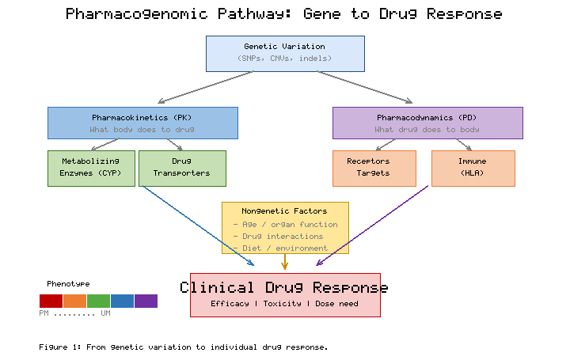
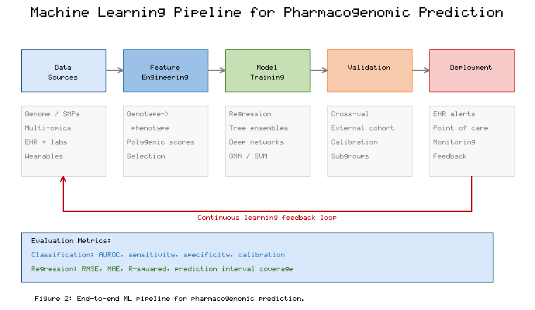
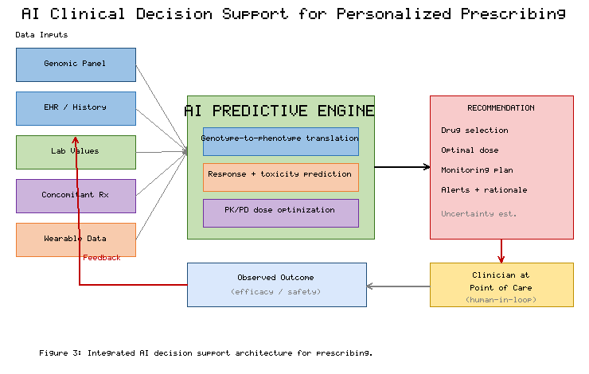
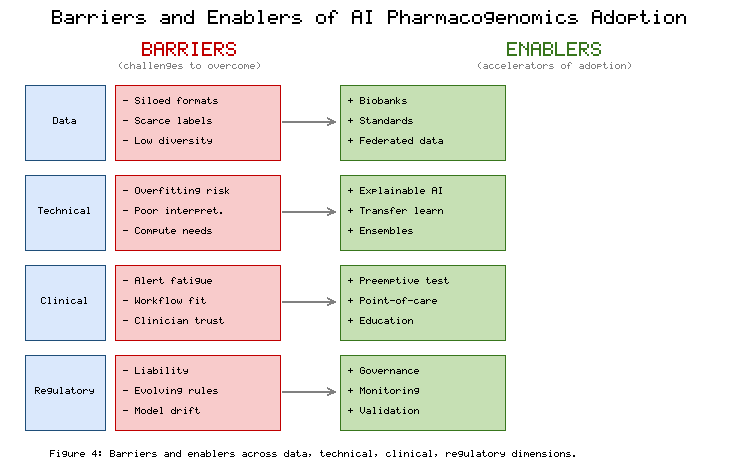

# Chapter 14. AI in Pharmacogenomics and Precision Medicine

---

## Abstract

Pharmacogenomics, the study of how an individual's genetic makeup influences their response to medications, sits at the heart of the precision medicine paradigm that seeks to tailor therapeutic decisions to the unique biological characteristics of each patient. For decades, the promise of personalized pharmacotherapy was constrained by the sheer complexity of the relationships linking genetic variation, drug metabolism, pharmacodynamics, and clinical outcomes. The emergence of artificial intelligence and machine learning has fundamentally reshaped this landscape, providing powerful computational tools capable of learning intricate, high-dimensional, and often nonlinear patterns from vast biomedical datasets. This chapter examines the convergence of artificial intelligence with pharmacogenomics and precision medicine across three interconnected dimensions. First, it explores the biological foundations of genetic variability and its consequences for individual drug response, describing the pharmacokinetic and pharmacodynamic pathways through which polymorphisms in metabolizing enzymes, drug transporters, and receptor targets shape therapeutic efficacy and toxicity. Second, it surveys the machine learning methodologies increasingly deployed to predict pharmacogenomic phenotypes, from classical supervised learning algorithms to deep neural networks and ensemble approaches, detailing how these models are trained, validated, and interpreted. Third, it investigates how artificial intelligence enables personalized drug selection and dose optimization, integrating multi-omic data, electronic health records, and pharmacokinetic modeling into clinical decision support systems. Throughout, the chapter addresses the practical challenges of data quality, model interpretability, regulatory acceptance, health equity, and clinical implementation that must be resolved before AI-driven pharmacogenomics can achieve its full potential. The synthesis presented here underscores that artificial intelligence is not merely an incremental improvement to existing pharmacogenomic practice but a transformative force capable of reshaping how medicines are prescribed, dosed, and monitored in the era of precision medicine.

**Keywords:** Pharmacogenomics, Precision Medicine, Machine Learning, Deep Learning, Drug Response Prediction, Dose Optimization, Clinical Decision Support, Personalized Therapy

---

## 14.1 Genetic Variability and Individual Drug Response

### 14.1.1 The Biological Basis of Variable Drug Response

The observation that patients receiving identical doses of the same medication frequently experience markedly different outcomes—ranging from complete therapeutic success to severe adverse reactions—has long puzzled clinicians and pharmacologists [1]. This variability, once attributed largely to differences in adherence, diet, or concomitant illness, is now understood to be substantially rooted in inherited genetic differences among individuals [2]. Pharmacogenomics provides the scientific framework for understanding how variations in the human genome influence the absorption, distribution, metabolism, and excretion of drugs, as well as the biological responses that drugs elicit once they reach their molecular targets [3]. The completion of the Human Genome Project and the subsequent explosion of high-throughput sequencing technologies have revealed that human beings differ from one another at millions of positions across the genome, and that a meaningful subset of this variation has direct consequences for pharmacotherapy [4].

At the population level, drug response follows a distribution in which most individuals cluster around an average response, while smaller groups exhibit unusually strong, weak, or paradoxical reactions. These outliers are of particular clinical concern because they encompass patients at greatest risk of treatment failure or drug-induced harm [5]. Adverse drug reactions represent a substantial burden on healthcare systems worldwide, contributing to hospital admissions, prolonged stays, and preventable mortality [6]. A significant proportion of these reactions is now attributable to identifiable genetic factors, making the systematic characterization of pharmacogenomic variation a public health imperative rather than merely an academic exercise [7].

The conceptual roots of pharmacogenomics extend back to early twentieth-century observations that certain drug idiosyncrasies clustered within families, suggesting a hereditary basis for variable response long before the molecular machinery could be characterized. The field matured through the identification of specific enzyme deficiencies that explained dramatic differences in the handling of particular drugs, and it accelerated enormously once genotyping became inexpensive and scalable. Today the discipline encompasses not only the classical single-gene traits with large effect sizes but also the far more numerous variants of individually modest effect that, in aggregate, shape the continuous spectrum of drug response observed across the population. This shift from a monogenic to a polygenic conception of drug response is precisely what makes computational analysis indispensable, because the human mind cannot readily integrate the simultaneous contributions of dozens or hundreds of variants each nudging the phenotype in a particular direction.

It is important to recognize that genetic variation does not act in a vacuum. The same variant may exert different effects depending on the patient's age, sex, renal and hepatic function, diet, concurrent illnesses, and the presence of other medications competing for the same metabolic pathways. This context dependence means that pharmacogenomic prediction is fundamentally a problem of integrating genetic information with a rich clinical picture, rather than reading a genotype in isolation. The recognition that genotype and environment interact in shaping drug response reinforces the argument, developed throughout this chapter, that the most powerful predictive systems will be those capable of learning from heterogeneous data spanning the molecular and clinical domains simultaneously.

### 14.1.2 Pharmacokinetic Gene Variation

The pharmacokinetic dimension of drug response concerns what the body does to a drug, encompassing the processes of absorption, distribution, metabolism, and elimination. Among these, drug metabolism has received the most intensive pharmacogenomic study because the enzymes responsible are highly polymorphic and their activity varies dramatically across individuals [8]. The cytochrome P450 (CYP) superfamily of enzymes catalyzes the oxidative metabolism of a large fraction of clinically used drugs, and several of its members exhibit clinically significant genetic polymorphism [9]. The *CYP2D6* gene, for example, is among the most extensively studied pharmacogenes, with more than one hundred allelic variants that give rise to a spectrum of metabolic phenotypes ranging from poor metabolizers who cannot adequately clear affected drugs to ultrarapid metabolizers who eliminate them so quickly that standard doses fail to achieve therapeutic concentrations [10].

The classification of individuals into metabolizer phenotypes—poor, intermediate, normal, rapid, and ultrarapid—provides a clinically actionable framework for anticipating drug exposure [11]. A poor metabolizer receiving a standard dose of a drug that is inactivated by *CYP2D6* may accumulate the parent compound to toxic levels, whereas the same phenotype may derive no benefit from a prodrug that requires *CYP2D6*-mediated activation to become pharmacologically active [12]. This bidirectional relationship illustrates why genotype interpretation must always be considered in the context of the specific drug and its metabolic pathway.

The translation of raw genotype data into a metabolizer phenotype is itself a nontrivial computational task. A single pharmacogene may harbor dozens of functional alleles, each assigned an activity value, and the combination of two inherited alleles produces a diplotype whose net functional consequence must be inferred. When many candidate alleles and structural variants such as gene deletions and duplications are considered, the number of possible diplotypes becomes large, and the mapping from diplotype to predicted phenotype is neither linear nor obvious. Automated genotype-to-phenotype translation algorithms have therefore become an essential component of pharmacogenomic infrastructure, and they represent an early and practically important point at which computational methods enter the pharmacogenomic workflow. The reliability of any downstream machine learning model depends on the accuracy of this foundational translation, underscoring the principle that data curation and phenotype assignment deserve as much rigor as the predictive modeling that follows. Other members of the CYP family, including *CYP2C9*, *CYP2C19*, and *CYP3A4/5*, contribute similarly consequential variability to the metabolism of anticoagulants, antiplatelet agents, proton pump inhibitors, and immunosuppressants [13].

The clinical importance of *CYP2C19* variation is well illustrated by the antiplatelet agent clopidogrel, a prodrug that requires enzymatic activation to exert its therapeutic effect. Patients who carry loss-of-function alleles generate insufficient active metabolite and remain at elevated risk of cardiovascular events despite treatment, a finding that has shaped prescribing guidance and motivated genotype-guided selection of alternative agents. Warfarin, an anticoagulant with a famously narrow therapeutic index, provides a complementary example in which variation in *CYP2C9* alters the rate of drug clearance while variation in *VKORC1* modulates pharmacodynamic sensitivity, so that accurate dose prediction requires the integration of two genes together with clinical covariates. These paradigmatic examples have become proving grounds for pharmacogenomic algorithms precisely because they combine strong genetic effects, serious clinical consequences, and readily measurable outcomes.

Beyond the phase I oxidative enzymes, phase II conjugating enzymes such as the UDP-glucuronosyltransferases and thiopurine methyltransferase also display pharmacogenomically important polymorphism [14]. Deficiency of thiopurine methyltransferase activity, for instance, predisposes patients treated with thiopurine drugs to life-threatening bone marrow suppression, and preemptive genotyping to guide dose reduction has become a well-established example of pharmacogenomics translated into routine clinical care [15]. Drug transporters, including the solute carrier and ATP-binding cassette families, further modulate pharmacokinetics by governing the movement of drugs across cellular membranes in the gut, liver, kidney, and blood-brain barrier, and polymorphisms in transporter genes such as *SLCO1B1* have been robustly associated with drug disposition and toxicity risk [16].

**Table 1** summarizes several of the most clinically established pharmacogenes, the drugs they affect, and the nature of the clinical consequences associated with their variant alleles. As shown in **Table 1**, the diversity of affected drug classes—from cardiovascular agents to psychiatric medications and chemotherapeutics—illustrates the breadth of pharmacogenomic influence across therapeutic areas.

### 14.1.3 Pharmacodynamic Gene Variation

While pharmacokinetic variation determines how much drug reaches its site of action, pharmacodynamic variation governs how the body responds to the drug once it arrives [17]. Polymorphisms in the genes encoding drug targets—receptors, enzymes, ion channels, and signaling proteins—can alter the sensitivity of an individual to a given drug concentration [18]. Variation in the vitamin K epoxide reductase complex, encoded by *VKORC1*, exemplifies pharmacodynamic influence on warfarin dosing, where certain genotypes confer heightened sensitivity requiring substantially reduced doses to avoid bleeding complications [19]. Similarly, variants in genes governing immune recognition, particularly within the human leukocyte antigen system, are strongly associated with severe hypersensitivity reactions to specific drugs, providing a mechanistic basis for screening programs that avert catastrophic cutaneous and systemic adverse events [20].

The interplay between pharmacokinetic and pharmacodynamic variation means that drug response is rarely governed by a single gene acting in isolation [21]. Instead, the observed phenotype emerges from the combined and sometimes interacting effects of multiple loci, along with nongenetic factors such as age, organ function, drug interactions, and environmental exposures [22]. This polygenic and multifactorial architecture poses a fundamental analytical challenge: the relationships between genotype and phenotype are frequently nonlinear, involve high-order interactions, and cannot be adequately captured by simple single-gene rules. It is precisely this complexity that motivates the application of artificial intelligence and machine learning, which excel at extracting predictive structure from high-dimensional and interacting data [23].

The immune system provides some of the most striking examples of pharmacodynamic variation with clinical consequences. Certain human leukocyte antigen alleles predispose carriers to severe and potentially fatal hypersensitivity reactions when exposed to specific drugs, and the strength of these associations is such that genetic screening before prescribing has become mandatory or strongly recommended for several agents. These associations are notable not only for their clinical importance but also for what they reveal about the biology of drug response: the reaction depends on a precise molecular interaction between a drug or its metabolite, a particular antigen-presenting molecule, and the immune repertoire of the individual. Such highly specific gene-drug relationships lend themselves to clear rules, but they coexist with the far messier, polygenic determinants of efficacy and dose, and a comprehensive predictive system must accommodate both the sharp deterministic associations and the diffuse probabilistic ones.

Receptor and target-level variation similarly influences the magnitude of a drug's effect at a given exposure. Polymorphisms in the genes encoding beta-adrenergic receptors, for instance, have been studied for their influence on the response to cardiovascular and respiratory therapies, and variation in genes governing neurotransmitter systems has been examined in relation to psychiatric drug response. Although many of these pharmacodynamic associations exhibit smaller and less reproducible effects than the major pharmacokinetic variants, they contribute meaningfully to the aggregate picture of individual response and are natural candidates for inclusion as features in machine learning models capable of weighing many weak signals collectively.

### 14.1.4 Population Diversity and the Limits of Simple Rules

Allele frequencies for pharmacogenetic variants differ substantially across ancestral populations, meaning that the clinical impact of a given variant may vary from one geographic or ethnic group to another [24]. Historically, pharmacogenomic discovery has been dominated by studies conducted in populations of European ancestry, creating a knowledge gap that risks exacerbating health disparities if predictive models are naively applied to underrepresented groups [25]. The construction of equitable and generalizable pharmacogenomic tools therefore demands diverse and representative training data, a requirement that has profound implications for the design and deployment of machine learning systems discussed in subsequent sections [26].

The consequences of this ancestral imbalance are not merely theoretical. A variant that is rare in the population from which a model was trained but common in another population may be poorly characterized, causing the model to make systematically less accurate predictions for members of the underrepresented group. Because pharmacogenomic tools are intended to reduce, not amplify, disparities in care, the deliberate inclusion of diverse populations at every stage of model development is both a scientific and an ethical necessity. Emerging biobanks and national genomic initiatives that prioritize the recruitment of historically underrepresented communities are beginning to redress this imbalance, and the maturation of these resources will directly determine how equitably the benefits of AI-driven pharmacogenomics are distributed. The scientific community's growing awareness of this issue represents an encouraging shift, but sustained investment and vigilance will be required to ensure that predictive equity keeps pace with predictive accuracy.

**Figure 1** illustrates the pharmacogenomic pathway from genetic variation through pharmacokinetic and pharmacodynamic mechanisms to observable clinical drug response, highlighting the multiple points at which genetic differences intervene. As depicted in **Figure 1**, the cascade of influences from gene to phenotype underscores why a purely rule-based approach struggles to accommodate the full complexity of individual drug response, setting the stage for the data-driven methods that follow.

---

## 14.2 Machine Learning for Pharmacogenomic Prediction

### 14.2.1 From Rules to Learning: The Rationale for Machine Learning

Traditional pharmacogenomic decision-making has relied heavily on curated guidelines that translate specific genotypes into recommended clinical actions [27]. While invaluable, such rule-based systems are inherently limited to the relatively small set of gene-drug pairs for which strong, replicated evidence exists, and they struggle to integrate the many additional variables—clinical, demographic, and molecular—that also shape drug response [28]. Machine learning offers a complementary paradigm in which predictive relationships are learned directly from data rather than being encoded by hand [29]. By ingesting large collections of genotypes, phenotypes, and outcomes, machine learning algorithms can discover patterns that would be impractical to specify manually, including subtle interactions among many genetic and nongenetic factors [30].

The central task in pharmacogenomic machine learning is typically framed as either classification—predicting a discrete outcome such as responder versus nonresponder or the presence versus absence of toxicity—or regression, predicting a continuous quantity such as an optimal drug dose or a plasma concentration [31]. In both cases, the algorithm is presented with a set of input features derived from the patient and asked to produce a prediction that can inform clinical decision-making. The quality of these predictions depends critically on the representativeness of the training data, the informativeness of the features, and the appropriateness of the chosen algorithm for the structure of the problem [32].

Machine learning does not replace the biological understanding accumulated through decades of pharmacological research; rather, it complements and extends it. The most successful applications tend to be those in which domain knowledge guides the framing of the problem, the selection of candidate features, and the interpretation of results, while the learning algorithm handles the combinatorial complexity of weighing many factors simultaneously. This synergy between mechanistic understanding and data-driven inference is a recurring theme in modern pharmacogenomics, and it distinguishes the field from purely empirical applications of machine learning in which the underlying processes are opaque. Because the biology of drug metabolism and action is comparatively well understood, pharmacogenomics offers fertile ground for hybrid approaches that embed known mechanisms within flexible learning frameworks, yielding models that are both accurate and scientifically interpretable.

A further consideration that shapes the design of pharmacogenomic models is the nature of the available labels. Clinical outcomes such as therapeutic response and adverse events are often recorded imperfectly, defined inconsistently across studies, and observed only after considerable delay. Surrogate endpoints such as plasma drug concentrations or biomarker levels are more readily measured but may correlate imperfectly with the outcomes that ultimately matter to patients. The choice of prediction target therefore involves a careful balance between what is measurable and what is clinically meaningful, and this choice profoundly influences both the difficulty of the learning problem and the interpretation of the resulting model. Thoughtful problem formulation, informed by clinical priorities, is thus as important to success as any algorithmic sophistication.

### 14.2.2 Feature Representation in Pharmacogenomic Models

The performance of any machine learning model is bounded by the quality of the features it receives. In pharmacogenomics, features may include individual variant genotypes, aggregated metabolizer phenotype scores, polygenic risk scores that summarize the combined effect of many variants, and a wide array of clinical and demographic covariates [33]. Increasingly, models incorporate multi-omic data, integrating information from the transcriptome, proteome, metabolome, and epigenome to capture layers of biological regulation that genotype alone cannot reveal [34]. The engineering of informative features from raw high-dimensional molecular data is a substantial undertaking, and modern deep learning approaches increasingly aim to learn useful representations automatically rather than relying entirely on manual feature construction [35].

The rationale for multi-omic integration rests on the recognition that the genome encodes potential rather than actuality. Two individuals sharing an identical pharmacogenetic genotype may nonetheless differ in the expression of the corresponding enzymes because of epigenetic regulation, the influence of inflammation and disease state, or the modulating effect of the gut microbiome on drug metabolism. Transcriptomic and proteomic measurements capture the realized activity of the relevant pathways, complementing the static information contained in the genome. Metabolomic profiling, meanwhile, can reflect the integrated output of drug metabolism directly, offering a readout that is downstream of both genetic and environmental influences. By combining these layers, a machine learning model gains access to a more complete picture of the biological state that determines drug response, though at the cost of greater data complexity and the challenge of harmonizing measurements produced by heterogeneous technologies.

Feature selection and dimensionality reduction assume special importance when the number of candidate molecular features vastly exceeds the number of patients, a situation ubiquitous in omics-based pharmacogenomics. Without principled reduction of the feature space, models risk latching onto noise, and their interpretability suffers as predictive signal is diluted across thousands of weakly informative variables. Techniques ranging from biologically informed feature grouping to penalized regression that drives uninformative coefficients to zero help concentrate the model's attention on the features most likely to carry genuine signal. The judicious construction and pruning of the feature space is often the difference between a model that generalizes and one that merely memorizes, and it is an area in which biological insight and statistical rigor must work hand in hand.

**Table 2** presents a comparative overview of the principal categories of machine learning algorithms applied to pharmacogenomic prediction, describing their characteristic strengths, limitations, and typical use cases. As **Table 2** indicates, the choice among these methods involves trade-offs between predictive power, data requirements, and interpretability that must be weighed against the demands of the specific clinical application.

### 14.2.3 Supervised Learning Algorithms

Among supervised learning methods, regularized linear and logistic regression models remain widely used because of their transparency and their natural handling of the additive genetic effects that dominate many pharmacogenomic relationships [36]. These models assign interpretable coefficients to each feature, allowing clinicians and researchers to understand precisely how each variant contributes to a prediction, a property that is highly valued in a regulated clinical environment [37]. However, linear models capture interactions and nonlinearities only when these are explicitly specified, limiting their power when the underlying biology is complex.

Tree-based methods, including decision trees and their ensemble extensions such as random forests and gradient-boosted trees, have proven especially effective for pharmacogenomic tasks [38]. These algorithms naturally model nonlinear relationships and high-order interactions among features without requiring the analyst to specify them in advance, and they tend to perform robustly on the tabular, mixed-type data that characterize clinical and genetic datasets [39]. Gradient-boosting frameworks in particular have achieved strong predictive accuracy across a range of drug response prediction benchmarks, and their accompanying feature-importance measures offer a degree of interpretability that supports clinical trust [40]. Support vector machines, which construct decision boundaries in transformed feature spaces, provide another effective option, particularly for problems with many features relative to the number of samples [41].

### 14.2.4 Deep Learning Approaches

Deep neural networks have emerged as powerful tools for pharmacogenomic prediction, particularly when large datasets and rich, high-dimensional inputs are available [42]. By stacking multiple layers of learned transformations, deep networks can automatically discover hierarchical representations of molecular data, capturing complex nonlinear structure that shallower models may miss [43]. Convolutional architectures have been applied to genomic sequence data to detect regulatory motifs relevant to drug metabolism, while recurrent and attention-based architectures accommodate sequential and variable-length biological inputs [44]. Graph neural networks, which operate directly on the molecular graphs of drugs and on biological interaction networks, offer a particularly natural representation for problems that involve both chemical structure and genetic context [45].

Despite their power, deep learning models demand large volumes of high-quality labeled data, substantial computational resources, and careful regularization to avoid overfitting, all of which can be difficult to satisfy in clinical pharmacogenomics where labeled outcomes are often scarce [46]. Transfer learning, in which a model pretrained on a large auxiliary dataset is fine-tuned on a smaller task-specific dataset, has helped mitigate data scarcity, as have techniques that integrate prior biological knowledge to constrain the space of plausible models [47].

The relationship between model complexity and data availability deserves particular emphasis in the pharmacogenomic context. In many other domains where deep learning has flourished, training datasets contain millions of labeled examples, whereas pharmacogenomic studies frequently involve only hundreds or a few thousand patients with well-characterized outcomes. In such data-limited regimes, the elaborate representational capacity of deep networks can become a liability, leading to models that fit the idiosyncrasies of the training set rather than the underlying biology. For this reason, simpler and more strongly regularized models often match or exceed the performance of deep architectures on typical pharmacogenomic datasets, and practitioners are well advised to match model complexity to the quantity and quality of available data rather than reflexively reaching for the most sophisticated architecture.

Ensemble learning, in which the predictions of multiple diverse models are combined, offers a robust strategy that frequently yields more accurate and stable predictions than any single model. By averaging over the errors of individual learners, ensembles reduce variance and hedge against the failure modes of particular algorithms. This principle underlies the strong performance of tree-based boosting methods and also motivates the combination of mechanistically distinct models—for example, blending a biologically grounded pharmacokinetic model with a purely data-driven learner. The pragmatic lesson emerging from applied pharmacogenomic modeling is that methodological pluralism, guided by rigorous validation, tends to serve patients better than dogmatic allegiance to any single class of algorithm.

**Figure 2** presents a schematic machine learning pipeline for pharmacogenomic prediction, tracing the flow from raw multi-omic and clinical data through feature engineering, model training, and validation to a deployed prediction. As **Figure 2** makes clear, robust validation is not an afterthought but a central component of the pipeline that determines whether a model can be trusted in clinical practice.

### 14.2.5 Model Validation, Interpretability, and Generalization

The clinical utility of a pharmacogenomic machine learning model rests entirely on its ability to generalize to patients who were not part of its training data. Rigorous validation therefore requires evaluation on independent test sets and, ideally, on external cohorts drawn from different institutions and populations [37]. Cross-validation provides an internal estimate of performance, but it can be optimistic if data leakage occurs or if the training population is not representative of the intended deployment setting. Performance is assessed using metrics appropriate to the task, such as the area under the receiver operating characteristic curve for classification or the root mean squared error for dose prediction, and calibration—the agreement between predicted and observed probabilities—is increasingly recognized as essential for clinical decision-making.

Interpretability has become a defining concern in pharmacogenomic machine learning [40]. Clinicians are understandably reluctant to act on predictions they cannot understand, and regulators require transparency into the basis for clinical recommendations. Techniques for explaining model predictions, including feature-attribution methods that quantify the contribution of each input to a given output, help bridge the gap between complex models and clinical accountability. The tension between the predictive power of complex models and the transparency of simpler ones is a recurring theme, and the appropriate balance depends on the clinical stakes of the decision being supported.

A subtle but critical hazard in pharmacogenomic modeling is data leakage, in which information that would not be available at the time of a real clinical prediction inadvertently contaminates the training process, producing performance estimates that cannot be reproduced in practice. Related pitfalls include the failure to account for population structure, which can cause a model to exploit spurious correlations tied to ancestry rather than genuine biological signal, and the overfitting that arises when many candidate features are screened against a small sample. Guarding against these hazards requires disciplined experimental design, including strict separation of training and evaluation data, careful handling of related individuals, and preregistration of analysis plans where feasible. The credibility of a pharmacogenomic model ultimately rests as much on the soundness of its validation methodology as on the raw accuracy it reports.

Finally, the evaluation of a pharmacogenomic model should extend beyond aggregate accuracy to consider its performance across clinically meaningful subgroups. A model that performs well on average may nonetheless fail systematically for a minority population, for patients with particular comorbidities, or for the rare but high-consequence cases in which intervention matters most. Disaggregated evaluation, in which performance is reported separately across relevant strata, is essential for detecting such failures and for building the trust required for clinical deployment. This emphasis on equitable and clinically nuanced evaluation connects directly to the implementation challenges addressed in the final section of this chapter.

---

## 14.3 AI-Based Personalized Drug Selection and Dose Optimization

### 14.3.1 From Prediction to Prescription

The ultimate goal of pharmacogenomic artificial intelligence is not merely to predict how a patient will respond to a drug but to translate that prediction into an improved prescribing decision. Personalized drug selection and dose optimization represent the point at which computational insight meets clinical action, and it is here that artificial intelligence has the greatest potential to improve patient outcomes. A predictive model that never influences a prescribing decision, however elegant, delivers no benefit to patients; the value of pharmacogenomic artificial intelligence is realized only when its outputs change what clinicians do. This orientation toward action rather than mere prediction distinguishes clinically useful systems from academically interesting ones and shapes every aspect of their design, from the choice of prediction target to the manner in which recommendations are delivered. The task of drug selection involves choosing, from among therapeutic alternatives, the agent most likely to be both effective and safe for a particular patient given their genetic and clinical profile. Dose optimization, in turn, seeks to determine the amount and schedule of a chosen drug that will achieve therapeutic exposure while minimizing the risk of toxicity.

Artificial intelligence contributes to both tasks by integrating diverse streams of information that no clinician could feasibly synthesize unaided. A modern AI-based prescribing system may draw upon a patient's genotype across many pharmacogenes, their electronic health record, laboratory values reflecting organ function, concurrent medications with potential for interaction, and even data streamed from wearable sensors. By combining these inputs within a predictive model, the system can generate individualized recommendations that account simultaneously for efficacy, safety, and the practical realities of the patient's clinical situation [46].

The value of this integrative capacity is best appreciated by considering the cognitive burden that prescribing already places on clinicians. A physician selecting a medication must simultaneously weigh the indication, the patient's comorbidities, potential interactions with existing drugs, organ function, cost and availability, and—increasingly—the patient's pharmacogenomic profile. As the number of actionable gene-drug pairs grows and as the volume of relevant clinical data expands, the task of holding all of this information in mind at the moment of decision becomes untenable. Artificial intelligence offers a way to marshal this information systematically and to present the clinician with a distilled, evidence-based recommendation, transforming an overwhelming cognitive challenge into a tractable one while preserving the clinician's ultimate authority over the decision.

It is essential to frame these systems as tools that augment rather than replace clinical judgment. The most defensible deployment model positions the AI as an advisor that surfaces relevant considerations and proposes options, leaving the final decision to a clinician who can incorporate contextual knowledge, patient preferences, and considerations that lie outside the model's field of view. This human-in-the-loop philosophy respects both the power and the limitations of current predictive technology, and it aligns with prevailing regulatory expectations that clinical decision support should inform rather than dictate care. The gradual accrual of evidence and clinician confidence, rather than an abrupt handover of authority, is the realistic path toward broader adoption.

**Figure 3** depicts an integrated AI-driven clinical decision support architecture for personalized prescribing, showing how genomic, clinical, and real-world data sources feed into predictive models that generate drug and dose recommendations delivered at the point of care. As **Figure 3** illustrates, the closed-loop nature of such systems—in which observed outcomes are fed back to refine future predictions—is central to their capacity for continuous improvement.

### 14.3.2 Model-Informed Precision Dosing

Model-informed precision dosing represents one of the most mature applications of computational methods to individualized therapy. In this approach, pharmacokinetic and pharmacodynamic models describe mathematically how a drug moves through and acts upon the body, and these models are personalized to an individual patient using their characteristics and, where available, measured drug concentrations. Traditionally grounded in population pharmacokinetic modeling, this field is being transformed by the incorporation of machine learning, which can capture complex relationships between patient covariates and pharmacokinetic parameters that mechanistic models describe only approximately.

The integration of machine learning with pharmacokinetic modeling takes several forms. In some approaches, machine learning is used to predict individual pharmacokinetic parameters that then feed into a mechanistic model, combining the flexibility of data-driven learning with the physiological grounding of compartmental models. In others, hybrid models embed mechanistic structure directly within a learning framework, constraining the model to respect known physiological principles while allowing data to inform the remaining degrees of freedom. Bayesian methods, which update dosing estimates as new concentration measurements become available for a patient, provide a principled framework for individualization under uncertainty and align naturally with the sequential nature of clinical care [47].

The appeal of model-informed precision dosing is especially strong for drugs with narrow therapeutic windows, for which the margin between an effective dose and a toxic one is slim and the cost of getting the dose wrong is high. Anticoagulants, immunosuppressants, certain antibiotics, and many chemotherapeutic agents fall into this category, and each has been the subject of dosing algorithms that combine genetic, clinical, and pharmacokinetic information. For such drugs, even modest improvements in dosing accuracy can translate into meaningful reductions in adverse events and treatment failures, providing a compelling rationale for the additional complexity that model-informed approaches entail. The clinical case for these methods is thus strongest precisely where the stakes are highest, which helps explain why several of the earliest and most successful implementations have targeted high-risk therapies.

A distinctive strength of the machine learning contribution to precision dosing lies in its ability to capture relationships that mechanistic models represent only crudely. Classical population pharmacokinetic models describe drug disposition using a small number of physiologically interpretable parameters, but the way these parameters depend on patient characteristics is often approximated by simple functional forms that may not reflect the true, potentially nonlinear, dependencies. Machine learning can learn these covariate relationships directly from data, and when embedded within an otherwise mechanistic framework, it can improve predictive accuracy without sacrificing the physiological interpretability that makes such models trustworthy. This marriage of mechanistic structure and data-driven flexibility exemplifies the broader trend toward hybrid modeling in quantitative pharmacology.

**Table 3** compares conventional dosing strategies with model-informed and AI-augmented precision dosing approaches across several dimensions, including the data required, the handling of interindividual variability, and the capacity for real-time adaptation. As **Table 3** demonstrates, AI-augmented approaches offer substantial advantages in adaptability and personalization, though they impose greater demands on data infrastructure and validation.

### 14.3.3 Reinforcement Learning and Adaptive Dosing

Beyond static prediction, reinforcement learning has attracted growing interest for its ability to learn optimal sequential dosing policies from data. In this framework, the choice of dose is treated as an action taken in a particular clinical state, and the algorithm learns a policy that maximizes a cumulative reward reflecting therapeutic goals such as maintaining a drug concentration within a target range or achieving a desired physiological response. This formulation is especially well suited to chronic therapies and to drugs with narrow therapeutic windows, where dosing must be repeatedly adjusted in response to evolving patient status.

The application of reinforcement learning to dosing carries important caveats. Because these algorithms learn from data reflecting past decisions, they can inherit the biases and limitations of historical prescribing practice, and their recommendations must be constrained to remain within safe clinical bounds. The offline setting, in which policies are learned from retrospective data without direct experimentation on patients, is the most ethically acceptable route for clinical development, but it introduces statistical challenges related to the mismatch between the data-generating policy and the learned policy. Rigorous evaluation and, ultimately, prospective clinical validation remain indispensable before such systems can be entrusted with autonomous dosing decisions.

The design of the reward function that a reinforcement learning agent seeks to maximize is a delicate matter with profound clinical implications. A reward defined too narrowly—rewarding only the attainment of a target concentration, for example—may induce a policy that achieves that target at the expense of considerations the reward failed to capture, such as the burden of frequent monitoring or the risk of transient excursions outside the safe range. Encoding the full richness of clinical goals into a single scalar reward is difficult, and misspecification can lead to policies that are technically optimal yet clinically undesirable. This challenge has spurred interest in approaches that learn from clinician demonstrations or that explicitly incorporate safety constraints, ensuring that the learned policy remains aligned with the nuanced objectives of good medical practice.

Uncertainty quantification is a further prerequisite for the safe deployment of adaptive dosing systems. A recommendation accompanied by a well-calibrated estimate of its own uncertainty allows a clinician to know when to trust the algorithm and when to exercise independent judgment or gather additional information. Methods that produce probabilistic outputs rather than single point estimates, and that can recognize when a patient falls outside the distribution on which the model was trained, are therefore of considerable practical value. The maturation of reliable uncertainty quantification is likely to be as important to clinical acceptance as improvements in average predictive accuracy, because it directly addresses the question of when an automated recommendation can responsibly be followed.

### 14.3.4 Integration into Clinical Workflows

The technical sophistication of a pharmacogenomic AI system counts for little unless it can be integrated smoothly into the workflows of busy clinicians. Clinical decision support tools that deliver pharmacogenomic recommendations directly within the electronic health record, at the moment of prescribing, have proven far more effective than standalone reports that require clinicians to seek out and interpret genetic information separately. Alerts must be designed to convey actionable guidance without contributing to the alert fatigue that plagues many clinical systems, and recommendations must be presented with sufficient explanation to support informed clinical judgment.

The preemptive model of pharmacogenomic testing, in which a panel of pharmacogenes is genotyped in advance and stored for reference whenever a relevant prescribing decision arises, aligns particularly well with AI-based decision support. Under this model, the genetic information is already available when needed, and the AI system can incorporate it instantly into its recommendations without the delay of ordering and awaiting a new test.

Successful clinical implementation also depends heavily on human factors that are easily overlooked amid the focus on algorithmic performance. Clinicians must trust the system, understand its scope and limitations, and know how to act on its recommendations. This requires investment in education and in the thoughtful design of the user interface through which recommendations are conveyed. A recommendation that is technically sound but poorly communicated, buried in an inconvenient part of the workflow, or presented without adequate explanation is unlikely to change practice. The experience of early adopters has repeatedly demonstrated that the sociotechnical dimensions of implementation—training, workflow design, and organizational change management—are at least as decisive as the underlying predictive technology in determining whether a pharmacogenomic decision support tool improves care.

The economic dimension of implementation cannot be ignored either. Genotyping incurs cost, as does the development and maintenance of the informatics infrastructure required to store, interpret, and act upon genetic data. Demonstrating that these investments yield commensurate improvements in outcomes and, ideally, net savings through the avoidance of adverse events and ineffective therapy is essential for securing the institutional support and reimbursement that sustainable programs require. Health-economic evaluation is therefore an integral part of the evidence base for AI-driven pharmacogenomics, complementing the clinical evidence of efficacy and safety with the financial case for adoption. **Table 4** outlines key implementation considerations for AI-based pharmacogenomic clinical decision support, spanning technical, clinical, ethical, and regulatory domains. As summarized in **Table 4**, successful implementation depends not only on model performance but on organizational readiness, clinician education, and the establishment of governance structures to oversee the responsible use of these tools.

### 14.3.5 Challenges, Equity, and the Path Forward

Several challenges must be addressed before AI-based personalized prescribing becomes routine. Data quality and interoperability remain persistent obstacles, as genetic and clinical data are frequently siloed across incompatible systems and encoded in inconsistent formats. The scarcity of large, diverse, and well-annotated datasets constrains both model development and validation, and the underrepresentation of many populations in existing data threatens to widen rather than narrow health disparities if not deliberately corrected. Ensuring that AI-driven pharmacogenomic tools are developed and validated across the full diversity of the patients they will serve is both a scientific necessity and an ethical obligation.

Regulatory frameworks for AI-based clinical tools are still evolving, and questions of liability, oversight, and the management of models that continue to learn after deployment remain incompletely resolved. Transparency, rigorous validation, and ongoing monitoring for performance drift are essential safeguards. **Figure 4** synthesizes the principal barriers to clinical adoption alongside the enabling factors that can accelerate responsible implementation, organized across data, technical, clinical, and regulatory dimensions. As **Figure 4** conveys, progress will require coordinated advances on multiple fronts rather than technical improvement alone.

Privacy and data governance constitute another dimension of the challenge that is easily underestimated. Genetic information is uniquely identifying and permanent, and it carries implications not only for the individual but for their biological relatives. The aggregation of genomic and clinical data at the scale required to train powerful models therefore raises legitimate concerns about consent, security, and the potential for misuse. Approaches such as federated learning, in which models are trained across institutions without centralizing the underlying data, and privacy-preserving computation offer technical routes to reconcile the need for large datasets with the imperative to protect individual privacy. Establishing public trust through transparent governance, meaningful consent, and demonstrable safeguards is not a peripheral concern but a precondition for the sustainable growth of the field.

The regulatory science surrounding adaptive and continuously learning models remains an area of active development. A model that updates itself as new data arrive can, in principle, improve over time, but it can also drift in ways that degrade performance or introduce new biases if left unmonitored. Frameworks that specify in advance the ways in which a model may change, that require ongoing surveillance of real-world performance, and that define clear thresholds for intervention are beginning to emerge, but much work remains before adaptive clinical AI can be routinely and safely deployed. The pharmacogenomic setting, with its high stakes and its blend of stable biological knowledge and evolving evidence, is likely to be an important arena in which these regulatory paradigms are tested and refined.

Looking ahead, the trajectory of AI in pharmacogenomics points toward increasingly integrated systems that combine genomic, multi-omic, and real-world data within continuously learning frameworks capable of refining their recommendations as evidence accumulates. The convergence of artificial intelligence with pharmacogenomics holds the promise of a future in which every prescribing decision is informed by a comprehensive, individualized understanding of the patient, moving medicine decisively away from the one-size-fits-all paradigm and toward truly personalized therapeutics. Realizing this vision will demand sustained collaboration among computational scientists, clinicians, regulators, and the diverse communities of patients whose data and trust make the entire enterprise possible. As the tools mature and the evidence base deepens, pharmacogenomic artificial intelligence is poised to become an unremarkable and pervasive feature of everyday clinical practice, quietly ensuring that the right patient receives the right drug at the right dose—the enduring aspiration of precision medicine finally rendered routine.

---

## Tables

Table 1. Clinically established pharmacogenes, affected drugs, and clinical consequences of variant alleles.

| Gene | Enzyme/Protein | Representative Drugs | Clinical Consequence of Variation |
|---|---|---|---|
| CYP2D6 | Cytochrome P450 2D6 | Codeine, tamoxifen, antidepressants | Altered efficacy or toxicity across metabolizer phenotypes |
| CYP2C19 | Cytochrome P450 2C19 | Clopidogrel, proton pump inhibitors | Reduced activation of clopidogrel in poor metabolizers |
| CYP2C9 | Cytochrome P450 2C9 | Warfarin, phenytoin, NSAIDs | Increased bleeding or toxicity risk with reduced function |
| VKORC1 | Vitamin K epoxide reductase | Warfarin | Heightened warfarin sensitivity requiring dose reduction |
| TPMT | Thiopurine methyltransferase | Azathioprine, mercaptopurine | Severe myelosuppression in deficient individuals |
| SLCO1B1 | Hepatic uptake transporter | Simvastatin | Increased statin exposure and myopathy risk |
| HLA-B | Human leukocyte antigen | Abacavir, carbamazepine | Severe hypersensitivity and cutaneous reactions |
| DPYD | Dihydropyrimidine dehydrogenase | Fluoropyrimidines | Life-threatening toxicity in deficient patients |

Table 2. Comparison of principal machine learning algorithm categories applied to pharmacogenomic prediction.

| Algorithm Category | Strengths | Limitations | Typical Use Case |
|---|---|---|---|
| Regularized regression | Interpretable, handles additive effects | Limited nonlinearity capture | Polygenic dose prediction |
| Tree ensembles | Nonlinear, robust on tabular data | Less interpretable than linear models | Drug response classification |
| Support vector machines | Effective in high dimensions | Sensitive to parameter tuning | Small-sample variant studies |
| Deep neural networks | Learns rich representations | Data hungry, opaque | Multi-omic integration |
| Graph neural networks | Models molecular and network structure | Complex to train and validate | Drug-gene interaction modeling |

Table 3. Comparison of conventional, model-informed, and AI-augmented dosing strategies.

| Dimension | Conventional Dosing | Model-Informed Dosing | AI-Augmented Dosing |
|---|---|---|---|
| Basis of decision | Fixed labels and weight bands | Population pharmacokinetic models | Learned multi-factor models |
| Individualization | Minimal | Covariate and concentration based | Comprehensive multi-omic |
| Real-time adaptation | Limited | Bayesian updating | Continuous learning |
| Data requirements | Low | Moderate | High |
| Interpretability | High | Moderate | Variable, requires explanation |

Table 4. Implementation considerations for AI-based pharmacogenomic clinical decision support.

| Domain | Key Consideration | Practical Requirement |
|---|---|---|
| Technical | Data interoperability | Standardized genomic and EHR integration |
| Clinical | Workflow integration | Point-of-care alerts without alert fatigue |
| Educational | Clinician competency | Training in interpretation of AI recommendations |
| Ethical | Health equity | Diverse and representative validation data |
| Regulatory | Oversight and monitoring | Governance for evolving and learning models |

---

## Figures

Figure 1. The pharmacogenomic pathway from genetic variation through pharmacokinetic and pharmacodynamic mechanisms to observable clinical drug response.

Figure 2. Schematic machine learning pipeline for pharmacogenomic prediction, from raw data through feature engineering, model training, and validation to deployment.

Figure 3. Integrated AI-driven clinical decision support architecture for personalized drug selection and dose optimization.

Figure 4. Barriers to and enablers of clinical adoption of AI-based pharmacogenomics across data, technical, clinical, and regulatory dimensions.

---

## References

[1] Roden DM, McLeod HL, Relling MV, et al. Pharmacogenomics. The Lancet. 2019;394(10197):521-532.

[2] Weinshilboum R. Inheritance and drug response. New England Journal of Medicine. 2003;348(6):529-537.

[3] Evans WE, Relling MV. Pharmacogenomics: translating functional genomics into rational therapeutics. Science. 1999;286(5439):487-491.

[4] Collins FS, Varmus H. A new initiative on precision medicine. New England Journal of Medicine. 2015;372(9):793-795.

[5] Pirmohamed M. Personalized pharmacogenomics: predicting efficacy and adverse drug reactions. Annual Review of Genomics and Human Genetics. 2014;15:349-370.

[6] Lazarou J, Pomeranz BH, Corey PN. Incidence of adverse drug reactions in hospitalized patients. JAMA. 1998;279(15):1200-1205.

[7] Phillips KA, Veenstra DL, Oren E, et al. Potential role of pharmacogenomics in reducing adverse drug reactions. JAMA. 2001;286(18):2270-2279.

[8] Zanger UM, Schwab M. Cytochrome P450 enzymes in drug metabolism. Pharmacology and Therapeutics. 2013;138(1):103-141.

[9] Ingelman-Sundberg M. Pharmacogenetics of cytochrome P450 and its applications in drug therapy. Trends in Pharmacological Sciences. 2004;25(4):193-200.

[10] Gaedigk A, Sangkuhl K, Whirl-Carrillo M, et al. Prediction of CYP2D6 phenotype from genotype. Genetics in Medicine. 2017;19(1):69-76.

[11] Caudle KE, Dunnenberger HM, Freimuth RR, et al. Standardizing terms for clinical pharmacogenetic test results. Genetics in Medicine. 2017;19(2):215-223.

[12] Crews KR, Gaedigk A, Dunnenberger HM, et al. CPIC guidelines for CYP2D6 and codeine therapy. Clinical Pharmacology and Therapeutics. 2014;95(4):376-382.

[13] Relling MV, Klein TE. CPIC: Clinical Pharmacogenetics Implementation Consortium. Clinical Pharmacology and Therapeutics. 2011;89(3):464-467.

[14] Guillemette C. Pharmacogenomics of human UDP-glucuronosyltransferase enzymes. The Pharmacogenomics Journal. 2003;3(3):136-158.

[15] Relling MV, Schwab M, Whirl-Carrillo M, et al. CPIC guideline for thiopurine dosing based on TPMT and NUDT15. Clinical Pharmacology and Therapeutics. 2019;105(5):1095-1105.

[16] Giacomini KM, Huang SM, Tweedie DJ, et al. Membrane transporters in drug development. Nature Reviews Drug Discovery. 2010;9(3):215-236.

[17] Meyer UA. Pharmacogenetics and adverse drug reactions. The Lancet. 2000;356(9242):1667-1671.

[18] Johnson JA. Pharmacogenetics in clinical practice: how far have we come. American Journal of Health-System Pharmacy. 2011;68(2):143-150.

[19] Johnson JA, Caudle KE, Gong L, et al. CPIC guideline for pharmacogenetics-guided warfarin dosing. Clinical Pharmacology and Therapeutics. 2017;102(3):397-404.

[20] Mallal S, Phillips E, Carosi G, et al. HLA-B*5701 screening for hypersensitivity to abacavir. New England Journal of Medicine. 2008;358(6):568-579.

[21] Wilke RA, Lin DW, Roden DM, et al. Identifying genetic risk factors for serious adverse drug reactions. Nature Reviews Drug Discovery. 2007;6(11):904-916.

[22] Sim SC, Ingelman-Sundberg M. Pharmacogenomic biomarkers: new tools in current and future drug therapy. Trends in Pharmacological Sciences. 2011;32(2):72-81.

[23] Deo RC. Machine learning in medicine. Circulation. 2015;132(20):1920-1930.

[24] Sirugo G, Williams SM, Tishkoff SA. The missing diversity in human genetic studies. Cell. 2019;177(1):26-31.

[25] Popejoy AB, Fullerton SM. Genomics is failing on diversity. Nature. 2016;538(7624):161-164.

[26] Martin AR, Kanai M, Kamatani Y, et al. Clinical use of current polygenic risk scores may exacerbate health disparities. Nature Genetics. 2019;51(4):584-591.

[27] Whirl-Carrillo M, Huddart R, Gong L, et al. An evidence-based framework for evaluating pharmacogenomics knowledge. Clinical Pharmacology and Therapeutics. 2021;110(3):563-572.

[28] Hicks JK, Dunnenberger HM, Gumpper KF, et al. Integrating pharmacogenomics into electronic health records. American Journal of Health-System Pharmacy. 2016;73(23):1967-1976.

[29] Rajkomar A, Dean J, Kohane I. Machine learning in medicine. New England Journal of Medicine. 2019;380(14):1347-1358.

[30] Libbrecht MW, Noble WS. Machine learning applications in genetics and genomics. Nature Reviews Genetics. 2015;16(6):321-332.

[31] Kalinin AA, Higgins GA, Reamaroon N, et al. Deep learning in pharmacogenomics. Pharmacogenomics. 2018;19(7):629-650.

[32] Vamathevan J, Clark D, Czodrowski P, et al. Applications of machine learning in drug discovery and development. Nature Reviews Drug Discovery. 2019;18(6):463-477.

[33] Torkamani A, Wineinger NE, Topol EJ. The personal and clinical utility of polygenic risk scores. Nature Reviews Genetics. 2018;19(9):581-590.

[34] Hasin Y, Seldin M, Lusis A. Multi-omics approaches to disease. Genome Biology. 2017;18(1):83.

[35] LeCun Y, Bengio Y, Hinton G. Deep learning. Nature. 2015;521(7553):436-444.

[36] Tibshirani R. Regression shrinkage and selection via the lasso. Journal of the Royal Statistical Society Series B. 1996;58(1):267-288.

[37] Cook NR. Use and misuse of the receiver operating characteristic curve in risk prediction. Circulation. 2007;115(7):928-935.

[38] Breiman L. Random forests. Machine Learning. 2001;45(1):5-32.

[39] Chen T, Guestrin C. XGBoost: a scalable tree boosting system. Proceedings of the ACM SIGKDD Conference. 2016:785-794.

[40] Lundberg SM, Lee SI. A unified approach to interpreting model predictions. Advances in Neural Information Processing Systems. 2017;30:4765-4774.

[41] Cortes C, Vapnik V. Support-vector networks. Machine Learning. 1995;20(3):273-297.

[42] Ching T, Himmelstein DS, Beaulieu-Jones BK, et al. Opportunities and obstacles for deep learning in biology and medicine. Journal of the Royal Society Interface. 2018;15(141):20170387.

[43] Eraslan G, Avsec Z, Gagneur J, et al. Deep learning: new computational modelling techniques for genomics. Nature Reviews Genetics. 2019;20(7):389-403.

[44] Zou J, Huss M, Abid A, et al. A primer on deep learning in genomics. Nature Genetics. 2019;51(1):12-18.

[45] Zitnik M, Agrawal M, Leskovec J. Modeling polypharmacy side effects with graph convolutional networks. Bioinformatics. 2018;34(13):i457-i466.

[46] Topol EJ. High-performance medicine: the convergence of human and artificial intelligence. Nature Medicine. 2019;25(1):44-56.

[47] Yu KH, Beam AL, Kohane IS. Artificial intelligence in healthcare. Nature Biomedical Engineering. 2018;2(10):719-731.
