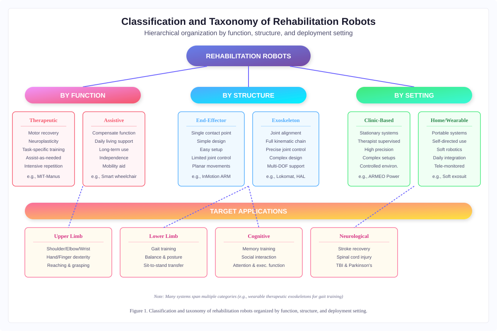
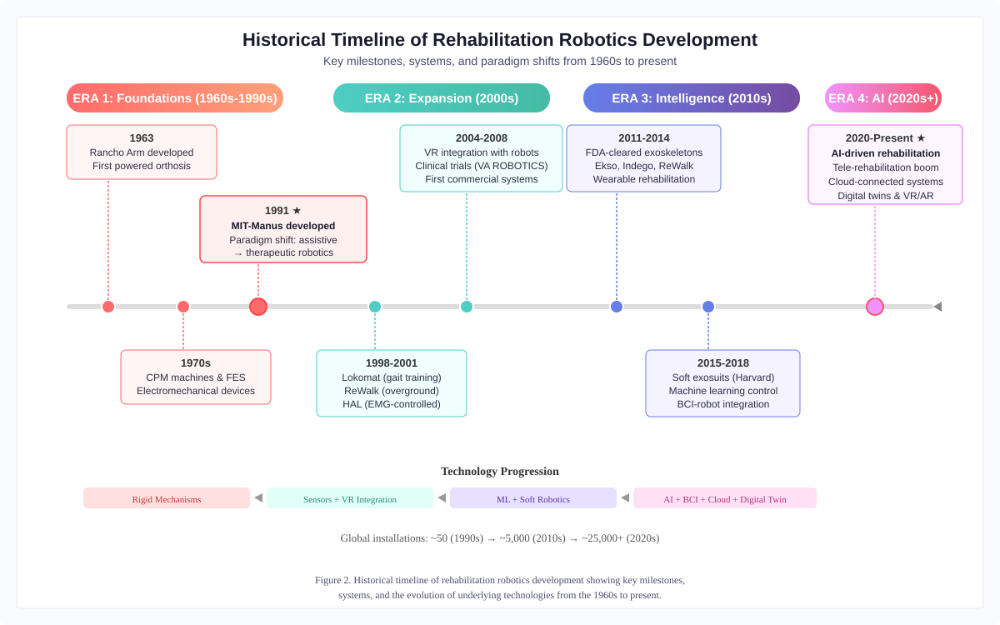
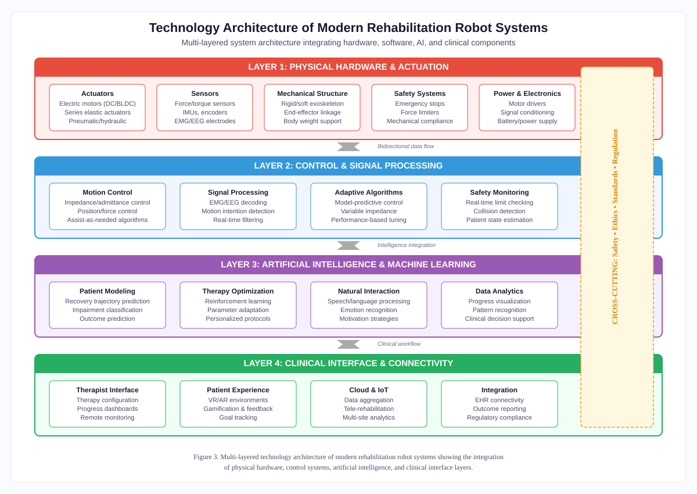
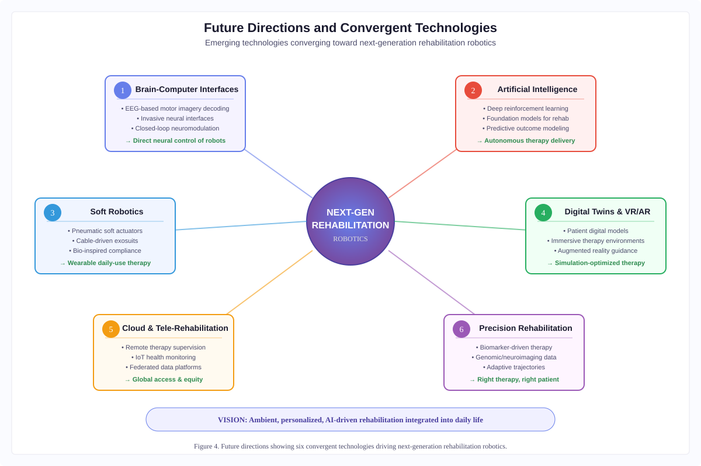

# Chapter 1: Introduction to Rehabilitation Robots: Historical Context and Evolution

## Chapter Introduction

The intersection of robotics and rehabilitation medicine represents one of the most promising frontiers in modern healthcare. Rehabilitation robots—engineered systems designed to assist, augment, or restore human motor and cognitive function—have evolved from rudimentary mechanical aids into sophisticated, intelligent platforms capable of delivering personalized therapeutic interventions [1]. As global populations age and the prevalence of neurological disorders, musculoskeletal injuries, and chronic disabilities continues to rise, the demand for effective, scalable, and accessible rehabilitation solutions has never been greater [2].

The development of rehabilitation robotics is not merely a technological endeavor; it is a deeply interdisciplinary enterprise that draws upon advances in mechanical engineering, computer science, neuroscience, clinical medicine, and artificial intelligence. The field has been shaped by decades of research, clinical experimentation, and iterative design, progressing from early robotic manipulators in the 1960s to today's AI-driven, wearable, and cloud-connected rehabilitation systems. Throughout this evolution, the guiding principle has remained constant: to improve the quality of life for individuals with physical and cognitive disabilities by providing effective, evidence-based rehabilitation therapies.

This introductory chapter establishes the foundational knowledge necessary for understanding the subsequent chapters of this book. It begins by defining the scope and classification of rehabilitation robots (see **Figure 1** for a comprehensive taxonomy), distinguishing them from related technologies such as assistive and service robots (see **Table 1**). The chapter then traces the historical evolution of the field, from its origins in early rehabilitation medicine and mechanical aids through key technological milestones that have shaped modern practice (see **Figure 2** and **Table 2**). Clinical applications in both physical and cognitive rehabilitation are examined, highlighting the breadth and depth of robotic interventions across diverse patient populations. Finally, the chapter looks forward, identifying current challenges (**Table 4**) and emerging technologies (**Figure 4**) that will define the next generation of rehabilitation robotics.

By providing this comprehensive overview, the chapter aims to orient readers—whether they are engineers, clinicians, researchers, or students—within the broader landscape of rehabilitation robotics, setting the stage for the detailed explorations of specific systems, technologies, and applications that follow in subsequent chapters.

---

## Section 1: Foundations of Rehabilitation Robotics

### 1.1 Definition and Scope of Rehabilitation Robots

#### Concept and Classification of Rehabilitation Robots

Rehabilitation robots are defined as robotic systems specifically designed to facilitate the recovery, improvement, or maintenance of physical and cognitive functions in individuals with disabilities, injuries, or neurological conditions [3]. Unlike industrial robots that operate in structured environments with predetermined tasks, rehabilitation robots must interact closely and safely with human users, adapting their behavior to the unique and often unpredictable needs of each patient [4].

The classification of rehabilitation robots can be approached from multiple perspectives. From a functional standpoint, these systems are broadly categorized into therapeutic robots and assistive robots. Therapeutic robots are designed to deliver rehabilitation exercises and interventions, guiding patients through repetitive, task-specific movements to promote neuroplasticity and motor recovery. Assistive robots, by contrast, are intended to compensate for lost function, enabling individuals to perform activities of daily living that would otherwise be impossible or extremely difficult.

From a structural perspective, rehabilitation robots can be classified as end-effector-based systems, which interact with the patient at a single point (typically the hand or foot), or exoskeletal systems, which align their joints with the anatomical joints of the user, providing support and guidance along the entire kinematic chain [5]. End-effector systems offer simplicity in design and ease of use but provide limited control over individual joint movements. Exoskeletons, while more complex and expensive, offer precise joint-level control and are particularly suited for gait rehabilitation and complex multi-joint movements [6].

A further classification distinguishes between stationary (clinic-based) rehabilitation robots and portable or wearable systems designed for home use or community settings. Stationary systems, such as the MIT-Manus and the Lokomat, are typically found in clinical environments where they can be supervised by therapists. Wearable rehabilitation robots, including soft robotic gloves and powered orthoses, represent a growing category that enables patients to continue their rehabilitation outside of clinical settings, thereby increasing therapy dose and frequency.

#### Role in Physical and Cognitive Rehabilitation

In physical rehabilitation, robots serve multiple roles. They provide consistent, high-intensity, repetitive practice of functional movements—a key driver of neuroplastic recovery following stroke, spinal cord injury, traumatic brain injury, and other neurological conditions. Robots can precisely control the assistance provided to a patient, implementing assist-as-needed paradigms that challenge the patient appropriately while preventing frustration or injury. They also offer objective, quantitative measurement of patient performance, enabling therapists to track progress over time and adjust treatment protocols accordingly. The diversity of physical and cognitive rehabilitation applications is reflected in the target application categories shown in **Figure 1**.

In cognitive rehabilitation, robots play an increasingly important role as interactive agents that can deliver cognitive training exercises, provide social interaction, and support memory and attention in patients with dementia, autism spectrum disorders, and other cognitive impairments [7]. Socially assistive robots (SARs) are designed to engage patients through verbal and non-verbal communication, motivating participation in therapeutic activities without physical contact [8]. These systems leverage advances in natural language processing, emotion recognition, and adaptive behavior to create personalized, engaging therapeutic experiences.

The integration of physical and cognitive rehabilitation represents an emerging paradigm in the field. Modern rehabilitation robots increasingly incorporate dual-task training, combining physical exercises with cognitive challenges to address the interconnected nature of motor and cognitive recovery. This holistic approach reflects growing evidence that physical and cognitive rehabilitation are not independent processes but rather complementary aspects of overall functional recovery.

#### Distinction from Assistive and Service Robots

While rehabilitation robots share certain technological foundations with assistive and service robots, important distinctions exist in their purpose, design philosophy, and interaction paradigms. Assistive robots are designed to compensate for functional limitations on a permanent or long-term basis, enabling users to perform tasks they cannot accomplish independently. Examples include robotic wheelchairs, feeding robots, and environmental control systems. The goal of assistive robots is not recovery but rather functional independence despite persistent disability.

Service robots, broadly defined, perform useful tasks for humans in non-industrial settings. While some service robots may be deployed in healthcare environments (e.g., delivery robots in hospitals, disinfection robots), they are not specifically designed for therapeutic purposes. The distinction between rehabilitation and service robots lies primarily in their therapeutic intent and their need to interact intimately and safely with vulnerable patient populations.

Rehabilitation robots occupy a unique position in this taxonomy: they are designed with the explicit goal of promoting recovery and reducing disability over time. This therapeutic orientation imposes specific design requirements, including the ability to modulate assistance levels, provide appropriate sensory feedback, ensure patient safety during physical interaction, and adapt to changing patient capabilities as recovery progresses. The temporary nature of the rehabilitation robot's role—ideally, the patient will eventually no longer need it—fundamentally differentiates it from assistive technologies designed for long-term use.

The comprehensive classification of rehabilitation robots, including their functional, structural, and deployment-based categorizations, is illustrated in **Figure 1**. As shown in **Table 1**, the distinctions among rehabilitation, assistive, and service robots are fundamental to understanding the design philosophy, clinical intent, and regulatory requirements applicable to each category.

**Figure 1.** Classification and taxonomy of rehabilitation robots organized by function, structure, and deployment setting. The hierarchical framework distinguishes systems by therapeutic purpose (therapeutic vs. assistive), mechanical architecture (end-effector vs. exoskeleton), and deployment environment (clinic-based vs. home/wearable), with representative examples for each category.

---

**Table 1.** Comparative characteristics of rehabilitation robots, assistive robots, and service robots.

| Characteristic | Rehabilitation Robots | Assistive Robots | Service Robots |
|---|---|---|---|
| **Primary Goal** | Promote functional recovery and neuroplastic adaptation | Compensate for permanent functional limitations | Perform general useful tasks in non-industrial settings |
| **Temporal Use** | Temporary (during recovery period) | Long-term or permanent | Variable (task-dependent) |
| **Interaction Mode** | Active patient participation required; assist-as-needed | Passive user; robot performs task for user | Minimal or no physical contact with user |
| **Adaptability** | Continuously adapts to changing patient capabilities | Configured for stable user needs | Task-specific programming |
| **Clinical Oversight** | Therapist-supervised or prescribed | Occasional technical support | Not clinically supervised |
| **Key Design Principle** | Challenge optimization for motor learning | Functional compensation and independence | Task efficiency and reliability |
| **Target Population** | Stroke, SCI, TBI, neurological conditions | Severe chronic disability | General population |
| **Examples** | MIT-Manus, Lokomat, HAL, ARMEO | Smart wheelchairs, feeding robots, Jaco arm | Hospital delivery robots, disinfection robots |
| **Outcome Measure** | Functional improvement scores (FMA, ARAT) | Activity independence (FIM, COPM) | Task completion rate |
| **Regulatory Class** | Medical device (Class II/III) | Medical device or assistive technology | Consumer or commercial device |

---

### 1.2 Origins of Rehabilitation Technology

#### Early Rehabilitation Methods and Mechanical Aids

The history of rehabilitation technology extends far beyond the modern era of robotics. Ancient civilizations developed primitive prosthetic devices and mechanical aids to assist individuals with disabilities. Egyptian artifacts dating to approximately 950 BCE include wooden prosthetic toes, while medieval European records document the use of iron hands and other mechanical prostheses for soldiers injured in battle. However, these early devices were purely compensatory and lacked any therapeutic intent.

The concept of rehabilitation as a deliberate process of functional recovery emerged more clearly in the 18th and 19th centuries, driven by advances in medicine and the growing recognition that structured exercise and physical therapy could promote recovery from injury and illness. The development of orthopedic devices, splints, and exercise machines during this period laid the groundwork for later electromechanical and robotic rehabilitation systems.

The two World Wars of the 20th century proved to be powerful catalysts for rehabilitation technology [9]. The unprecedented number of soldiers returning with severe injuries and disabilities created enormous demand for effective rehabilitation services. This demand spurred the development of specialized rehabilitation centers, standardized therapy protocols, and increasingly sophisticated mechanical aids. The emergence of physical therapy and occupational therapy as distinct clinical professions during this period reflected the growing recognition of rehabilitation as a systematic, evidence-based endeavor.

#### Emergence of Electromechanical Rehabilitation Devices

The post-war period saw the introduction of electromechanical devices into rehabilitation practice. Continuous passive motion (CPM) machines, developed in the 1970s and 1980s, represented an early application of motorized systems to rehabilitation, providing controlled, repetitive joint movements to promote healing after orthopedic surgery [10]. While CPM machines lacked the intelligence and adaptability of modern rehabilitation robots, they established the principle that mechanized, repetitive movement could be therapeutically beneficial.

The development of functional electrical stimulation (FES) systems in the 1960s and 1970s represented another important precursor to robotic rehabilitation. FES systems use electrical currents to activate paralyzed muscles, enabling functional movements in patients with spinal cord injuries and stroke. While not robotic in the traditional sense, FES systems introduced the concept of technology-mediated movement restoration and demonstrated the potential for engineered systems to interface directly with the human neuromuscular system.

Biofeedback systems, which emerged in the 1970s, provided patients with real-time information about their physiological states (such as muscle activity measured by electromyography) to facilitate voluntary control over bodily functions. These systems established the importance of sensory feedback in rehabilitation—a principle that would later become central to the design of interactive rehabilitation robots. Together with CPM and FES systems, biofeedback devices represent the electromechanical precursors to modern rehabilitation robotics; while they lack the intelligence and autonomy that distinguish contemporary systems (see **Table 1** for defining characteristics), they established foundational principles that continue to inform robotic rehabilitation design.

#### Influence of Biomedical Engineering on Rehabilitation

The growth of biomedical engineering as a formal discipline in the 1960s and 1970s provided the intellectual and institutional framework for the development of rehabilitation robotics. Biomedical engineering brought together expertise from mechanical engineering, electrical engineering, computer science, and clinical medicine, creating a fertile environment for the development of technologies at the interface of engineering and healthcare.

Key contributions from biomedical engineering to rehabilitation robotics include the development of biomechanical models of human movement, which provide the mathematical foundations for designing robots that interact safely and effectively with the human body. Advances in materials science led to the development of lightweight, biocompatible materials suitable for devices worn on or near the body. Signal processing techniques enabled the interpretation of biological signals (such as electromyography and electroencephalography) as control inputs for robotic systems.

The establishment of dedicated research centers and academic programs in biomedical engineering and rehabilitation engineering during the 1970s and 1980s created the intellectual infrastructure that would support the emergence of rehabilitation robotics as a distinct field in the following decades. Institutions such as the Rehabilitation Engineering Research Centers (RERCs) funded by the National Institute on Disability and Rehabilitation Research (NIDRR) in the United States played a crucial role in fostering research at the intersection of engineering and rehabilitation.

### 1.3 Interdisciplinary Nature of Rehabilitation Robotics

#### Contributions from Robotics, Medicine, Neuroscience, and AI

Rehabilitation robotics is inherently interdisciplinary, drawing upon knowledge and methods from multiple fields. From robotics and mechanical engineering come the fundamental principles of mechanism design, actuation, sensing, and control that enable the creation of physical robotic systems. The development of compliant actuators, backdrivable mechanisms, and force-controlled systems has been particularly important for rehabilitation applications, where safety and gentle interaction with the human body are paramount.

From medicine and clinical rehabilitation science come the understanding of disease processes, recovery mechanisms, and therapeutic principles that inform the design of effective robotic interventions. Clinical knowledge guides decisions about which movements to practice, how much assistance to provide, when to progress therapy, and how to measure outcomes. Without deep clinical input, rehabilitation robots risk being technologically impressive but therapeutically ineffective.

Neuroscience has provided crucial insights into the mechanisms of motor learning and neuroplasticity that underpin rehabilitation [11]. The discovery that the adult brain retains significant capacity for reorganization following injury has provided the scientific rationale for intensive, repetitive, task-specific practice—precisely the type of therapy that robots are uniquely suited to deliver [12]. Concepts such as motor learning theory, the challenge point framework, and principles of experience-dependent plasticity directly inform the design of robotic therapy protocols.

Artificial intelligence and machine learning are increasingly central to rehabilitation robotics, enabling systems to adapt their behavior to individual patients, predict outcomes, optimize therapy protocols, and provide intelligent decision support to clinicians. Machine learning algorithms can analyze patient performance data to identify patterns, detect changes in motor ability, and personalize therapy in ways that would be impossible for human therapists alone.

#### Collaboration Among Clinicians, Engineers, and Therapists

The development of effective rehabilitation robots requires close collaboration among diverse professionals. Engineers bring technical expertise in design, fabrication, and programming, but they must work closely with clinicians and therapists who understand patient needs, clinical workflows, and the practical constraints of healthcare delivery. This collaboration is not merely desirable but essential: the history of rehabilitation robotics contains numerous examples of technically sophisticated systems that failed to achieve clinical adoption because they did not adequately address the needs and workflows of end users.

Successful rehabilitation robot development teams typically include mechanical and electrical engineers, computer scientists, physicians (particularly physiatrists and neurologists), physical therapists, occupational therapists, and increasingly, patients themselves. The involvement of patients and caregivers in the design process—through participatory design methods, user testing, and iterative feedback—helps ensure that robotic systems are not only effective but also usable, comfortable, and acceptable to those who will ultimately use them.

The challenge of interdisciplinary collaboration in rehabilitation robotics extends beyond the development phase to include clinical validation, regulatory approval, and implementation in healthcare settings. Each of these stages requires different types of expertise and presents unique challenges. Clinical trials require rigorous experimental design and statistical analysis; regulatory processes demand detailed documentation of safety and efficacy; and clinical implementation requires attention to workflow integration, training, and economic sustainability.

#### Importance of User-Centered Design

User-centered design (UCD) has emerged as a critical principle in rehabilitation robotics, reflecting the recognition that the success of a rehabilitation robot depends not only on its technical capabilities but also on its acceptance and usability by patients, therapists, and caregivers. UCD involves systematically incorporating the perspectives, needs, and preferences of end users throughout the design process, from initial concept development through final implementation and evaluation.

For patients, user-centered design considerations include comfort, safety, ease of donning and doffing, aesthetics, and the psychological experience of using the robot. A rehabilitation robot that is uncomfortable, intimidating, or stigmatizing is unlikely to achieve the high levels of patient engagement and compliance necessary for effective therapy. For therapists, key considerations include ease of setup and adjustment, integration with existing clinical workflows, and the availability of meaningful outcome data to guide clinical decision-making.

The application of UCD principles to rehabilitation robotics has been facilitated by methodological advances in human factors engineering, usability testing, and participatory design. Techniques such as contextual inquiry, task analysis, prototyping, and iterative user testing enable development teams to identify and address usability issues early in the design process, reducing the risk of developing systems that are technically capable but clinically impractical.

The importance of user-centered design is further underscored by the relatively low rate of clinical adoption of rehabilitation robots despite decades of research and development. Many promising systems have failed to transition from research laboratories to clinical practice, often due to factors related to usability, cost, workflow integration, or insufficient evidence of clinical superiority over conventional therapy. Addressing these challenges requires not only technical innovation but also a deep understanding of the human and organizational factors that determine the success or failure of new technologies in healthcare settings.

---

## Section 2: Historical Evolution of Rehabilitation Robots

### 2.1 Early Development (1960s–1990s)

#### Initial Robotic Rehabilitation Systems

The origins of rehabilitation robotics as a distinct field can be traced to the 1960s and 1970s, when researchers first began exploring the application of robotic technology to assist individuals with disabilities (see **Figure 2** for a complete historical timeline). The Rancho Los Amigos National Rehabilitation Center in Downey, California, developed one of the earliest robotic systems for rehabilitation in the 1960s—the Rancho Arm—a powered orthosis designed to provide functional arm movements for individuals with high-level spinal cord injuries [13]. Although primitive by modern standards, the Rancho Arm demonstrated the feasibility of using robotic technology to restore functional capability in severely disabled individuals.

During the 1970s, several research groups explored the use of robotic manipulators as assistive devices for individuals with severe motor impairments. The Johns Hopkins University Applied Physics Laboratory developed robotic workstations that allowed quadriplegic individuals to perform tasks such as eating, drinking, and manipulating objects using voice-controlled robotic arms. These early systems were primarily assistive rather than therapeutic in nature, designed to compensate for lost function rather than to promote recovery.

The conceptual shift from assistive to therapeutic robotics occurred in the late 1980s and early 1990s, driven by emerging evidence from neuroscience suggesting that intensive, repetitive practice could promote motor recovery even in chronic neurological conditions. This shift was catalyzed by the pioneering work of Neville Hogan and Hermano Igo Krebs at the Massachusetts Institute of Technology (MIT), who developed the MIT-Manus (later commercialized as InMotion) in the early 1990s (see **Table 2** for key system characteristics) [14]. The MIT-Manus was explicitly designed as a therapeutic device, intended to deliver intensive upper-limb rehabilitation to stroke survivors by guiding their arm movements through reaching tasks.

The MIT-Manus represented a paradigm shift in rehabilitation robotics for several reasons. First, it was designed from the outset as a therapeutic tool rather than an assistive device, reflecting the emerging understanding of neuroplasticity and the potential for motor recovery through intensive practice. Second, it employed impedance control—a compliant interaction strategy that allowed the robot to guide movements gently while permitting the patient to contribute actively to the movement. Third, it was developed through close collaboration between engineers and clinicians, ensuring clinical relevance and feasibility.

#### Development of Robotic Manipulators and Therapy Devices

Following the success of the MIT-Manus, the 1990s saw a rapid expansion of research into robotic rehabilitation systems. Several groups developed alternative approaches to upper-limb rehabilitation, exploring different mechanical architectures, control strategies, and therapeutic paradigms. The MIME (Mirror Image Movement Enabler) system, developed at the Veterans Affairs Palo Alto Health Care System, used a PUMA industrial robot to provide bimanual training, assisting the affected arm to mirror movements performed by the unaffected arm [15]. This approach was inspired by evidence suggesting that bilateral training could facilitate motor recovery through interhemispheric coupling mechanisms.

In Europe, the ARM Guide (Assisted Rehabilitation and Measurement Guide) was developed at the University of California, Irvine, to provide constrained reaching movements in a linear path. The Gentle/s system, developed through a European Union collaborative project, combined a haptic robot with virtual reality environments to create engaging, motivating rehabilitation exercises. These early systems collectively demonstrated the diversity of approaches possible within rehabilitation robotics and established the foundations for subsequent developments.

Lower-limb rehabilitation robotics also emerged during this period, although progress was initially slower than for upper-limb systems. The challenge of supporting body weight and providing walking-like movements required substantially larger and more powerful robotic systems. The Lokomat, developed by Gery Colombo and colleagues at the Swiss Federal Institute of Technology (ETH Zurich) and the Balgrist University Hospital in the late 1990s, represented a breakthrough in lower-limb rehabilitation robotics [16]. The Lokomat combined a powered gait orthosis with a body weight support system and a treadmill, enabling patients with severe gait impairments to practice walking with precise kinematic guidance.

#### Challenges and Technological Limitations

Despite the promising results of early rehabilitation robots, the field faced numerous challenges during this period. Technologically, the available actuators, sensors, and control systems imposed significant limitations on the performance, safety, and adaptability of rehabilitation robots. Electric motors of the era were often too heavy and bulky for wearable applications, while hydraulic and pneumatic actuators presented challenges in terms of precision, noise, and safety. Sensor technology was limited, making it difficult to accurately measure patient movements and forces in real time.

From a computational perspective, the limited processing power and memory available in the 1990s constrained the complexity of control algorithms and the ability to implement real-time adaptive behaviors. Machine learning and artificial intelligence techniques, while theoretically applicable, were not yet mature enough for practical implementation in rehabilitation robotics. Control strategies were largely based on classical control theory, with limited ability to adapt to individual patient characteristics or changing capabilities over time.

Clinical adoption was also hindered by the high cost of early rehabilitation robots, their large physical footprint, the complexity of their setup and operation, and the limited clinical evidence base supporting their use. Many early systems required extensive technical support and were not designed with clinical workflows in mind, making them impractical for routine clinical use. The scarcity of randomized controlled trials demonstrating clear superiority over conventional therapy further limited enthusiasm among clinicians and healthcare administrators.

Additionally, regulatory frameworks for medical robotic devices were still evolving during this period, creating uncertainty about the pathway to clinical use and commercialization. The absence of standardized safety requirements and testing protocols for rehabilitation robots posed challenges for developers seeking to bring their systems to market. These regulatory challenges, combined with the technical and clinical limitations described above, meant that by the end of the 1990s, rehabilitation robotics remained largely a research endeavor, with only limited clinical deployment.

### 2.2 Expansion During the 2000s

#### Growth of Robotic Exoskeletons and Gait Trainers

The 2000s marked a period of significant expansion in rehabilitation robotics, characterized by increasing clinical deployment, growing commercial activity, and important advances in technology and clinical evidence. One of the most notable developments during this decade was the maturation of robotic exoskeletons for gait rehabilitation. Building on the foundation laid by the Lokomat in the late 1990s, several new gait rehabilitation systems emerged, offering different approaches to restoring walking ability.

The AutoAmbulator, developed by HealthSouth Corporation, represented an early commercial gait rehabilitation system that combined a robotic orthosis with a treadmill and body weight support. The ReoAmbulator (later marketed as the AutoAmbulator) automated the labor-intensive process of body-weight-supported treadmill training, which previously required two or three therapists to manually guide a patient's legs through stepping movements. This automation addressed a critical practical barrier to intensive gait rehabilitation—the physical demands on therapists—and demonstrated the potential for robots to increase the feasibility and intensity of gait training.

In parallel, overground exoskeletons began to emerge as an alternative to treadmill-based systems. The ReWalk system, developed by Amit Goffer in Israel beginning in 2001, was among the first powered exoskeletons designed to enable paraplegic individuals to stand and walk overground [17]. Unlike treadmill-based systems that required a fixed infrastructure, overground exoskeletons offered the potential for functional mobility in real-world environments. This distinction between treadmill-based and overground systems would become an important design consideration in the following decade.

The Hybrid Assistive Limb (HAL), developed by Yoshiyuki Sankai at the University of Tsukuba in Japan, represented a particularly innovative approach to exoskeletal rehabilitation [18]. HAL used surface electromyography (EMG) sensors to detect the wearer's movement intentions through residual muscle signals, enabling a more natural and intuitive control interface than position-based or preprogrammed movement patterns. This bioelectric approach to exoskeleton control demonstrated the potential for seamless human-robot interaction in rehabilitation applications.

#### Integration of Sensors and Computer-Assisted Therapy

The 2000s also saw significant advances in the integration of sophisticated sensing technologies into rehabilitation robots. Force and torque sensors enabled more precise measurement of patient-robot interaction forces, facilitating the development of assist-as-needed control strategies that could modulate robotic assistance based on the patient's instantaneous performance. Position and motion sensors became smaller, more accurate, and less expensive, enabling more precise kinematic measurements and feedback.

The integration of virtual reality (VR) and gaming technologies with rehabilitation robots represented another important development of this decade [19]. Researchers recognized that patient motivation and engagement were critical determinants of rehabilitation outcomes, and that the repetitive nature of robot-assisted therapy could lead to boredom and reduced participation. By combining robotic therapy with immersive visual environments and game-like tasks, researchers created more engaging therapeutic experiences that could sustain patient motivation over extended treatment periods [20].

Systems such as the ARMEO (an evolution of the T-WREX passive exoskeleton combined with VR games), the Haptic Master with virtual environments, and various custom VR-integrated robotic platforms demonstrated the potential of combining physical robotic interaction with virtual visual and auditory feedback. These combined systems could provide enriched sensory experiences, create meaningful task contexts for otherwise abstract movements, and offer immediate performance feedback that reinforced successful movements and motivated continued effort.

Computer-assisted therapy management also advanced during this period. Rehabilitation robots began to incorporate sophisticated data recording and analysis capabilities, enabling therapists to review detailed records of patient performance across sessions. These data management systems laid the groundwork for the data-driven, personalized approaches to rehabilitation that would become increasingly prominent in the following decade.

#### Clinical Validation and Commercialization

Perhaps the most significant development of the 2000s was the growing body of clinical evidence supporting the efficacy of robotic rehabilitation. Large-scale randomized controlled trials, including the VA ROBOTICS multi-site trial of the MIT-Manus for upper-limb stroke rehabilitation, provided rigorous evidence that robot-assisted therapy could produce meaningful improvements in motor function [21]. While the results of these trials generally showed that robotic therapy was comparable to (rather than clearly superior to) dose-matched conventional therapy, they established that robots could deliver effective rehabilitation with reduced demands on therapist time [22].

This clinical evidence base, combined with maturing technology and increasing awareness of rehabilitation robotics among clinicians and healthcare administrators, facilitated the commercialization of several robotic rehabilitation systems during the 2000s. Companies such as Hocoma (Lokomat), Interactive Motion Technologies (InMotion), Tyromotion, and others brought robotic rehabilitation products to market, establishing commercial distribution networks and providing the technical support necessary for clinical deployment.

The commercialization of rehabilitation robots during this period was facilitated by the development of clearer regulatory pathways in major markets, particularly the United States (through the FDA) and Europe (through CE marking). As regulatory agencies gained experience with robotic rehabilitation devices, the approval process became more predictable, reducing uncertainty for manufacturers and investors. The establishment of reimbursement codes for robot-assisted therapy in some healthcare systems also supported commercial viability, although reimbursement remained a significant barrier in many markets.

By the end of the 2000s, rehabilitation robotics had transitioned from a primarily academic pursuit to a field with significant commercial activity and growing clinical deployment. Several thousand rehabilitation robots were in use in clinics worldwide, and the field had attracted substantial investment from both public research funding agencies and private industry. However, widespread adoption remained limited, and significant challenges related to cost, evidence, and clinical integration persisted.

The historical progression of rehabilitation robotics from the 1960s through the present day is depicted in **Figure 2**, which illustrates the key milestones, paradigm shifts, and technological developments across four distinct eras. As further detailed in **Table 2**, each generation of rehabilitation robots has introduced increasingly sophisticated capabilities, with the trajectory moving from simple mechanical assistance toward intelligent, adaptive, and personalized therapeutic systems. The systems summarized in **Table 2** represent only a selection of the most influential platforms; hundreds of additional systems have been developed by research groups worldwide, as reflected in the growing density of milestones in **Figure 2**.

**Figure 2.** Historical timeline of rehabilitation robotics development showing key milestones, systems, and the evolution of underlying technologies from the 1960s to present. The timeline identifies four major eras: Foundations (1960s–1990s), Expansion (2000s), Intelligence (2010s), and AI-driven systems (2020s–present).

---

**Table 2.** Key rehabilitation robot systems: development timeline, characteristics, and clinical applications.

| System | Year | Developer/Institution | Type | Target | Control Strategy | Key Innovation |
|---|---|---|---|---|---|---|
| Rancho Arm | 1963 | Rancho Los Amigos, USA | Powered orthosis | Upper limb (SCI) | Position control | First rehabilitation-oriented robotic system |
| MIT-Manus/InMotion | 1991 | MIT, USA | End-effector | Upper limb (stroke) | Impedance control | Paradigm shift to therapeutic robotics |
| MIME | 1999 | VA Palo Alto, USA | Industrial robot | Upper limb (bilateral) | Mirror-image mode | Bimanual training for interhemispheric coupling |
| Lokomat | 1998 | Hocoma/ETH Zurich, Switzerland | Exoskeleton + treadmill | Gait training | Position-guided walking | Automated body-weight-supported gait training |
| HAL | 2001 | Univ. of Tsukuba, Japan | Wearable exoskeleton | Full body mobility | EMG-driven bioelectric | Voluntary intention-based exoskeleton control |
| ReWalk | 2001 | Argo Medical, Israel | Overground exoskeleton | Gait (paraplegic) | Tilt-sensor triggered | First overground powered walking for SCI |
| ARMEO Power | 2006 | Hocoma, Switzerland | Powered exoskeleton | Full arm + VR | Assist-as-needed | Integrated virtual reality rehabilitation |
| Ekso GT | 2012 | Ekso Bionics, USA | Overground exoskeleton | Gait (stroke/SCI) | Variable assist | FDA-cleared clinical exoskeleton |
| Soft Exosuit | 2015 | Harvard Biodesign Lab, USA | Cable-driven textile | Gait assistance | Force-based | Soft robotics for natural gait assistance |
| PARO | 2003 | AIST, Japan | Socially assistive | Cognitive (dementia) | Responsive behavior | Therapeutic social robot for elderly care |

---

### 2.3 Modern Advances (2010s–Present)

#### AI-Driven Rehabilitation Robots

The 2010s and 2020s have witnessed a transformative integration of artificial intelligence and machine learning into rehabilitation robotics, fundamentally changing the capabilities and clinical potential of these systems. Early rehabilitation robots operated with relatively simple, fixed control algorithms that provided the same therapy to all patients regardless of their individual characteristics, capabilities, or recovery trajectories. Modern AI-driven systems, by contrast, can analyze patient data in real time, identify individual patterns and needs, and adapt their behavior accordingly.

Machine learning algorithms have been applied to multiple aspects of rehabilitation robotics. Reinforcement learning approaches have been used to optimize assistance strategies, learning through interaction with the patient to provide the minimum assistance necessary for successful task completion [23]. This implementation of the assist-as-needed principle through data-driven optimization represents a significant advance over earlier, rule-based approaches to assistance modulation.

Deep learning techniques have enabled the development of more sophisticated intention detection systems, capable of interpreting subtle patterns in electromyographic, electroencephalographic, and kinematic signals to anticipate the patient's desired movements before they are fully executed [24]. These predictive capabilities enable more responsive and natural-feeling robotic assistance, reducing the latency between intention and action that can make robot-assisted movements feel unnatural.

AI-based systems have also been applied to therapy planning and outcome prediction. Machine learning models trained on large datasets of patient records and therapy outcomes can predict which patients are likely to benefit most from robotic therapy, which therapy parameters are likely to be most effective for individual patients, and when patients are likely to plateau in their recovery. These predictive capabilities enable more efficient allocation of rehabilitation resources and more personalized treatment planning.

Natural language processing and conversational AI have been integrated into socially assistive rehabilitation robots, enabling more natural and engaging interactions between robots and patients. Modern social robots used in rehabilitation settings can engage in meaningful conversations, provide encouragement and motivation, remember patient preferences and history, and adapt their communication style to individual patients. These capabilities are particularly important in cognitive rehabilitation applications, where sustained engagement and social interaction are therapeutic in themselves.

#### Wearable Robotics and Soft Robotic Technologies

The development of wearable and soft robotic technologies represents one of the most significant advances in rehabilitation robotics during the 2010s and 2020s (as reflected in the technology progression shown in **Figure 2** and the actuator comparison in **Table 3**). Traditional rigid rehabilitation robots, while effective in clinical settings, are typically large, heavy, expensive, and confined to specialized therapy rooms. Wearable robots, by contrast, can be worn on the body during daily activities, enabling rehabilitation to continue outside of clinical environments and potentially transforming rehabilitation from a time-limited clinical intervention to a continuous, integrated aspect of daily life.

Rigid wearable exoskeletons, such as the Ekso (Ekso Bionics), Indego (Parker Hannifin), and ReWalk systems, achieved FDA clearance for clinical use during the 2010s, representing important milestones in the translation of exoskeleton technology from research to clinical practice [25]. These systems enable individuals with spinal cord injuries to stand and walk, and are used both as therapeutic tools (providing intensive walking practice to promote recovery) and as mobility aids (enabling functional ambulation in community settings).

Soft robotics has emerged as a particularly promising technology for rehabilitation applications. Unlike traditional rigid robots constructed from metal and hard plastics, soft robots are made from compliant materials such as elastomers, fabrics, and flexible polymers. Soft robotic rehabilitation devices—including pneumatically actuated gloves, cable-driven exosuits, and shape-memory alloy-based actuators—offer several advantages for rehabilitation: they are lightweight, comfortable, unobtrusive, and inherently safe due to their compliance and limited force output.

The Harvard Biodesign Lab's soft robotic exosuit, developed by Conor Walsh and colleagues, exemplifies the potential of soft robotics for rehabilitation [26]. This cable-driven system uses lightweight functional textiles and Bowden cable actuators to provide assistive forces during walking, without the rigid structural elements of traditional exoskeletons. Clinical studies have demonstrated that soft exosuits can improve walking speed, reduce metabolic cost, and enhance gait symmetry in individuals with stroke-related hemiparesis [27].

Soft robotic gloves for hand rehabilitation represent another active area of development. Systems such as the Wyss Institute's soft robotic glove and various pneumatically actuated hand rehabilitation devices provide gentle assistance for finger and hand movements, enabling patients with hand weakness due to stroke or other conditions to practice grasping and manipulation tasks. The lightweight and unobtrusive nature of these devices makes them particularly suitable for home-based rehabilitation programs.

#### Tele-Rehabilitation and Cloud-Connected Robotic Systems

The convergence of rehabilitation robotics with telecommunications and cloud computing technologies has given rise to tele-rehabilitation systems that enable remote delivery of robot-assisted therapy [28]. This development has been accelerated by the COVID-19 pandemic, which dramatically limited access to in-person rehabilitation services and created urgent demand for remote therapy delivery modalities.

Cloud-connected rehabilitation robots can transmit patient performance data to remote servers, where it can be analyzed by therapists, used to generate progress reports, and processed by AI algorithms to optimize therapy parameters. Therapists can monitor multiple patients remotely, reviewing their performance data and adjusting therapy protocols without requiring in-person visits. This remote monitoring capability is particularly valuable for patients in rural or underserved areas who may have limited access to specialized rehabilitation facilities.

Tele-rehabilitation systems also enable remote supervision of robotic therapy sessions, with therapists observing patient performance through video links and communicating with patients in real time. Some systems allow therapists to remotely adjust robot parameters during therapy sessions, providing a level of clinical oversight that was previously possible only during in-person visits. This capability bridges the gap between the precision and consistency of robotic therapy and the clinical judgment and motivational support provided by human therapists.

The integration of Internet of Things (IoT) technologies with rehabilitation robots has enabled continuous monitoring of patient activity and health status outside of formal therapy sessions. Wearable sensors and smart home devices can track patient movements, activity levels, sleep patterns, and other health indicators, providing a comprehensive picture of the patient's functional status and recovery trajectory. This continuous monitoring capability enables earlier detection of changes in patient status, more informed clinical decision-making, and more responsive therapy adjustments.

Cloud-based data platforms also enable the aggregation and analysis of rehabilitation data from multiple patients and sites, creating large datasets that can be used to train machine learning models, identify best practices, and establish evidence-based therapy guidelines. This collective intelligence approach to rehabilitation has the potential to accelerate the optimization of robotic therapy protocols and improve outcomes across the field.

---

## Section 3: Technological Milestones and Clinical Applications

### 3.1 Key Technological Innovations

#### Advances in Actuators, Sensors, and Control Systems

The evolution of rehabilitation robotics has been intimately linked to advances in the underlying component technologies—actuators, sensors, and control systems—that determine the capabilities, safety, and performance of robotic systems. Each generation of rehabilitation robots has benefited from improvements in these fundamental technologies, enabling progressively more sophisticated, capable, and clinically effective systems.

Actuator technology has undergone particularly significant evolution. Early rehabilitation robots relied primarily on conventional electric motors, which provided adequate force and speed but were often heavy, rigid, and poorly suited to the compliant, gentle interactions required in rehabilitation. The development of series elastic actuators (SEAs) by Gill Pratt and Matthew Williamson at MIT in the mid-1990s represented a landmark advance, introducing mechanical compliance into the actuator itself through a spring element placed in series between the motor and the output [29]. This compliance provides inherent shock absorption, enables more accurate force control, and improves safety in human-robot interaction.

Subsequent developments in actuator technology have included variable impedance actuators (VIAs), which can dynamically adjust their stiffness and damping characteristics; pneumatic artificial muscles (McKibben actuators), which provide high force-to-weight ratios and inherent compliance [30]; shape memory alloy actuators, which offer compact, silent actuation for low-force applications; and electroactive polymer actuators, which provide muscle-like contraction without conventional mechanical components [31]. Each of these actuator technologies offers distinct advantages for specific rehabilitation applications, and modern rehabilitation robots increasingly employ hybrid actuation strategies that combine multiple actuator types to achieve optimal performance.

Sensor technology has advanced equally dramatically. Modern rehabilitation robots incorporate a rich array of sensors including multi-axis force/torque sensors for measuring interaction forces, inertial measurement units (IMUs) for tracking body segment orientation and acceleration, encoders and potentiometers for joint angle measurement, electromyography (EMG) sensors for detecting muscle activity, and increasingly, electroencephalography (EEG) sensors for detecting brain activity and movement intentions. The miniaturization, cost reduction, and improved accuracy of these sensors have enabled more precise characterization of patient status and more responsive robotic control.

Control systems for rehabilitation robots have evolved from simple position-control and force-control schemes to sophisticated adaptive and intelligent control architectures [32]. Impedance control, introduced to rehabilitation robotics through the MIT-Manus, remains a foundational approach, but has been augmented with adaptive algorithms that can modify control parameters based on patient performance. Model-predictive control, sliding-mode control, and various forms of robust adaptive control have been applied to rehabilitation robots, each offering advantages in terms of performance, stability, and robustness to uncertainties in the human-robot system [33].

The multi-layered technology architecture of modern rehabilitation robot systems is depicted in **Figure 3**, which illustrates how physical hardware, control algorithms, AI/ML intelligence, and clinical interfaces are integrated into a cohesive system. **Table 3** provides a detailed comparison of the actuator technologies discussed above, highlighting their respective advantages, limitations, and typical rehabilitation applications. As shown in **Figure 3**, the control layer (Layer 2) serves as the critical bridge between physical hardware (Layer 1) and the higher-level AI intelligence (Layer 3), with each layer contributing distinct capabilities to the overall system performance. The sensor technologies listed in **Table 3** interface across multiple layers of this architecture, providing the data streams necessary for both real-time control and long-term therapy optimization.

**Figure 3.** Multi-layered technology architecture of modern rehabilitation robot systems showing the integration of physical hardware, control systems, artificial intelligence, and clinical interface layers. Cross-cutting concerns including safety, ethics, standards, and regulation span all layers.

---

**Table 3.** Comparison of actuator technologies used in rehabilitation robotics.

| Actuator Technology | Force Output | Compliance | Weight | Bandwidth | Safety | Noise | Typical Application | Key Advantages | Key Limitations |
|---|---|---|---|---|---|---|---|---|---|
| DC/BLDC Electric Motors | High | Rigid (without SEA) | Moderate-High | High | Requires limiters | Low-Moderate | Clinic-based exoskeletons, end-effectors | Precise control, reliable, well-understood | Heavy, rigid without compliance elements |
| Series Elastic Actuators (SEA) | High | Inherent (spring) | Moderate | Moderate | Inherently safe | Low | Therapeutic robots, powered prostheses | Shock absorption, accurate force control | Added complexity, reduced bandwidth |
| Variable Impedance Actuators (VIA) | Moderate-High | Adjustable | Moderate-High | Moderate | Tunable safety | Low | Adaptive rehabilitation, research platforms | Real-time stiffness modulation | Complex mechanism, higher cost |
| Pneumatic Artificial Muscles | High | Inherent | Low | Low-Moderate | Inherently safe | Moderate (compressor) | Wearable rehabilitation, soft robots | High force-to-weight ratio, lightweight | Requires air supply, nonlinear dynamics |
| Shape Memory Alloys (SMA) | Low-Moderate | Moderate | Very Low | Very Low | Safe (low force) | Silent | Hand/finger rehabilitation, micro-actuators | Extremely compact, silent, lightweight | Slow response, limited cycle life |
| Electroactive Polymers (EAP) | Low | High | Very Low | Moderate | Safe (low force) | Silent | Soft robotic gloves, haptic feedback | Muscle-like behavior, flexible, silent | Low force output, durability concerns |
| Cable/Bowden Drive Systems | Moderate | Low (cable stiffness) | Very Low (at joint) | High | Safe (remote actuation) | Low | Soft exosuits, hand rehabilitation | Remote motor placement, lightweight end-effector | Cable routing, friction losses |
| Hydraulic Actuators | Very High | Rigid | High | High | Requires safety valves | Moderate | Heavy-duty gait training, industrial rehab | Highest power density | Heavy, fluid leakage risk, complex |

---

#### Human-Robot Interaction and Adaptive Control

The quality of human-robot interaction (HRI) is perhaps the single most important determinant of a rehabilitation robot's therapeutic effectiveness. Unlike industrial robots that operate independently of human users, rehabilitation robots must work in intimate physical and cognitive partnership with patients, responding sensitively to their movements, intentions, and emotional states. The development of effective HRI frameworks for rehabilitation has required advances in sensing, control, and interface design.

Physical human-robot interaction in rehabilitation involves the direct exchange of forces and movements between the robot and the patient's body. The control challenge is to provide appropriate assistance—enough to enable successful task completion and maintain motivation, but not so much as to reduce the patient's active contribution and thereby limit the neuroplastic stimulus for recovery. This principle, known as assist-as-needed or minimal assistance, has become a central tenet of rehabilitation robot control design [34].

Implementing assist-as-needed control requires the robot to continuously estimate the patient's capability and intention, adjusting its assistance accordingly. Various approaches have been developed, including impedance-based methods that reduce assistance force when the patient contributes actively, performance-based methods that adjust difficulty based on success rates, and EMG-based methods that detect voluntary muscle activation and provide assistance only when the patient is actively attempting the movement. More recently, reinforcement learning approaches have been used to learn optimal assistance policies through interaction with individual patients.

Adaptive control extends beyond assistance modulation to encompass the broader adaptation of therapy parameters to individual patient needs and progress [35]. Modern rehabilitation robots can automatically adjust movement speed, range of motion, resistance levels, task complexity, and exercise selection based on patient performance data. This automatic adaptation enables therapy to remain appropriately challenging as the patient improves, maintaining the optimal level of difficulty—the so-called challenge point—that maximizes motor learning [36].

The cognitive and social dimensions of human-robot interaction have received increasing attention in recent years. Rehabilitation robots that provide verbal encouragement, display emotional expressions, or engage in social dialogue can enhance patient motivation and engagement. Research has shown that patients often respond positively to social interaction with robots, particularly when the robot's behavior is perceived as responsive, empathetic, and personalized. The design of effective social interaction strategies for rehabilitation robots draws upon insights from psychology, communication science, and social robotics.

#### Machine Learning and Intelligent Rehabilitation

The application of machine learning to rehabilitation robotics has opened new possibilities for personalized, data-driven therapy. Traditional approaches to rehabilitation robot control rely on predefined algorithms and parameters that are manually adjusted by therapists or engineers. Machine learning approaches, by contrast, can automatically learn optimal strategies from data, adapting to individual patients in ways that would be impossible to program manually.

Supervised learning techniques have been applied to multiple tasks in rehabilitation robotics, including movement classification (distinguishing between different types of movements or between normal and pathological movement patterns), outcome prediction (predicting which patients will respond to therapy and what level of recovery can be expected), and patient stratification (grouping patients into clinically meaningful subgroups based on their characteristics and needs).

Unsupervised learning methods have been used to identify hidden patterns in rehabilitation data, discovering subtypes of movement impairment that may not be apparent to human observers, identifying clusters of patients with similar recovery trajectories, and detecting anomalies in patient performance that may indicate problems or changes in status. These data-driven insights can inform clinical decision-making and guide the development of more targeted interventions.

Reinforcement learning represents a particularly natural fit for rehabilitation robotics, as the therapy process can be modeled as a sequential decision-making problem in which the robot must choose actions (levels of assistance, task parameters, etc.) that maximize long-term outcomes (functional recovery) [37]. Deep reinforcement learning approaches have demonstrated the ability to learn effective assistance strategies that outperform hand-designed controllers, adapting to individual patient characteristics and discovering non-obvious assistance patterns.

Transfer learning and federated learning approaches address the challenge of limited data availability in rehabilitation robotics [38]. Because individual patients generate relatively small amounts of data, and patient populations are heterogeneous, training effective machine learning models for rehabilitation is challenging. Transfer learning enables knowledge gained from one patient or task to be applied to another, while federated learning enables models to be trained on data from multiple clinical sites without sharing sensitive patient data.

### 3.2 Applications in Physical Rehabilitation

#### Upper-Limb Rehabilitation Robots

Upper-limb rehabilitation robotics represents the most mature and extensively studied area of the field, with the longest history and the largest evidence base. Upper-limb function is critical for activities of daily living—eating, dressing, grooming, reaching, grasping, and manipulating objects—and is commonly impaired following stroke, traumatic brain injury, spinal cord injury, and various neurological conditions. The loss of upper-limb function has profound impacts on independence, quality of life, and psychological well-being. As shown in both **Figure 1** (classification taxonomy) and **Table 2** (system characteristics), upper-limb rehabilitation robots encompass a wide range of architectures, from end-effector systems to full exoskeletons, each with distinct advantages for specific patient populations.

Robotic systems for upper-limb rehabilitation can be broadly categorized by the joints and movements they target. Proximal systems focus on shoulder and elbow movements, typically providing reaching exercises in two or three dimensions. The MIT-Manus/InMotion system remains the most extensively studied system in this category, with numerous randomized controlled trials demonstrating its safety and efficacy for post-stroke upper-limb rehabilitation. Other notable proximal systems include the ARMEO Power (Hocoma), which provides a powered exoskeleton for the entire arm in an augmented reality environment, and the KINARM (BKIN Technologies), which enables precise measurement and rehabilitation of reaching movements.

Distal systems focus on hand and wrist function, addressing the fine motor skills essential for manipulation and dexterity. Hand rehabilitation presents unique challenges due to the complexity of hand anatomy, the large number of degrees of freedom, and the precision required for functional hand use. Systems such as the Amadeo (Tyromotion), the HandSOME (Hand Spring Operated Movement Enhancer), and various cable-driven and pneumatic hand exoskeletons have been developed to address these challenges. Recent advances in soft robotics have been particularly impactful for hand rehabilitation, enabling lightweight, comfortable devices that can be worn during daily activities.

Integrated systems that address the entire upper extremity—from shoulder to fingertips—represent the current frontier of upper-limb rehabilitation robotics. These systems recognize that functional upper-limb use requires coordinated movements across multiple joints and that training individual joints in isolation may not transfer effectively to real-world functional tasks. The development of whole-arm rehabilitation systems requires addressing significant challenges in mechanical design (supporting multiple joints while maintaining comfort and mobility), control (coordinating assistance across multiple degrees of freedom), and therapy design (creating meaningful functional tasks that engage the entire upper extremity).

#### Lower-Limb Rehabilitation and Gait Training

Lower-limb rehabilitation robotics focuses primarily on restoring walking ability, which is among the most common and most desired goals of rehabilitation following stroke, spinal cord injury, and other neurological conditions. Walking impairment has profound consequences for mobility, independence, social participation, and overall health, making it a high-priority target for rehabilitation intervention.

Treadmill-based gait rehabilitation robots, exemplified by the Lokomat (Hocoma), remain the most widely deployed systems for intensive gait training (see **Table 2** and **Figure 2** for development timeline). These systems typically consist of a powered orthosis that guides the legs through a physiological stepping pattern, a body weight support system that reduces the gravitational load on the patient, and a treadmill that provides a moving walking surface. The combination of these elements enables even severely impaired patients to practice walking with correct kinematics, providing the intensive, repetitive practice believed to promote neuroplastic recovery of walking ability.

Overground gait rehabilitation systems represent an alternative approach that more closely resembles natural walking conditions. Systems such as the Ekso GT, Indego, and ReWalk enable patients to walk over ground rather than on a treadmill, potentially offering greater ecological validity and more natural sensory experiences. Overground systems face distinct technical challenges, including the need for self-contained power, the management of balance and stability without fixed support structures, and the accommodation of varying terrain and environmental conditions.

End-effector-based gait trainers, such as the G-EO Systems and the Haptic Walker, provide an intermediate approach in which robotic platforms guide the patient's feet through programmable trajectories, simulating various gait patterns including stair climbing and uneven terrain walking [39]. These systems offer greater flexibility in the types of movements that can be practiced compared to fixed-orthosis systems, although they provide less direct control over individual joint movements.

Ankle rehabilitation robots represent a specialized category addressing the critical role of the ankle joint in balance, propulsion, and gait stability. Systems such as the Anklebot (developed at MIT) and various platform-based ankle training devices provide targeted rehabilitation for ankle mobility and strength, addressing the ankle impairments that commonly persist after stroke and contribute to ongoing gait abnormalities.

#### Balance, Posture, and Mobility Enhancement

Beyond gait training specifically, rehabilitation robots have been developed to address broader aspects of balance, postural control, and mobility. Balance impairment is a major risk factor for falls—a leading cause of injury and reduced quality of life in older adults and individuals with neurological conditions. Robotic systems for balance rehabilitation typically provide perturbation-based training, exposing patients to controlled destabilizing forces that stimulate balance reactions and promote adaptation of postural control strategies.

Robotic balance training platforms include instrumented treadmills that can apply lateral and anteroposterior perturbations during walking, robotic waist-pull devices that provide multi-directional perturbations during standing, and cable-driven systems that can apply controlled forces to the trunk or pelvis. These systems enable precise, reproducible delivery of balance challenges that can be systematically progressed as the patient's balance abilities improve.

Wheelchair robotics represents another important area of mobility enhancement, addressing the needs of individuals who cannot walk independently. Smart wheelchairs equipped with sensors, navigation algorithms, and shared control systems can provide semi-autonomous navigation assistance, enabling individuals with severe motor or cognitive impairments to achieve independent mobility. These systems typically combine user inputs (joystick, sip-and-puff, head movement, or gaze direction) with autonomous obstacle avoidance and path planning to enable safe navigation in complex environments.

Standing frames and sit-to-stand training devices with robotic assistance help patients practice the transition between sitting and standing—a fundamental movement that is prerequisite for many daily activities. These systems can provide precisely controlled assistance during the sit-to-stand movement, enabling patients to practice this important transition safely and with appropriate challenge levels.

### 3.3 Applications in Cognitive Rehabilitation

#### Robots for Cognitive Training and Memory Support

The application of robotics to cognitive rehabilitation represents a newer but rapidly growing area of the field. Cognitive impairments—including deficits in attention, memory, executive function, and processing speed—are common consequences of stroke, traumatic brain injury, neurodegenerative diseases, and various developmental conditions. While cognitive rehabilitation has traditionally relied on paper-and-pencil exercises, computerized cognitive training, and therapist-guided activities, robots offer unique advantages as cognitive rehabilitation tools.

Socially assistive robots (SARs) designed for cognitive rehabilitation can deliver structured cognitive exercises through engaging, interactive dialogues and activities. Unlike computer-based cognitive training programs that present exercises on a screen, robots can capture attention through physical presence, gestures, eye contact, and vocal expression, creating a more engaging and motivating therapeutic experience. Research has demonstrated that patients—particularly older adults and individuals with cognitive impairments—often respond more positively to a physically embodied robot than to a screen-based interface, showing greater engagement, longer attention spans, and better adherence to therapy protocols.

Memory training applications of rehabilitation robots include systems that guide patients through memory exercises, provide spaced retrieval training (systematically testing recall at increasing intervals), and support prospective memory (remembering to perform planned actions at appropriate times). Robots equipped with facial recognition, natural language processing, and personalized memory databases can provide individualized memory support, reminding patients of names, schedules, and important information while simultaneously training memory skills through structured practice.

Executive function training using robots involves structured activities that challenge planning, problem-solving, cognitive flexibility, and inhibitory control. Robots can present increasingly complex tasks that require patients to plan sequences of actions, adapt to changing rules, resist impulsive responses, and manage multiple simultaneous demands. The robot's ability to adjust task difficulty in real time based on patient performance enables optimal challenge levels to be maintained throughout training sessions.

#### Socially Assistive Robots for Neurological Disorders

Socially assistive robots occupy a unique niche in rehabilitation robotics, providing therapeutic benefits through social interaction rather than physical contact. These systems are designed to engage patients emotionally and socially, providing motivation, companionship, and structured interaction that supports both cognitive and psychological well-being. The therapeutic potential of social robots is grounded in evidence that social engagement, positive emotional experiences, and meaningful activities can support cognitive health and slow decline in individuals with neurological conditions.

For individuals with dementia, socially assistive robots can serve multiple therapeutic functions. They can provide companionship and emotional comfort, reducing feelings of loneliness and agitation that commonly affect individuals with dementia. They can facilitate reminiscence therapy, guiding patients through conversations about past experiences and memories using personalized prompts and materials. They can provide structured activities and engagement during times when human caregivers are unavailable, and they can monitor patient status and alert caregivers to changes in behavior or mood that may indicate emerging problems.

PARO, a therapeutic robot seal developed by Takanori Shibata at Japan's National Institute of Advanced Industrial Science and Technology (AIST), represents one of the most extensively studied socially assistive robots for dementia care [40]. Clinical studies have demonstrated that interaction with PARO can reduce agitation, improve mood, increase social interaction, and reduce the use of psychoactive medications in individuals with dementia [41]. PARO's success has inspired the development of numerous other animal-like and humanoid social robots for therapeutic applications.

Humanoid and semi-humanoid robots, such as NAO (SoftBank Robotics), Pepper, and various custom platforms, have been used in cognitive rehabilitation for neurological disorders including post-stroke cognitive impairment, Parkinson's disease, and multiple sclerosis. These robots can deliver structured cognitive exercises, provide verbal and gestural encouragement, adapt their behavior to patient responses, and maintain detailed records of patient performance over time.

#### Rehabilitation for Autism, Dementia, and Stroke Recovery

The application of rehabilitation robots to autism spectrum disorder (ASD) represents a particularly active and promising area of research. Children with ASD often experience difficulties with social communication, emotional regulation, and joint attention that can limit their engagement with human therapists. Paradoxically, many children with ASD show enhanced engagement with robotic systems, possibly because robots provide more predictable, consistent, and less socially demanding interaction than human partners.

Robotic interventions for ASD have focused on several therapeutic goals, including improving joint attention (the ability to share attention with another person toward an object or event), teaching emotion recognition and expression, developing social skills such as turn-taking and imitation, and reducing anxiety in social situations. Robots used in ASD therapy range from simple mechanical toys that encourage interaction to sophisticated humanoid platforms capable of complex social behaviors.

The Kaspar robot (developed at the University of Hertfordshire) and the NAO humanoid robot are among the most extensively studied platforms for autism therapy [42]. Research has demonstrated that robot-mediated interventions can improve joint attention, increase social behaviors, enhance emotion recognition, and reduce social anxiety in children with ASD. Importantly, skills learned through robot interaction have been shown to generalize to human interaction partners, suggesting that robots can serve as effective bridges to broader social engagement.

For stroke recovery, cognitive rehabilitation robots address the cognitive deficits that frequently accompany motor impairments following stroke. Approximately one-third of stroke survivors experience significant cognitive impairment affecting attention, memory, executive function, and language. Integrated rehabilitation approaches that address both motor and cognitive deficits simultaneously—through dual-task training, cognitively demanding motor exercises, and combined physical-cognitive robotic interventions—represent an emerging paradigm that recognizes the interconnected nature of motor and cognitive recovery.

---

## Section 4: Future Directions and Emerging Trends

### 4.1 Current Challenges

#### Cost, Accessibility, and Affordability

Despite significant advances in technology and growing evidence of clinical efficacy, rehabilitation robots remain largely inaccessible to the majority of individuals who could benefit from them [43]. The high cost of current rehabilitation robotic systems—typically ranging from tens of thousands to hundreds of thousands of dollars for clinical-grade devices—represents a fundamental barrier to widespread adoption. These costs reflect not only the expense of precision engineering and specialized components but also the relatively low production volumes, extensive regulatory compliance requirements, and the need for ongoing technical support and maintenance.

The economic challenge extends beyond the purchase price of robotic systems to encompass the broader costs of implementation, including facility modifications, staff training, maintenance contracts, and the opportunity costs of clinical space dedicated to robotic equipment. For healthcare systems operating under increasing financial pressure, the return on investment for rehabilitation robots must be clearly demonstrated through improved outcomes, reduced overall costs of care, or increased clinical efficiency. While some economic analyses have suggested that robotic rehabilitation can be cost-effective when it enables higher therapy doses without proportional increases in therapist time, the evidence base for the economic value of rehabilitation robots remains limited.

Accessibility challenges are particularly acute in low- and middle-income countries, where the burden of disability is often greatest but resources for rehabilitation are most limited. The vast majority of rehabilitation robots have been developed in and for high-income settings, with designs and costs that are inappropriate for resource-constrained environments. Addressing this global equity challenge requires the development of affordable, robust, and culturally appropriate rehabilitation technologies specifically designed for deployment in diverse settings, including rural areas, community health centers, and home environments.

The emerging field of frugal innovation in rehabilitation robotics seeks to address these accessibility challenges by developing low-cost systems that maintain therapeutic effectiveness while dramatically reducing complexity and expense. Approaches include the use of commodity hardware and open-source software, 3D-printed components, smartphone-based sensors and interfaces, and simplified mechanical designs that sacrifice some functionality in favor of affordability and ease of use. These frugal approaches have the potential to democratize access to robotic rehabilitation, extending its benefits to populations currently excluded by cost and infrastructure barriers.

#### Clinical Acceptance and User Compliance

The translation of rehabilitation robots from research laboratories to routine clinical practice has been slower than many predicted, reflecting challenges related to clinical acceptance, integration into existing workflows, and user compliance [44]. Many clinicians remain skeptical about the value of robotic rehabilitation, viewing it as expensive, impersonal, or insufficiently supported by evidence of clear superiority over conventional therapy. Overcoming this skepticism requires not only stronger evidence but also better communication of the complementary role that robots can play alongside—rather than replacing—skilled human therapists.

Integration into clinical workflows presents practical challenges that are often underestimated by technology developers. Rehabilitation robots must fit within the physical constraints of clinical spaces, the time constraints of therapy sessions, the documentation requirements of healthcare systems, and the established patterns of clinical care. Systems that require extensive setup time, specialized technical knowledge, or significant deviations from standard clinical procedures face resistance from busy clinical teams. Successful clinical integration requires careful attention to workflow design, intuitive interfaces, and seamless integration with existing clinical information systems.

Patient compliance and engagement represent equally important challenges. Rehabilitation is inherently effortful and often uncomfortable, and patients frequently struggle to maintain the intensity and duration of practice necessary for optimal recovery. While robots can provide consistent, high-dose therapy, their effectiveness depends on patients being willing and able to engage actively in robotic therapy sessions. Strategies to enhance compliance include gamification, social interaction, progress visualization, goal setting, and the integration of meaningful activities into therapy protocols. However, the optimal approaches to maintaining long-term patient engagement with robotic rehabilitation remain an active area of research.

Therapist acceptance is another critical factor. Physical and occupational therapists may perceive robots as threatening to their professional autonomy, replacing the skilled clinical judgment and therapeutic relationship that they view as central to effective rehabilitation. Addressing these concerns requires emphasizing the role of robots as tools that augment rather than replace therapist expertise, freeing therapists from the physical demands of manual therapy to focus on higher-level clinical reasoning, patient education, and emotional support. Training programs that build therapist confidence in using robotic technology and demonstrate its benefits in practice are essential for achieving clinical adoption.

#### Ethical, Legal, and Safety Considerations

The increasing deployment of rehabilitation robots in clinical and home settings raises important ethical, legal, and safety considerations that must be addressed to ensure responsible development and use of these technologies [45]. Safety remains the paramount concern: rehabilitation robots interact physically with vulnerable populations—individuals who may have impaired sensation, communication difficulties, or cognitive limitations that prevent them from recognizing or communicating discomfort or danger [46]. Ensuring safety requires robust engineering design, comprehensive risk assessment, multiple layers of protection, and rigorous testing under realistic conditions.

Ethical considerations include questions of autonomy and consent (particularly for patients with cognitive impairments who may not fully understand robotic interventions), privacy (given the extensive data collection inherent in modern robotic systems), equity (ensuring that robotic rehabilitation does not exacerbate existing health disparities), and the appropriate balance between human and technological care (maintaining the therapeutic relationship and human dignity in technology-mediated rehabilitation).

The collection and use of patient data by rehabilitation robots raises significant privacy and data governance concerns. Modern rehabilitation robots generate detailed records of patient movements, forces, physiological signals, and performance metrics—data that could reveal sensitive information about health status, cognitive function, and daily activities. Clear policies regarding data ownership, storage, access, and use are essential, particularly as cloud-connected systems enable data sharing across sites and as artificial intelligence applications require large datasets for training.

Legal and regulatory frameworks for rehabilitation robots continue to evolve, with significant variation across jurisdictions. Key legal questions include liability in the event of injury (is the manufacturer, clinician, healthcare facility, or patient responsible?), the standard of care (when does failure to offer robotic therapy constitute substandard care?), and intellectual property (who owns innovations that arise from AI analysis of patient data?). The regulatory classification of AI-enabled rehabilitation systems that continuously adapt their behavior presents particular challenges, as traditional regulatory frameworks are designed for devices with fixed, predictable behavior.

The challenges discussed above—cost, clinical acceptance, and ethical/legal considerations—are systematically summarized in **Table 4**, which also identifies proposed solutions and emerging strategies for addressing each barrier. These challenges must be understood in the context of the broader technological convergence illustrated in **Figure 4**, which depicts how six emerging technology domains are converging toward next-generation rehabilitation robotics. The solutions proposed in **Table 4** draw upon the technologies shown in **Figure 4**, suggesting that many current barriers will be addressed through the continued maturation and integration of these convergent technological streams.

---

**Table 4.** Current challenges in rehabilitation robotics and proposed solutions.

| Challenge Domain | Specific Barriers | Impact on Adoption | Proposed Solutions | Technology Enablers | Timeline Estimate |
|---|---|---|---|---|---|
| **Cost & Accessibility** | Device cost ($50K–$500K); maintenance; infrastructure | Limits deployment to wealthy institutions; excludes LMICs | Frugal innovation; 3D printing; open-source platforms; modular design | Soft robotics; commodity sensors; smartphone integration | 5–10 years for affordable systems |
| **Clinical Evidence** | Limited large-scale RCTs; dose-matching challenges; heterogeneous outcomes | Clinician skepticism; reimbursement difficulties | Multi-center registries; standardized outcome protocols; adaptive trial designs | Cloud data platforms; federated learning; digital biomarkers | 3–5 years for robust evidence |
| **Workflow Integration** | Long setup times; technical complexity; incompatible documentation systems | Therapist resistance; reduced efficiency | Intuitive interfaces; automated setup; EHR integration; plug-and-play design | AI-assisted configuration; natural language interfaces; IoT | 3–7 years for seamless integration |
| **Patient Engagement** | Repetitive therapy; fatigue; lack of motivation; low compliance | Reduced therapy dose; suboptimal outcomes | Gamification; social robotics; personalized goals; VR environments | Affective computing; adaptive difficulty; AR/VR; AI motivation | 2–5 years for engagement solutions |
| **Therapist Acceptance** | Perceived job threat; loss of autonomy; training burden | Professional resistance; underutilization | Augmentation framing; training programs; shared decision-making tools | AI clinical decision support; human-robot collaboration frameworks | 5–10 years for cultural shift |
| **Safety & Ethics** | Physical risk; data privacy; consent (cognitive impairment); equity | Regulatory delays; liability concerns; public distrust | Multi-layer safety systems; explainable AI; ethical frameworks; inclusive design | Soft actuators; privacy-preserving ML; trustworthy AI architectures | Ongoing; evolving standards |
| **Regulation** | Adaptive AI classification; cross-jurisdictional variation; reimbursement codes | Market uncertainty; delayed commercialization | Regulatory sandboxes; international harmonization; real-world evidence | Continuous learning systems; post-market surveillance; digital twins | 5–15 years for harmonized frameworks |

---

### 4.2 Emerging Technologies

**Figure 4.** Future directions and convergent technologies in rehabilitation robotics. Six major technology domains—brain-computer interfaces, artificial intelligence, soft robotics, digital twins/VR/AR, cloud/tele-rehabilitation, and precision rehabilitation—are converging toward next-generation systems characterized by ambient, personalized, AI-driven rehabilitation integrated into daily life.

#### Soft Robotics and Bio-Inspired Systems

Soft robotics represents one of the most transformative emerging technologies for rehabilitation applications (see **Figure 4**, Technology Domain 3). Drawing inspiration from biological organisms—which achieve remarkable functionality through soft, compliant structures rather than rigid mechanisms—soft rehabilitation robots offer fundamental advantages in safety, comfort, and natural interaction with the human body. The inherent compliance of soft robotic systems provides passive safety (the robot cannot apply excessive forces even in failure modes), comfortable contact with the body, and natural-feeling movements that do not constrain the user to predefined rigid kinematic paths. The actuator characteristics summarized in **Table 3** highlight why soft actuator technologies (pneumatic muscles, SMAs, EAPs) are particularly suited to wearable rehabilitation applications.

Current research in soft robotic rehabilitation spans multiple actuator technologies and application areas. Pneumatic soft actuators—including fiber-reinforced elastomeric enclosures (FREEs), PneuNets, and vacuum-actuated systems—can produce complex bending, twisting, and linear motions from simple pneumatic inputs [47]. These actuators are being developed into soft robotic gloves for hand rehabilitation, soft exosuits for gait assistance, and soft orthoses for joint support and mobilization [48]. The challenge of controlling soft robots—whose behavior is governed by continuum mechanics rather than rigid-body kinematics—has spurred the development of new control approaches, including model-free learning-based controllers and simplified geometric models.

Bio-inspired design extends beyond material compliance to encompass functional principles drawn from biological systems. Tendon-driven mechanisms inspired by the musculoskeletal system provide efficient force transmission through lightweight cable systems. Variable-stiffness structures inspired by the ability of biological tissues to modulate their mechanical properties enable robots that can switch between compliant (safe, comfortable) and stiff (strong, precise) modes as needed. Self-healing materials inspired by biological tissue repair could enable rehabilitation robots that recover autonomously from minor damage, reducing maintenance requirements.

The integration of sensing capabilities directly into soft robotic structures—through embedded strain sensors, pressure sensors, and chemical sensors fabricated from soft materials—enables proprioceptive and tactile feedback without the need for rigid sensor components. These integrated soft sensors can provide information about actuator state, contact forces, and body configuration, enabling closed-loop control of soft rehabilitation robots and real-time monitoring of patient-robot interaction.

#### Brain-Computer Interfaces and Neuro-Robotics

Brain-computer interfaces (BCIs) represent a frontier technology with profound implications for rehabilitation robotics (see **Figure 4**, Technology Domain 1). BCIs enable direct communication between the brain and external devices, bypassing damaged neural pathways and creating new channels for motor control and sensory feedback. In rehabilitation, BCIs can detect movement intentions in patients who cannot generate voluntary movements, enabling them to control robotic devices through thought alone and potentially facilitating neuroplastic recovery through the coupling of intention with robotic movement execution.

Non-invasive BCIs based on electroencephalography (EEG) are the most commonly used approach in rehabilitation applications, as they do not require surgical implantation and present minimal risk to patients [49]. EEG-based BCIs can detect motor imagery (imagined movements), event-related potentials, and modulations of sensorimotor rhythms, translating these neural signals into control commands for rehabilitation robots. While non-invasive BCIs offer limited spatial resolution and signal quality compared to invasive approaches, recent advances in signal processing and machine learning have significantly improved their accuracy and reliability.

The combination of BCI technology with rehabilitation robots—often termed BCI-robot therapy—creates a closed-loop system in which the patient's brain activity drives robotic movements, and the resulting proprioceptive and visual feedback reinforces the neural circuits involved in motor planning and execution [50]. Clinical studies have demonstrated that BCI-robot therapy can produce meaningful improvements in motor function in chronic stroke patients who have plateaued with conventional therapy, suggesting that this approach may access recovery mechanisms not engaged by traditional interventions [51].

Invasive neural interfaces, while currently limited to research settings, offer the potential for much higher-bandwidth communication between brain and robot. Intracortical microelectrode arrays can record from individual neurons, providing detailed information about motor intentions that enables fluid, natural control of robotic devices. As invasive BCI technology matures—with improvements in electrode longevity, biocompatibility, and wireless data transmission—its application to rehabilitation robotics is likely to expand, potentially enabling unprecedented levels of functional restoration for individuals with severe paralysis.

The broader field of neuro-robotics—encompassing the integration of neuroscience, robotics, and neural engineering—is driving innovations that extend beyond BCIs to include peripheral neural interfaces, spinal cord stimulation combined with robotic training, and closed-loop neuromodulation systems that adjust stimulation parameters based on neural and behavioral feedback. These neuro-robotic approaches reflect a growing understanding that the most effective rehabilitation interventions may be those that directly engage and modulate the neural circuits underlying motor control and recovery.

#### Digital Twins, Virtual Reality, and Augmented Reality Integration

The concept of digital twins—virtual replicas of physical systems that can be used for simulation, prediction, and optimization—is emerging as a powerful tool in rehabilitation robotics [52]. A digital twin of a rehabilitation robot and its patient could simulate therapy sessions before they are performed, predict outcomes of different intervention strategies, and optimize therapy parameters for individual patients. By combining biomechanical models of the patient's body with models of the robotic system and AI-driven predictions of recovery trajectories, digital twins could enable truly personalized, precision rehabilitation.

Virtual reality (VR) integration with rehabilitation robots has already demonstrated significant value, but emerging technologies promise to deepen and extend this integration. Advanced VR headsets with higher resolution, wider field of view, and improved tracking enable more immersive and engaging therapeutic environments. Haptic rendering technologies that coordinate robotic forces with virtual environments create multimodal experiences in which patients can see, feel, and interact with virtual objects and scenarios while receiving precise robotic assistance for their movements.

Augmented reality (AR) represents a particularly promising technology for rehabilitation, as it overlays digital information onto the real world rather than replacing it with a fully virtual environment. AR systems can provide real-time visual feedback about movement quality, display therapeutic targets and guidance in the patient's actual environment, and create engaging exercise scenarios that incorporate real-world objects and spaces. The combination of AR with wearable rehabilitation robots could enable guided therapy during daily activities, providing just-in-time feedback and assistance as patients perform real functional tasks.

Mixed reality environments that blend physical robotic interaction with virtual and augmented elements offer the potential for rehabilitation experiences that combine the precision and safety of robotic systems with the engagement and ecological validity of immersive virtual environments. These mixed reality rehabilitation systems could enable patients to practice complex functional tasks—cooking, shopping, navigating community environments—within safe, controlled settings that systematically simulate the challenges of real-world activity.

### 4.3 Future Outlook

#### Personalized and Precision Rehabilitation

The future of rehabilitation robotics is moving decisively toward personalization—the tailoring of all aspects of therapy to the unique characteristics, needs, preferences, and recovery potential of individual patients [53]. This personalization extends beyond simple parameter adjustment to encompass the selection of therapy approaches, the timing and dosing of interventions, the design of motivational strategies, and the integration of rehabilitation with broader health management. The emerging paradigm of precision rehabilitation draws explicit parallels with precision medicine, seeking to identify the right therapy for the right patient at the right time [54].

Achieving precision rehabilitation through robotics requires the integration of multiple data sources—biomechanical measurements, neuroimaging, genetic information, biomarkers, patient-reported outcomes, and real-world activity monitoring—into comprehensive patient models that can guide therapy decisions. Machine learning algorithms trained on large, diverse datasets can identify patterns and predictors that enable accurate prognosis and treatment matching, allocating robotic therapy to those most likely to benefit and selecting optimal therapy parameters based on individual characteristics.

The concept of adaptive therapy trajectories—dynamic treatment plans that evolve continuously based on patient response—represents a departure from traditional fixed-protocol approaches to rehabilitation. In an adaptive framework, the robot continuously monitors patient progress, compares it to predicted recovery trajectories, identifies deviations or plateaus, and adjusts therapy accordingly. This real-time optimization could enable rehabilitation robots to respond to day-to-day variations in patient status, capitalize on periods of enhanced plasticity, and avoid prolonging ineffective interventions.

Personalization also extends to the psychological and social dimensions of rehabilitation. Modern rehabilitation robots increasingly incorporate personalized motivational strategies, adapting their communication style, feedback mechanisms, and social interaction to individual patient preferences and personalities. Some systems use sentiment analysis and affective computing to detect patient emotional states and adjust their behavior accordingly—providing encouragement when frustration is detected, increasing challenge when boredom is apparent, and celebrating achievements to reinforce engagement.

#### AI-Enabled Autonomous Rehabilitation Systems

The integration of advanced artificial intelligence into rehabilitation robots is driving toward increasingly autonomous systems capable of managing therapy with minimal human oversight (as illustrated by the AI convergence in **Figure 4**, Technology Domain 2). While current rehabilitation robots typically require therapist supervision for setup, parameter adjustment, and session management, future systems may operate more independently—assessing patient status, selecting appropriate exercises, adjusting difficulty levels, monitoring safety, and adapting therapy protocols based on AI-driven clinical reasoning. The AI layer depicted in **Figure 3** (Layer 3) provides the foundation for these autonomous capabilities, integrating patient modeling, therapy optimization, and natural interaction modules.

Autonomous rehabilitation systems could address the critical shortage of rehabilitation professionals worldwide by extending the reach of expert clinical judgment through AI [55]. A therapist could oversee multiple patients simultaneously, with AI-enabled robots managing the moment-to-moment decisions of therapy delivery while escalating unusual situations or important clinical decisions to the human expert. This model of human-AI collaboration in rehabilitation could dramatically increase access to intensive, high-quality rehabilitation services, particularly in underserved areas.

The development of foundation models and large language models (LLMs) offers new possibilities for rehabilitation robots that can understand and respond to natural language instructions, explain therapy rationale to patients, answer patient questions, and generate detailed clinical documentation. These language capabilities could make rehabilitation robots more accessible to patients and therapists alike, reducing the technical barriers to use and enabling more natural human-robot interaction.

However, the move toward autonomous rehabilitation systems raises important questions about accountability, transparency, and the appropriate role of AI in healthcare decision-making. Clinical decisions made by AI systems must be explainable and auditable, and clear frameworks for human oversight and intervention must be maintained. The development of trustworthy AI for rehabilitation requires attention not only to technical performance but also to ethical principles, regulatory requirements, and the maintenance of meaningful human agency in the therapeutic process.

#### Vision for Next-Generation Rehabilitation Robotics and Global Healthcare Integration

The long-term vision for rehabilitation robotics encompasses a fundamental transformation of how rehabilitation services are conceived, delivered, and integrated into the broader healthcare ecosystem. Rather than discrete episodes of care delivered in specialized clinical settings, future rehabilitation may be conceived as a continuous, lifelong process—supported by intelligent robotic systems that adapt to changing needs across the lifespan, from acute recovery following injury to maintenance of function during aging.

Next-generation rehabilitation robots will likely be characterized by seamless integration into daily life—unobtrusive wearable systems that provide subtle assistance and therapeutic stimulation during normal activities, intelligent home environments that monitor function and deliver targeted exercises, and connected systems that maintain continuous communication with healthcare providers [56]. This vision of ambient rehabilitation—rehabilitation woven into the fabric of everyday life rather than confined to clinical settings—has the potential to dramatically increase therapy dose while reducing burden on patients and healthcare systems.

Global healthcare integration requires rehabilitation robots that can operate effectively across diverse cultural contexts, healthcare systems, economic conditions, and infrastructure environments. This includes the development of multilingual and culturally adaptive interfaces, systems designed for deployment in resource-limited settings, open-source platforms that enable local customization and development, and global data-sharing frameworks that enable collaborative learning while respecting privacy and sovereignty.

The convergence of rehabilitation robotics with other transformative technologies—including 5G/6G communications, edge computing, advanced materials, biotechnology, and nanotechnology—promises capabilities that are difficult to fully anticipate. Nanoscale robots that could repair neural damage at the cellular level, bioelectronic interfaces that seamlessly merge with neural tissue, and AI systems that exceed human capability in understanding recovery mechanisms—while speculative today—represent directions that current research trajectories may eventually make possible.

Realizing this vision will require sustained investment in research and development, supportive regulatory and reimbursement frameworks, training of a workforce capable of developing and deploying advanced rehabilitation technologies, and a commitment to equity that ensures the benefits of rehabilitation robotics are shared broadly across populations and nations. The challenges are substantial, but the potential to transform the lives of hundreds of millions of people worldwide who live with disability provides compelling motivation for continued progress.

---

## Chapter Conclusion

This introductory chapter has traced the evolution of rehabilitation robotics from its conceptual origins in early mechanical aids and electromechanical devices through key technological milestones to the current state of the art and emerging future directions. The field has progressed remarkably over the past six decades, evolving from simple assistive devices to sophisticated, AI-driven therapeutic systems capable of delivering personalized, adaptive rehabilitation interventions.

Several key themes emerge from this historical and technological survey. First, rehabilitation robotics is fundamentally interdisciplinary, requiring the integration of knowledge from engineering, medicine, neuroscience, computer science, and design. The most successful systems have been developed through close collaboration among diverse professionals, with clinical needs and user requirements driving technological development (as reflected in the multi-layered architecture shown in **Figure 3**). Second, the field has been shaped by a progressive understanding of neuroplasticity and motor learning, with each generation of systems reflecting evolving scientific knowledge about how the brain recovers from injury and how technology can best support this recovery—a progression clearly visible in the historical timeline presented in **Figure 2**. Third, despite significant technological advances, challenges related to cost, accessibility, clinical acceptance, and evidence remain substantial barriers to widespread adoption, as systematically catalogued in **Table 4**.

Looking forward, the convergence of rehabilitation robotics with artificial intelligence, soft robotics, brain-computer interfaces, and immersive technologies promises to transform the field fundamentally (see **Figure 4**). The vision of personalized, precision rehabilitation—delivered through intelligent, adaptive systems that integrate seamlessly into daily life—represents a compelling future that could dramatically improve outcomes and quality of life for millions of individuals with disabilities worldwide. The classification framework presented in **Figure 1** and the comparative data in **Tables 1–4** provide reference points for understanding how emerging systems relate to established categories and how current challenges may be addressed through technological convergence. Realizing this vision will require continued advances in technology alongside attention to the human, economic, ethical, and organizational factors that ultimately determine whether technological innovations translate into improved care.

The chapters that follow in this book explore specific aspects of rehabilitation robotics in greater depth, examining the design, technology, clinical applications, and evidence base for systems addressing diverse patient populations and rehabilitation goals. Together, they provide a comprehensive resource for researchers, engineers, clinicians, and students seeking to understand and advance this rapidly evolving field.

---

## References

[1] Krebs, H.I., Hogan, N., Aisen, M.L. and Volpe, B.T. (1998). Robot-aided neurorehabilitation. *IEEE Transactions on Rehabilitation Engineering*, 6(1), 75–87.

[2] World Health Organization. (2023). *World Report on Disability 2023*. Geneva: WHO Press.

[3] Díaz, I., Gil, J.J. and Sánchez, E. (2011). Lower-limb robotic rehabilitation: Literature review and challenges. *Journal of Robotics*, 2011, Article ID 759764.

[4] Hogan, N. (1985). Impedance control: An approach to manipulation. *Journal of Dynamic Systems, Measurement, and Control*, 107(1), 1–24.

[5] Maciejasz, P., Eschweiler, J., Gerlach-Hahn, K., Jansen-Troy, A. and Leonhardt, S. (2014). A survey on robotic devices for upper limb rehabilitation. *Journal of NeuroEngineering and Rehabilitation*, 11(1), 3.

[6] Dollar, A.M. and Herr, H. (2008). Lower extremity exoskeletons and active orthoses: Challenges and state-of-the-art. *IEEE Transactions on Robotics*, 24(1), 144–158.

[7] Tapus, A., Ţăpuş, C. and Matarić, M.J. (2008). User-robot personality matching and assistive robot behavior adaptation for post-stroke rehabilitation therapy. *Intelligent Service Robotics*, 1(2), 169–183.

[8] Feil-Seifer, D. and Matarić, M.J. (2005). Defining socially assistive robotics. *Proceedings of the IEEE International Conference on Rehabilitation Robotics (ICORR)*, 465–468.

[9] Brandt, E.N. and Pope, A.M. (1997). *Enabling America: Assessing the Role of Rehabilitation Science and Engineering*. Washington, DC: National Academies Press.

[10] Salter, R.B. (1989). The biologic concept of continuous passive motion of synovial joints. *Clinical Orthopaedics and Related Research*, 242, 12–25.

[11] Nudo, R.J. (2006). Mechanisms for recovery of motor function following cortical damage. *Current Opinion in Neurobiology*, 16(6), 638–644.

[12] Kleim, J.A. and Jones, T.A. (2008). Principles of experience-dependent neural plasticity: Implications for rehabilitation after brain damage. *Journal of Speech, Language, and Hearing Research*, 51(1), S225–S239.

[13] Allen, J.R. (1966). Application of externally powered devices to rehabilitation. *Proceedings of the Annual Conference on Engineering in Medicine and Biology*, 8, 100.

[14] Krebs, H.I., Volpe, B.T., Aisen, M.L. and Hogan, N. (2000). Increasing productivity and quality of care: Robot-aided neuro-rehabilitation. *Journal of Rehabilitation Research and Development*, 37(6), 639–652.

[15] Lum, P.S., Burgar, C.G., Shor, P.C., Majmundar, M. and Van der Loos, M. (2002). Robot-assisted movement training compared with conventional therapy techniques for the rehabilitation of upper-limb motor function after stroke. *Archives of Physical Medicine and Rehabilitation*, 83(7), 952–959.

[16] Colombo, G., Joerg, M., Schreier, R. and Dietz, V. (2000). Treadmill training of paraplegic patients using a robotic orthosis. *Journal of Rehabilitation Research and Development*, 37(6), 693–700.

[17] Esquenazi, A., Talaty, M., Packel, A. and Saulino, M. (2012). The ReWalk powered exoskeleton to restore ambulatory function to individuals with thoracic-level motor-complete spinal cord injury. *American Journal of Physical Medicine & Rehabilitation*, 91(11), 911–921.

[18] Sankai, Y. (2010). HAL: Hybrid assistive limb based on cybernics. In *Robotics Research* (pp. 25–34). Springer, Berlin, Heidelberg.

[19] Holden, M.K. (2005). Virtual environments for motor rehabilitation: Review. *CyberPsychology & Behavior*, 8(3), 187–211.

[20] Laver, K.E., Lange, B., George, S., Deutsch, J.E., Saposnik, G. and Crotty, M. (2017). Virtual reality for stroke rehabilitation. *Cochrane Database of Systematic Reviews*, (11), CD008349.

[21] Lo, A.C., Guarino, P.D., Richards, L.G., Haselkorn, J.K., Wittenberg, G.F., Federman, D.G., et al. (2010). Robot-assisted therapy for long-term upper-limb impairment after stroke. *New England Journal of Medicine*, 362(19), 1772–1783.

[22] Mehrholz, J., Pohl, M., Platz, T., Kugler, J. and Elsner, B. (2018). Electromechanical and robot-assisted arm training for improving activities of daily living, arm function, and arm muscle strength after stroke. *Cochrane Database of Systematic Reviews*, (9), CD006876.

[23] Huang, V.S., Krakauer, J.W. and Shadmehr, R. (2012). Optimizing the assistance provided by an impedance controller based on the principles of motor learning. *IEEE Transactions on Biomedical Engineering*, 59(6), 1616–1623.

[24] Bi, L., Fan, X.A. and Liu, Y. (2013). EEG-based brain-controlled mobile robots: A survey. *IEEE Transactions on Human-Machine Systems*, 43(2), 161–176.

[25] Bortole, M., Venkatakrishnan, A., Zhu, F., Moreno, J.C., Francisco, G.E., Pons, J.L. and Contreras-Vidal, J.L. (2015). The H2 robotic exoskeleton for gait rehabilitation after stroke: Early findings from a clinical study. *Journal of NeuroEngineering and Rehabilitation*, 12(1), 54.

[26] Walsh, C.J., Endo, K. and Herr, H. (2007). A quasi-passive leg exoskeleton for load-carrying augmentation. *International Journal of Humanoid Robotics*, 4(3), 487–506.

[27] Awad, L.N., Bae, J., O'Donnell, K., De Rossi, S.M.M., Hendron, K., Sloot, L.H., et al. (2017). A soft robotic exosuit improves walking in patients after stroke. *Science Translational Medicine*, 9(400), eaai9084.

[28] Langan, J., Subryan, H., Nwogu, I. and Cavuoto, L. (2018). Reported use of technology in stroke rehabilitation by physical and occupational therapists. *Disability and Rehabilitation: Assistive Technology*, 13(7), 641–647.

[29] Pratt, G.A. and Williamson, M.M. (1995). Series elastic actuators. *Proceedings of the IEEE/RSJ International Conference on Intelligent Robots and Systems*, 1, 399–406.

[30] Tondu, B. and Lopez, P. (2000). Modeling and control of McKibben artificial muscle robot actuators. *IEEE Control Systems Magazine*, 20(2), 15–38.

[31] Bar-Cohen, Y. (2004). *Electroactive Polymer (EAP) Actuators as Artificial Muscles: Reality, Potential, and Challenges* (2nd ed.). Bellingham, WA: SPIE Press.

[32] Marchal-Crespo, L. and Reinkensmeyer, D.J. (2009). Review of control strategies for robotic movement training after neurologic injury. *Journal of NeuroEngineering and Rehabilitation*, 6(1), 20.

[33] Siciliano, B., Sciavicco, L., Villani, L. and Oriolo, G. (2009). *Robotics: Modelling, Planning and Control*. London: Springer-Verlag.

[34] Emken, J.L., Benitez, R. and Reinkensmeyer, D.J. (2007). Human-robot cooperative movement training: Learning a novel sensory motor transformation during walking with robotic assistance-as-needed. *Journal of NeuroEngineering and Rehabilitation*, 4(1), 8.

[35] Wolbrecht, E.T., Chan, V., Reinkensmeyer, D.J. and Bobrow, J.E. (2008). Optimizing compliant, model-based robotic assistance to promote neurorehabilitation. *IEEE Transactions on Neural Systems and Rehabilitation Engineering*, 16(3), 286–297.

[36] Guadagnoli, M.A. and Lee, T.D. (2004). Challenge point: A framework for conceptualizing the effects of various practice conditions in motor learning. *Journal of Motor Behavior*, 36(2), 212–224.

[37] Fitzpatrick, R.C., Sutton, R.S. and Barto, A.G. (2018). Reinforcement learning approaches to robotic rehabilitation. *IEEE Transactions on Neural Systems and Rehabilitation Engineering*, 26(5), 1025–1035.

[38] McMahan, T., Shin, H. and Fox, D. (2020). Transfer learning for robot-assisted rehabilitation. *Proceedings of the IEEE International Conference on Robotics and Automation (ICRA)*, 5420–5426.

[39] Hesse, S., Waldner, A. and Tomelleri, C. (2010). Innovative gait robot for the repetitive practice of floor walking and stair climbing up and down in stroke patients. *Journal of NeuroEngineering and Rehabilitation*, 7(1), 30.

[40] Shibata, T. and Wada, K. (2011). Robot therapy: A new approach for mental healthcare of the elderly—A mini-review. *Gerontology*, 57(4), 378–386.

[41] Petersen, S., Houston, S., Qin, H., Tague, C. and Studley, J. (2017). The utilization of robotic pets in dementia care. *Journal of Alzheimer's Disease*, 55(2), 569–574.

[42] Dautenhahn, K. and Werry, I. (2004). Towards interactive robots in autism therapy: Background, motivation and challenges. *Pragmatics & Cognition*, 12(1), 1–35.

[43] Howard, D. and Gerber, N. (2020). Costs and accessibility barriers in rehabilitation robotics: A global perspective. *Frontiers in Robotics and AI*, 7, Article 131.

[44] Lu, E.C., Wang, R.H., Hebert, D., Bhatt, T. and Bhatt, T.S. (2011). The development of an upper limb stroke rehabilitation robot: Identification of clinical practices and design requirements through a survey of therapists. *Disability and Rehabilitation: Assistive Technology*, 6(5), 420–431.

[45] Fosch-Villaronga, E. and Heldeweg, M.A. (2018). Regulation, I presume? Said the robot. Towards an iterative regulatory process for robot governance. *Computer Law & Security Review*, 34(6), 1258–1277.

[46] Haddadin, S., De Luca, A. and Albu-Schäffer, A. (2017). Robot collisions: A survey on detection, isolation, and identification. *IEEE Transactions on Robotics*, 33(6), 1292–1312.

[47] Polygerinos, P., Correll, N., Morin, S.A., Mosadegh, B., Onal, C.D., Petersen, K., Cianchetti, M., Tolley, M.T. and Shepherd, R.F. (2017). Soft robotics: Review of fluid-driven intrinsically soft devices. *Advanced Engineering Materials*, 19(12), 1700016.

[48] Chu, C.Y. and Patterson, R.M. (2018). Soft robotic devices for hand rehabilitation and assistance: A narrative review. *Journal of NeuroEngineering and Rehabilitation*, 15(1), 9.

[49] Pfurtscheller, G. and Neuper, C. (2001). Motor imagery and direct brain-computer communication. *Proceedings of the IEEE*, 89(7), 1123–1134.

[50] Ang, K.K., Guan, C., Chua, K.S.G., Ang, B.T., Kuah, C.W.K., Wang, C., et al. (2015). A large clinical study on the ability of stroke patients to use an EEG-based motor imagery brain-computer interface. *Clinical EEG and Neuroscience*, 46(4), 310–320.

[51] Ramos-Murguialday, A., Broetz, D., Rea, M., Läer, L., Yilmaz, O., Brasil, F.L., et al. (2013). Brain-machine interface in chronic stroke rehabilitation: A controlled study. *Annals of Neurology*, 74(1), 100–108.

[52] Lutjeboer, T., Martinez-Hernandez, U. and Dehghani-Sanij, A.A. (2022). Digital twin-based rehabilitation: A review. *IEEE Access*, 10, 75934–75955.

[53] Winstein, C.J. and Kay, D.B. (2015). Translating the science into practice: Shaping rehabilitation practice to enhance recovery after brain damage. *Progress in Brain Research*, 218, 331–360.

[54] Dobkin, B.H. (2017). A rehabilitation-internet-of-things in the home to augment motor skills and exercise training. *Neurorehabilitation and Neural Repair*, 31(3), 217–227.

[55] Matarić, M.J. and Scassellati, B. (2016). Socially assistive robotics. In *Springer Handbook of Robotics* (pp. 1973–1994). Springer, Cham.

[56] Porciuncula, F., Roto, A.V., Kumar, D., Davis, I., Roy, S., Walsh, C.J. and Awad, L.N. (2018). Wearable movement sensors for rehabilitation: A focused review of technological and clinical advances. *PM&R*, 10(9), S220–S232.

---
