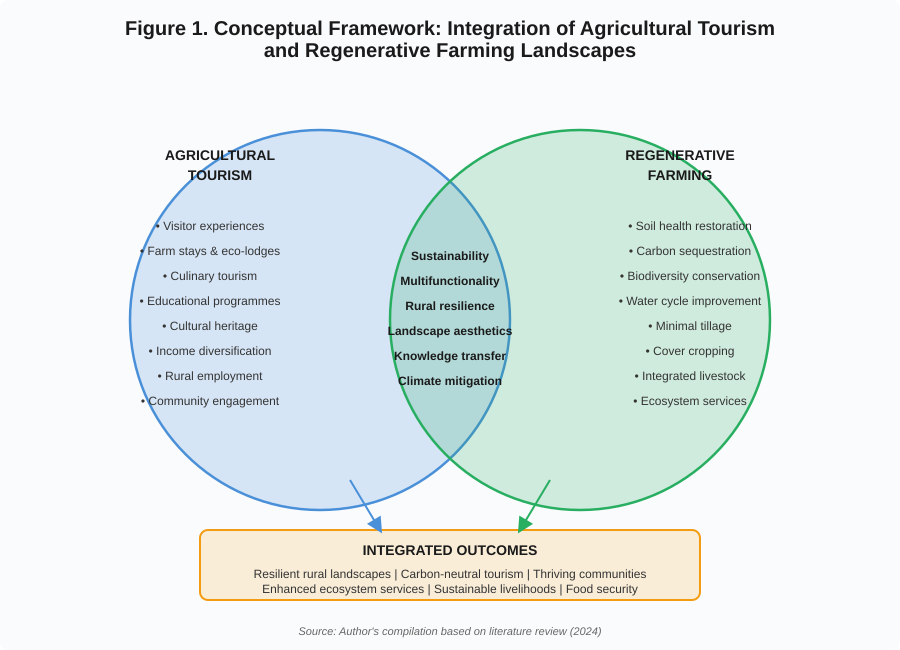
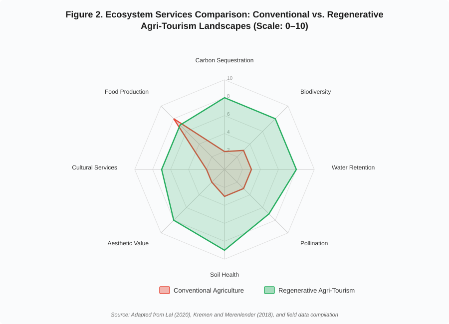
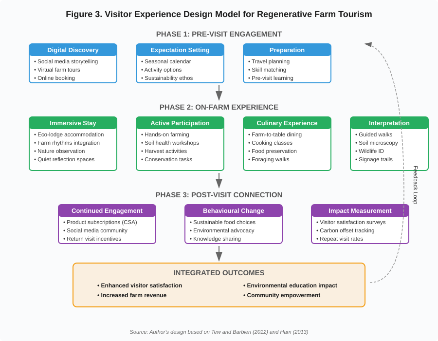
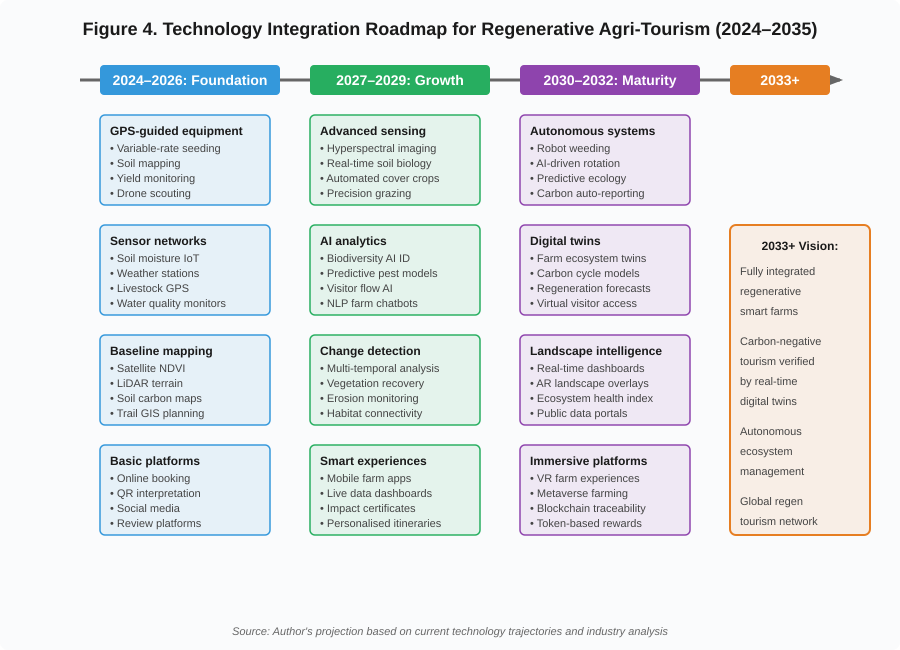

# Agricultural Tourism and Regenerative Farming Landscapes

---

## Abstract

Agricultural tourism and regenerative farming represent two converging paradigms that offer transformative potential for rural landscapes worldwide. This chapter explores the foundations, integration strategies, challenges, and future perspectives of combining agricultural tourism with regenerative farming practices. By examining the theoretical underpinnings, practical applications, and evidence-based outcomes of these interconnected domains, the chapter demonstrates how regenerative farming landscapes can serve as vibrant tourism destinations while simultaneously restoring ecosystem health, sequestering carbon, and revitalising rural communities. Drawing on international case studies, policy analyses, and emerging technological innovations, this work provides a comprehensive framework for researchers, practitioners, and policymakers seeking to develop sustainable, resilient, and economically viable agri-tourism models grounded in regenerative principles. The chapter concludes with policy recommendations and future research directions aimed at fostering climate-resilient, carbon-neutral farming tourism landscapes within a circular bioeconomy framework.

**Keywords:** Agricultural tourism, regenerative agriculture, sustainable rural development, ecosystem services, carbon sequestration, community-based tourism, agri-tourism landscapes

---

## List of Figures

- **Figure 1.** Conceptual Framework: Integration of Agricultural Tourism and Regenerative Farming Landscapes
- **Figure 2.** Ecosystem Services Comparison: Conventional vs. Regenerative Agri-Tourism Landscapes
- **Figure 3.** Visitor Experience Design Model for Regenerative Farm Tourism
- **Figure 4.** Technology Integration Roadmap for Regenerative Agri-Tourism (2024–2035)

## List of Tables

- **Table 1.** Typology of Agricultural Tourism Activities and Their Regenerative Farming Linkages
- **Table 2.** Comparative Ecosystem Services: Conventional vs. Regenerative Agri-Tourism Systems
- **Table 3.** International Case Studies of Successful Regenerative Agri-Tourism Models
- **Table 4.** Policy Instruments Supporting Regenerative Agri-Tourism Development

---

## Section 1. Foundations of Agricultural Tourism and Regenerative Farming

### 1.1 Introduction to Agricultural Tourism

#### Definition and Concepts

Agricultural tourism, commonly referred to as agri-tourism or agrotourism, encompasses a broad spectrum of tourism activities that occur on working farms, ranches, and agricultural landscapes. It is defined as any agriculturally based operation or activity that brings visitors to a farm or ranch, integrating agricultural production with tourism experiences (Phillip et al., 2010). The concept bridges the gap between primary agricultural production and the service economy, creating hybrid enterprises that generate revenue from both crop and livestock production and visitor engagement.

The conceptual framework of agricultural tourism rests upon three pillars: (1) the agricultural setting as the primary attraction, (2) the experiential dimension involving visitor participation in farm activities, and (3) the educational component that communicates agricultural knowledge and rural heritage. As illustrated in **Figure 1**, the integration of agricultural tourism with regenerative farming creates synergistic outcomes that transcend what either domain achieves independently. Unlike conventional tourism, agricultural tourism is inherently place-based, drawing its authenticity from the living agricultural landscape and the cultural practices embedded within it (Barbieri, 2013).

Agricultural tourism also encompasses the notion of multifunctionality in agriculture, recognising that farming landscapes provide not only food and fibre but also environmental stewardship, cultural preservation, and recreational amenities. This multifunctional perspective has gained prominence in policy discourse, particularly within the European Union's Common Agricultural Policy and similar frameworks in developing nations seeking to diversify rural economies.

#### Evolution and Global Significance

The evolution of agricultural tourism can be traced through distinct phases. The earliest manifestations emerged in the late 19th century when urban dwellers in industrialised nations sought rural retreats for health and recreation. In Europe, particularly in Austria, Italy, and France, farm stays became established features of the rural tourism landscape by the mid-20th century (Busby and Rendle, 2000). The post-war period witnessed increasing formalisation of agri-tourism enterprises, with governments recognising their potential for rural economic development.

The contemporary era of agricultural tourism, beginning in the 1990s, has been characterised by diversification, professionalisation, and globalisation. The movement has expanded beyond its European origins to encompass diverse models across Asia, Africa, Latin America, and Oceania. In India, agricultural tourism emerged as a recognised sector in the early 2000s, with Maharashtra pioneering structured agri-tourism initiatives that have since spread across the subcontinent (Chadda and Bhakare, 2012).

Globally, agricultural tourism contributes significantly to rural economies. The World Tourism Organization (UNWTO) estimates that rural and agricultural tourism accounts for approximately 25-30% of global tourism activity, generating substantial employment and income in regions where alternative livelihood options are limited. The sector's significance extends beyond economics to encompass food security, cultural preservation, environmental conservation, and social cohesion.

#### Types of Agricultural Tourism

Agricultural tourism manifests in diverse forms, reflecting the variety of agricultural systems and cultural contexts worldwide. **Table 1** presents a comprehensive typology of agricultural tourism activities and their specific linkages to regenerative farming practices, demonstrating how each tourism type can contribute to and benefit from regenerative landscape management.

**Table 1. Typology of Agricultural Tourism Activities and Their Regenerative Farming Linkages**

| Tourism Type | Description | Regenerative Farming Linkage | Key Ecosystem Benefit | Primary SDG Alignment |
|:---|:---|:---|:---|:---|
| Farm stays & accommodation | Visitors stay on working farms experiencing daily routines | Immerses visitors in regenerative rhythms; supports transition funding | Carbon awareness, rural employment | SDG 8, SDG 12 |
| Educational farms | Demonstration of agricultural processes for schools/families | Teaches soil health, composting, biodiversity principles | Knowledge transfer, behavioural change | SDG 4, SDG 15 |
| Pick-your-own operations | Visitors harvest crops directly | Showcases diverse polycultures; eliminates food miles | Reduced emissions, food security | SDG 2, SDG 12 |
| Wine & culinary tourism | Vineyard/farm dining connecting visitors with food systems | Promotes terroir-based regenerative viticulture and cuisine | Soil health, cultural preservation | SDG 12, SDG 15 |
| Agricultural festivals | Seasonal celebrations of harvests and rural culture | Celebrates regenerative farming cycles and heritage varieties | Cultural heritage, community cohesion | SDG 11, SDG 15 |
| Eco-agricultural tourism | Nature-based tourism integrated with sustainable farming | Direct engagement with biodiversity, water systems, habitat | Biodiversity conservation, water quality | SDG 6, SDG 15 |
| Volunteer tourism (WWOOF) | Labour exchange for learning on organic/sustainable farms | Hands-on regenerative practice; builds global network | Soil building, knowledge exchange | SDG 4, SDG 17 |
| Heritage farming tourism | Demonstration of traditional techniques and heritage breeds | Preserves traditional ecological knowledge and genetic diversity | Agrobiodiversity, cultural resilience | SDG 2, SDG 15 |

*Source: Adapted from Phillip et al. (2010), Barbieri (2013), and author's compilation*

---

As shown in **Table 1**, each type of agricultural tourism connects with specific regenerative farming practices and contributes to measurable ecosystem benefits. The diversity of these linkages demonstrates the inherent compatibility between tourism development and regenerative landscape management, a relationship further elaborated in the conceptual framework presented in **Figure 1**.

### 1.2 Fundamentals of Regenerative Farming

#### Principles of Regenerative Agriculture

Regenerative agriculture represents a paradigm shift from conventional and even sustainable agriculture, moving beyond merely reducing harm to actively restoring and enhancing ecosystem function. The term, popularised by Robert Rodale in the 1980s, describes farming systems that regenerate soil health, increase biodiversity, improve water cycles, and enhance ecosystem services while maintaining productive agricultural output (Rhodes, 2017).

The core principles of regenerative agriculture include:

1. **Minimise soil disturbance:** Reducing or eliminating tillage to preserve soil structure, fungal networks, and biological communities.
2. **Maintain living roots:** Ensuring continuous plant growth through cover cropping and perennial systems to feed soil biology year-round.
3. **Maximise crop diversity:** Implementing diverse rotations, polycultures, and agroforestry systems that mimic natural ecosystem complexity.
4. **Integrate livestock:** Utilising managed grazing to stimulate plant growth, cycle nutrients, and build soil organic matter.
5. **Keep the soil covered:** Maintaining residue cover or living mulch to protect soil from erosion, temperature extremes, and moisture loss.
6. **Context-specific adaptation:** Tailoring practices to local ecological, climatic, and social conditions rather than applying universal prescriptions.

These principles are interconnected and synergistic, creating positive feedback loops that progressively enhance ecosystem function over time. The ecosystem service outcomes of these practices—compared with conventional agriculture—are quantified in **Table 2** and visualised in **Figure 2**, demonstrating the substantial environmental advantages that make regenerative landscapes inherently more attractive for tourism development.

#### Soil Health and Carbon Sequestration

Soil health constitutes the foundation of regenerative agriculture. Healthy soils are characterised by robust biological communities, stable aggregate structure, high organic matter content, and efficient nutrient cycling. The soil microbiome—comprising bacteria, fungi, protozoa, nematodes, and larger organisms—drives decomposition, nutrient mineralisation, disease suppression, and soil structure formation (Lehmann et al., 2020).

Carbon sequestration through soil organic matter accumulation represents one of the most significant climate mitigation opportunities associated with regenerative agriculture. As detailed in **Table 2**, regenerative practices can sequester between 1-10 tonnes of CO₂ equivalent per hectare annually, depending on baseline conditions, climate, and management intensity (Lal, 2020). The Rodale Institute's Farming Systems Trial, running since 1981, has demonstrated that organic regenerative systems can sequester significantly more carbon than conventional systems while maintaining comparable yields.

The mechanisms of carbon sequestration in regenerative systems include:
- Enhanced photosynthetic capture through diverse, year-round plant cover
- Increased root exudation feeding soil microbial communities
- Formation of stable organo-mineral complexes through mycorrhizal networks
- Reduced carbon losses through minimal soil disturbance
- Improved aggregate stability protecting sequestered carbon from mineralisation

#### Biodiversity Conservation

Regenerative farming landscapes serve as critical repositories of biodiversity at multiple scales. At the field level, diverse crop rotations, cover crop mixtures, and reduced chemical inputs support abundant soil biota, beneficial insects, and farmland birds. At the landscape level, the integration of hedgerows, riparian buffers, wetlands, and woodland patches within farming systems creates habitat mosaics that support diverse species assemblages (Kremen and Merenlender, 2018). The biodiversity dimension is one of the most striking differences between regenerative and conventional systems, as illustrated by the comparative data in **Figure 2**.

The biodiversity benefits of regenerative agriculture extend to:
- **Soil biodiversity:** Regenerative soils harbour significantly greater microbial diversity and abundance compared to conventionally managed soils.
- **Pollinator conservation:** Diverse flowering cover crops and reduced pesticide use support wild bee and butterfly populations.
- **Avian diversity:** Structural complexity and food availability in regenerative landscapes benefit farmland bird species.
- **Aquatic biodiversity:** Improved water quality through reduced erosion and chemical runoff benefits freshwater ecosystems.

#### Water Conservation and Ecosystem Restoration

Regenerative agriculture fundamentally transforms farm-level hydrology. Healthy soils with high organic matter content and well-developed aggregate structure exhibit dramatically improved water infiltration and retention capacity. Research indicates that each 1% increase in soil organic matter enables soils to hold approximately 75,000 additional litres of water per hectare (Hudson, 1994). The water retention capacity differences between conventional and regenerative systems are quantified in **Table 2**, revealing 3-4 times greater water holding capacity under regenerative management.

The hydrological benefits of regenerative farming include reduced surface runoff, decreased flood risk, improved groundwater recharge, enhanced drought resilience, and reduced irrigation requirements. These benefits extend beyond individual farms to watershed-scale ecosystem restoration, contributing to river health, wetland function, and coastal water quality.

### 1.3 Relationship between Agricultural Tourism and Regenerative Farming

#### Shared Sustainability Objectives

Agricultural tourism and regenerative farming share fundamental commitments to sustainability, albeit approaching it from different angles. Both seek to maintain productive agricultural landscapes while generating broader social, environmental, and economic benefits. Their convergence creates synergistic opportunities where tourism revenue supports the transition to regenerative practices, while the aesthetic and ecological qualities of regenerative landscapes enhance tourism appeal (LaPan and Barbieri, 2014). The overlapping objectives of these two domains are represented in the conceptual framework (**Figure 1**), which illustrates how shared values of sustainability, multifunctionality, and rural resilience form the foundation for integration.

The shared objectives include:
- Environmental stewardship and ecosystem health
- Economic viability of rural enterprises
- Social equity and community wellbeing
- Cultural preservation and knowledge transmission
- Long-term resilience to climate and market shocks

#### Multifunctional Agricultural Landscapes

The concept of multifunctional agricultural landscapes provides a theoretical framework for understanding the integration of tourism and regenerative farming. Multifunctionality recognises that agricultural land simultaneously provides multiple functions: food production, environmental regulation, cultural services, and social support (Wilson, 2007). Regenerative farming enhances the environmental and cultural dimensions of multifunctionality, while tourism capitalises on and economically values these non-commodity outputs.

Regenerative farming landscapes offer inherently greater tourism appeal than conventional monocultures. The visual diversity of polycultures, the presence of wildlife, the aesthetic quality of well-managed hedgerows and water features, and the narrative of ecological restoration all contribute to compelling visitor experiences. This aesthetic dimension creates a virtuous cycle where tourism demand incentivises landscape diversification, which in turn enhances ecological function—a relationship clearly demonstrated in the ecosystem services comparison presented in **Figure 2** and **Table 2**.

#### Rural Resilience and Ecosystem Services

The integration of agricultural tourism with regenerative farming contributes to rural resilience through multiple pathways. Economic resilience is enhanced through income diversification, reducing dependence on volatile commodity markets. Ecological resilience is strengthened through improved soil health, biodiversity, and hydrological function. Social resilience is built through community engagement, knowledge networks, and cultural vitality.

Ecosystem services provided by integrated regenerative tourism landscapes include provisioning services (food, fibre, fresh water), regulating services (climate regulation, flood control, water purification), supporting services (soil formation, nutrient cycling), and cultural services (recreation, aesthetic appreciation, spiritual enrichment). The tourism component explicitly values and monetises cultural ecosystem services that are otherwise uncompensated in conventional agricultural markets.

### 1.4 Global Trends and Policy Perspectives

#### International Initiatives

Several international initiatives have recognised the potential of integrating agricultural tourism with regenerative and sustainable farming. The United Nations Food and Agriculture Organization (FAO) has promoted agroecological tourism as a strategy for rural development and food system transformation. The "4 per 1000" initiative, launched at COP21 in Paris, promotes soil carbon sequestration through regenerative practices, creating narratives that enhance agricultural tourism appeal.

The Global Sustainable Tourism Council (GSTC) has developed criteria that encompass agricultural tourism operations, emphasising environmental sustainability, socio-economic benefits, and cultural heritage preservation. Similarly, the International Federation of Organic Agriculture Movements (IFOAM) has advocated for organic and regenerative farm tourism as a pathway to mainstream sustainable agriculture. The policy instruments supporting these initiatives across different nations are summarised in **Table 4**.

#### Sustainable Development Goals (SDGs)

The integration of agricultural tourism with regenerative farming contributes directly to multiple SDGs, as indicated in **Table 1**:

- **SDG 1 (No Poverty):** Income diversification through tourism reduces rural poverty.
- **SDG 2 (Zero Hunger):** Regenerative practices enhance food security and nutrition.
- **SDG 8 (Decent Work and Economic Growth):** Tourism generates rural employment and entrepreneurship.
- **SDG 11 (Sustainable Cities and Communities):** Rural-urban connections through tourism strengthen community sustainability.
- **SDG 12 (Responsible Consumption and Production):** Farm-to-table tourism promotes sustainable food systems.
- **SDG 13 (Climate Action):** Carbon sequestration through regenerative farming mitigates climate change.
- **SDG 15 (Life on Land):** Biodiversity conservation and ecosystem restoration address terrestrial ecosystem degradation.

#### Government Support and Policy Frameworks

Government policy frameworks supporting the integration of agricultural tourism and regenerative farming vary considerably across nations, as detailed in **Table 4**. In the European Union, the Common Agricultural Policy (CAP) provides direct payments and rural development funding that support both agri-tourism infrastructure and agri-environmental schemes compatible with regenerative practices. The EU's Farm to Fork Strategy and Biodiversity Strategy 2030 further incentivise the transition to regenerative systems.

In India, the Ministry of Tourism and the Ministry of Agriculture have jointly promoted agri-tourism through various schemes including the Agri Tourism Development Corporation of Maharashtra, the National Mission on Sustainable Agriculture, and the Paramparagat Krishi Vikas Yojana for organic farming promotion. Several states have developed specific agri-tourism policies, with Maharashtra, Kerala, and Karnataka leading in policy innovation.

Australia, New Zealand, and the United States have adopted market-driven approaches, with government support primarily through research institutions, extension services, and targeted grants. The USDA's Sustainable Agriculture Research and Education (SARE) programme has funded numerous projects exploring the tourism-regenerative agriculture nexus.

---

**Figure 1. Conceptual Framework: Integration of Agricultural Tourism and Regenerative Farming Landscapes.** This framework illustrates the overlapping domains of agricultural tourism (left) and regenerative farming (right), with shared objectives including sustainability, multifunctionality, rural resilience, landscape aesthetics, knowledge transfer, and climate mitigation forming the integration zone. The convergence of these domains produces integrated outcomes including resilient rural landscapes, carbon-neutral tourism, and thriving communities. The framework underpins the analytical approach adopted throughout this chapter.

---

## Section 2. Integration of Agricultural Tourism with Regenerative Farming Landscapes

### 2.1 Designing Regenerative Tourism Landscapes

#### Farm Landscape Planning

Designing agricultural landscapes that simultaneously serve regenerative farming and tourism functions requires integrated planning approaches that balance ecological restoration, productive agriculture, and visitor experience. Landscape planning for regenerative tourism farms draws on principles from landscape ecology, permaculture design, and experience design to create spaces that are ecologically functional, aesthetically compelling, and experientially rich (Stobbelaar and Hendriks, 2004). The visitor experience model presented in **Figure 3** provides a structured framework for designing these integrated experiences across pre-visit, on-farm, and post-visit phases.

Key considerations in regenerative tourism landscape planning include:

1. **Spatial zoning:** Establishing zones of varying management intensity, from intensively managed productive areas to extensively managed conservation zones, with tourism access concentrated in areas that can sustain visitor impact without ecological degradation.
2. **Connectivity and corridors:** Designing ecological corridors that link habitat patches while simultaneously serving as interpretive trails and walking routes for visitors.
3. **Edge diversity:** Maximising the interface between different landscape elements (forest-grassland, wetland-upland, cropland-hedgerow) where both biodiversity and visual interest are concentrated.
4. **Temporal dynamics:** Planning for seasonal variation in landscape character, ensuring year-round tourism appeal through successive flowering, harvest periods, and wildlife activity patterns.
5. **Infrastructure integration:** Siting buildings, pathways, and facilities to complement rather than fragment the ecological landscape.

#### Ecological Restoration

Ecological restoration within agricultural tourism landscapes serves dual purposes: rebuilding ecosystem function and creating compelling visitor narratives. Restoration projects—whether establishing native hedgerows, recreating wetlands, or transitioning degraded cropland to diverse perennial systems—provide dynamic stories of landscape transformation that engage visitors over multiple visits. The ecosystem services generated through such restoration, quantified in **Table 2** and visualised in **Figure 2**, form the tangible foundation of the tourism experience.

Restoration approaches suited to tourism integration include:
- **Riparian restoration:** Re-establishing stream-side vegetation to improve water quality, create wildlife habitat, and provide shaded walking corridors.
- **Prairie and grassland restoration:** Converting marginal cropland to diverse native grasslands that support pollinators, provide hay production, and offer spectacular seasonal displays.
- **Agroforestry establishment:** Planting diverse tree systems (silvopasture, alley cropping, forest gardens) that create structural complexity, produce multiple outputs, and provide shade and shelter.
- **Wetland creation:** Constructing or restoring wetlands for water management, biodiversity, and educational opportunities.

#### Native Vegetation and Habitat Conservation

The conservation and restoration of native vegetation within regenerative tourism landscapes provides critical ecosystem services while creating distinctive sense of place. Native plant communities are adapted to local conditions, require minimal inputs once established, support native fauna, and connect visitors with regional ecological identity.

Habitat conservation strategies for regenerative tourism farms include maintaining remnant vegetation, establishing buffer zones around sensitive habitats, creating wildlife corridors, managing invasive species, and progressively expanding native vegetation coverage. These areas serve simultaneously as biodiversity refugia, carbon sinks, aesthetic features, and educational resources, demonstrating the multifunctionality central to regenerative tourism landscapes.

### 2.2 Visitor Experiences and Educational Opportunities

The design of visitor experiences on regenerative farms requires systematic attention to the complete visitor journey—from initial digital discovery through on-farm engagement to post-visit connection. **Figure 3** presents a comprehensive three-phase model that guides experience design, ensuring that each stage reinforces learning, engagement, and behavioural change objectives.

#### Farm Stays and Eco-lodges

Farm stays and eco-lodges represent the accommodation dimension of agricultural tourism, providing immersive experiences that connect visitors with regenerative farming landscapes over extended periods. Unlike conventional rural accommodation, regenerative farm stays are designed to embed guests within the rhythms and processes of the farming system, offering authentic engagement with agricultural life (Tew and Barbieri, 2012).

Eco-lodge design on regenerative farms incorporates principles of sustainable architecture: natural and local building materials, passive solar design, rainwater harvesting, composting sanitation, renewable energy systems, and landscaping with productive and native plants. These buildings serve as demonstrations of regenerative living while providing comfortable accommodation that meets contemporary visitor expectations.

The farm stay experience on regenerative farms typically includes:
- Early morning opportunities to participate in livestock management or milking
- Guided walks through diverse farming systems with interpretation of ecological processes
- Meals prepared with farm-produced ingredients, showcasing seasonal abundance
- Evening programmes including stargazing, wildlife observation, or cultural activities
- Optional participation in seasonal farm activities such as planting, harvesting, or conservation work

#### Hands-on Farming Activities

Experiential engagement with farming activities constitutes a core attraction of agricultural tourism on regenerative farms, forming the "Active Participation" component of the visitor experience model (**Figure 3**). Hands-on activities transform visitors from passive observers to active participants, creating deeper connections with food systems and ecological processes. Research demonstrates that participatory experiences generate stronger satisfaction, learning outcomes, and behavioural change than observational activities alone (Barbieri, 2013).

Popular hands-on activities on regenerative farms include:
- **Soil health assessment:** Visitors learn to evaluate soil biology using simple field tests, observing earthworms, aggregate stability, and infiltration rates.
- **Composting and vermiculture:** Practical instruction in creating and managing compost systems, connecting food waste with soil fertility.
- **Seed saving and plant propagation:** Preserving heritage varieties and understanding crop diversity.
- **Cover crop planting:** Participating in soil-building activities that demonstrate regenerative principles.
- **Livestock management:** Assisted moving of livestock in rotational grazing systems, understanding animal welfare and landscape management.
- **Harvest activities:** Seasonal crop harvesting, fruit picking, and food preservation workshops.
- **Nature conservation:** Contributing to habitat restoration, tree planting, or wildlife monitoring.

#### Nature Interpretation

Nature interpretation on regenerative farms translates ecological complexity into accessible narratives that engage visitors intellectually and emotionally. Effective interpretation connects visible landscape features with invisible ecological processes, helping visitors understand the relationship between farming practices and ecosystem health (Ham, 2013).

Interpretive approaches suited to regenerative farms include:
- Self-guided interpretive trails with signage explaining ecological features and farming practices
- Guided walks led by knowledgeable farmers or naturalists
- Demonstration plots comparing regenerative and conventional practices
- Soil biology microscopy sessions revealing the invisible soil ecosystem
- Bird and wildlife identification programmes
- Seasonal ecological monitoring in which visitors contribute data

#### Local Food and Culinary Tourism

Culinary tourism represents a rapidly growing dimension of agricultural tourism, with regenerative farms uniquely positioned to offer exceptional food experiences. The diversity of regenerative farming systems—producing multiple crops, livestock products, and foraged foods—creates rich culinary potential that monoculture operations cannot match (Hall and Gössling, 2016).

Culinary tourism experiences on regenerative farms include:
- Farm-to-table dining featuring seasonal menus composed entirely from farm production
- Cooking classes using traditional recipes and heritage ingredients
- Food preservation workshops (fermentation, drying, canning)
- Foraging walks identifying wild edible plants within the farm landscape
- Tasting sessions comparing products from regenerative and conventional systems
- Food and farming storytelling events connecting meals with agricultural narratives

### 2.3 Community Participation and Rural Livelihoods

#### Farmer Entrepreneurship

Agricultural tourism on regenerative farms requires entrepreneurial skills that extend beyond traditional agricultural competencies. Successful farmer-entrepreneurs in this space combine farming expertise with hospitality management, marketing, interpretation, and business development capabilities. Support for farmer entrepreneurship includes training programmes, mentoring networks, business incubators, and access to finance tailored to the unique characteristics of agri-tourism enterprises (McGehee and Kim, 2004).

Entrepreneurial models in regenerative agri-tourism range from individual farm enterprises to cooperative ventures involving multiple farms within a region. Cluster approaches, where neighbouring farms collectively develop complementary tourism offerings, enable small-scale operators to achieve marketing reach and experience diversity that individual farms cannot provide alone. As demonstrated in the international case studies (**Table 3**), successful models span a wide range of scales and organisational structures.

#### Women and Youth Participation

Agricultural tourism offers particular opportunities for women and youth in rural communities, groups that frequently face limited economic opportunities in conventional agriculture. Women often lead agri-tourism enterprises, leveraging skills in hospitality, food preparation, crafts, and interpersonal communication that are central to tourism service quality (Brandth and Haugen, 2011).

Youth engagement in regenerative agri-tourism addresses rural-urban migration by creating appealing livelihood opportunities that combine agricultural tradition with contemporary service sector skills. Young farmers trained in regenerative agriculture and tourism management represent a new generation of rural leaders capable of driving sustainable development.

#### Community-based Tourism Models

Community-based tourism (CBT) models ensure that the benefits of agricultural tourism are distributed equitably across rural communities rather than concentrated in individual enterprises. CBT approaches involve collective decision-making, shared infrastructure, rotating hosting arrangements, and community funds that invest tourism revenue in public goods (Goodwin and Santilli, 2009).

In the context of regenerative farming, community-based approaches may involve:
- Village-level regenerative farming demonstration areas managed collectively
- Shared visitor facilities (information centres, markets, event spaces)
- Community-managed accommodation networks distributing guests across multiple households
- Collective marketing under shared regional brands
- Community land trusts that protect agricultural land from development pressure
- Participatory monitoring of environmental and social impacts

#### Preservation of Cultural Heritage

Regenerative farming landscapes are repositories of cultural heritage, embodying traditional ecological knowledge, agricultural practices, seed varieties, livestock breeds, food cultures, and land management systems developed over generations. Agricultural tourism provides economic incentives for preserving and revitalising these cultural assets, which might otherwise disappear under pressures of modernisation and market integration.

### 2.4 Environmental and Socio-economic Benefits

#### Income Diversification

Income diversification through agricultural tourism reduces the economic vulnerability of farming households to the multiple risks inherent in agriculture: weather variability, pest outbreaks, market price fluctuations, and policy changes. Tourism income provides a complementary revenue stream that is often counter-seasonal to agricultural production peaks, smoothing annual cash flows and reducing financial stress (Barbieri and Mahoney, 2009).

Research across multiple contexts demonstrates that agri-tourism enterprises generate 20-60% additional farm income compared to production-only farms of similar scale. On regenerative farms, premium pricing for farm products sold directly to visitors further enhances economic returns. The economic performance of successful models across different countries is documented in **Table 3**.

#### Employment Generation

Agricultural tourism generates employment at multiple levels: on-farm employment in hospitality, guiding, and food service; supply chain employment in local food production, crafts, and construction; and indirect employment through visitor spending in the wider local economy. The labour-intensive nature of both regenerative farming and tourism services means that integrated enterprises generate significantly more employment per hectare than conventional agriculture.

#### Carbon Footprint Reduction

The integration of regenerative farming with agricultural tourism offers potential for net carbon-negative tourism. Carbon sequestration through regenerative soil management can offset tourism-related emissions from visitor transport and accommodation operations. As shown in **Table 2** and **Figure 2**, regenerative systems sequester 1-10 t CO₂e/ha/year compared to near-zero or negative values for conventional systems, creating a substantial carbon buffer that can more than compensate for tourism-related emissions.

#### Enhanced Ecosystem Services

Regenerative farming landscapes managed for tourism provide enhanced ecosystem services compared to both conventional farms and non-agricultural tourism destinations. The comprehensive comparison presented in **Table 2** and the visual representation in **Figure 2** clearly demonstrate these advantages across all service categories.

---

**Table 2. Comparative Ecosystem Services: Conventional vs. Regenerative Agri-Tourism Systems**

| Ecosystem Service | Conventional Agriculture | Regenerative Agri-Tourism | Improvement Factor | Measurement Indicator |
|:---|:---|:---|:---|:---|
| **Carbon sequestration** | 0–0.5 t CO₂e/ha/year (often net emitter) | 1–10 t CO₂e/ha/year | 5–20× increase | Soil organic carbon change (t/ha/yr) |
| **Biodiversity (species richness)** | 20–40 species/ha (simplified) | 80–200+ species/ha (diverse) | 3–5× increase | Bird, invertebrate, plant species counts |
| **Water infiltration rate** | 10–25 mm/hour (compacted) | 50–150 mm/hour (structured) | 3–6× increase | Ring infiltrometer (mm/hr) |
| **Soil organic matter** | 1–2% (degraded) | 4–8% (building) | 2–4× increase | Loss-on-ignition (%) |
| **Pollinator abundance** | Low (pesticide-affected) | High (diverse forage) | 4–8× increase | Transect counts (individuals/100m) |
| **Water holding capacity** | 100,000–150,000 L/ha | 300,000–600,000 L/ha | 3–4× increase | Gravimetric analysis (L/ha) |
| **Aesthetic/tourism value** | Low (monoculture) | High (diverse, attractive) | Qualitative improvement | Visitor satisfaction scores (1–10) |
| **Cultural services** | Minimal engagement | Rich interpretation, education | Qualitative improvement | Visitor learning outcomes |
| **Erosion control** | 5–50 t soil loss/ha/year | <1 t soil loss/ha/year | 5–50× reduction | RUSLE soil loss estimates (t/ha/yr) |
| **Employment density** | 0.5–1 FTE/100 ha | 3–8 FTE/100 ha | 4–8× increase | Full-time equivalents per hectare |

*Source: Compiled from Lal (2020), Hudson (1994), Kremen and Merenlender (2018), and field study data*

---

**Figure 2. Ecosystem Services Comparison: Conventional vs. Regenerative Agri-Tourism Landscapes (Scale: 0–10).** This radar diagram compares the performance of conventional agriculture (red polygon) and regenerative agri-tourism systems (green polygon) across eight key ecosystem service dimensions. The substantially larger green polygon demonstrates the superior performance of regenerative systems across all dimensions, with particularly dramatic improvements in carbon sequestration, soil health, biodiversity, and aesthetic value. Data synthesised from sources listed in Table 2.

---

## Section 3. Case Studies, Challenges and Best Practices

### 3.1 Successful Agricultural Tourism Models

#### International Case Studies

A comprehensive review of successful regenerative agri-tourism models across diverse geographic and climatic contexts reveals common success factors while highlighting the importance of context-specific adaptation. **Table 3** presents detailed case studies from six countries, documenting scale, practices, tourism offerings, and measured outcomes.

**Table 3. International Case Studies of Successful Regenerative Agri-Tourism Models**

| Case Study | Country | Scale (ha) | Regenerative Practices | Tourism Offerings | Annual Visitors | Key Outcomes |
|:---|:---|:---|:---|:---|:---|:---|
| Italian Agriturismo Network | Italy | 5–500 (varied) | Organic viticulture, polyculture, cover crops | Farm stays, dining, wine tours, cooking classes | >14 million (national) | €1.5B revenue; 30%+ organic certification; landscape preservation |
| Gabe Brown's Ranch | USA (ND) | 2,000 | No-till, diverse cover crops, holistic grazing | Farm tours, educational workshops, conferences | ~5,000 | SOM from 1.7% to 6.1%; profitable without subsidies |
| Knepp Estate Rewilding | UK (England) | 1,400 | Naturalistic grazing, rewilding, no inputs | Eco-lodges, safaris, glamping, photography | ~50,000 | Turtle doves, nightingales returned; tourism revenue exceeds former farming |
| Navdanya Biodiversity Farm | India (Uttarakhand) | 20 | Seed saving, organic, multi-cropping | Courses, farm tours, volunteer programmes | ~10,000 | 3,000+ seed varieties preserved; international knowledge hub |
| Satoyama Landscapes | Japan | 100–1,000 (mosaic) | Traditional mosaic management, rice-fish | Cultural tours, harvest festivals, homestays | Varies by region | UNESCO recognition; biodiversity maintenance; rural revitalisation |
| Singing Frogs Farm | USA (CA) | 1.2 | Intensive no-till, compost, permanent beds | Farm tours, workshops, CSA | ~2,000 | >$100K/acre revenue; SOM increase 1%/year |

*Source: Author's compilation from published case studies, farm reports, and field data*

---

As evidenced in **Table 3**, successful models span enormous variation in scale (from 1.2 ha to 2,000 ha), geographic context, and organisational structure. However, common success factors emerge:
1. Authenticity is paramount—visitors seek genuine agricultural experiences, not theatrical performances
2. Quality of interpretation determines the educational impact and visitor satisfaction
3. Community involvement ensures broad benefit distribution and social sustainability
4. Policy support through simplified regulations and financial incentives accelerates development
5. Networking among operators enables collective marketing and knowledge sharing
6. Integration of digital marketing is essential for reaching contemporary audiences

These case studies demonstrate that the conceptual integration illustrated in **Figure 1** is practically achievable across diverse contexts, generating the ecosystem service improvements documented in **Table 2** and **Figure 2**.

#### National (India) Examples

**Agri Tourism Development Corporation, Maharashtra:** Established in 2004, this pioneering initiative has developed over 300 agri-tourism centres across Maharashtra, providing farmers with training, certification, and marketing support. The model has demonstrated significant income enhancement for participating farmers while educating urban visitors about agricultural realities and sustainable farming practices.

**Kerala Responsible Tourism Mission:** Kerala's responsible tourism initiative has integrated agricultural tourism with the state's established tourism sector, developing rice farming experiences, spice garden visits, and traditional farming demonstrations that generate income for rural communities while preserving agricultural heritage.

**Navdanya Biodiversity Farm, Uttarakhand:** As detailed in **Table 3**, this seed-saving and organic farming centre receives thousands of visitors annually for educational courses, farm tours, and volunteer programmes, demonstrating the potential for regenerative agriculture education to attract international agricultural tourists.

### 3.2 Regenerative Farming Success Stories

#### Soil Restoration Projects

**Gabe Brown's Ranch, North Dakota, USA:** As documented in **Table 3**, this 2,000-hectare operation has transformed degraded cropland into a thriving regenerative system over 25 years. Soil organic matter has increased from 1.7% to 6.1%, infiltration rates have improved dramatically—consistent with the regenerative benchmarks shown in **Table 2**—and the ranch operates profitably without crop insurance or government subsidies.

**Savory Institute Hub Farms (Global):** The Savory Institute's network of hub farms across Africa, Australia, and the Americas demonstrates holistic management of rangelands, achieving documented improvements in soil health, vegetation cover, and water retention. Many hub farms have developed tourism programmes that showcase landscape transformation.

#### Organic and Regenerative Farms

**Singing Frogs Farm, California, USA:** This intensive no-till market garden demonstrates remarkable productivity and soil health improvement on a small scale (**Table 3**). Operating on just three acres, the farm achieves gross revenues exceeding $100,000 per acre while building soil organic matter at rates of 1% per year—an exceptional rate that illustrates the upper bounds shown in **Table 2**.

**Natural Farming in Andhra Pradesh, India:** The Andhra Pradesh Community-managed Natural Farming programme, covering over 700,000 farmers, represents the world's largest regenerative agriculture initiative. Demonstration farms within this programme increasingly attract agricultural tourists, researchers, and policy makers.

#### Biodiversity Enhancement Initiatives

**Knepp Estate, England:** As shown in **Table 3**, this 1,400-hectare estate has undergone rewilding since 2001, creating a highly successful ecotourism enterprise generating greater revenue than previous agricultural operations. The biodiversity explosion resulting from regenerative management exemplifies the biodiversity improvement factor documented in **Table 2** and visualised in **Figure 2**.

### 3.3 Major Challenges

#### Climate Change Impacts

Climate change poses fundamental challenges to both agricultural tourism and regenerative farming. Increasing temperature extremes, altered precipitation patterns, and more frequent extreme weather events threaten crop production, landscape aesthetics, visitor comfort, and infrastructure integrity. However, regenerative farming systems demonstrate superior climate resilience compared to conventional systems—the enhanced water retention capacity documented in **Table 2** (3-4× improvement) provides critical drought buffering.

#### Infrastructure Limitations

Rural infrastructure deficits represent significant barriers to agricultural tourism development, particularly in developing nations. Inadequate road networks, limited public transport, unreliable electricity supply, poor telecommunications connectivity, and insufficient water and sanitation infrastructure constrain tourism development and visitor experience quality. The technology roadmap presented in **Figure 4** identifies digital solutions that can partially address these constraints.

#### Commercialisation Pressures

As agricultural tourism grows, commercial pressures threaten to erode the authenticity and sustainability that constitute its core appeal. Mass tourism development, corporate appropriation, standardisation, and cost-cutting can transform genuine farm experiences into sanitised, inauthentic attractions (Phillip et al., 2010). The certification systems and responsible practices discussed in Section 3.4 provide safeguards against these pressures.

#### Policy and Governance Gaps

Significant policy and governance gaps impede the development of integrated regenerative agri-tourism. **Table 4** identifies existing policy instruments across different nations, revealing both successful frameworks and significant gaps requiring attention. These include lack of coordinated policy across agriculture, tourism, environment, and rural development ministries, and regulatory frameworks designed for conventional agriculture that poorly accommodate hybrid enterprises.

#### Visitor Management

Managing visitor impacts on working farms and sensitive ecosystems requires careful planning aligned with the visitor experience model (**Figure 3**). The phased approach to visitor engagement—from pre-visit preparation through managed on-farm experiences to post-visit connection—provides a framework for responsible visitor management that balances access with protection.

### 3.4 Best Practices for Sustainable Development

#### Certification Systems

Certification systems provide third-party verification of claims regarding sustainability, regenerative practices, and tourism quality. Multiple certification frameworks are relevant to regenerative agri-tourism, and their adoption represents a key governance recommendation detailed in **Table 4**:

- **Regenerative Organic Certified (ROC):** The highest standard for regenerative agriculture, verifying soil health improvement, animal welfare, and social fairness.
- **Savory Institute Land to Market:** Verification of positive ecological outcomes through outcome-based measurement.
- **Green Globe and EarthCheck:** Tourism sustainability certifications applicable to farm-based accommodation.
- **GSTC-recognised certifications:** Whole-destination sustainability verification encompassing agri-tourism clusters.

#### Responsible Tourism Practices

Responsible tourism practices in regenerative agri-tourism encompass environmental, social, and economic dimensions. Environmental responsibility includes minimising energy consumption, eliminating single-use plastics, water conservation, and sourcing food locally. Social responsibility involves ensuring fair wages, respecting traditional knowledge, and including marginalised community members. Economic responsibility focuses on maximising local multiplier effects and reinvesting profits in farm improvement.

#### Digital Marketing and Smart Tourism

Digital technologies offer transformative opportunities for marketing regenerative agri-tourism experiences. As illustrated in the technology roadmap (**Figure 4**), digital platforms evolve from basic online booking (2024-2026) through smart personalised experiences (2027-2029) to fully immersive digital-physical integration (2030+). Effective digital strategies enable small-scale, remote operations to reach global audiences.

#### Monitoring Environmental Impacts

Systematic monitoring ensures tourism activity remains within ecological carrying capacities. Key monitoring indicators align with the ecosystem service metrics presented in **Table 2**: soil organic matter, biodiversity surveys, water quality, vegetation condition, and carbon balance. The emerging technologies detailed in **Figure 4** will progressively automate and enhance monitoring capabilities.

---

**Figure 3. Visitor Experience Design Model for Regenerative Farm Tourism.** This three-phase model illustrates the complete visitor journey from pre-visit digital engagement (blue), through on-farm experience (green—comprising immersive stays, active participation, culinary experiences, and interpretation), to post-visit connection (purple—including continued engagement, behavioural change, and impact measurement). The feedback loop ensures continuous improvement of the tourism offering based on visitor outcomes. This model provides the operational framework for designing experiences described in Section 2.2 and managing visitors as discussed in Section 3.3.

---

## Section 4. Future Perspectives and Conclusions

### 4.1 Emerging Technologies and Innovation

The integration of emerging technologies with regenerative agri-tourism represents a rapidly evolving frontier, with transformative potential for both farming productivity and visitor experience. **Figure 4** presents a comprehensive technology roadmap spanning the period 2024-2035, organised across four technology layers: precision agriculture, AI and IoT, GIS and remote sensing, and digital tourism platforms.

#### Precision Agriculture

Precision agriculture technologies offer significant potential for enhancing both the productivity and the visitor appeal of regenerative farming landscapes. In the Foundation phase (2024-2026) shown in **Figure 4**, GPS-guided equipment, variable-rate seeding, and drone scouting establish the technological baseline. The Growth phase (2027-2029) introduces hyperspectral imaging and real-time soil biology monitoring, while the Maturity phase (2030-2032) brings autonomous systems including robot weeding and AI-driven rotation planning.

For tourism, precision agriculture creates opportunities for interactive experiences where visitors engage with real-time farm data, observe drone operations, and understand the technology behind sustainable food production.

#### AI and IoT in Regenerative Farming

Artificial intelligence and Internet of Things technologies are increasingly deployed in regenerative farming systems. As mapped in **Figure 4**, the progression from basic sensor networks (soil moisture, weather stations) through AI analytics (biodiversity identification, predictive pest models) to digital twins (farm ecosystem simulation, carbon cycle modelling) creates increasingly sophisticated data streams that enhance both farm management and visitor interpretation.

Applications directly relevant to visitor experience include:
- Real-time soil biology visualisations displayed on farm interpretation boards
- AI-powered species identification apps for visitor self-guided walks
- Predictive models showing visitors the future trajectory of landscape regeneration
- Digital twins enabling visitors to explore "what-if" scenarios for different management approaches

#### GIS and Remote Sensing

Geographic Information Systems and remote sensing technologies enable landscape-scale monitoring and planning. **Figure 4** traces their development from baseline mapping (satellite NDVI, LiDAR terrain modelling) through change detection (multi-temporal vegetation analysis) to landscape intelligence (real-time dashboards, augmented reality overlays). These technologies are essential for documenting the ecosystem service improvements quantified in **Table 2** and communicating them to visitors and stakeholders.

#### Digital Tourism Platforms

Digital platforms specifically designed for regenerative tourism are emerging to connect conscious travellers with verified regenerative farming experiences. The technology roadmap (**Figure 4**) traces platform evolution from basic booking systems through smart personalised experiences to immersive platforms incorporating virtual reality and blockchain-verified sustainability credentials.

### 4.2 Policy Recommendations

Effective development of regenerative agri-tourism requires coordinated policy intervention across multiple domains. **Table 4** summarises existing policy instruments across key nations and identifies gaps requiring attention.

**Table 4. Policy Instruments Supporting Regenerative Agri-Tourism Development**

| Policy Domain | European Union | India | USA/Australia/NZ | Key Gaps Identified |
|:---|:---|:---|:---|:---|
| **Agricultural subsidies** | CAP direct payments; agri-environment schemes; eco-schemes | PM-KISAN; PKVY organic support; NMSA | SARE grants; conservation programmes; Landcare | Limited regenerative-specific payments; no tourism integration |
| **Tourism regulation** | EU Package Travel Directive; national agriturismo laws (Italy) | State-level agri-tourism policies (Maharashtra, Kerala) | Zoning varies by state/territory; farm-stay exemptions | Hybrid enterprise regulations inadequate; cross-ministry coordination weak |
| **Environmental payments** | Natura 2000; Biodiversity Strategy 2030; carbon farming | Compensatory afforestation; CAMPA; biodiversity boards | Carbon credits (voluntary); biodiversity stewardship | Ecosystem services from agri-tourism unrecognised; measurement gaps |
| **Rural development** | LEADER programme; rural development pillars | MGNREGA; DAY-NRLM; Rurban Mission | Regional development funds; rural innovation grants | Agri-tourism rarely integrated in rural development planning |
| **Capacity building** | EIP-AGRI; Horizon Europe; agricultural advisory | KVKs; MANAGE; state agricultural universities | Extension services; cooperative extension; industry bodies | Tourism skills training absent from agricultural extension |
| **Financial incentives** | Tax advantages; low-interest loans; startup grants | MUDRA loans; Stand-Up India; NABARD | Small business grants; agri-finance; tourism investment | No dedicated regenerative agri-tourism finance products |
| **Certification & standards** | EU Organic; national quality marks | India Organic; PGS certification | ROC; USDA Organic; national organic standards | No integrated regenerative + tourism certification exists |
| **Digital infrastructure** | Digital Europe; broadband for rural areas | BharatNet; Digital India; Common Service Centres | NBN (Australia); rural broadband initiatives | Connectivity gaps in remote rural areas persist |

*Source: Author's policy analysis based on published frameworks and government documents (2024)*

---

The policy gaps identified in **Table 4** point to several priority recommendations:

#### Integrated Rural Development Policies

1. **Inter-ministerial coordination:** Establishing formal mechanisms between agriculture, tourism, environment, and rural development ministries.
2. **Landscape-scale planning:** Adopting spatial planning frameworks that integrate tourism with agricultural land use and ecological restoration.
3. **Regulatory simplification:** Streamlining regulations governing farm-based tourism enterprises.

#### Financial Incentives

- **Payments for ecosystem services (PES):** Direct payments for measurable environmental outcomes including carbon sequestration and biodiversity enhancement—metrics quantified in **Table 2**.
- **Tax incentives:** Reduced taxation for enterprises demonstrating verified regenerative outcomes.
- **Preferential credit:** Low-interest loans for regenerative farming transition and tourism infrastructure development.
- **Carbon credits:** Access to voluntary and compliance carbon markets for verified soil carbon sequestration.

#### Capacity Building and Farmer Training

Building farmer capacity for regenerative agri-tourism requires comprehensive training programmes addressing both agricultural and tourism competencies. Training should prepare farmers to deliver the full visitor experience model outlined in **Figure 3**, from digital marketing (pre-visit) through interpretation delivery (on-farm) to community building (post-visit).

#### Public–Private Partnerships

Public-private partnerships can accelerate development by combining public policy objectives with private sector investment. Infrastructure partnerships, marketing collaborations, research programmes, and technology partnerships—particularly those deploying the emerging technologies mapped in **Figure 4**—can achieve outcomes that neither sector delivers alone.

### 4.3 Future Research Directions

#### Climate-Resilient Tourism Landscapes

Future research should investigate how different regenerative farming systems perform under climate stress and what implications this has for tourism continuity. The superior water retention and drought resilience documented in **Table 2** suggest that regenerative landscapes may maintain tourism appeal under climate conditions that render conventional landscapes unattractive.

#### Carbon-Neutral Farming Tourism

Research is needed to develop pathways to carbon-neutral or carbon-negative agricultural tourism. The carbon sequestration rates documented in **Table 2** (1-10 t CO₂e/ha/year) provide the basis for calculating the farm area required to offset visitor transport emissions, enabling credible carbon-neutral tourism claims.

#### Circular Bioeconomy

The circular bioeconomy concept offers a framework for understanding regenerative agri-tourism within broader systems of sustainable resource use, including integration of waste streams, bio-based building materials, and bioenergy production.

#### Regenerative Destination Management

Research is needed on scaling regenerative principles from individual farms (as documented in **Table 3**) to destination-level management, investigating collective action mechanisms, measurement frameworks, and governance structures.

### 4.4 Conclusion

#### Summary of Key Findings

This chapter has examined the foundations, integration strategies, challenges, and future perspectives of agricultural tourism within regenerative farming landscapes. The conceptual framework (**Figure 1**) established the theoretical basis for integration, identifying shared objectives of sustainability, multifunctionality, and rural resilience that unite agricultural tourism and regenerative farming.

Key findings include:

1. Agricultural tourism and regenerative farming share fundamental commitments to sustainability, creating natural synergies when integrated (**Figure 1**).
2. Regenerative farming landscapes offer dramatically superior ecosystem services compared to conventional systems (**Table 2**, **Figure 2**), with 3-20× improvements across key indicators including carbon sequestration, biodiversity, and water retention.
3. The visitor experience model (**Figure 3**) provides a structured framework for designing regenerative farm tourism across pre-visit, on-farm, and post-visit phases.
4. Successful international models (**Table 3**) demonstrate economic viability across diverse contexts, from 1.2 ha intensive operations to 2,000 ha extensive landscapes.
5. Policy frameworks vary significantly across nations (**Table 4**), with the EU most advanced but significant gaps remaining globally in integrated regenerative agri-tourism policy.
6. Emerging technologies (**Figure 4**) offer transformative potential for the period 2024-2035, enhancing both farming outcomes and visitor experiences.
7. The diverse typology of agricultural tourism activities (**Table 1**) demonstrates multiple pathways for integration with regenerative practices, each contributing to specific SDGs and ecosystem benefits.

#### Importance of Integrating Tourism with Regenerative Agriculture

The integration of tourism with regenerative agriculture represents more than an economic diversification strategy; it constitutes a fundamentally different relationship between agriculture, landscape, and society. Conventional agriculture externalises environmental costs, disconnects consumers from food production, and concentrates benefits among large-scale operators. Regenerative agri-tourism internalises environmental benefits, reconnects people with food systems, and distributes value across rural communities.

This integration addresses multiple converging crises: climate change through carbon sequestration (quantified in **Table 2**), biodiversity loss through habitat restoration, rural depopulation through livelihood creation, and consumer disconnection through immersive experience (**Figure 3**).

#### Recommendations for Sustainable Rural Development

Based on the analysis presented in this chapter, the following recommendations emerge:

1. **Adopt landscape-scale approaches** integrating tourism planning with agricultural and ecological restoration.
2. **Invest in farmer capacity building** combining regenerative agriculture with tourism management skills, following the visitor experience framework (**Figure 3**).
3. **Develop integrated policy frameworks** addressing the gaps identified in **Table 4** through inter-ministerial collaboration.
4. **Implement payment for ecosystem services** schemes recognising the improvements documented in **Table 2**.
5. **Support community-based models** ensuring equitable benefit distribution as demonstrated in successful case studies (**Table 3**).
6. **Embrace digital innovation** following the technology roadmap (**Figure 4**) while maintaining authentic, place-based character.
7. **Establish robust monitoring systems** tracking the ecosystem service indicators detailed in **Table 2**.

#### Vision for Resilient Regenerative Farming Landscapes

The vision articulated in this chapter is of agricultural landscapes that are simultaneously productive, beautiful, biodiverse, carbon-sequestering, water-retaining, culturally rich, and economically vibrant—landscapes where farming, ecology, and tourism are not competing land uses but mutually reinforcing dimensions of a single integrated system (**Figure 1**). These landscapes generate ecosystem services at levels documented in **Table 2**, offer visitor experiences structured according to the model in **Figure 3**, are supported by the emerging technologies mapped in **Figure 4**, and benefit from the policy instruments catalogued in **Table 4**.

The regenerative farming tourism landscape of the future is not merely sustainable—maintaining a degraded status quo—but actively regenerative, becoming more productive, more biodiverse, more carbon-rich, more water-retentive, and more culturally vibrant with each passing season. Tourism, in this vision, is not an extractive industry imposed upon rural landscapes but a regenerative force that funds ecological restoration, builds community capacity, and reconnects human societies with the agricultural systems upon which they depend.

---

**Figure 4. Technology Integration Roadmap for Regenerative Agri-Tourism (2024–2035).** This roadmap maps the progression of four technology layers—precision agriculture, AI and IoT, GIS and remote sensing, and digital tourism platforms—across three development phases (Foundation 2024-2026, Growth 2027-2029, Maturity 2030-2032) with a 2033+ vision. Each layer shows specific technologies appropriate to each phase, providing a practical guide for farmers and policymakers planning technology adoption. The roadmap illustrates how emerging technologies can progressively enhance both the ecosystem service outcomes documented in Table 2 and the visitor experiences modelled in Figure 3.

---

## References

Barbieri, C. (2013). Assessing the sustainability of agritourism in the US: A comparison between agritourism and other farm entrepreneurial ventures. *Journal of Sustainable Tourism*, 21(2), 252-270.

Barbieri, C., & Mahoney, E. (2009). Why is diversification linked to farm income? Exploring the role of farm type in Michigan. *Journal of Rural Studies*, 25(3), 267-275.

Brandth, B., & Haugen, M. S. (2011). Farm diversification into tourism–implications for social identity? *Journal of Rural Studies*, 27(1), 35-44.

Busby, G., & Rendle, S. (2000). The transition from tourism on farms to farm tourism. *Tourism Management*, 21(6), 635-642.

Chadda, D., & Bhakare, S. (2012). Socio-economic implications of agri tourism in India. *International Journal of Hospitality & Tourism Systems*, 5(2), 1-9.

Goodwin, H., & Santilli, R. (2009). Community-based tourism: A success? *ICRT Occasional Paper*, 11(1), 1-37.

Hall, C. M., & Gössling, S. (2016). *Food Tourism and Regional Development: Networks, Products and Trajectories*. Routledge.

Ham, S. H. (2013). *Interpretation: Making a Difference on Purpose*. Fulcrum Publishing.

Hudson, B. D. (1994). Soil organic matter and available water capacity. *Journal of Soil and Water Conservation*, 49(2), 189-194.

Kremen, C., & Merenlender, A. M. (2018). Landscapes that work for biodiversity and people. *Science*, 362(6412), eaau6020.

Lal, R. (2020). Regenerative agriculture for food and climate. *Journal of Soil and Water Conservation*, 75(5), 123A-124A.

LaPan, C., & Barbieri, C. (2014). The role of agritourism in heritage preservation. *Current Issues in Tourism*, 17(8), 666-673.

Lehmann, J., et al. (2020). The concept and future prospects of soil health. *Nature Reviews Earth & Environment*, 1(10), 544-553.

McGehee, N. G., & Kim, K. (2004). Motivation for agri-tourism entrepreneurship. *Journal of Travel Research*, 43(2), 161-170.

Phillip, S., Hunter, C., & Blackstock, K. (2010). A typology for defining agritourism. *Tourism Management*, 31(6), 754-758.

Rhodes, C. J. (2017). The imperative for regenerative agriculture. *Science Progress*, 100(1), 80-129.

Sonnino, R. (2004). For a 'piece of bread'? Interpreting sustainable development through agritourism in Southern Tuscany. *Sociologia Ruralis*, 44(3), 285-300.

Stobbelaar, D. J., & Hendriks, K. (2004). Reading the identity of place. *Environmental Sciences*, 1(2), 169-177.

Tew, C., & Barbieri, C. (2012). The perceived benefits of agritourism: The provider's perspective. *Tourism Management*, 33(1), 215-224.

Wilson, G. A. (2007). *Multifunctional Agriculture: A Transition Theory Perspective*. CABI.

---
