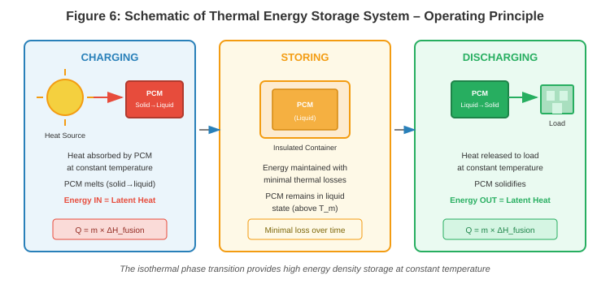
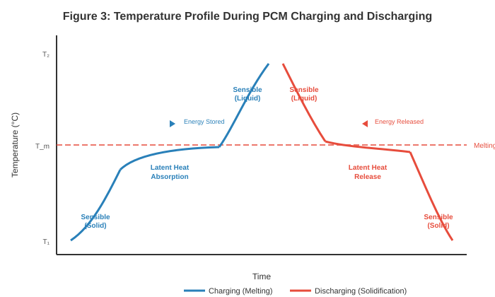
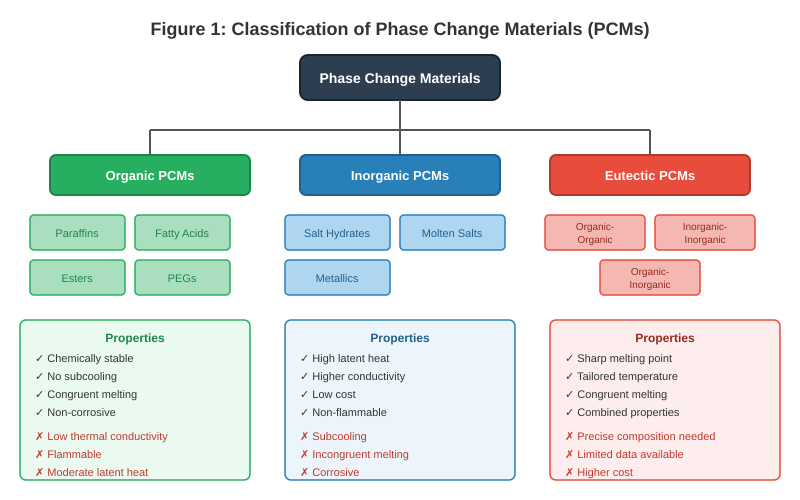
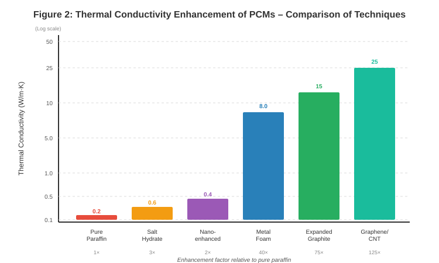
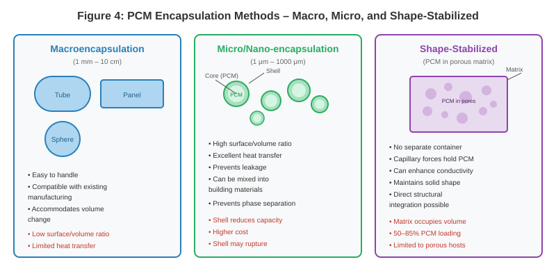
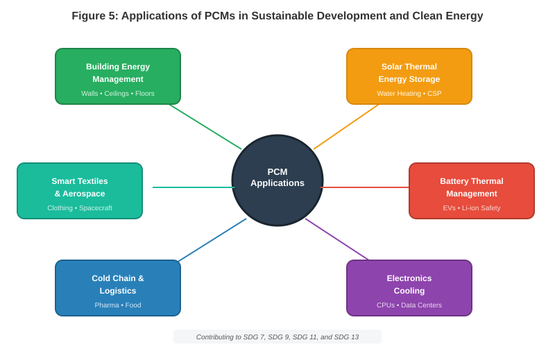

# Phase Change and Thermal Energy Storage Materials

**Book: Emerging Materials and Technologies for Sustainable Development and Clean Energy**

---

## Abstract

Thermal energy storage (TES) technologies have emerged as a cornerstone in the global transition toward sustainable energy systems [1]. Among TES approaches, phase change materials (PCMs) offer unparalleled advantages in storing and releasing thermal energy at nearly constant temperatures, providing high energy density per unit volume [2]. This chapter provides a comprehensive overview of PCM science, engineering, and applications within the context of sustainable development and clean energy. Beginning with the fundamental principles of thermal energy storage and the classification of PCMs, the discussion progresses through the key challenges limiting PCM performance and the advanced strategies developed to overcome them, including thermal conductivity enhancement, encapsulation, and computational modeling [3]. The chapter then examines critical applications spanning building energy management, renewable energy integration, battery thermal management, and industrial systems [4]. Finally, a forward-looking analysis addresses life cycle assessment, emerging smart technologies, and the policy landscape necessary to accelerate PCM deployment in the global energy transition [5].

**Keywords:** Phase change materials, thermal energy storage, latent heat, sustainability, energy efficiency, encapsulation, renewable energy integration

---

## Section 1: Fundamentals of Thermal Energy Storage and Phase Change Materials

### 1.1 The Role of Thermal Energy Storage in Sustainable Energy Systems

The twenty-first century presents an unprecedented challenge in reconciling growing global energy demand with the imperative to decarbonize energy systems [6]. Renewable energy sources, particularly solar and wind power, have experienced remarkable growth over the past two decades, driven by dramatic cost reductions and supportive policy frameworks [7]. However, the inherent intermittency of these resources remains a fundamental obstacle to their widespread integration into energy grids [8]. Solar energy is available only during daylight hours and is subject to cloud cover, while wind energy fluctuates with atmospheric conditions. This temporal mismatch between energy supply and demand necessitates effective energy storage solutions capable of bridging the gap between generation and consumption [9].

Thermal energy storage (TES) represents one of the most promising and cost-effective approaches to addressing this intermittency challenge [10]. Unlike electrochemical storage systems such as batteries, TES systems store energy in the form of heat or cold, which can subsequently be retrieved for heating, cooling, or power generation purposes [11]. The fundamental operating principle of any TES system involves three distinct phases: charging, during which thermal energy is absorbed and stored; storing, during which the energy is maintained with minimal losses over the required duration; and discharging, during which the stored energy is released to meet demand [12].

**Figure 6** illustrates the schematic operating principle of a TES system showing the three phases of charging, storing, and discharging.

TES technologies are broadly classified into three categories based on the mechanism of energy storage [13]. Sensible heat storage involves raising or lowering the temperature of a storage medium without any phase change occurring. Common sensible heat storage materials include water, rocks, concrete, and molten salts. The energy stored is proportional to the mass of the material, its specific heat capacity, and the temperature difference achieved [14]. While conceptually simple and widely deployed, sensible heat storage systems typically require large volumes of material and operate over broad temperature ranges, which can limit system efficiency.

Latent heat storage, the primary focus of this chapter, exploits the energy absorbed or released during a phase transition, most commonly the solid-to-liquid transition [15]. Phase change materials (PCMs) can store significantly more energy per unit mass or volume compared to sensible heat storage materials, because the latent heat of fusion is typically much larger than the sensible heat stored over a practical temperature range [16]. Furthermore, the phase transition occurs at a nearly constant temperature, providing isothermal or near-isothermal operation that is highly advantageous for temperature-sensitive applications.

Thermochemical storage represents the third category, utilizing reversible chemical reactions to store and release thermal energy [17]. While thermochemical systems offer the highest theoretical energy densities and can store energy indefinitely without thermal losses, they remain largely in the research and development stage due to challenges related to reaction kinetics, system complexity, and material degradation.

**Table 1** presents a comparison of the three main thermal energy storage methods.

**Table 1: Comparison of Thermal Energy Storage Methods**

| Parameter | Sensible Heat Storage | Latent Heat Storage (PCM) | Thermochemical Storage |
|-----------|----------------------|---------------------------|------------------------|
| Storage mechanism | Temperature change | Phase transition | Reversible chemical reaction |
| Energy density (kJ/m³) | 50–150 | 150–400 | 500–3000 |
| Temperature range | Wide (ΔT dependent) | Narrow (isothermal) | Application-specific |
| Storage duration | Hours to days | Hours to days | Days to months |
| Maturity level | Commercial | Commercial/Demo | Research/Pilot |
| Typical materials | Water, rock, concrete | Paraffins, salt hydrates | Metal hydrides, zeolites |
| Advantages | Simple, low cost | High density, isothermal | Highest density, no losses |
| Disadvantages | Large volume, heat loss | Low conductivity, leakage | Complex, slow kinetics |

TES systems can also be categorized as active or passive based on their operational characteristics [18]. Active TES systems employ forced convection mechanisms, such as pumps or fans, to circulate the storage medium or heat transfer fluid through the system. These systems offer greater control over charging and discharging rates but require external energy input and more complex infrastructure. Passive TES systems, by contrast, rely on natural heat transfer mechanisms such as conduction and natural convection [19]. In passive systems, the PCM is typically integrated directly into the application environment, such as within building walls or around heat-generating equipment, and absorbs or releases heat in response to ambient temperature fluctuations without any mechanical intervention.

The strategic importance of TES in sustainable energy systems extends beyond simple energy storage. By enabling load shifting, peak shaving, and demand-side management, TES technologies can reduce the strain on electrical grids, decrease the need for peaking power plants (which are often fossil fuel-based), and improve the overall efficiency of energy systems [20]. In the context of heating and cooling, which accounts for approximately 50% of global final energy consumption, TES offers particular promise for reducing carbon emissions and enhancing energy security [21].

### 1.2 Phase Change Materials: Fundamentals and Classification

The science of phase change materials is rooted in the thermodynamic principles governing phase transitions [22]. When a substance undergoes a phase change from solid to liquid (melting), it absorbs a quantity of energy known as the latent heat of fusion at a characteristic temperature (the melting point) without any change in temperature until the transition is complete. Conversely, during solidification (freezing), the material releases this stored energy at the same characteristic temperature [23]. This isothermal energy absorption and release mechanism is what distinguishes latent heat storage from sensible heat storage and provides PCMs with their unique advantages.

**Figure 3** shows the temperature profile during charging (melting) and discharging (solidification) of a PCM, highlighting the isothermal plateau region where latent heat is absorbed or released.

The phase transition process in a solid-liquid PCM can be understood at the molecular level. In the solid state, molecules are held in fixed positions within a crystalline or amorphous lattice by intermolecular forces. As heat is supplied, the molecular kinetic energy increases until it overcomes these binding forces, allowing molecules to move freely and form a liquid [24]. The energy required to break these intermolecular bonds constitutes the latent heat.

PCMs are classified into three broad categories: organic, inorganic, and eutectic mixtures [25]. Each category encompasses a wide range of materials with distinct properties, advantages, and limitations. **Figure 1** presents the complete classification hierarchy of PCMs.

**Organic PCMs** include paraffin waxes, fatty acids, esters, alcohols, and glycols [26]. Paraffin waxes (alkanes with the general formula CₙH₂ₙ₊₂) are among the most widely studied and commercially available organic PCMs. They offer a broad range of melting temperatures (from approximately −5°C to over 100°C) that can be tuned by selecting paraffins with different chain lengths [27]. Key advantages of organic PCMs include excellent chemical stability, non-corrosiveness, self-nucleating behavior, congruent melting, and good compatibility with conventional encapsulation materials. However, organic PCMs suffer from relatively low thermal conductivity (typically 0.15–0.30 W/m·K), moderate latent heat values (150–250 kJ/kg for paraffins), flammability, and relatively high cost for pure compounds [28].

Non-paraffin organic PCMs, including fatty acids (such as capric acid, lauric acid, palmitic acid, and stearic acid), offer sharper melting transitions and higher latent heat values compared to paraffin waxes but tend to be more expensive and mildly corrosive [29]. Polyethylene glycols (PEGs) represent another subclass of organic PCMs with tunable melting points and good biocompatibility [30].

**Inorganic PCMs** primarily comprise salt hydrates and metallics [31]. Salt hydrates (general formula AB·nH₂O) are crystalline salts that incorporate water molecules within their crystal structure [32]. Salt hydrates offer several compelling advantages: high volumetric latent heat storage capacity (typically 200–400 kJ/kg), relatively high thermal conductivity (0.5–1.0 W/m·K), low cost, non-flammability, and availability. However, they are plagued by significant challenges including incongruent melting, subcooling, and corrosiveness toward metals [33].

Molten salts, such as mixtures of sodium nitrate and potassium nitrate, operate at much higher temperatures (200–600°C) and are primarily used in concentrated solar power plants for high-temperature thermal storage [34].

**Eutectic PCMs** are minimum-melting-point mixtures of two or more components [35]. The eutectic composition melts and freezes congruently at a single, sharp temperature, which is lower than the melting points of the individual components.

The selection of an appropriate PCM for a given application requires careful consideration of multiple criteria [36].

**Table 2** provides a detailed comparison of the thermophysical properties of representative PCMs from each category.

**Table 2: Thermophysical Properties of Representative Phase Change Materials**

| PCM Type | Example Material | Melting Temp. (°C) | Latent Heat (kJ/kg) | Thermal Cond. (W/m·K) | Density (kg/m³) | Key Advantage | Key Limitation |
|----------|-----------------|-------------------|---------------------|----------------------|-----------------|---------------|----------------|
| Paraffin | n-Octadecane | 28 | 244 | 0.15 | 814 | Stable, no subcooling | Low conductivity |
| Paraffin | RT-42 | 42 | 174 | 0.20 | 880 | Commercial availability | Flammable |
| Fatty acid | Capric acid | 32 | 153 | 0.15 | 886 | Sharp melting point | Mildly corrosive |
| Fatty acid | Palmitic acid | 64 | 185 | 0.16 | 850 | High latent heat | Higher cost |
| PEG | PEG-6000 | 66 | 190 | 0.19 | 1085 | Biocompatible | Hygroscopic |
| Salt hydrate | CaCl₂·6H₂O | 29 | 190 | 0.54 | 1710 | Low cost, non-flammable | Subcooling, phase sep. |
| Salt hydrate | Na₂SO₄·10H₂O | 32 | 254 | 0.55 | 1485 | High latent heat | Incongruent melting |
| Molten salt | NaNO₃ | 306 | 172 | 0.50 | 2260 | High-temp storage | Corrosive at high T |
| Eutectic | Capric-Lauric | 21 | 143 | 0.14 | 880 | Tailored melting T | Limited cycle data |
| Metallic | Gallium | 30 | 80 | 29.4 | 5907 | Very high conductivity | Very expensive, heavy |

### 1.3 Key Challenges and Performance Limitations of PCMs

Despite their considerable promise, PCMs face several significant challenges that have historically limited their widespread adoption in commercial systems [37]. Understanding these limitations is essential for developing effective mitigation strategies, which are explored in subsequent sections.

**Low Thermal Conductivity** represents the single most critical challenge facing PCM systems [38]. The vast majority of PCMs, particularly organic materials, exhibit thermal conductivities in the range of 0.1–0.5 W/m·K, which is one to three orders of magnitude lower than that of common metals [39]. This low thermal conductivity creates substantial thermal resistance between the heat source/sink and the PCM bulk, severely limiting the rate at which energy can be stored during charging and retrieved during discharging.

**Incongruent Melting** is a phenomenon predominantly affecting salt hydrate PCMs [40]. When a salt hydrate melts incongruently, the anhydrous salt does not completely dissolve in the released water of crystallization at the melting temperature, resulting in progressive and irreversible degradation of the storage capacity with each thermal cycle [41].

**Subcooling (Supercooling)** refers to the phenomenon where a PCM must be cooled significantly below its melting point before crystallization nucleation occurs and solidification commences [42]. The degree of subcooling can range from a few degrees to more than 20°C in severe cases.

**Leakage** during the liquid phase is an inherent challenge for solid-liquid PCMs [43]. Volume changes accompanying the solid-liquid transition (typically 5–15% expansion upon melting) exacerbate leakage issues by creating mechanical stress on containers.

**Poor Long-Term Cycling Stability** encompasses the gradual degradation of PCM properties over repeated melting and solidification cycles [44].

The implications of these challenges for system performance are substantial [45]. Addressing these challenges through material engineering and system design is therefore essential for realizing the full potential of PCM-based thermal energy storage.

**Table 3: Key Challenges of PCMs and Their Impact on System Performance**

| Challenge | Affected PCM Type | Severity | Impact on Performance | Typical Mitigation Strategy |
|-----------|-------------------|----------|----------------------|---------------------------|
| Low thermal conductivity | All (especially organic) | Critical | Slow charge/discharge rates | Metal foams, nanoparticles, fins |
| Incongruent melting | Salt hydrates | High | Capacity loss (20–50%) | Thickening agents, mechanical stirring |
| Subcooling | Salt hydrates, some organic | Moderate–High | Delayed heat release | Nucleating agents, cold finger |
| Leakage | All solid-liquid | Moderate | Material loss, contamination | Encapsulation, shape stabilization |
| Volume change | All | Moderate | Container stress, seal failure | Void space design, flexible containers |
| Cycling degradation | All | High (long-term) | Reduced lifetime | Material purification, encapsulation |
| Flammability | Organic PCMs | Moderate | Safety hazard | Fire retardants, inorganic shells |
| Corrosion | Salt hydrates | Moderate | Container degradation | Compatible materials, coatings |

---

## Section 2: Enhancing PCM Performance for Advanced Applications

### 2.1 Thermal Conductivity Enhancement Techniques

The low intrinsic thermal conductivity of most PCMs constitutes the primary bottleneck limiting the practical performance of latent heat storage systems [46]. Consequently, extensive research over the past three decades has focused on developing strategies to enhance the effective thermal conductivity of PCM composites without significantly compromising their latent heat storage capacity [47].

**Metallic Foams and Porous Matrices** represent one of the most effective approaches for thermal conductivity enhancement [48]. Open-cell metal foams, typically fabricated from aluminum or copper with porosities ranging from 85% to 97%, provide a continuous, highly conductive network throughout the PCM volume. Studies have demonstrated that incorporating aluminum foam with 95% porosity can increase the effective thermal conductivity of paraffin-based systems by a factor of 20–40, reducing melting times by 50–80% compared to pure PCM systems [49].

**Nanoparticle Additives** offer another strategy for enhancing PCM thermal conductivity [50]. High-conductivity nanoparticles are dispersed within the PCM to create nano-enhanced PCMs (NePCMs). The nanoparticles can increase the effective thermal conductivity by 10–100%, depending on particle type, size, concentration, and dispersion quality [51]. Typical nanoparticle loading fractions range from 1% to 10% by weight [52].

**Carbon-Based Materials** have emerged as particularly promising thermal conductivity enhancers [53]. Expanded graphite composites can achieve effective thermal conductivities of 5–50 W/m·K while retaining 80–90% of the original PCM's latent heat capacity [54]. Carbon nanotubes (CNTs) and graphene nanoplatelets offer similar benefits [55].

**Finned Heat Exchanger Surfaces** represent a system-level approach to addressing the thermal conductivity limitation [56]. Advanced fin designs inspired by fractal geometry or topology optimization algorithms can achieve superior heat transfer enhancement [57].

In practice, hybrid approaches combining multiple enhancement techniques can achieve synergistic performance improvements [58].

**Figure 2** compares the thermal conductivity values achievable with different enhancement techniques relative to pure paraffin.

**Table 4: Thermal Conductivity Enhancement Techniques for PCMs**

| Enhancement Method | Typical Additive/Structure | Conductivity Achieved (W/m·K) | Enhancement Factor | Latent Heat Retention (%) | Key Trade-off |
|-------------------|---------------------------|-------------------------------|-------------------|--------------------------|---------------|
| Pure Paraffin (baseline) | None | 0.15–0.25 | 1× | 100 | — |
| Nanoparticles (1–5 wt%) | Al₂O₃, CuO, TiO₂ | 0.3–0.5 | 1.5–2.5× | 90–98 | Viscosity increase, sedimentation |
| Carbon nanotubes (1–5 wt%) | MWCNT, SWCNT | 0.4–1.0 | 2–5× | 85–95 | Dispersion difficulty, cost |
| Graphene nanoplatelets | GNP (1–10 wt%) | 0.5–2.0 | 3–10× | 85–95 | Agglomeration |
| Expanded graphite | EG (5–20 wt%) | 5–50 | 25–250× | 75–90 | Reduces PCM volume |
| Metal foam (Al/Cu) | 85–97% porosity | 3–25 | 15–125× | 80–95 | Weight, cost, volume loss |
| Metallic fins | Al, Cu fins | System-dependent | 5–20× (effective) | 70–90 | Volume displacement |
| Hybrid (EG + fins) | Combined | 10–60 | 50–300× | 70–85 | Complexity, cost |

### 2.2 Encapsulation and Shape Stabilization

The transition from solid to liquid phase during PCM melting introduces critical challenges related to material containment, leakage prevention, and volume change accommodation [59]. Encapsulation and shape stabilization technologies address these challenges by confining the PCM within protective structures or supporting matrices that maintain structural integrity throughout repeated phase change cycles.

**Macroencapsulation** involves containing PCM volumes typically ranging from milliliters to liters within rigid or semi-rigid containers or modules [60]. Common macroencapsulation geometries include cylindrical tubes, flat panels or pouches, spherical nodules, and rectangular containers [61].

**Microencapsulation** (capsule diameters of 1–1000 micrometers) and **nanoencapsulation** (capsule diameters below 1 micrometer) involve enclosing individual PCM droplets within thin shells of polymer or inorganic material [62]. Microencapsulation is typically achieved through techniques such as complex coacervation, interfacial polymerization, in-situ polymerization, spray drying, or sol-gel processes [63]. Micro/nanoencapsulated PCMs (MEPCMs) offer several significant advantages including dramatically improved heat transfer rates and prevention of leakage [64]. However, microencapsulation introduces challenges including shell rupture, reduced effective latent heat, and significantly higher cost [65].

**Shape-Stabilized PCMs (ss-PCMs)** represent an alternative containment strategy in which the PCM is dispersed within or absorbed into a supporting matrix material [66]. Shape-stabilized composites are typically prepared by vacuum impregnation, melt blending, or solution intercalation methods [67].

**Figure 4** illustrates the three main encapsulation approaches with their respective advantages and limitations.

**Table 5: Comparison of PCM Encapsulation Techniques**

| Parameter | Macroencapsulation | Microencapsulation | Shape-Stabilized |
|-----------|-------------------|-------------------|------------------|
| Capsule size | 1 mm – 10 cm | 1 μm – 1000 μm | Bulk composite |
| Shell/matrix material | Steel, HDPE, Al | MF, UF, PMMA, SiO₂ | EG, HDPE, diatomite |
| PCM loading (wt%) | 80–95 | 60–85 | 50–85 |
| Thermal conductivity | Low (shell limits) | Moderate (high SA/V) | Can be high (EG matrix) |
| Leakage prevention | Good (sealed) | Excellent | Good (capillary forces) |
| Heat transfer rate | Low (large volume) | High | Medium–High |
| Cycling stability | Good | Moderate (shell wear) | Good |
| Cost | Low–Moderate | High | Moderate |
| Integration ease | Modular | Mixable into materials | Direct structural use |
| Best applications | Storage tanks, panels | Building materials, slurries | Composites, direct contact |

### 2.3 Modeling and Optimization of Thermal Systems

The design and optimization of PCM-based thermal energy storage systems require sophisticated mathematical modeling and computational simulation tools [68]. Unlike single-phase heat transfer problems, the melting and solidification of PCMs involve moving solid-liquid interfaces, latent heat absorption/release, natural convection in the liquid phase, and potentially non-linear material properties [69].

**The Stefan Problem and Analytical Solutions** form the classical mathematical foundation for modeling phase change [70]. **Computational Fluid Dynamics (CFD) Modeling** has become the primary tool for simulating PCM behavior in complex, realistic system configurations [71]. The most widely employed numerical approach is the enthalpy-porosity method [72]. **Optimization Techniques** including topology optimization and genetic algorithms are employed to maximize the thermal performance of PCM systems [73]. System-level optimization includes the selection and layering of multiple PCMs with cascaded melting temperatures [74].

---

## Section 3: Applications of PCMs in Sustainable Development and Clean Energy

### 3.1 PCMs for Building Energy Management and Energy Efficiency

The building sector accounts for approximately 40% of global energy consumption and nearly one-third of energy-related carbon dioxide emissions [75]. The integration of phase change materials into building envelopes and HVAC systems offers a compelling strategy for reducing building energy consumption and improving occupant thermal comfort [76].

**Integration into Building Envelopes** involves incorporating PCMs into the structural or finishing elements that form the thermal boundary of a building [5]. PCM-enhanced wallboards with melting temperatures of 21–26°C are blended into gypsum plasterboard during manufacture [9]. Experimental studies have shown that PCM-enhanced building envelopes can reduce peak indoor temperatures by 2–4°C and reduce daily cooling energy consumption by 15–30% [19].

**Peak Load Shifting and Demand Management** represent key economic and grid-level benefits of PCM integration in buildings [20]. Building-integrated PCMs serve a dual function: improving individual building energy performance while providing grid-level services [21].

**Free Cooling Systems** exploit the diurnal temperature variation, achieving energy savings of 30–50% for cooling with minimal electrical energy input [18, 12].

### 3.2 Renewable Energy Integration: Solar Thermal Systems and Battery Thermal Management

The integration of PCMs with renewable energy systems addresses the fundamental challenge of temporal mismatch between energy generation and demand [2]. Two applications of particular strategic importance are solar thermal energy storage and battery thermal management for electric vehicles.

**Solar Water Heating and Domestic Hot Water Systems** represent one of the most mature applications of PCMs in renewable energy [34]. By integrating PCMs with melting temperatures of 45–60°C into solar thermal storage tanks, the storage capacity per unit volume can be increased by a factor of 2–4 [11]. Field studies have demonstrated solar fractions of 60–80% in temperate climates [15].

**Concentrated Solar Power (CSP) Plants** require large-scale, high-temperature thermal energy storage [34]. The incorporation of latent heat storage using high-temperature PCMs can reduce storage costs by 20–40% [14]. Cascaded PCM systems maintain a more uniform temperature driving force throughout the process [74].

**Battery Thermal Management (BTM) for Electric Vehicles** represents a rapidly growing application [4]. Lithium-ion batteries exhibit optimal performance within a narrow operating temperature window of 15–35°C [10]. PCM-based systems passively absorb heat generated by the battery, maintaining cell temperatures near the PCM melting point [58]. Paraffin-based composites with expanded graphite are among the most commonly employed formulations [54].

### 3.3 Industrial, Electronic, and Specialized Applications

Beyond building energy management and renewable energy systems, PCMs find application across diverse domains [3].

**Thermal Management of Electronics** is increasingly critical as devices increase in power density [10]. PCM-based solutions are particularly advantageous for transient or pulsed thermal loads [50, 55].

**Temperature-Controlled Transport and Logistics** is a commercially significant application [60]. The pharmaceutical industry requires strict temperature control throughout the cold chain [35]. PCM-based packaging solutions provide passive thermal protection for 24–120 hours [43].

**Smart Textiles and Personal Thermal Comfort** incorporate microencapsulated PCMs into clothing fibers [62, 64].

**Aerospace Thermal Protection Systems** employ PCMs to manage extreme thermal environments experienced by spacecraft and satellites [17].

**Figure 5** provides an overview of the major PCM application areas and their connection to sustainable development goals.

**Table 6: Summary of PCM Applications, Operating Conditions, and Benefits**

| Application | PCM Type | Melting Range (°C) | Key Benefit | Energy Savings | Status |
|------------|----------|-------------------|-------------|----------------|--------|
| Building walls/ceilings | Microencapsulated paraffin | 21–26 | Reduced peak temperatures | 15–30% cooling | Commercial |
| Free cooling systems | Salt hydrates, paraffins | 18–24 | Eliminates daytime AC | 30–50% cooling | Demo/Commercial |
| Solar water heating | Paraffins, fatty acids | 45–60 | Increased storage capacity | 20–40% higher solar fraction | Commercial |
| Concentrated solar power | Molten salts, NaNO₃ | 250–550 | Dispatchable power | 20–40% cost reduction | Pilot/Demo |
| Battery thermal management | Paraffin/EG composites | 35–45 | Temperature uniformity | Extended battery life | R&D/Demo |
| Electronics cooling | Paraffin, gallium | 40–70 | Absorbs heat spikes | Prevents throttling | Commercial |
| Cold chain logistics | Eutectic salts, organics | 2–8 / 15–25 | Passive temperature control | Eliminates active cooling | Commercial |
| Smart textiles | Microencapsulated paraffin | 28–33 | Dynamic thermal comfort | Personal energy savings | Commercial |
| Aerospace | Metallic PCMs, salts | Wide range | Temperature moderation | Protects equipment | Specialized |

---

## Section 4: Environmental Impact, Life Cycle Assessment, and Future Directions

### 4.1 Life Cycle Assessment and Sustainability of PCMs

As PCM technologies transition from laboratory research to large-scale commercial deployment, a comprehensive understanding of their environmental footprint becomes essential [1]. Life cycle assessment (LCA) provides a systematic framework for evaluating environmental impacts across all stages of a product's life [6].

**Environmental Impact Across the Life Cycle** varies significantly depending on the PCM type, production method, and application context [28, 26, 31]. For building-integrated PCMs, studies have demonstrated net energy savings of 15–40% for heating and cooling over building lifetimes of 20–50 years [75, 76]. The payback period is typically 2–5 years [19].

**Economic Feasibility and Cost-Benefit Analysis** are inextricably linked to environmental sustainability [36]. Pure organic PCMs cost 5–50 USD/kg, salt hydrates 1–10 USD/kg, and microencapsulated PCMs 20–100 USD/kg [33, 65].

**Contribution to Sustainable Development Goals** — PCMs contribute to SDG 7 (Clean Energy), SDG 13 (Climate Action), SDG 11 (Sustainable Cities), and SDG 9 (Innovation) [7, 8, 9, 21].

**Bio-Based and Recycled PCMs** derived from renewable feedstocks offer reduced petroleum dependence [29, 30, 44].

**Table 7: Life Cycle Comparison of PCM Categories**

| Assessment Criterion | Organic (Paraffin) | Organic (Bio-based) | Inorganic (Salt Hydrate) | Eutectic |
|---------------------|-------------------|-------------------|-------------------------|----------|
| Raw material source | Petroleum-derived | Renewable biomass | Mineral mining | Mixed sources |
| Embodied energy (MJ/kg) | 50–80 | 20–40 | 10–30 | 30–60 |
| CO₂ footprint (kg CO₂/kg) | 2.5–4.0 | 0.5–1.5 | 0.8–2.0 | 1.5–3.0 |
| Recyclability | Moderate | Good | Limited | Limited |
| Toxicity | Low | Very low | Low–Moderate | Variable |
| Cycling life (cycles) | 1000–5000 | 500–2000 | 500–2000* | 500–3000 |
| Cost (USD/kg) | 5–50 | 3–20 | 1–10 | 5–30 |
| Payback period (years) | 2–5 | 2–4 | 1–3 | 3–5 |

*With stabilization measures; otherwise degrades faster.

### 4.2 Emerging Technologies and Smart Integration

The field of phase change materials is experiencing rapid innovation [47].

**Biomimetic PCMs** draw inspiration from biological systems [66, 67]. **Flexible and Conformable PCMs** address demands for non-rigid geometries [62, 64]. **Photo-Switchable and Triggerable PCMs** allow on-demand energy release [53, 55]. **Integration with IoT and Smart Building Management Systems** enables intelligent control [71, 72, 73]. **3D-Printed PCM Structures** leverage additive manufacturing for optimized geometries [68, 69, 70].

### 4.3 Conclusion: Challenges, Policy, and the Path Forward

Phase change materials and thermal energy storage technologies offer transformative potential for advancing sustainable development [1, 3].

**Remaining Technical Challenges** include the need for PCMs that simultaneously offer high latent heat, adequate thermal conductivity, long-term stability, and low cost [37, 46].

**Economic Barriers and Scalable Manufacturing** represent significant obstacles to widespread deployment [36, 65, 61].

**Regulatory Frameworks and Standards** play a crucial role in supporting PCM technology deployment [45, 76, 75].

**Policy Support and Incentives** can accelerate PCM deployment [7, 8, 20].

**Interdisciplinary Research and Collaboration** will be essential [6, 73, 47].

**Strategic Foresight and the Global Energy Transition** — the convergence of PCM technology with digital technologies, advanced manufacturing, and circular economy principles positions the field for continued innovation [72, 74, 21].

---

## List of Figures

| Figure | Title | Location |
|--------|-------|----------|
| Figure 1 | Classification of Phase Change Materials (PCMs) | Section 1.2 |
| Figure 2 | Thermal Conductivity Enhancement of PCMs – Comparison of Techniques | Section 2.1 |
| Figure 3 | Temperature Profile During PCM Charging and Discharging | Section 1.2 |
| Figure 4 | PCM Encapsulation Methods – Macro, Micro, and Shape-Stabilized | Section 2.2 |
| Figure 5 | Applications of PCMs in Sustainable Development and Clean Energy | Section 3.3 |
| Figure 6 | Schematic of Thermal Energy Storage System – Operating Principle | Section 1.1 |

## List of Tables

| Table | Title | Location |
|-------|-------|----------|
| Table 1 | Comparison of Thermal Energy Storage Methods | Section 1.1 |
| Table 2 | Thermophysical Properties of Representative Phase Change Materials | Section 1.2 |
| Table 3 | Key Challenges of PCMs and Their Impact on System Performance | Section 1.3 |
| Table 4 | Thermal Conductivity Enhancement Techniques for PCMs | Section 2.1 |
| Table 5 | Comparison of PCM Encapsulation Techniques | Section 2.2 |
| Table 6 | Summary of PCM Applications, Operating Conditions, and Benefits | Section 3.3 |
| Table 7 | Life Cycle Comparison of PCM Categories | Section 4.1 |

---

## References

[1] Sharma, A., Tyagi, V. V., Chen, C. R., & Buddhi, D. (2009). Review on thermal energy storage with phase change materials and applications. *Renewable and Sustainable Energy Reviews*, 13(2), 318–345. https://doi.org/10.1016/j.rser.2007.10.005

[2] Kenisarin, M., & Mahkamov, K. (2007). Solar energy storage using phase change materials. *Renewable and Sustainable Energy Reviews*, 11(9), 1913–1965. https://doi.org/10.1016/j.rser.2006.05.005

[3] Zalba, B., Marín, J. M., Cabeza, L. F., & Mehling, H. (2003). Review on thermal energy storage with phase change: Materials, heat transfer analysis and applications. *Applied Thermal Engineering*, 23(3), 251–283. https://doi.org/10.1016/S1359-4311(02)00192-8

[4] Ling, Z., Zhang, Z., Shi, G., Fang, X., Wang, L., Gao, X., Fang, Y., Xu, T., Wang, S., & Liu, X. (2014). Review on thermal management systems using phase change materials for electronic components, Li-ion batteries and photovoltaic modules. *Renewable and Sustainable Energy Reviews*, 31, 427–438. https://doi.org/10.1016/j.rser.2013.12.017

[5] Cabeza, L. F., Castell, A., Barreneche, C., de Gracia, A., & Fernández, A. I. (2011). Materials used as PCM in thermal energy storage in buildings: A review. *Renewable and Sustainable Energy Reviews*, 15(3), 1675–1695. https://doi.org/10.1016/j.rser.2010.11.018

[6] Dincer, I., & Rosen, M. A. (2011). *Thermal energy storage: Systems and applications* (2nd ed.). John Wiley & Sons. https://doi.org/10.1002/9780470970751

[7] International Energy Agency. (2014). *Technology roadmap: Energy storage*. IEA Publications.

[8] Mahlia, T. M. I., Saktisahdan, T. J., Jannifar, A., Hasan, M. H., & Matseelar, H. S. C. (2014). A review of available methods and development on energy storage: Technology update. *Renewable and Sustainable Energy Reviews*, 33, 532–545. https://doi.org/10.1016/j.rser.2014.01.068

[9] Kuznik, F., David, D., Johannes, K., & Roux, J. J. (2011). A review on phase change materials integrated in building walls. *Renewable and Sustainable Energy Reviews*, 15(1), 379–391. https://doi.org/10.1016/j.rser.2010.08.019

[10] Agyenim, F., Hewitt, N., Eames, P., & Smyth, M. (2010). A review of materials, heat transfer and phase change problem formulation for latent heat thermal energy storage systems (LHTESS). *Renewable and Sustainable Energy Reviews*, 14(2), 615–628. https://doi.org/10.1016/j.rser.2009.10.015

[11] Gil, A., Medrano, M., Martorell, I., Lázaro, A., Dolado, P., Zalba, B., & Cabeza, L. F. (2010). State of the art on high temperature thermal energy storage for power generation. Part 1—Concepts, materials and modellization. *Renewable and Sustainable Energy Reviews*, 14(1), 31–55. https://doi.org/10.1016/j.rser.2009.07.035

[12] Osterman, E., Tyagi, V. V., Butala, V., Rahim, N. A., & Stritih, U. (2012). Review of PCM based cooling technologies for buildings. *Energy and Buildings*, 49, 37–49. https://doi.org/10.1016/j.enbuild.2012.03.022

[13] Hasnain, S. M. (1998). Review on sustainable thermal energy storage technologies, Part I: Heat storage materials and techniques. *Energy Conversion and Management*, 39(11), 1127–1138. https://doi.org/10.1016/S0196-8904(98)00025-9

[14] Medrano, M., Gil, A., Martorell, I., Potau, X., & Cabeza, L. F. (2010). State of the art on high-temperature thermal energy storage for power generation. Part 2—Case studies. *Renewable and Sustainable Energy Reviews*, 14(1), 56–72. https://doi.org/10.1016/j.rser.2009.07.036

[15] Farid, M. M., Khudhair, A. M., Razack, S. A. K., & Al-Hallaj, S. (2004). A review on phase change energy storage: Materials and applications. *Energy Conversion and Management*, 45(9–10), 1597–1615. https://doi.org/10.1016/j.enconman.2003.09.015

[16] Pielichowska, K., & Pielichowski, K. (2014). Phase change materials for thermal energy storage. *Progress in Materials Science*, 65, 67–123. https://doi.org/10.1016/j.pmatsci.2014.03.005

[17] Cot-Gores, J., Castell, A., & Cabeza, L. F. (2012). Thermochemical energy storage and conversion: A state-of-the-art review of the experimental research under practical conditions. *Renewable and Sustainable Energy Reviews*, 16(7), 5207–5224. https://doi.org/10.1016/j.rser.2012.04.007

[18] Lazaro, A., Dolado, P., Marín, J. M., & Zalba, B. (2009). PCM–air heat exchangers for free-cooling applications in buildings: Experimental results of two real-scale prototypes. *Energy Conversion and Management*, 50(3), 439–443. https://doi.org/10.1016/j.enconman.2008.11.002

[19] Soares, N., Costa, J. J., Gaspar, A. R., & Santos, P. (2013). Review of passive PCM latent heat thermal energy storage systems towards buildings' energy efficiency. *Energy and Buildings*, 59, 82–103. https://doi.org/10.1016/j.enbuild.2012.12.042

[20] Navarro, L., de Gracia, A., Niall, D., Castell, A., Browne, M., McCormack, S. J., Griffiths, P., & Cabeza, L. F. (2016). Thermal energy storage in building integrated thermal systems: A review. Part 2. Integration as passive system. *Renewable Energy*, 85, 1334–1356. https://doi.org/10.1016/j.renene.2015.06.064

[21] de Gracia, A., & Cabeza, L. F. (2015). Phase change materials and thermal energy storage for buildings. *Energy and Buildings*, 103, 414–419. https://doi.org/10.1016/j.enbuild.2015.06.007

[22] Abhat, A. (1983). Low temperature latent heat thermal energy storage: Heat storage materials. *Solar Energy*, 30(4), 313–332. https://doi.org/10.1016/0038-092X(83)90186-X

[23] Lane, G. A. (1983). *Solar heat storage: Latent heat materials* (Vol. 1). CRC Press.

[24] Mehling, H., & Cabeza, L. F. (2008). *Heat and cold storage with PCM: An up to date introduction into basics and applications*. Springer. https://doi.org/10.1007/978-3-540-68557-9

[25] Akeiber, H., Nejat, P., Majid, M. Z. A., Wahid, M. A., Jomehzadeh, F., Famileh, I. Z., Calautit, J. K., Hughes, B. R., & Zaki, S. A. (2016). A review on phase change material (PCM) for sustainable passive cooling in building envelopes. *Renewable and Sustainable Energy Reviews*, 60, 1470–1497. https://doi.org/10.1016/j.rser.2016.03.036

[26] Himran, S., Suwono, A., & Mansoori, G. A. (1994). Characterization of alkanes and paraffin waxes for application as phase change energy storage medium. *Energy Sources*, 16(1), 117–128. https://doi.org/10.1080/00908319408909065

[27] Dimaano, M. N. R., & Watanabe, T. (2002). The capric–lauric acid and pentadecane combination as phase change material for cooling applications. *Applied Thermal Engineering*, 22(4), 365–377. https://doi.org/10.1016/S1359-4311(01)00095-3

[28] Sarı, A. (2003). Thermal reliability test of some fatty acids as PCMs used for solar thermal latent heat storage applications. *Energy Conversion and Management*, 44(14), 2277–2287. https://doi.org/10.1016/S0196-8904(02)00251-0

[29] Yuan, Y., Zhang, N., Tao, W., Cao, X., & He, Y. (2014). Fatty acids as phase change materials: A review. *Renewable and Sustainable Energy Reviews*, 29, 482–498. https://doi.org/10.1016/j.rser.2013.08.107

[30] Karaman, S., Karaipekli, A., Sarı, A., & Biçer, A. (2011). Polyethylene glycol (PEG)/diatomite composite as a novel form-stable phase change material for thermal energy storage. *Solar Energy Materials and Solar Cells*, 95(7), 1647–1653. https://doi.org/10.1016/j.solmat.2011.01.025

[31] Tyagi, V. V., & Buddhi, D. (2007). PCM thermal storage in buildings: A state of art. *Renewable and Sustainable Energy Reviews*, 11(6), 1146–1166. https://doi.org/10.1016/j.rser.2005.10.002

[32] Oró, E., de Gracia, A., Castell, A., Farid, M. M., & Cabeza, L. F. (2012). Review on phase change materials (PCMs) for cold thermal energy storage applications. *Applied Energy*, 99, 513–533. https://doi.org/10.1016/j.apenergy.2012.03.058

[33] Mohamed, S. A., Al-Sulaiman, F. A., Ibrahim, N. I., Zahir, M. H., Al-Ahmed, A., Saidur, R., Yılbaş, B. S., & Sahin, A. Z. (2017). A review on current status and challenges of inorganic phase change materials for thermal energy storage systems. *Renewable and Sustainable Energy Reviews*, 70, 1072–1089. https://doi.org/10.1016/j.rser.2016.12.012

[34] Liu, M., Saman, W., & Bruno, F. (2012). Review on storage materials and thermal performance enhancement techniques for high temperature phase change thermal storage systems. *Renewable and Sustainable Energy Reviews*, 16(4), 2118–2132. https://doi.org/10.1016/j.rser.2012.01.020

[35] Sharma, R. K., Ganesan, P., Tyagi, V. V., Metselaar, H. S. C., & Sandaran, S. C. (2015). Developments in organic solid–liquid phase change materials and their applications in thermal energy storage. *Energy Conversion and Management*, 95, 193–228. https://doi.org/10.1016/j.enconman.2015.01.084

[36] Kousksou, T., Bruel, P., Jamil, A., El Rhafiki, T., & Zeraouli, Y. (2014). Energy storage: Applications and challenges. *Solar Energy Materials and Solar Cells*, 120, 59–80. https://doi.org/10.1016/j.solmat.2013.08.015

[37] Lin, Y., Jia, Y., Alva, G., & Fang, G. (2018). Review on thermal conductivity enhancement, thermal properties and applications of phase change materials in thermal energy storage. *Renewable and Sustainable Energy Reviews*, 82, 2730–2742. https://doi.org/10.1016/j.rser.2017.10.002

[38] Fan, L., & Khodadadi, J. M. (2011). Thermal conductivity enhancement of phase change materials for thermal energy storage: A review. *Renewable and Sustainable Energy Reviews*, 15(1), 24–46. https://doi.org/10.1016/j.rser.2010.08.007

[39] Dhaidan, N. S., & Khodadadi, J. M. (2015). Melting and convection of phase change materials in different shape containers: A review. *Renewable and Sustainable Energy Reviews*, 43, 449–477. https://doi.org/10.1016/j.rser.2014.11.017

[40] Rathod, M. K., & Banerjee, J. (2013). Thermal stability of phase change materials used in latent heat energy storage systems: A review. *Renewable and Sustainable Energy Reviews*, 18, 246–258. https://doi.org/10.1016/j.rser.2012.10.022

[41] Cabeza, L. F., Castellón, C., Nogués, M., Medrano, M., Leppers, R., & Zubillaga, O. (2007). Use of microencapsulated PCM in concrete walls for energy savings. *Energy and Buildings*, 39(2), 113–119. https://doi.org/10.1016/j.enbuild.2006.03.030

[42] Günther, E., Hiebler, S., Mehling, H., & Redlich, R. (2009). Enthalpy of phase change materials as a function of temperature: Required accuracy and suitable measurement methods. *International Journal of Thermophysics*, 30(4), 1257–1269. https://doi.org/10.1007/s10765-009-0641-z

[43] Sarı, A., & Karaipekli, A. (2007). Thermal conductivity and latent heat thermal energy storage characteristics of paraffin/expanded graphite composite as phase change material. *Applied Thermal Engineering*, 27(8–9), 1271–1277. https://doi.org/10.1016/j.applthermaleng.2006.11.004

[44] Alva, G., Lin, Y., & Fang, G. (2018). An overview of thermal energy storage systems. *Energy*, 144, 341–378. https://doi.org/10.1016/j.energy.2017.12.037

[45] Pandey, A. K., Hossain, M. S., Tyagi, V. V., Rahim, N. A., Jeyraj, A., Selvaraj, L., & Sari, A. (2018). Novel approaches and recent developments on potential applications of phase change materials in solar energy. *Renewable and Sustainable Energy Reviews*, 82, 281–323. https://doi.org/10.1016/j.rser.2017.09.043

[46] Huang, X., Alva, G., Jia, Y., & Fang, G. (2017). Morphological characterization and applications of phase change materials in thermal energy storage: A review. *Renewable and Sustainable Energy Reviews*, 72, 128–145. https://doi.org/10.1016/j.rser.2017.01.048

[47] Milian, Y. E., Gutiérrez, A., Grágeda, M., & Ushak, S. (2017). A review on encapsulation techniques for inorganic phase change materials and the influence on their thermophysical properties. *Renewable and Sustainable Energy Reviews*, 73, 983–999. https://doi.org/10.1016/j.rser.2017.01.159

[48] Zhao, C. Y., & Wu, Z. G. (2011). Heat transfer enhancement of high temperature thermal energy storage using metal foams and expanded graphite. *Solar Energy Materials and Solar Cells*, 95(2), 636–643. https://doi.org/10.1016/j.solmat.2010.09.032

[49] Xiao, X., Zhang, P., & Li, M. (2013). Preparation and thermal characterization of paraffin/metal foam composite phase change material. *Applied Energy*, 112, 1357–1366. https://doi.org/10.1016/j.apenergy.2013.04.050

[50] Khodadadi, J. M., & Hosseinizadeh, S. F. (2007). Nanoparticle-enhanced phase change materials (NEPCM) with great potential for improved thermal energy storage. *International Communications in Heat and Mass Transfer*, 34(5), 534–543. https://doi.org/10.1016/j.icheatmasstransfer.2007.02.005

[51] Leong, K. Y., Abdul Rahman, M. R., & Gurunathan, B. A. (2019). Nano-enhanced phase change materials: A review of thermo-physical properties, applications and challenges. *Journal of Energy Storage*, 21, 18–31. https://doi.org/10.1016/j.est.2018.11.008

[52] Wu, S., Zhu, D., Zhang, X., & Huang, J. (2010). Preparation and melting/freezing characteristics of Cu/paraffin nanofluid as phase-change material (PCM). *Energy & Fuels*, 24(3), 1894–1898. https://doi.org/10.1021/ef9013967

[53] Zhang, P., Xiao, X., & Ma, Z. W. (2016). A review of the composite phase change materials: Fabrication, characterization, mathematical modeling and application to performance enhancement. *Applied Energy*, 165, 472–510. https://doi.org/10.1016/j.apenergy.2015.12.043

[54] Sarı, A., & Karaipekli, A. (2009). Preparation, thermal properties and thermal reliability of palmitic acid/expanded graphite composite as form-stable PCM for thermal energy storage. *Solar Energy Materials and Solar Cells*, 93(5), 571–576. https://doi.org/10.1016/j.solmat.2008.11.057

[55] Shi, J. N., Ger, M. D., Liu, Y. M., Fan, Y. C., Wen, N. T., Lin, C. K., & Pu, N. W. (2013). Improving the thermal conductivity and shape-stabilization of phase change materials using nanographite additives. *Carbon*, 51, 365–372. https://doi.org/10.1016/j.carbon.2012.08.068

[56] Agyenim, F., Eames, P., & Smyth, M. (2009). A comparison of heat transfer enhancement in a medium temperature thermal energy storage heat exchanger using fins. *Solar Energy*, 83(9), 1509–1520. https://doi.org/10.1016/j.solener.2009.04.007

[57] Mat, S., Al-Abidi, A. A., Sopian, K., Sulaiman, M. Y., & Mohammad, A. T. (2013). Enhance heat transfer for PCM melting in triplex tube with internal–external fins. *Energy Conversion and Management*, 74, 223–236. https://doi.org/10.1016/j.enconman.2013.05.003

[58] Javani, N., Dincer, I., Naterer, G. F., & Yilbas, B. S. (2014). Heat transfer and thermal management with PCMs in a Li-ion battery cell for electric vehicles. *International Journal of Heat and Mass Transfer*, 72, 690–703. https://doi.org/10.1016/j.ijheatmasstransfer.2013.12.076

[59] Jamekhorshid, A., Sadrameli, S. M., & Farid, M. (2014). A review of microencapsulation methods of phase change materials (PCMs) as a thermal energy storage (TES) medium. *Renewable and Sustainable Energy Reviews*, 31, 531–542. https://doi.org/10.1016/j.rser.2013.12.033

[60] Regin, A. F., Solanki, S. C., & Saini, J. S. (2008). Heat transfer characteristics of thermal energy storage system using PCM capsules: A review. *Renewable and Sustainable Energy Reviews*, 12(9), 2438–2458. https://doi.org/10.1016/j.rser.2007.06.009

[61] Salunkhe, P. B., & Shembekar, P. S. (2012). A review on effect of phase change material encapsulation on the thermal performance of a system. *Renewable and Sustainable Energy Reviews*, 16(8), 5603–5616. https://doi.org/10.1016/j.rser.2012.05.037

[62] Mondal, S. (2008). Phase change materials for smart textiles – An overview. *Applied Thermal Engineering*, 28(11–12), 1536–1550. https://doi.org/10.1016/j.applthermaleng.2007.08.009

[63] Zhao, C. Y., & Zhang, G. H. (2011). Review on microencapsulated phase change materials (MEPCMs): Fabrication, characterization and applications. *Renewable and Sustainable Energy Reviews*, 15(8), 3813–3832. https://doi.org/10.1016/j.rser.2011.07.019

[64] Sarier, N., & Onder, E. (2012). Organic phase change materials and their textile applications: An overview. *Thermochimica Acta*, 540, 7–60. https://doi.org/10.1016/j.tca.2012.04.013

[65] Tyagi, V. V., Kaushik, S. C., Tyagi, S. K., & Akiyama, T. (2011). Development of phase change materials based microencapsulated technology for buildings: A review. *Renewable and Sustainable Energy Reviews*, 15(2), 1373–1391. https://doi.org/10.1016/j.rser.2010.10.006

[66] Khadiran, T., Hussein, M. Z., Zainal, Z., & Rusli, R. (2016). Shape-stabilised n-octadecane/activated carbon nanocomposite phase change material for thermal energy storage. *Journal of the Taiwan Institute of Chemical Engineers*, 55, 26–34. https://doi.org/10.1016/j.jtice.2015.03.028

[67] Wen, R., Zhang, X., Huang, Z., Fang, M., Liu, Y., Wu, X., Min, X., Gao, W., & Huang, S. (2017). Preparation and thermal properties of fatty acid/diatomite form-stable composite phase change material for thermal energy storage. *Solar Energy Materials and Solar Cells*, 178, 273–279. https://doi.org/10.1016/j.solmat.2018.01.032

[68] Al-Abidi, A. A., Mat, S., Sopian, K., Sulaiman, M. Y., & Mohammad, A. T. (2013). Numerical study of PCM solidification in a triplex tube heat exchanger with internal and external fins. *International Journal of Heat and Mass Transfer*, 61, 684–695. https://doi.org/10.1016/j.ijheatmasstransfer.2013.02.030

[69] Voller, V. R., & Prakash, C. (1987). A fixed grid numerical modelling methodology for convection-diffusion mushy region phase-change problems. *International Journal of Heat and Mass Transfer*, 30(8), 1709–1719. https://doi.org/10.1016/0017-9310(87)90317-6

[70] Dutil, Y., Rousse, D. R., Salah, N. B., Lassue, S., & Zalewski, L. (2011). A review on phase-change materials: Mathematical modeling and simulations. *Renewable and Sustainable Energy Reviews*, 15(1), 112–130. https://doi.org/10.1016/j.rser.2010.06.011

[71] Jegadheeswaran, S., & Pohekar, S. D. (2009). Performance enhancement in latent heat thermal storage system: A review. *Renewable and Sustainable Energy Reviews*, 13(9), 2225–2244. https://doi.org/10.1016/j.rser.2009.06.024

[72] Khudhair, A. M., & Farid, M. M. (2004). A review on energy conservation in building applications with thermal storage by latent heat using phase change materials. *Energy Conversion and Management*, 45(2), 263–275. https://doi.org/10.1016/S0196-8904(03)00131-6

[73] Baetens, R., Jelle, B. P., & Gustavsen, A. (2010). Phase change materials for building applications: A state-of-the-art review. *Energy and Buildings*, 42(9), 1361–1368. https://doi.org/10.1016/j.enbuild.2010.03.026

[74] Xu, H. J., Zhao, C. Y., & Liang, D. (2019). Analytical considerations of thermal storage and interface evolution of a PCM with/without porous media. *International Journal of Numerical Methods for Heat & Fluid Flow*, 30(1), 373–400. https://doi.org/10.1108/HFF-02-2019-0094

[75] Bland, A., Khzouz, M., Statheros, T., & Gkanas, E. I. (2017). PCMs for residential building applications: A short review focused on disadvantages and proposals for future development. *Buildings*, 7(3), 78. https://doi.org/10.3390/buildings7030078

[76] Souayfane, F., Fardoun, F., & Biwole, P. H. (2016). Phase change materials (PCM) for cooling applications in buildings: A review. *Energy and Buildings*, 129, 396–431. https://doi.org/10.1016/j.enbuild.2016.04.006

---
