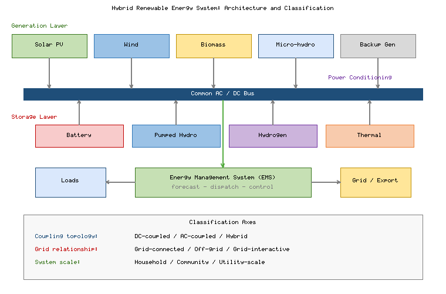
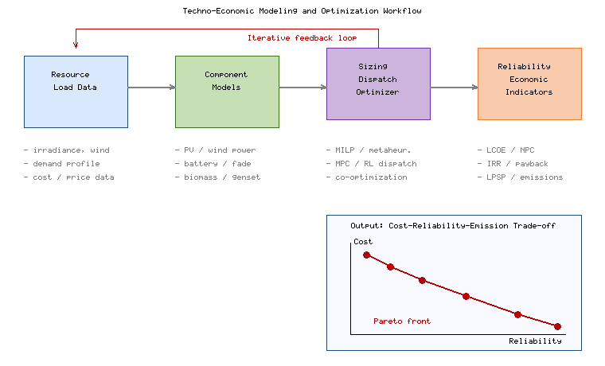
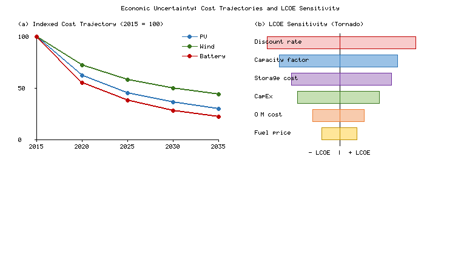
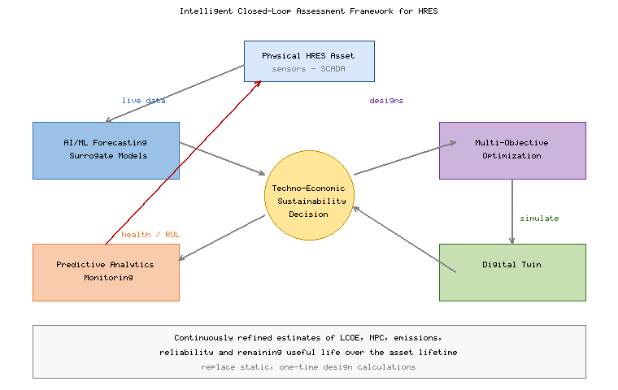

# Techno-Economic and Sustainability Assessment of Hybrid Renewable Energy Systems

**Book:** *Intelligent Power Management and Resilient Control in Hybrid Renewable Energy Systems*

---

## Abstract

Hybrid Renewable Energy Systems (HRES) that combine solar photovoltaic, wind, biomass, and other renewable resources with energy storage and intelligent control have become a cornerstone of the global transition toward low-carbon, resilient power supply [1]. Deciding whether such systems are worth building, however, requires more than a demonstration that they can keep the lights on: it demands a rigorous, integrated assessment of their technical performance, economic viability, and environmental sustainability over the full project lifecycle. This chapter presents a comprehensive techno-economic and sustainability assessment framework for HRES. It introduces the concept, architecture, and classification of hybrid systems; develops the technical and economic modelling that underpins system sizing and optimization; examines economic feasibility and market-integration pathways under grid-connected and off-grid business models; and evaluates environmental and social sustainability through lifecycle assessment, carbon accounting, resource-efficiency, and equity indicators. The chapter closes by surveying intelligent assessment frameworks—artificial intelligence, multi-objective optimization, digital twins, and predictive analytics—and by identifying research gaps and policy pathways toward sustainable hybrid energy systems. Four figures and four tables consolidate the quantitative evidence, and the discussion is grounded throughout in results reported in high-impact journals.

**Keywords:** Hybrid Renewable Energy Systems; Techno-Economic Analysis; Levelized Cost of Energy; Lifecycle Assessment; Multi-Objective Optimization; Energy Storage; Sustainability; Digital Twin

---

## 1. Introduction to Hybrid Renewable Energy Systems

### 1.1 Concept, Architecture, and Classification of Hybrid Renewable Energy Systems

The decarbonization of electricity supply is among the defining engineering challenges of the century, driven by climate commitments and the falling cost of renewable technologies [1]. Individual renewable sources, however, are variable and non-dispatchable: solar photovoltaic (PV) output collapses at night and under cloud cover, while wind output fluctuates on timescales from seconds to seasons. A Hybrid Renewable Energy System addresses these limitations by integrating two or more generation technologies with energy storage and a coordinating control layer, so that the complementary temporal profiles of the resources yield a more stable and reliable aggregate supply than any single source could provide [2].

The strategic appeal of HRES follows directly from this complementarity. By diversifying across resources whose outputs are imperfectly correlated, a hybrid plant reduces the variance of aggregate generation, which in turn lowers the storage and backup capacity needed to guarantee supply and improves the utilization of shared infrastructure such as converters, transformers, and the grid connection. The same logic that underpins portfolio diversification in finance therefore applies to energy resources: a mixed portfolio dominates a single-resource plant on the combined axes of cost and reliability [1]. This insight explains why hybridization, rather than the deployment of ever-larger single-technology plants, has emerged as the preferred architecture for high-renewable supply [2].

Architecturally, an HRES comprises four functional layers: a generation layer (PV arrays, wind turbines, biomass or micro-hydro units, and sometimes a dispatchable backup such as a diesel or biogas genset); a storage layer (batteries, hydrogen, pumped hydro, or thermal storage); a power-conditioning and coupling layer (converters and a common AC or DC bus); and a supervisory energy-management layer that schedules generation, storage, and loads. **Figure 1** depicts this layered architecture and the principal classification axes. HRES are commonly classified by coupling topology (DC-coupled, AC-coupled, or hybrid-coupled), by grid relationship (grid-connected, off-grid/standalone, or grid-interactive microgrids), and by scale (from household pico-systems to utility-scale hybrid plants). The classification matters because it determines which modelling assumptions, economic metrics, and regulatory frameworks apply—an off-grid village system is assessed primarily on reliability and levelized cost, whereas a grid-connected hybrid plant is judged additionally on its market revenue and grid-service capability [2].

**Figure 1.** Layered architecture of a Hybrid Renewable Energy System, showing the generation, storage, power-conditioning, and energy-management layers connected through a common bus, together with the principal classification axes (coupling topology, grid relationship, and scale).

### 1.2 Integration of Solar Photovoltaic, Wind, Biomass, and Other Renewable Energy Sources

The technical rationale for hybridization rests on resource complementarity. Solar and wind resources are frequently anti-correlated at daily and seasonal scales, so a combined PV–wind plant delivers firmer output and requires less storage than either technology alone to meet a given reliability target [3]. Biomass and biogas add a dispatchable, carbon-neutral component that can be scheduled to cover residual load during extended low-resource periods, while micro-hydro and small concentrated-solar-thermal units contribute inertia and thermal storage respectively [4]. The design task is therefore to select a resource mix whose aggregate generation best tracks the demand profile at least cost.

**Table 1** summarizes the salient techno-economic characteristics of the renewable sources and storage media most frequently combined in HRES, including typical capacity factors, levelized cost ranges, dispatchability, and technological maturity. The data illustrate why PV and onshore wind dominate new capacity—their levelized costs are now the lowest of any generation technology—while biomass and storage provide the flexibility that converts variable energy into firm, usable power [3][4].

**Table 1.** Techno-economic characteristics of renewable sources and storage media commonly integrated in HRES.

| Technology | Typical Capacity Factor (%) | Indicative LCOE / LCOS (USD/MWh) | Dispatchability | Maturity |
|------------|-----------------------------|----------------------------------|-----------------|----------|
| Solar PV (utility) | 15–27 | 30–60 | Non-dispatchable | Mature |
| Onshore wind | 25–45 | 30–65 | Non-dispatchable | Mature |
| Offshore wind | 40–55 | 60–110 | Non-dispatchable | Commercial |
| Biomass / biogas | 50–85 | 60–120 | Dispatchable | Mature |
| Micro-hydro | 40–60 | 40–90 | Partly dispatchable | Mature |
| Li-ion battery | 1–4 h duration | 100–200 (LCOS) | Fast dispatch | Commercial |
| Pumped hydro | 6–12 h duration | 50–120 (LCOS) | Dispatchable | Mature |
| Hydrogen (electrolyzer+FC) | Seasonal | 150–400 (LCOS) | Long-duration | Emerging |

### 1.3 Role of Energy Storage and Power Management in Hybrid Systems

Storage is the technology that transforms a collection of variable generators into a controllable power plant. Short-duration lithium-ion batteries absorb sub-hourly fluctuations, provide fast frequency response, and shift a few hours of solar energy into the evening peak, whereas pumped hydro and hydrogen enable multi-hour to seasonal shifting that batteries cannot deliver economically [5]. The appropriate storage portfolio depends on the mismatch between the generation and demand profiles: systems with high solar penetration need diurnal shifting, while systems targeting very high renewable fractions require a long-duration tier to bridge multi-day resource droughts.

The choice of coupling topology interacts strongly with the storage decision. DC-coupled architectures route PV and battery through a shared DC bus, avoiding one conversion stage and improving round-trip efficiency for solar-dominated systems, whereas AC-coupled architectures accommodate heterogeneous sources and retrofits more flexibly at the cost of additional conversion. These are not merely engineering preferences: the conversion losses and the component count they imply feed directly into the lifecycle efficiency and cost that the techno-economic assessment must capture [5]. Sizing the storage tier is likewise a balance between energy capacity (how many hours can be served) and power capacity (how fast energy can be delivered), and the two are decoupled in flow and hydrogen systems but tightly linked in conventional batteries [5].

The intelligence that coordinates these assets resides in the energy-management system (EMS). A well-designed EMS performs forecasting, unit commitment, economic dispatch, and real-time balancing, deciding at each instant how much power to draw from each source, how to charge or discharge storage, and when to curtail or export. Rule-based controllers remain common in small systems, but optimization-based and learning-based controllers increasingly dominate because they can respect battery degradation limits, anticipate forecast resource and price signals, and minimize lifecycle cost rather than merely instantaneous cost [6]. The quality of this power-management layer has a first-order effect on both the economics and the reliability of the system, which is why it is central to the assessment methods developed later in this chapter.

### 1.4 Applications, Challenges, and Future Prospects of Hybrid Renewable Energy Systems

HRES span an enormous range of applications. In off-grid contexts they electrify remote communities, telecom towers, islands, and productive loads such as water pumping, often displacing expensive and polluting diesel generation and delivering rapid social and economic benefits [7]. In grid-connected contexts, hybrid PV–wind–storage plants provide firm, dispatchable renewable capacity, participate in energy and ancillary-service markets, and defer transmission upgrades. Emerging applications couple HRES to green-hydrogen production, electric-vehicle charging, and industrial process heat.

The future prospects of HRES are closely tied to three converging trends: the continuing decline in the cost of PV, wind, and storage; the digitalization of control and markets; and the broadening of value from electricity alone toward coupled sectors such as transport, heat, and hydrogen. Each of these trends enlarges the space in which hybridization is economically attractive, but each also complicates assessment, because the value of a system can no longer be judged against a single commodity price or a single service. The methodological response, developed throughout this chapter, is to assess HRES across multiple services, multiple objectives, and the full lifecycle simultaneously [7].

Despite rapid growth, several challenges constrain deployment: the high upfront capital intensity and financing cost of storage-rich systems; the technical complexity of controlling multi-source plants under uncertainty; regulatory frameworks that were designed for conventional generation and that often disadvantage small or variable resources; and sustainability concerns around critical-material supply chains and end-of-life waste [8]. The remainder of this chapter addresses precisely these dimensions, providing an integrated methodology to quantify whether, where, and how HRES deliver net techno-economic and environmental value.

---

## 2. Techno-Economic Modeling and System Optimization

### 2.1 Technical Modeling of Renewable Energy Sources and Energy Storage Components

Credible techno-economic assessment begins with physically grounded component models that convert resource data into power and energy flows at an appropriate time resolution—typically hourly or sub-hourly over a representative year. PV generation is modelled from plane-of-array irradiance and cell temperature, incorporating module efficiency, inverter losses, soiling, and temperature de-rating [9]. Wind generation is derived by mapping hub-height wind speed—extrapolated from measurement height using a logarithmic or power-law profile—through the turbine power curve, with corrections for air density and wake and availability losses [9]. Biomass and genset units are represented by fuel-consumption curves and minimum-load and ramping constraints.

The level of detail must be matched to the assessment question. A planning-stage sizing study can tolerate reduced-order models that run quickly across thousands of configurations, whereas a bankable feasibility study or an operational digital twin demands higher-fidelity representations validated against measured performance. Mismatching fidelity to purpose is a common source of error: over-simplified models hide the degradation and part-load inefficiencies that erode returns, while needlessly detailed models make the large-scale optimization intractable [9]. The art of credible modelling therefore lies in capturing the physics that drives the economic result while suppressing detail that does not.

Storage models must capture not only energy balance but also the physical limits that govern lifetime economics. A battery model typically tracks state of charge, round-trip efficiency, depth-of-discharge limits, and—critically—capacity fade as a function of cycling and calendar age, because replacement cost over the project horizon frequently dominates storage economics [10]. Representing this fade accurately is challenging because it depends non-linearly on temperature, charge rate, and the depth and frequency of cycles, so a model that assumes a fixed cycle life can misestimate replacement timing and distort the entire lifecycle cost [10]. **Figure 2** presents the end-to-end techno-economic modelling and optimization workflow: resource and load data feed component models, which feed a sizing-and-dispatch optimizer, whose candidate designs are evaluated against reliability and economic indicators and returned as a trade-off set. Fidelity in these component models directly determines the credibility of every downstream economic and environmental conclusion.

**Figure 2.** Techno-economic modelling and optimization workflow for HRES, linking resource and demand data through physical component models to the sizing-and-dispatch optimizer and the reliability and economic indicators used to rank candidate configurations.

### 2.2 Energy Demand Assessment, Resource Evaluation, and System Sizing

Accurate demand characterization is as important as resource evaluation, because an HRES is sized to serve a specific load with a specified reliability. Demand assessment constructs hourly load profiles—including base load, seasonal variation, and peak coincidence—and, increasingly, treats a portion of the load as flexible or deferrable, which materially reduces the required generation and storage capacity [11]. Resource evaluation combines long-term satellite and reanalysis datasets with on-site measurement to quantify the mean, variability, and temporal correlation of the solar and wind resources, since it is the joint distribution—not the individual means—that governs hybrid performance [11].

The temporal resolution and horizon of the input data deserve particular care, because averaging conceals the very extremes that drive storage sizing. Hourly data understate short-duration ramps and sub-hourly imbalances that a battery must absorb, while a single representative year omits the inter-annual variability—dark, still winter periods or drought years for hydro—that determines whether a system meets its reliability target in a bad year rather than an average one [11]. Best practice therefore uses multi-year, high-resolution datasets and explicitly tests designs against worst-case resource sequences, so that the assessed reliability reflects the conditions the system will actually face [11].

System sizing then determines the capacity of each generator and storage unit. Reliability is quantified through metrics such as the loss of power supply probability (LPSP), the unmet-load fraction, and the renewable fraction, which are traded against cost. Because the design space is large and the dispatch is itself an optimization nested within sizing, sizing is almost always posed as a formal optimization problem rather than solved by enumeration [12]. The choice of reliability target has a strong, non-linear effect on cost: moving from 95% to 100% renewable supply can double or triple storage capacity, so the assessment must make the reliability–cost trade-off explicit rather than fixing reliability arbitrarily.

### 2.3 Economic Indicators: Net Present Cost, Levelized Cost of Energy, and Payback Period

Economic assessment reduces a complex stream of costs and energy flows to a small set of decision metrics. The **Net Present Cost (NPC)** aggregates all discounted capital, replacement, operation-and-maintenance, and fuel costs, net of salvage value, over the project life *N* at discount rate *r*:

$$NPC = \sum_{t=0}^{N} \frac{C_{cap,t} + C_{rep,t} + C_{O\&M,t} + C_{fuel,t} - S_t}{(1+r)^t}$$

The **Levelized Cost of Energy (LCOE)** normalizes the discounted total cost by the discounted energy served, giving a per-unit cost that permits comparison across technologies and configurations [13]:

$$LCOE = \frac{\sum_{t=0}^{N} \dfrac{C_{cap,t} + C_{O\&M,t} + C_{rep,t} + C_{fuel,t}}{(1+r)^t}}{\sum_{t=1}^{N} \dfrac{E_t}{(1+r)^t}}$$

where *E_t* is the useful electricity delivered in year *t*. For grid-connected systems the **discounted payback period** and **net present value** of the investment capture the time to recover capital from net revenues, while the **internal rate of return (IRR)** expresses profitability as the discount rate at which NPV vanishes [14]. **Table 2** defines these indicators, gives their formulas and interpretation, and lists indicative ranges reported for optimized HRES. Together the metrics answer complementary questions: LCOE asks how cheaply energy is produced, NPC asks how much total capital is committed, and payback and IRR ask how attractive the investment is to a financier [13][14].

**Table 2.** Principal economic indicators used in HRES techno-economic assessment.

| Indicator | Definition / Interpretation | Typical Range (optimized HRES) |
|-----------|------------------------------|--------------------------------|
| Net Present Cost (NPC) | Discounted lifecycle cost net of salvage | Project-specific |
| Levelized Cost of Energy (LCOE) | Discounted cost per unit energy delivered | 40–120 USD/MWh |
| Levelized Cost of Storage (LCOS) | Discounted cost per unit energy discharged | 50–250 USD/MWh |
| Net Present Value (NPV) | Discounted net revenue over life | >0 for viable projects |
| Internal Rate of Return (IRR) | Discount rate giving NPV = 0 | 8–20% |
| Discounted Payback Period | Years to recover capital from net revenue | 4–10 years |
| Loss of Power Supply Probability (LPSP) | Reliability: fraction of unmet demand | 0–5% (design target) |

### 2.4 Optimization Techniques for Capacity Planning and Energy Management

Because HRES design couples discrete and continuous decisions with a nested dispatch problem under uncertainty, a wide spectrum of optimization techniques is employed. Classical approaches include linear and mixed-integer linear programming for dispatch and iterative or deterministic search for sizing, as implemented in widely used tools. For the non-convex, multi-modal sizing problem, metaheuristics—genetic algorithms, particle-swarm optimization, and their hybrids—are popular because they handle non-linearities and discrete catalogue sizes without gradient information [15]. At the operational layer, model-predictive control and, increasingly, reinforcement-learning controllers optimize dispatch over a rolling horizon using forecasts of resource, demand, and price [16].

The practical selection of a technique balances solution quality against computational tractability and transparency. Mathematical-programming formulations yield provably optimal or bounded solutions and are well suited to convex dispatch problems, but they can struggle with the non-convexities introduced by unit commitment, degradation, and discrete equipment sizes. Metaheuristics scale gracefully to these complications and to many decision variables, yet they offer no optimality guarantee and require careful tuning and repeated runs to assess robustness [15]. Hybrid schemes that use a metaheuristic for the discrete sizing layer and an exact solver for the embedded dispatch increasingly offer the best of both, delivering near-optimal designs with acceptable confidence [15].

A central methodological point is that capacity planning and energy management cannot be optimized in isolation: the economically optimal size depends on how well the system will be operated, and the best operating policy depends on the installed capacities. State-of-the-art assessment therefore co-optimizes sizing and dispatch, and casts the result as a multi-objective problem that trades cost against reliability and emissions rather than collapsing everything into a single weighted objective [15][16]. This optimization machinery is the engine that turns the component and economic models of the preceding sections into actionable system designs.

---

## 3. Economic Feasibility and Market Integration

### 3.1 Capital Investment, Operation, Maintenance, and Lifecycle Cost Analysis

Economic feasibility rests on a disciplined accounting of costs across the asset lifecycle. Capital expenditure (CapEx) covers equipment, balance-of-system, installation, grid connection, and development costs; for storage-rich HRES, batteries and power electronics constitute a large and declining share of CapEx [17]. Operation-and-maintenance (O&M) expenditure comprises fixed costs (scheduled maintenance, insurance, land) and variable costs (fuel for backup units, degradation-driven cycling costs). Critically, storage components incur replacement costs mid-life, so a lifecycle-cost analysis that ignores battery replacement will understate true cost substantially [17].

The time profile of these cash flows matters as much as their magnitude. Renewable-dominated HRES are capital-front-loaded: almost all expenditure occurs at construction, after which marginal operating cost is near zero, in sharp contrast to fossil plants whose cost is dominated by ongoing fuel. This profile makes HRES economics acutely sensitive to the discount rate and to financing terms, and it rewards durability—components that last longer defer the replacement expenditure that erodes net present value [17]. It also means that salvage value and decommissioning cost, often neglected, can tip marginal projects, particularly where high-value materials can be recovered at end of life [17].

Lifecycle cost analysis consolidates these streams into the NPC and LCOE metrics defined earlier, discounting future expenditures to present value. The analysis must reflect learning-driven cost declines: PV, wind, and battery costs have fallen steeply, and projecting replacement costs at today's prices overstates lifecycle cost, whereas assuming aggressive future declines understates risk. A credible assessment therefore brackets component-cost trajectories and reports the resulting range rather than a single point estimate [17].

### 3.2 Financial Feasibility, Sensitivity Analysis, and Uncertainty Assessment

Because HRES economics depend on many uncertain parameters—resource quality, discount rate, component cost, fuel price, and load growth—point estimates of LCOE or NPV can be misleading. Sensitivity analysis identifies the parameters to which the result is most responsive, and uncertainty analysis propagates parameter distributions to produce a distribution of outcomes [18]. **Figure 3** illustrates both: a cost-trajectory panel showing the historical and projected decline of PV, wind, and battery costs, and a tornado panel ranking the sensitivity of system LCOE to the principal input parameters.

**Figure 3.** Economic uncertainty in HRES assessment: (left) indicative historical and projected cost trajectories for solar PV, wind, and lithium-ion battery storage; (right) tornado diagram ranking the sensitivity of system LCOE to key input parameters.

Sensitivity analyses across the literature consistently find that the discount rate (cost of capital), the capacity factor of the dominant resource, and storage cost dominate HRES LCOE, often outweighing the influence of fuel or O&M assumptions [18]. This has a direct policy implication: measures that lower the cost of capital—long-term offtake contracts, concessional finance, and risk-guarantee instruments—can improve HRES competitiveness as much as further technological cost reductions. Robust assessment therefore reports results as probability distributions and reports the financing assumptions transparently, so that technology and financing risk can be managed separately.

### 3.3 Electricity Tariffs, Renewable Energy Incentives, and Market Participation

The revenue side of feasibility is shaped by the regulatory and market environment. Retail and wholesale electricity tariffs, time-of-use pricing, feed-in tariffs, and net-metering rules determine the value of self-consumed and exported energy, while incentives such as capital subsidies, tax credits, renewable-energy certificates, and carbon pricing improve project returns [19]. The structure of these instruments—not merely their magnitude—shapes system design: time-of-use tariffs reward storage that shifts energy into high-price periods, whereas flat tariffs provide no such signal [19].

Incentive design also carries durability risk that the assessment must price. Retroactive changes to feed-in tariffs and support schemes in several markets have stranded investor expectations and raised the perceived risk—and therefore the cost of capital—of subsequent projects, illustrating that policy stability is itself an economic input [19]. A robust feasibility study consequently stress-tests revenue against plausible tariff and incentive scenarios rather than assuming today's support persists unchanged over a two-decade asset life [19].

For grid-connected HRES, market participation unlocks revenue streams beyond simple energy sales. The combination of variable generation with dispatchable storage allows a hybrid plant to arbitrage energy prices and to supply high-value ancillary services—frequency regulation, reserves, and capacity—thereby stacking multiple revenue sources from the same assets [20]. Realizing this value depends on market-access rules: minimum-size thresholds, telemetry requirements, and performance penalties can exclude smaller renewable-based plants, so the regulatory design is itself a determinant of economic feasibility [20].

### 3.4 Grid-Connected and Off-Grid Business Models for Hybrid Renewable Energy Systems

Two broad business-model families dominate. Grid-connected models monetize energy and grid services through wholesale markets, corporate power-purchase agreements, or feed-in schemes, and increasingly through aggregation into virtual power plants that let small assets reach markets otherwise inaccessible to them [20]. Off-grid and mini-grid models serve customers who lack reliable grid access and are evaluated chiefly on levelized cost and reliability relative to the diesel or kerosene alternatives they displace [21].

A recurring complication for mini-grid assessment is demand uncertainty. In newly electrified communities, load is initially low and grows unpredictably as households and businesses acquire appliances, which makes a system sized for present demand quickly inadequate and one sized for future demand uneconomic at the outset [21]. Modular, incrementally expandable architectures and demand-stimulation programmes are therefore not peripheral conveniences but central to the techno-economic case, and the assessment should model demand growth as a scenario variable rather than a fixed input [21].

Off-grid business models have diversified well beyond simple asset sale. Energy-as-a-service, pay-as-you-go, and anchor-business-community models shift upfront cost and operating risk from the end user to a service provider, dramatically expanding the addressable market in low-income regions [21]. The economic viability of mini-grids hinges on achieving sufficient productive-use demand to raise the capacity factor and spread fixed costs, which is why successful projects deliberately stimulate income-generating loads. Across both families, the economic case for HRES is strongest where it either displaces expensive diesel generation or provides firm, market-remunerated capacity to a constrained grid.

---

## 4. Sustainability and Environmental Performance Assessment

### 4.1 Lifecycle Assessment of Hybrid Renewable Energy Systems

Economic competitiveness is necessary but not sufficient; sustainability assessment asks whether an HRES delivers genuine net environmental benefit across its full lifecycle. Lifecycle assessment (LCA) quantifies environmental burdens from raw-material extraction through manufacturing, transport, installation, operation, and end-of-life, avoiding the error of judging renewable systems "zero impact" simply because they emit nothing during operation [22]. For HRES, the embodied impacts of PV modules, wind turbines, and especially batteries are concentrated in the manufacturing phase, so the operational displacement of fossil generation must be large enough to repay this embodied burden [22].

A credible LCA requires that the functional unit, system boundary, and allocation rules be defined explicitly and consistently, because methodological choices can change results by large margins and make studies incomparable. Harmonized meta-analyses, which re-express disparate studies on a common basis, have been essential in resolving the once-wide spread in reported figures and in establishing defensible central estimates for the carbon intensity of PV and wind [22]. For hybrid systems the boundary must also encompass the storage and power-electronics subsystems, whose embodied impacts can rival those of the generators and whose omission would flatter the result [22].

Two integrative indicators summarize this balance. The **energy payback time (EPBT)** is the operating time required for a system to generate the energy consumed in its production, and the **energy return on investment (EROI)** is the ratio of lifetime energy delivered to energy invested. **Table 3** reports representative lifecycle indicators—greenhouse-gas intensity, EPBT, water use, land use, and recyclability—for the technologies that make up a typical HRES, drawn from harmonized LCA studies. The data confirm that modern PV and wind repay their energy debt within one to three years and deliver lifecycle greenhouse-gas intensities one to two orders of magnitude below fossil generation, which underpins the environmental case for hybridization [22][23].

**Table 3.** Representative lifecycle environmental indicators for HRES component technologies.

| Technology | Lifecycle GHG (gCO₂eq/kWh) | Energy Payback Time (years) | Relative Water Use | Relative Land Use | End-of-Life Recyclability |
|------------|----------------------------|-----------------------------|--------------------|-------------------|---------------------------|
| Solar PV | 20–50 | 1–3 | Low | Moderate | 85–95% (mass) |
| Onshore wind | 8–20 | 0.4–1.0 | Very low | Low (footprint) | 85–90% |
| Offshore wind | 12–25 | 0.6–1.2 | Very low | Low | 80–90% |
| Biomass | 15–120 | Varies | Moderate–high | High | High (ash reuse) |
| Li-ion battery | 50–120 (per kWh throughput) | n/a | Moderate | Low | 50–95% (improving) |
| Natural gas (reference) | 400–500 | n/a | High | Low | n/a |

### 4.2 Carbon Emissions Reduction and Environmental Impact Evaluation

The headline environmental benefit of HRES is avoided greenhouse-gas emissions. Carbon accounting compares the lifecycle emissions of the hybrid system against a counterfactual—typically the grid mix or the diesel generation it displaces—to compute net abatement, which can then be monetized through carbon pricing or used to assess alignment with decarbonization targets [23]. In diesel-displacing off-grid applications the abatement is especially large, since diesel generation emits on the order of 700–900 gCO₂eq/kWh, while in grid applications the benefit scales with the carbon intensity of the displaced grid electricity [23].

A rigorous environmental evaluation extends beyond carbon to the full suite of impact categories—acidification, eutrophication, particulate formation, and resource depletion—because single-issue focus can hide burden-shifting, where reducing carbon increases another impact. For HRES the most important such trade-offs involve the material intensity of storage and the land and ecological footprint of generation, both of which must be weighed against the operational emissions avoided [23]. When assessed across categories, well-designed HRES show net improvement on the dominant impacts, but the margin depends strongly on the carbon intensity of the displaced energy and on the manufacturing supply chain of the components.

### 4.3 Resource Efficiency, Material Consumption, and End-of-Life Management

The scale-up of HRES raises material-sustainability questions that economic metrics alone do not capture. Clean-energy technologies are considerably more material-intensive per unit of capacity than fossil alternatives, drawing on critical materials such as lithium, cobalt, nickel, rare earths, silver, and copper whose supply chains carry geopolitical, environmental, and social risks [24]. Resource-efficiency assessment therefore tracks the quantity and criticality of materials embodied in a design and favours configurations and chemistries that reduce reliance on constrained materials [24].

The timing of material demand compounds the challenge. Because deployment is growing exponentially, primary material demand will peak before recycling can supply a meaningful secondary stream, since today's installations will not retire for one to two decades; recycling eases but does not eliminate the near-term supply pressure [24]. Assessment that accounts for this dynamic favours designs that are material-light, that avoid the most constrained elements, and that are built to last, thereby reducing both the primary demand and the eventual waste burden [24].

End-of-life management closes the loop. Without deliberate circular-economy strategies, the coming waves of retired PV modules and batteries represent both an environmental hazard and a wasted resource; with them, recovered materials can substantially reduce the embodied impact and material demand of future systems [25]. Design for disassembly, second-life use of batteries in less demanding stationary applications, and high-yield recycling are increasingly incorporated into sustainability assessment, shifting the frame from a linear "produce-use-dispose" model to a circular one in which end-of-life recovery is an explicit design objective [25]. These considerations are now material to both the environmental and the long-run economic case for HRES.

### 4.4 Sustainability Indicators: Social Acceptance, Energy Equity, and Long-Term Resilience

Sustainability is a three-pillar concept, and the social dimension is frequently decisive in practice. Social acceptance—shaped by perceived fairness, local benefit-sharing, visual and land-use impacts, and procedural justice—determines whether projects are permitted and operated without conflict, and the assessment of large HRES increasingly incorporates stakeholder and community metrics alongside technical ones [26]. Energy equity asks who bears the costs and who reaps the benefits of the transition, a question of particular weight for off-grid HRES that extend first-time access to electricity in underserved communities [26].

Valuing resilience is methodologically difficult because its benefits accrue mainly during rare, high-impact events and are therefore poorly captured by average-case metrics such as LCOE. Approaches that quantify the value of lost load, or that treat guaranteed service during outages as a distinct product, make this value visible and allow it to be weighed against the cost of the storage and redundancy that provide it [27]. As climate-driven extreme events grow more frequent, this resilience value is becoming a larger component of the overall case for HRES, particularly for critical facilities and for communities at the grid's edge [27].

Finally, long-term resilience captures the capacity of a system to maintain or rapidly restore service under shocks—extreme weather, fuel-supply disruption, or cyber-physical threats. HRES contribute to resilience through resource and technological diversity, local generation, and the ride-through capability that storage provides, allowing microgrids to island and continue serving critical loads during grid outages [27]. A complete sustainability assessment therefore integrates environmental, economic, social, and resilience indicators into a multi-criteria evaluation, recognizing that a system optimal on cost alone may be unacceptable on equity or fragile under stress [27].

---

## 5. Intelligent Assessment Frameworks and Future Research Directions

### 5.1 Artificial Intelligence and Machine Learning for Techno-Economic Assessment

The assessment methods described so far are increasingly augmented by artificial intelligence (AI) and machine learning (ML), which address two persistent difficulties: the heavy computational cost of high-fidelity simulation and optimization, and the pervasive uncertainty in resource, demand, and price inputs [28]. ML surrogate models learn the input–output behaviour of expensive simulations, enabling thousands of candidate designs to be evaluated in the time previously required for one and making full probabilistic assessment tractable [28].

These capabilities, however, come with caveats that assessment practice must respect. Data-driven models can extrapolate poorly beyond the conditions represented in their training data, and their opacity complicates the explanation and auditing of investment-grade conclusions. Prudent use therefore pairs ML with physically grounded models—as surrogates validated against simulation, or within hybrid physics-informed architectures—and quantifies predictive uncertainty rather than reporting single values, so that the confidence placed in an AI-assisted assessment is itself assessed [28]. Treated this way, AI becomes a tool that widens the scope and sharpens the resolution of techno-economic analysis without sacrificing its rigor [28].

On the forecasting side, data-driven models—gradient-boosted trees, recurrent and convolutional neural networks, and transformer architectures—now predict solar irradiance, wind power, demand, and electricity price with accuracies that materially improve dispatch and market participation [29]. Better forecasts tighten the uncertainty bands around every economic indicator and allow the EMS to operate closer to the true optimum, so improvements in forecasting translate directly into improved assessed economics [29]. **Figure 4** situates these AI/ML components within an intelligent, closed-loop assessment framework.

**Figure 4.** Intelligent assessment framework for HRES, integrating AI/ML forecasting and surrogate modelling, multi-objective optimization, a digital twin, and predictive analytics into a closed loop that links physical assets to techno-economic and sustainability decisions.

### 5.2 Multi-Objective Optimization for Cost, Reliability, and Sustainability

Because stakeholders care simultaneously about cost, reliability, and environmental impact—objectives that conflict—single-objective optimization is increasingly replaced by multi-objective formulations that compute a Pareto front of non-dominated designs [30]. Rather than imposing weights a priori, this approach presents decision-makers with the explicit trade-off surface, allowing them to see, for example, how much additional cost buys a given reduction in emissions or unmet load [30].

Translating a Pareto front into a single chosen design still requires a decision step, and this is where multi-criteria decision-making methods enter, formalizing stakeholder priorities and the relative weight attached to cost, reliability, and environmental objectives [30]. Making this step explicit and transparent is important for legitimacy: two defensible weightings can select very different points on the same front, so the assessment should report the front and the preference assumptions separately, allowing decision-makers to see the consequences of their value judgments rather than having them hidden inside an aggregate score [30].

Evolutionary algorithms such as NSGA-II and decomposition-based methods are the workhorses here, often coupled with the ML surrogates of the previous section to keep the many required evaluations affordable [30]. The maturing practice is to treat sustainability indicators—lifecycle carbon, material criticality, water use—as first-class objectives alongside cost and reliability, so that the optimization delivers designs that are defensible across all three sustainability pillars rather than merely least-cost. This represents a significant methodological advance over the single-metric assessments that long dominated the field.

### 5.3 Digital Twins, Predictive Analytics, and Real-Time Performance Monitoring

A digital twin is a continuously updated virtual replica of a physical HRES, synchronized with live sensor data, that mirrors the plant's state and simulates its response to prospective actions [31]. By closing the loop between model and asset, digital twins extend assessment from a one-time design exercise into a living, operational discipline: the twin re-estimates component health, re-optimizes dispatch, and re-forecasts lifecycle economics as real operating data accumulate [31].

Realizing these benefits depends on data quality, interoperability, and cybersecurity, which are prerequisites rather than afterthoughts. A digital twin is only as trustworthy as the sensor streams and the models that drive it, and the same connectivity that enables remote optimization also enlarges the attack surface of a critical energy asset [31]. A mature assessment framework therefore treats data governance and cyber-physical security as design requirements whose costs and risks are weighed alongside the operational gains the twin delivers [31].

Predictive analytics built on this foundation detect incipient faults, estimate remaining useful life of batteries and power electronics, and schedule condition-based maintenance, reducing unplanned downtime and preserving revenue-generating availability [32]. Real-time performance monitoring also feeds back into assessment accuracy, replacing assumed degradation and availability parameters with measured values and thereby tightening the uncertainty on long-term projections [32]. Together, digital twins and predictive analytics transform the techno-economic and sustainability assessment from a static prediction into a continuously refined estimate that improves over the asset's life.

### 5.4 Research Gaps, Policy Recommendations, and Pathways toward Sustainable Hybrid Energy Systems

Despite rapid progress, significant gaps remain. Methodologically, the integration of techno-economic and environmental assessment is still immature: cost and LCA models are frequently built separately and reconciled only loosely, and data on battery second-life performance, real-world degradation, and critical-material supply remain scarce and inconsistent [33]. There is a need for open, harmonized datasets and standardized assessment protocols so that results from different studies can be compared and trusted [33]. **Table 4** consolidates the principal research gaps, their implications, and corresponding recommendations.

**Table 4.** Research gaps, implications, and recommendations for sustainable HRES assessment.

| Research Gap | Implication | Recommendation |
|--------------|-------------|----------------|
| Siloed techno-economic and LCA models | Trade-offs across cost and environment hidden | Develop integrated, co-simulated assessment frameworks |
| Scarce real-world degradation / second-life data | Overstated storage uncertainty | Build open, harmonized operational datasets |
| Point-estimate reporting of LCOE/NPC | Risk mispriced | Mandate probabilistic, scenario-based reporting |
| Market rules unsuited to variable resources | HRES value under-remunerated | Reform market access and define hybrid-resource products |
| Critical-material and end-of-life risk | Supply and waste bottlenecks | Embed circular-economy and criticality metrics in design |
| Equity and social acceptance under-assessed | Project delay and conflict | Integrate multi-criteria social indicators |

On the policy side, the dominant lever is the cost of capital: stable long-term offtake, concessional finance, and risk-mitigation instruments reduce HRES LCOE as effectively as further technology-cost declines, especially in emerging economies [34]. Market reform to define hybrid-resource products and to open ancillary-service and capacity markets to aggregated small assets would let HRES capture the full value they create [34]. The pathway toward sustainable hybrid energy systems therefore combines integrated and probabilistic assessment methods, intelligent operation through AI and digital twins, circular-economy material strategies, and supportive policy and finance—an agenda in which rigorous techno-economic and sustainability assessment is not a formality but the central instrument for directing capital toward the systems that deliver the greatest net benefit [34].

---

## 6. Conclusion

This chapter has developed an integrated framework for the techno-economic and sustainability assessment of Hybrid Renewable Energy Systems. Beginning from the concept, architecture, and classification of hybrid systems, it established the physical component models and economic indicators—NPC, LCOE, payback, and IRR—that underpin rigorous system sizing and optimization, and it examined how feasibility is shaped by lifecycle cost, uncertainty, tariffs, incentives, and the grid-connected and off-grid business models through which value is realized. It then extended assessment beyond economics to the environmental and social pillars of sustainability, through lifecycle assessment, carbon accounting, resource-efficiency and end-of-life analysis, and indicators of equity and resilience. Finally, it surveyed the intelligent methods—AI/ML, multi-objective optimization, digital twins, and predictive analytics—that are transforming assessment from a static design calculation into a continuously refined, closed-loop discipline. The consistent message is that HRES are techno-economically competitive and environmentally beneficial across a wide range of contexts, but that realizing their potential depends on integrated, probabilistic, and multi-criteria assessment, on supportive market and finance structures, and on circular-economy strategies for the materials on which they rely.

Looking ahead, the assessment of hybrid renewable energy systems is likely to become less a discrete milestone performed once at the design stage and more a continuous, data-driven process that spans the entire asset life. The convergence of cheaper sensing, pervasive connectivity, machine learning, and digital-twin technology makes it feasible to keep every techno-economic and sustainability indicator current, re-estimating lifecycle cost, emissions, and reliability as the system ages and as market and climate conditions evolve. In parallel, the broadening of value across coupled energy sectors will require assessment frameworks that span electricity, heat, transport, and hydrogen within a single coherent model. The frameworks, metrics, and methods set out in this chapter provide the foundation for that evolution, and their disciplined application remains the surest route to directing scarce capital and materials toward the hybrid energy systems that deliver the greatest and most durable net benefit to society.

---

## References

[1] Gielen D, Boshell F, Saygin D, Bazilian MD, Wagner N, Gorini R. The role of renewable energy in the global energy transformation. Energy Strategy Reviews. 2019;24:38–50.

[2] Khan FA, Pal N, Saeed SH. Review of solar photovoltaic and wind hybrid energy systems for sizing strategies, optimization techniques and cost analysis methodologies. Renewable and Sustainable Energy Reviews. 2018;92:937–947.

[3] Sinha S, Chandel SS. Review of recent trends in optimization techniques for solar photovoltaic–wind based hybrid energy systems. Renewable and Sustainable Energy Reviews. 2015;50:755–769.

[4] Khan AA, Minai AF, Pachauri RK, Malik H. Optimal sizing, control, and management strategies for hybrid renewable energy systems: a comprehensive review. Energies. 2021;14(21):7307.

[5] Hannan MA, Wali SB, Ker PJ, Rahman MSA, Mansor M, Ramachandaramurthy VK, et al. Battery energy-storage system: a review of technologies, optimization objectives, constraints, approaches, and outstanding issues. Journal of Energy Storage. 2021;42:103023.

[6] Olatomiwa L, Mekhilef S, Ismail MS, Moghavvemi M. Energy management strategies in hybrid renewable energy systems: a review. Renewable and Sustainable Energy Reviews. 2016;62:821–835.

[7] Mandelli S, Barbieri J, Mereu R, Colombo E. Off-grid systems for rural electrification in developing countries: definitions, classification and a comprehensive literature review. Renewable and Sustainable Energy Reviews. 2016;58:1621–1646.

[8] Lian J, Zhang Y, Ma C, Yang Y, Chaima E. A review on recent sizing methodologies of hybrid renewable energy systems. Energy Conversion and Management. 2019;199:112027.

[9] Al-Shahri OA, Ismail FB, Hannan MA, Lipu MSH, Al-Shetwi AQ, Begum RA, et al. Solar photovoltaic energy optimization methods, challenges and issues: a comprehensive review. Journal of Cleaner Production. 2021;284:125465.

[10] Xu B, Oudalov A, Ulbig A, Andersson G, Kirschen DS. Modeling of lithium-ion battery degradation for cell life assessment. IEEE Transactions on Smart Grid. 2018;9(2):1131–1140.

[11] Mahesh A, Sandhu KS. Hybrid wind/photovoltaic energy system developments: critical review and findings. Renewable and Sustainable Energy Reviews. 2015;52:1135–1147.

[12] Siddaiah R, Saini RP. A review on planning, configurations, modeling and optimization techniques of hybrid renewable energy systems for off-grid applications. Renewable and Sustainable Energy Reviews. 2016;58:376–396.

[13] Bruck M, Sandborn P, Goudarzi N. A levelized cost of energy (LCOE) model for wind farms that includes power purchase agreement (PPA) energy delivery limits. Renewable Energy. 2018;122:131–139.

[14] Rezk H, Mukhametzyanov IZ, Al-Dhaifallah M, Ziedan HA. Optimal selection of hybrid renewable energy system using multi-criteria decision-making algorithms. Computers, Materials & Continua. 2021;68(2):2001–2027.

[15] Fathy A, Kaaniche K, Alanazi TM. Recent approach based social spider optimizer for optimal sizing of hybrid PV/wind/battery/diesel integrated microgrid. IEEE Access. 2020;8:57630–57645.

[16] Zia MF, Elbouchikhi E, Benbouzid M. Microgrids energy management systems: a critical review on methods, solutions, and prospects. Applied Energy. 2018;222:1033–1055.

[17] Mohseni S, Brent AC, Burmester D. A comparison of metaheuristics for the optimal capacity planning of an isolated, battery-less, hydrogen-based micro-grid. Applied Energy. 2020;259:114224.

[18] Mytilinou V, Kolios AJ. Techno-economic optimisation of offshore wind farms based on life cycle cost analysis on the UK. Renewable Energy. 2019;132:439–454.

[19] Pyrgou A, Kylili A, Fokaides PA. The future of the feed-in tariff (FiT) scheme in Europe: the case of photovoltaics. Energy Policy. 2016;95:94–102.

[20] Gandhi O, Kumar DS, Rodríguez-Gallegos CD, Srinivasan D. Review of power system impacts at high PV penetration — Part I: factors limiting PV penetration. Solar Energy. 2020;210:181–201.

[21] Peters J, Sievert M, Toman MA. Rural electrification through mini-grids: challenges ahead. Energy Policy. 2019;132:27–31.

[22] Nugent D, Sovacool BK. Assessing the lifecycle greenhouse gas emissions from solar PV and wind energy: a critical meta-survey. Energy Policy. 2014;65:229–244.

[23] Pehl M, Arvesen A, Humpenöder F, Popp A, Hertwich EG, Luderer G. Understanding future emissions from low-carbon power systems by integration of life-cycle assessment and integrated energy modelling. Nature Energy. 2017;2:939–945.

[24] Watari T, Nansai K, Nakajima K. Review of critical metal dynamics to 2050 for 48 elements. Resources, Conservation and Recycling. 2020;155:104669.

[25] Heath GA, Silverman TJ, Kempe M, Deceglie M, Ravikumar D, Remo T, et al. Research and development priorities for silicon photovoltaic module recycling to support a circular economy. Nature Energy. 2020;5:502–510.

[26] Sovacool BK, Burke M, Baker L, Kotikalapudi CK, Wlokas H. New frontiers and conceptual frameworks for energy justice. Energy Policy. 2017;105:677–691.

[27] Hussain A, Bui VH, Kim HM. Microgrids as a resilience resource and strategies used by microgrids for enhancing resilience. Applied Energy. 2019;240:56–72.

[28] Ahmad T, Zhang D, Huang C, Zhang H, Dai N, Song Y, et al. Artificial intelligence in sustainable energy industry: status quo, challenges and opportunities. Journal of Cleaner Production. 2021;289:125834.

[29] Ahmed R, Sreeram V, Mishra Y, Arif MD. A review and evaluation of the state-of-the-art in PV solar power forecasting: techniques and optimization. Renewable and Sustainable Energy Reviews. 2020;124:109792.

[30] Twaha S, Ramli MAM. A review of optimization approaches for hybrid distributed energy generation systems: off-grid and grid-connected systems. Sustainable Cities and Society. 2018;41:320–331.

[31] Yu W, Patros P, Young B, Klinac E, Walmsley TG. Energy digital twin technology for industrial energy management: classification, challenges and future. Renewable and Sustainable Energy Reviews. 2022;161:112407.

[32] Jafari S, Byun YC. Prediction of the battery state using the digital twin framework based on the battery management system. IEEE Access. 2022;10:124685–124696.

[33] Weitemeyer S, Kleinhans D, Vogt T, Agert C. Integration of renewable energy sources in future power systems: the role of storage. Renewable Energy. 2015;75:14–20.

[34] Steffen B. Estimating the cost of capital for renewable energy projects. Energy Economics. 2020;88:104783.
