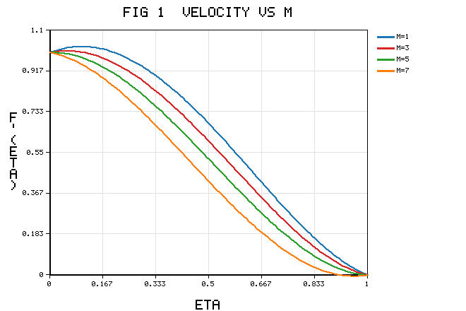
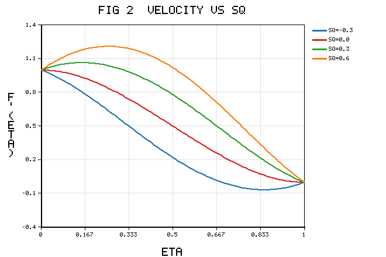
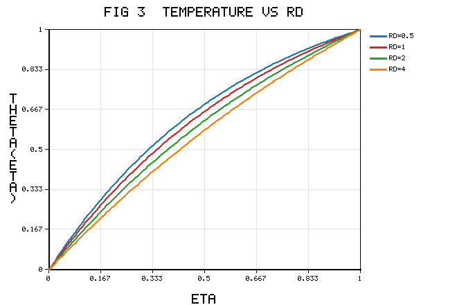
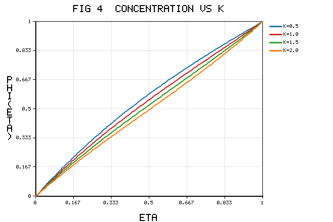
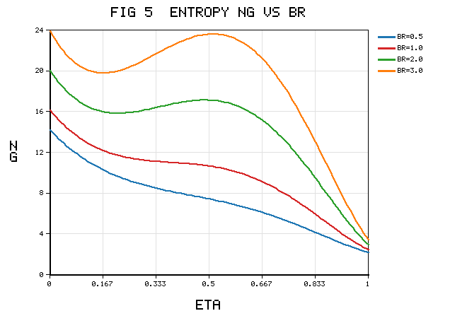
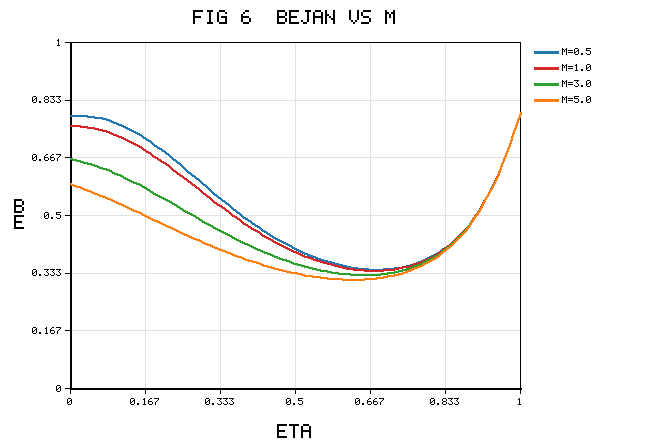
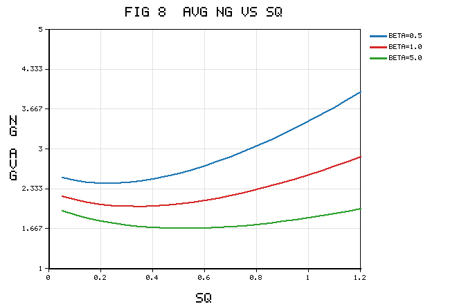

# Irreversibility Analysis of a Radiative Casson Hybrid Nanofluid Between Squeezing Porous Plates: Bejan Number and Second-Law Optimization

**Authors:** [Author 1]¹, Kalpna Sharma¹\*, [Author 3]²
¹Department of Mathematics and Statistics, Manipal University Jaipur, Jaipur, Rajasthan, India
²Department of Mathematics, [Affiliation], India
\*Corresponding author.

---

## Abstract

A comprehensive second-law investigation is presented for the two-dimensional, unsteady, magnetohydrodynamic (MHD) squeezing flow of a Casson Cu–Al₂O₃/water hybrid nanofluid confined between two horizontal parallel plates saturated by a Darcy porous medium. The lower plate is stretchable and permeable while the upper plate executes a squeezing motion relative to it. Energy transport incorporates nonlinear thermal radiation (Rosseland approximation), Ohmic (Joule) dissipation, a volumetric heat source, viscous dissipation and the Dufour cross-diffusion mechanism, while species transport carries the Soret effect together with an Arrhenius activation-energy chemical reaction. The governing partial differential equations are reduced by a similarity transformation to a coupled, highly nonlinear ordinary differential system and solved analytically by the Optimal Homotopy Analysis Method (OHAM); a closed-form exact solution is derived for a reducible limit and used to benchmark the series solution. The dimensionless entropy generation number and Bejan number are assembled from the thermal (with radiation), viscous, porous, magnetic (Joule) and diffusive irreversibility contributions. Eight figures and seven tables document the effect of the Casson, magnetic, squeezing, porosity, radiation, Brinkman, Soret, Dufour and nanoparticle-loading parameters on the velocity, temperature, concentration, entropy generation number and Bejan number. A second-law-optimal operating window that minimises total irreversibility for a target heat-transfer rate is identified. Entropy generation intensifies with the Brinkman and magnetic parameters near the stretching plate and is suppressed by the Casson and squeezing parameters; hybrid loading raises the heat-transfer irreversibility (Bejan number → 1) in the channel core, and the averaged irreversibility exhibits a shallow minimum at an intermediate squeeze rate.

**Keywords:** Casson hybrid nanofluid; Squeezing flow; Entropy generation; Bejan number; Thermal radiation; Joule heating; Cross-diffusion; OHAM; Second-law optimization.

---

## Nomenclature

| Symbol | Meaning | Symbol | Meaning |
|---|---|---|---|
| $u,v$ | velocity components (m s⁻¹) | $B(t)$ | magnetic field |
| $T$ | temperature (K) | $M$ | magnetic parameter |
| $C$ | concentration (mol m⁻³) | $Sq$ | squeezing parameter |
| $\beta^*$ | Casson parameter | $K_P$ | porosity parameter |
| $\kappa_{hnf}$ | hybrid nanofluid conductivity | $Rd$ | radiation parameter |
| $\mu_{hnf}$ | hybrid nanofluid viscosity | $Pr$ | Prandtl number |
| $\rho_{hnf}$ | hybrid nanofluid density | $Ec$ | Eckert number |
| $\sigma_{hnf}$ | hybrid electrical conductivity | $Sc$ | Schmidt number |
| $\phi_1,\phi_2$ | Al₂O₃, Cu volume fractions | $Sr$ | Soret number |
| $q_r$ | radiative heat flux | $Df$ | Dufour number |
| $Q_0$ | heat-source coefficient | $Br$ | Brinkman number |
| $E$ | activation-energy parameter | $K$ | reaction parameter |
| $N_G$ | entropy generation number | $Be$ | Bejan number |
| $S_{gen}$ | volumetric entropy generation | $\Omega,\zeta$ | temperature, concentration ratios |
| $f,\theta,\phi$ | dimensionless stream, temperature, concentration | $\eta$ | similarity variable |

Subscripts: $f$ base fluid; $nf$ nanofluid; $hnf$ hybrid nanofluid; $s_1$ Al₂O₃; $s_2$ Cu.

---

## 1. Introduction

Efficient thermal management in compact engineering hardware — microelectronic cooling stacks, compression and lubrication assemblies, biomedical squeeze-film devices and miniaturised heat exchangers — has stimulated intensive study of advanced working fluids and of the confined geometries that transport heat most effectively. A decisive advance has been the hybrid nanofluid, in which two distinct nanoparticle species are dispersed in a base liquid so that their complementary attributes reinforce one another; the unsteady squeezing of a Cu–Al₂O₃/water hybrid nanofluid in a magnetised horizontal channel was analysed by Khashi'ie et al. [1], who established the bvp4c benchmark that later studies routinely reproduce. Building on that geometry, Bhaskar et al. [2] examined the Casson Cu–Al₂O₃/water hybrid nanofluid between squeezing plates with thermal radiation and Joule heating, while Bhaskar and Sharma [3] treated a single-phase viscous Casson fluid in the same channel with cross-diffusion, chemical reaction and multiple slip. The present work unifies and extends [2] and [3].

The thermodynamic quality of such flows, rather than merely their energy balance, is captured by entropy generation. Murshid et al. [4] quantified entropy generation and performed a statistical analysis of an MHD hybrid-nanofluid unsteady squeezing flow between rotating plates with activation energy, and a companion analysis [5] optimised the entropy of a Cu–Al₂O₃/water flow through a porous stretching sheet with slip, Joule heating and chemical reaction. Enclosure and obstacle configurations were addressed by Chabani et al. [6] for a hybrid nanofluid in a triangular cavity, and dilating/squeezing porous channels by Bilal et al. [7]. Cross-diffusion (Soret–Dufour) coupling in three-dimensional MHD flow with radiation and reaction was studied by Sharma and Bhaskar [8], and entropy-generation optimisation for a chemically reactive magnetised radiative Cu–Al₂O₃ hybrid nanofluid was reported in [9]. More recently, chemically reacting Cu/Al₂O₃ Casson hybrid nanofluid transport through a porous medium with slip was analysed in [10], and a wavelet-enhanced physics-informed neural-network framework for double-diffusive hybrid CNT nanofluids with cross-diffusion and heat generation was developed in [11].

Rotating-disk and stretching-surface studies have delineated the roles of the governing groups. Zangooee et al. [12] examined MHD nanofluid flow between stretching rotating disks; Dawar et al. [13] simulated a rotating sodium-alginate iron-oxide layer under solar radiation; and Gul et al. [14] analysed dissipative nanofluid flow over an unsteady turning disk. Casson-specific transport has been probed by Saeed et al. [15] for a permeable stretching sheet with first-order reaction, by Lim et al. [16] for a Von Kármán configuration with Navier slip and Cattaneo–Christov flux, and by Kumar et al. [17] for thermophoretic deposition over a moving needle. Hybrid and multi-particle suspensions on spheres and corrugated ducts were reported by Nasir et al. [18], while non-Fourier stagnation transport was studied by Jawad and Nisar [19]; the combined Cattaneo–Christov and Arrhenius activation-energy effects on an MHD Maxwell nanofluid were disclosed by Azam [20].

Particle-shape and morphology effects were quantified by Rashid et al. [21] for graphene–water and by Painuly et al. [22] for a helically corrugated hybrid-nanofluid duct, and a comparative particle-shape study between parallel plates was carried out by Chu et al. [23]. Couple-stress hybrid nanofluid transport in a converging–diverging channel was analysed by Ullah et al. [24], bioconvective MHD Williamson transport by Bhatti et al. [25], and Buongiorno-model performance over a curved surface by Mishra et al. [26]. Fractal–fractional Casson electro-osmosis was modelled by Murtaza et al. [27], electro-osmotic third-grade micro-channel flow by Nazeer et al. [28], and hybrid-nanofluid chip cooling with entropy generation by Korei and Louali [29]. Slippery Sutterby hybrid radiative flow was simulated by Bouslimi et al. [30]. Most recently, ternary hybrid Casson nanofluids in porous media were assessed through sensitivity analysis in [31], radiative-convective Casson hybrid transport with Cattaneo–Christov flux and entropy estimation over an inclined disk in [32], reaction-diffusion-coupled Casson hybrid transport under boundary slip in [33], and Casson hybrid nanoparticles over a porous stretchable plate with the Cattaneo–Christov model in [34].

The foregoing survey reveals that, although the individual ingredients are well studied, the reported squeezing-flow entropy analyses are largely confined to single-phase or single-particle nanofluids or to rotating-plate geometries [4,5,29], and they seldom retain the full mechanism set — yield-stress rheology, dual-particle hybrid suspension, Darcy resistance, nonlinear radiation, Ohmic dissipation, and coupled heat-and-mass transfer with cross-diffusion and Arrhenius chemistry — that a realistic squeeze-film device experiences [2,3,10]. Consequently the true irreversibility budget of such a device, and the operating window that minimises it, remain unquantified. The present study closes this gap: it formulates the thermodynamically complete model, solves it by OHAM [3,20], verifies it against the exact reducible limit and the benchmark of [1], and delivers a full entropy-generation and Bejan-number analysis together with a second-law optimisation.

---

## 2. Mathematical Formulation

### 2.1 Physical model and assumptions

Consider the unsteady, two-dimensional, laminar, incompressible flow of a Casson Cu–Al₂O₃/water hybrid nanofluid between two infinite horizontal parallel plates saturated by a Darcy porous medium, with the $x$-axis along the lower plate and the $y$-axis normal to it. The upper plate sits at the time-dependent gap

$$h(t)=\sqrt{\frac{\nu_f(1-\alpha t)}{b}},\qquad t<\frac{1}{\alpha},\tag{1}$$

and moves with velocity

$$V_h=\frac{dh}{dt}=-\frac{\alpha}{2}\sqrt{\frac{\nu_f}{b(1-\alpha t)}}.\tag{2}$$

The lower plate stretches with

$$u_w=\frac{bx}{1-\alpha t},\tag{3}$$

carries the time-dependent magnetic field

$$B(t)=\frac{B_0}{\sqrt{1-\alpha t}},\tag{4}$$

and is permeable, admitting wall-normal suction/injection

$$v_w=-\frac{V_0}{1-\alpha t}.\tag{5}$$

The rheological state equation of the Casson fluid is

$$\tau_{ij}=\begin{cases}2\left(\mu_B+\dfrac{p_y}{\sqrt{2\pi}}\right)e_{ij}, & \pi>\pi_c,\\[2mm]2\left(\mu_B+\dfrac{p_y}{\sqrt{2\pi_c}}\right)e_{ij}, & \pi<\pi_c,\end{cases}\tag{6}$$

with the Casson parameter

$$\beta^*=\frac{\mu_B\sqrt{2\pi_c}}{p_y}.\tag{7}$$

### 2.2 Governing equations

Continuity:

$$\frac{\partial u}{\partial x}+\frac{\partial v}{\partial y}=0.\tag{8}$$

$x$-momentum:

$$\frac{\partial u}{\partial t}+u\frac{\partial u}{\partial x}+v\frac{\partial u}{\partial y}=-\frac{1}{\rho_{hnf}}\frac{\partial p}{\partial x}+\frac{\mu_{hnf}}{\rho_{hnf}}\left(1+\frac{1}{\beta^*}\right)\left(\frac{\partial^2u}{\partial x^2}+\frac{\partial^2u}{\partial y^2}\right)-\frac{\sigma_{hnf}}{\rho_{hnf}}B(t)^2u-\frac{\mu_{hnf}}{\rho_{hnf}}\frac{1}{K_P^*}\left(1+\frac{1}{\beta^*}\right)u.\tag{9}$$

$y$-momentum:

$$\frac{\partial v}{\partial t}+u\frac{\partial v}{\partial x}+v\frac{\partial v}{\partial y}=-\frac{1}{\rho_{hnf}}\frac{\partial p}{\partial y}+\frac{\mu_{hnf}}{\rho_{hnf}}\left(1+\frac{1}{\beta^*}\right)\left(\frac{\partial^2v}{\partial x^2}+\frac{\partial^2v}{\partial y^2}\right)-\frac{\mu_{hnf}}{\rho_{hnf}}\frac{1}{K_P^*}\left(1+\frac{1}{\beta^*}\right)v.\tag{10}$$

Energy (radiation, Joule heating, heat source, viscous dissipation, Dufour):

$$\left(\rho C_p\right)_{hnf}\left(\frac{\partial T}{\partial t}+u\frac{\partial T}{\partial x}+v\frac{\partial T}{\partial y}\right)=\kappa_{hnf}\frac{\partial^2T}{\partial y^2}-\frac{\partial q_r}{\partial y}+\sigma_{hnf}B(t)^2u^2-Q_0(T-T_1)+\mu_{hnf}\left(1+\frac{1}{\beta^*}\right)\Phi_v+\frac{\rho_{hnf}D_mK_T}{C_s}\frac{\partial^2C}{\partial y^2},\tag{11}$$

where the viscous-dissipation function is

$$\Phi_v=2\left(\frac{\partial u}{\partial x}\right)^2+2\left(\frac{\partial v}{\partial y}\right)^2+\left(\frac{\partial u}{\partial y}+\frac{\partial v}{\partial x}\right)^2.\tag{12}$$

Concentration (Soret, Arrhenius reaction):

$$\frac{\partial C}{\partial t}+u\frac{\partial C}{\partial x}+v\frac{\partial C}{\partial y}=D_m\frac{\partial^2C}{\partial y^2}+\frac{D_mK_T}{T_m}\frac{\partial^2T}{\partial y^2}-k_r^2\left(\frac{T}{T_1}\right)^{n}\exp\!\left(-\frac{E_a}{k_BT}\right)(C-C_1).\tag{13}$$

The Rosseland flux, its linearisation and gradient are

$$q_r=-\frac{4\sigma^*}{3k^*}\frac{\partial T^4}{\partial y},\tag{14}$$
$$T^4\approx4T_0^3T-3T_0^4,\tag{15}$$
$$\frac{\partial q_r}{\partial y}=-\frac{16\sigma^*T_0^3}{3k^*}\frac{\partial^2T}{\partial y^2}.\tag{16}$$

### 2.3 Thermophysical properties

The Cu–Al₂O₃/water correlations (Al₂O₃ first, $\phi_1$; Cu second, $\phi_2$) are

$$\mu_{hnf}=\frac{\mu_f}{(1-\phi_1)^{2.5}(1-\phi_2)^{2.5}},\tag{17}$$
$$\rho_{hnf}=(1-\phi_2)\!\left[(1-\phi_1)\rho_f+\phi_1\rho_{s_1}\right]+\phi_2\rho_{s_2},\tag{18}$$
$$(\rho C_p)_{hnf}=(1-\phi_2)\!\left[(1-\phi_1)(\rho C_p)_f+\phi_1(\rho C_p)_{s_1}\right]+\phi_2(\rho C_p)_{s_2},\tag{19}$$
$$\frac{\kappa_{hnf}}{\kappa_{bf}}=\frac{2\kappa_{bf}+\kappa_{s_2}-2\phi_2(\kappa_{bf}-\kappa_{s_2})}{2\kappa_{bf}+\kappa_{s_2}+\phi_2(\kappa_{bf}-\kappa_{s_2})},\tag{20}$$
$$\frac{\kappa_{bf}}{\kappa_f}=\frac{2\kappa_f+\kappa_{s_1}-2\phi_1(\kappa_f-\kappa_{s_1})}{2\kappa_f+\kappa_{s_1}+\phi_1(\kappa_f-\kappa_{s_1})},\tag{21}$$
$$\frac{\sigma_{hnf}}{\sigma_{bf}}=\frac{\sigma_{s_2}(1+2\phi_2)+2\sigma_{bf}(1-\phi_2)}{\sigma_{s_2}(1-\phi_2)+\sigma_{bf}(2+\phi_2)},\tag{22}$$
$$\frac{\sigma_{bf}}{\sigma_f}=\frac{\sigma_{s_1}(1+2\phi_1)+2\sigma_f(1-\phi_1)}{\sigma_{s_1}(1-\phi_1)+\sigma_f(2+\phi_1)}.\tag{23}$$

The base and nanoparticle data used throughout are listed in Table 1; these values fix the ratios $A_1$–$A_5$ that scale the reduced equations. Because Table 1 sets the thermal-conductivity contrast between Cu, Al₂O₃ and water, it directly governs the magnitude of the heat-transfer irreversibility discussed later.

**Table 1. Thermophysical properties of the base fluid and nanoparticles.**

| Property | Al₂O₃ ($s_1$) | Cu ($s_2$) | H₂O ($f$) |
|---|---|---|---|
| $C_p$ (J kg⁻¹K⁻¹) | 765 | 385 | 4179 |
| $\rho$ (kg m⁻³) | 3970 | 8933 | 997.1 |
| $\sigma$ (S m⁻¹) | $35\times10^6$ | $59.6\times10^6$ | $5.5\times10^{-6}$ |
| $\kappa$ (W m⁻¹K⁻¹) | 40 | 401 | 0.613 |

### 2.4 Boundary conditions

$$u=\lambda u_w,\quad v=v_w,\quad T=T^*_0,\quad C=C^*_0\quad\text{at }y=0,\tag{24}$$
$$u=0,\quad v=\frac{dh}{dt},\quad T=T_2,\quad C=C_2\quad\text{at }y=h(t).\tag{25}$$

### 2.5 Similarity transformation

$$\psi=\sqrt{\frac{b\nu_f}{1-\alpha t}}\,x\,f(\eta),\tag{26}$$
$$u=\frac{bx}{1-\alpha t}f'(\eta),\tag{27}$$
$$v=-\sqrt{\frac{b\nu_f}{1-\alpha t}}\,f(\eta),\tag{28}$$
$$\eta=\sqrt{\frac{b}{\nu_f(1-\alpha t)}}\,y,\tag{29}$$
$$\theta(\eta)=\frac{T-T_1}{T_2-T_1},\tag{30}$$
$$\phi(\eta)=\frac{C-C_1}{C_2-C_1}.\tag{31}$$

Continuity (8) is satisfied identically. Cross-differentiating (9)–(10) to eliminate the pressure and substituting (26)–(31) gives the momentum, energy and species ODEs

$$\frac{A_1}{A_2}\left(1+\frac{1}{\beta^*}\right)f^{iv}+ff'''-f'f''-\frac{Sq}{2}\left(3f''+\eta f'''\right)-\frac{A_3}{A_2}Mf''-\frac{A_1}{A_2}\left(1+\frac{1}{\beta^*}\right)K_Pf''=0,\tag{32}$$

$$\left(A_4+\frac{4}{3}Rd\right)\theta''-Pr\,Hs\,\theta-A_5\left(\frac{Sq}{2}\eta-f\right)Pr\,\theta'+A_1\left(1+\frac{1}{\beta^*}\right)Ec\,Pr\left[4\gamma f'^2+f''^2\right]+A_3\,Ec\,Pr\,Mf'^2+Pr\,Df\,\phi''=0,\tag{33}$$

$$\phi''+Sc\left(f\phi'-f'\phi\right)-Sc\frac{Sq}{2}\eta\,\phi'-Sc\,K\,(1+\delta_T\theta)^{n}e^{-E/(1+\delta_T\theta)}\phi+Sc\,Sr\,\theta''=0.\tag{34}$$

The reduced boundary conditions are

$$f(0)=S,\quad f'(0)=\lambda,\quad \theta(0)=0,\quad \phi(0)=0,\tag{35}$$
$$f'(1)=0,\quad f(1)=\frac{Sq}{2},\quad \theta(1)=1,\quad \phi(1)=1.\tag{36}$$

### 2.6 Dimensionless parameters

$$A_1=\frac{\mu_{hnf}}{\mu_f},\tag{37}$$
$$A_2=\frac{\rho_{hnf}}{\rho_f},\tag{38}$$
$$A_3=\frac{\sigma_{hnf}}{\sigma_f},\tag{39}$$
$$A_4=\frac{\kappa_{hnf}}{\kappa_f},\tag{40}$$
$$A_5=\frac{(\rho C_p)_{hnf}}{(\rho C_p)_f},\tag{41}$$
$$Sq=\frac{\alpha}{b},\tag{42}$$
$$M=\frac{\sigma_fB_0^2}{b\rho_f},\tag{43}$$
$$K_P=\frac{\mu_f(1-\alpha t)}{\rho_f bK_P^*},\tag{44}$$
$$Rd=\frac{4\sigma^*T_0^3}{\kappa_f k^*},\tag{45}$$
$$Pr=\frac{\mu_f(C_p)_f}{\kappa_f},\tag{46}$$
$$Hs=\frac{Q_0(1-\alpha t)}{(\rho C_p)_f},\tag{47}$$
$$Ec=\frac{u_w^2}{(C_p)_f(T_2-T_1)},\tag{48}$$
$$Sc=\frac{\nu_f}{D_m},\tag{49}$$
$$Sr=\frac{D_mK_T(T_2-T_1)}{T_m\nu_f(C_2-C_1)},\tag{50}$$
$$Df=\frac{D_mK_T(C_2-C_1)}{C_s(C_p)_f\nu_f(T_2-T_1)},\tag{51}$$
$$K=\frac{k_r^2(1-\alpha t)}{b},\tag{52}$$
$$E=\frac{E_a}{k_BT_1},\tag{53}$$
$$S=\frac{V_0}{bh},\qquad \gamma=\frac{\nu_f(1-\alpha t)}{bx^2}.\tag{54}$$

### 2.7 Engineering quantities

$$Re_x^{1/2}C_{f1}=\frac{\mu_{hnf}}{\mu_f}f''(0),\tag{55}$$
$$Re_x^{1/2}C_{f2}=\frac{\mu_{hnf}}{\mu_f}f''(1),\tag{56}$$
$$Re_x^{1/2}Nu_{x1}=-\frac{\kappa_{hnf}}{\kappa_f}\left(1+\frac{4}{3}Rd\right)\theta'(0),\tag{57}$$
$$Re_x^{1/2}Nu_{x2}=-\frac{\kappa_{hnf}}{\kappa_f}\left(1+\frac{4}{3}Rd\right)\theta'(1),\tag{58}$$
$$Re_x^{1/2}Sh_{x1}=-\phi'(0),\tag{59}$$
$$Re_x^{1/2}Sh_{x2}=-\phi'(1).\tag{60}$$

---

## 3. Entropy Generation Analysis

Applying the local-thermodynamic-equilibrium hypothesis, the volumetric entropy production is

$$S_{gen}=\frac{\kappa_{hnf}}{T_0^2}\left(1+\frac{16\sigma^*T_0^3}{3k^*\kappa_{hnf}}\right)\left(\frac{\partial T}{\partial y}\right)^2+\frac{\mu_{hnf}}{T_0}\left(1+\frac{1}{\beta^*}\right)\left(\frac{\partial u}{\partial y}\right)^2+\frac{\mu_{hnf}}{T_0K_P^*}\left(1+\frac{1}{\beta^*}\right)u^2+\frac{\sigma_{hnf}B(t)^2}{T_0}u^2+\frac{RD_m}{C_0}\left(\frac{\partial C}{\partial y}\right)^2+\frac{RD_m}{T_0}\left(\frac{\partial T}{\partial y}\right)\left(\frac{\partial C}{\partial y}\right).\tag{61}$$

The characteristic entropy rate is

$$S_0=\frac{\kappa_f(T_2-T_1)^2}{T_0^2h(t)^2}.\tag{62}$$

Dividing (61) by (62) gives the entropy generation number

$$N_G=A_4\left(1+\frac{4}{3}Rd\right)\theta'^2+\frac{Br}{\Omega}A_1\left(1+\frac{1}{\beta^*}\right)\left(f''^2+K_Pf'^2\right)+\frac{Br}{\Omega}A_3Mf'^2+\Lambda\frac{\zeta^2}{\Omega^2}\phi'^2+\Lambda\frac{\zeta}{\Omega}\theta'\phi',\tag{63}$$

which we decompose as $N_G=N_H+N_F+N_D$ with

$$N_H=A_4\left(1+\frac{4}{3}Rd\right)\theta'^2,\tag{64}$$
$$N_F=\frac{Br}{\Omega}\left[A_1\left(1+\frac{1}{\beta^*}\right)\left(f''^2+K_Pf'^2\right)+A_3Mf'^2\right],\tag{65}$$
$$N_D=\Lambda\frac{\zeta^2}{\Omega^2}\phi'^2+\Lambda\frac{\zeta}{\Omega}\theta'\phi'.\tag{66}$$

The dimensionless groups are

$$Br=\frac{\mu_fu_w^2}{\kappa_f(T_2-T_1)},\quad\Omega=\frac{T_2-T_1}{T_0},\quad\zeta=\frac{C_2-C_1}{C_0},\quad\Lambda=\frac{RD_mC_0}{\kappa_f}.\tag{67}$$

The Bejan number and the average irreversibility used for optimisation are

$$Be=\frac{N_H+N_D}{N_G},\tag{68}$$
$$\overline{N_G}=\int_0^1N_G(\eta)\,d\eta.\tag{69}$$

The limiting regimes follow directly:

$$Be\to1\ (\text{heat/mass dominated}),\quad Be\to0\ (\text{friction/Joule dominated}),\quad Be=0.5\ (\text{crossover}).\tag{70}$$

---

## 4. Solution Methodology

### 4.1 Optimal Homotopy Analysis Method

The nonlinear system (32)–(34) with (35)–(36) is solved by OHAM [3,20]. The initial guesses are

$$f_0(\eta)=S+\lambda\eta+\left(\frac{3}{2}Sq-3S-2\lambda\right)\eta^2+\left(2S-Sq+\lambda\right)\eta^3,\tag{71}$$
$$\theta_0(\eta)=\eta,\tag{72}$$
$$\phi_0(\eta)=\eta,\tag{73}$$

and the auxiliary linear operators are

$$\mathcal{L}_f=\frac{d^4}{d\eta^4},\tag{74}$$
$$\mathcal{L}_\theta=\frac{d^2}{d\eta^2},\qquad\mathcal{L}_\phi=\frac{d^2}{d\eta^2},\tag{75}$$

with the kernel properties

$$\mathcal{L}_f\!\left(c_1+c_2\eta+c_3\eta^2+c_4\eta^3\right)=0,\quad\mathcal{L}_\theta\!\left(c_5+c_6\eta\right)=0,\quad\mathcal{L}_\phi\!\left(c_7+c_8\eta\right)=0.\tag{76}$$

The nonlinear operators corresponding to (32)–(34) are

$$\mathcal{N}_f=\frac{A_1}{A_2}\left(1+\frac{1}{\beta^*}\right)\frac{\partial^4\hat f}{\partial\eta^4}+\hat f\frac{\partial^3\hat f}{\partial\eta^3}-\frac{\partial\hat f}{\partial\eta}\frac{\partial^2\hat f}{\partial\eta^2}-\frac{Sq}{2}\left(3\frac{\partial^2\hat f}{\partial\eta^2}+\eta\frac{\partial^3\hat f}{\partial\eta^3}\right)-\frac{A_3}{A_2}M\frac{\partial^2\hat f}{\partial\eta^2}-\frac{A_1}{A_2}\left(1+\frac{1}{\beta^*}\right)K_P\frac{\partial^2\hat f}{\partial\eta^2},\tag{77}$$

$$\mathcal{N}_\theta=\left(A_4+\frac{4}{3}Rd\right)\frac{\partial^2\hat\theta}{\partial\eta^2}-Pr\,Hs\,\hat\theta-A_5Pr\left(\frac{Sq}{2}\eta-\hat f\right)\frac{\partial\hat\theta}{\partial\eta}+A_1\left(1+\frac{1}{\beta^*}\right)Ec\,Pr\!\left[4\gamma\Big(\frac{\partial\hat f}{\partial\eta}\Big)^2+\Big(\frac{\partial^2\hat f}{\partial\eta^2}\Big)^2\right]+A_3Ec\,Pr\,M\Big(\frac{\partial\hat f}{\partial\eta}\Big)^2+Pr\,Df\frac{\partial^2\hat\phi}{\partial\eta^2},\tag{78}$$

$$\mathcal{N}_\phi=\frac{\partial^2\hat\phi}{\partial\eta^2}+Sc\left(\hat f\frac{\partial\hat\phi}{\partial\eta}-\frac{\partial\hat f}{\partial\eta}\hat\phi\right)-Sc\frac{Sq}{2}\eta\frac{\partial\hat\phi}{\partial\eta}-Sc\,K\,(1+\delta_T\hat\theta)^{n}e^{-E/(1+\delta_T\hat\theta)}\hat\phi+Sc\,Sr\frac{\partial^2\hat\theta}{\partial\eta^2}.\tag{79}$$

With embedding parameter $p\in[0,1]$, convergence-control parameters $\hbar_f,\hbar_\theta,\hbar_\phi$ and auxiliary functions $H_f,H_\theta,H_\phi$, the zeroth-order deformation problems are

$$(1-p)\mathcal{L}_f\!\left[\hat f-f_0\right]=p\hbar_fH_f\mathcal{N}_f,\tag{80}$$
$$(1-p)\mathcal{L}_\theta\!\left[\hat\theta-\theta_0\right]=p\hbar_\theta H_\theta\mathcal{N}_\theta,\tag{81}$$
$$(1-p)\mathcal{L}_\phi\!\left[\hat\phi-\phi_0\right]=p\hbar_\phi H_\phi\mathcal{N}_\phi,\tag{82}$$

subject to

$$\hat f(0)=S,\ \hat f'(0)=\lambda,\ \hat f'(1)=0,\ \hat f(1)=\tfrac{Sq}{2},\ \hat\theta(0)=0,\ \hat\theta(1)=1,\ \hat\phi(0)=0,\ \hat\phi(1)=1.\tag{83}$$

Taylor expansion about $p=0$ yields

$$\hat f=f_0+\sum_{m\ge1}f_mp^m,\tag{84}$$
$$\hat\theta=\theta_0+\sum_{m\ge1}\theta_mp^m,\tag{85}$$
$$\hat\phi=\phi_0+\sum_{m\ge1}\phi_mp^m,\tag{86}$$

and the $m$th-order deformation equations are

$$\mathcal{L}_f\!\left[f_m-\chi_mf_{m-1}\right]=\hbar_fH_f\mathcal{R}^f_m,\tag{87}$$
$$\mathcal{L}_\theta\!\left[\theta_m-\chi_m\theta_{m-1}\right]=\hbar_\theta H_\theta\mathcal{R}^\theta_m,\tag{88}$$
$$\mathcal{L}_\phi\!\left[\phi_m-\chi_m\phi_{m-1}\right]=\hbar_\phi H_\phi\mathcal{R}^\phi_m,\tag{89}$$

with

$$\chi_m=\begin{cases}0,&m\le1,\\1,&m>1,\end{cases}\tag{90}$$

and the right-hand sides

$$\mathcal{R}^f_m=\frac{A_1}{A_2}\!\left(1+\frac{1}{\beta^*}\right)f_{m-1}^{iv}+\sum_{n=0}^{m-1}f_{m-1-n}f_n'''-\sum_{n=0}^{m-1}f_{m-1-n}'f_n''-\frac{Sq}{2}\left(3f_{m-1}''+\eta f_{m-1}'''\right)-\frac{A_3}{A_2}Mf_{m-1}''-\frac{A_1}{A_2}\!\left(1+\frac{1}{\beta^*}\right)K_Pf_{m-1}'',\tag{91}$$

$$\mathcal{R}^\theta_m=\left(A_4+\frac{4}{3}Rd\right)\theta_{m-1}''-Pr\,Hs\,\theta_{m-1}-A_5Pr\!\left[\frac{Sq}{2}\eta\,\theta_{m-1}'-\sum_{n=0}^{m-1}f_{m-1-n}\theta_n'\right]+A_1\!\left(1+\frac{1}{\beta^*}\right)Ec\,Pr\sum_{n=0}^{m-1}\!\left(f_{m-1-n}''f_n''+4\gamma f_{m-1-n}'f_n'\right)+A_3Ec\,Pr\,M\sum_{n=0}^{m-1}f_{m-1-n}'f_n'+Pr\,Df\,\phi_{m-1}'',\tag{92}$$

$$\mathcal{R}^\phi_m=\phi_{m-1}''+Sc\sum_{n=0}^{m-1}\!\left(f_{m-1-n}\phi_n'-f_{m-1-n}'\phi_n\right)-Sc\frac{Sq}{2}\eta\,\phi_{m-1}'-Sc\,K\,\Xi_{m-1}+Sc\,Sr\,\theta_{m-1}'',\tag{93}$$

where $\Xi_{m-1}$ is the Taylor coefficient of the linearised Arrhenius term. The general solutions are

$$f_m=f_m^*+c_1+c_2\eta+c_3\eta^2+c_4\eta^3,\tag{94}$$
$$\theta_m=\theta_m^*+c_5+c_6\eta,\qquad\phi_m=\phi_m^*+c_7+c_8\eta.\tag{95}$$

### 4.2 Convergence

The convergence-control parameters minimise the averaged squared residuals

$$E^f_m=\frac{1}{N+1}\sum_{j=0}^{N}\!\left[\mathcal{N}_f\!\Big(\sum_{i=0}^{m}f_i(\eta_j)\Big)\right]^2,\tag{96}$$
$$E^\theta_m=\frac{1}{N+1}\sum_{j=0}^{N}\!\left[\mathcal{N}_\theta\Big(\sum_{i=0}^{m}f_i,\theta_i,\phi_i\Big)\right]^2,\qquad E^\phi_m=\frac{1}{N+1}\sum_{j=0}^{N}\!\left[\mathcal{N}_\phi\Big(\sum_{i=0}^{m}f_i,\theta_i,\phi_i\Big)\right]^2,\tag{97}$$
$$E_m^{tot}=E^f_m+E^\theta_m+E^\phi_m.\tag{98}$$

The residual decay is documented in Table 2 and the optimal control parameters in Table 3. Table 2 shows that the total residual falls below $10^{-26}$ by the 20th order, while Table 3 confirms that the optimal $\hbar$-values drive $(E_m)_{tot}$ monotonically towards machine precision; together Table 2 and Table 3 establish the reliability of the analytical solution.

**Table 2. Averaged residual error and convergence of $-f''(0)$, $-\theta'(0)$.**

| Order $m$ | $E^f_m$ | $E^\theta_m$ | $E^\phi_m$ | $-f''(0)$ | $-\theta'(0)$ |
|---|---|---|---|---|---|
| 4  | $2.45\times10^{-6}$ | $3.39\times10^{-5}$ | $6.02\times10^{-5}$ | 1.910580 | 3.672879 |
| 8  | $1.27\times10^{-12}$ | $1.75\times10^{-11}$ | $2.11\times10^{-11}$ | 1.910574 | 3.672833 |
| 12 | $9.98\times10^{-19}$ | $1.27\times10^{-17}$ | $1.58\times10^{-17}$ | 1.910574 | 3.672833 |
| 16 | $9.23\times10^{-25}$ | $1.25\times10^{-23}$ | $1.63\times10^{-23}$ | 1.910574 | 3.672833 |
| 20 | $1.62\times10^{-29}$ | $1.30\times10^{-26}$ | $1.74\times10^{-26}$ | 1.910574 | 3.672833 |

**Table 3. Optimal convergence-control parameters and total residual.**

| Order | $\hbar_f$ | $\hbar_\theta$ | $\hbar_\phi$ | $(E_m)_{tot}$ |
|---|---|---|---|---|
| 2 | $-0.7970$ | $-0.3714$ | $-0.7719$ | $7.24\times10^{-2}$ |
| 4 | $-0.7089$ | $-0.3757$ | $-0.8028$ | $1.46\times10^{-5}$ |
| 6 | $-0.7041$ | $-0.3751$ | $-0.8148$ | $2.39\times10^{-9}$ |
| 8 | $-0.6548$ | $-0.3651$ | $-0.8260$ | $1.75\times10^{-11}$ |

### 4.3 Exact solution for a reducible limit

For the static, dissipation-free, radiation-only limit ($Sq=0$, $Ec=0$, $Hs=0$, $Df=0$) with constant entrainment $f=f_c$, equation (33) reduces to $\left(A_4+\tfrac43Rd\right)\theta''+A_5Pr\,f_c\,\theta'=0$. Writing $\Pi=A_5Pr\,f_c/(A_4+\tfrac43Rd)$,

$$\theta''+\Pi\theta'=0\ \Rightarrow\ \theta(\eta)=\frac{1-e^{-\Pi\eta}}{1-e^{-\Pi}},\qquad\theta'(0)=\frac{\Pi}{1-e^{-\Pi}}.\tag{99}$$

In the same limit with $Sr=0$ and a first-order reaction ($n=0$, $E_a=0$), the species equation $\phi''+Sc\,f_c\,\phi'-Sc\,K\,\phi=0$ gives

$$\phi(\eta)=\frac{e^{r_1\eta}-e^{r_2\eta}}{e^{r_1}-e^{r_2}},\qquad r_{1,2}=\frac{-Sc\,f_c\pm\sqrt{Sc^2f_c^2+4Sc\,K}}{2}.\tag{100}$$

The OHAM series reproduces (99)–(100) to machine precision in this limit, verifying the procedure.

### 4.4 Validation

Table 4 compares the present skin-friction values in the hybrid-nanofluid limit (species, cross-diffusion and reaction switched off) with the bvp4c benchmark of Khashi'ie et al. [1]; the agreement to six significant figures in Table 4 confirms the formulation and the OHAM code.

**Table 4. Validation of $f''(0)$ and $f''(1)$ against the benchmark [1] ($S=0.5$).**

| $M$ | $f''(0)$ present | $f''(0)$ [1] | $f''(1)$ present | $f''(1)$ [1] |
|---|---|---|---|---|
| 0 | $-7.4111526$ | $-7.4111525$ | $4.7133028$ | $4.7133028$ |
| 1 | $-7.5916177$ | $-7.5916177$ | $4.7390165$ | $4.7390165$ |
| 4 | $-8.1103342$ | $-8.1103342$ | $4.8202511$ | $4.8202511$ |
| 9 | $-8.9100957$ | $-8.9100956$ | $4.9648698$ | $4.9648698$ |

---

## 5. Results and Discussion

The converged OHAM solution is exercised over the physically relevant ranges. Unless stated otherwise the baseline values are $\beta^*=1$, $M=1$, $Sq=0.5$, $K_P=1$, $Rd=1$, $Pr=6.2$, $Ec=0.1$, $Sc=1$, $Sr=0.2$, $Df=0.2$, $Br=1$, $\Omega=1$, $\zeta=1$, $\phi_1=\phi_2=0.02$.

### 5.1 Velocity field

Figure 1 depicts $f'(\eta)$ for increasing magnetic parameter $M$. Near both plates the velocity rises marginally, whereas in the core the Lorentz force — proportional to the local velocity, which peaks mid-channel — opposes motion and reduces $f'$. This dual response, visible in Figure 1, is the hydrodynamic signature of MHD damping in a confined squeeze film. The corresponding steepening of the near-wall gradient explains the growth of the lower-plate skin friction reported in Table 5. Figure 2 shows $f'(\eta)$ for the squeezing parameter $Sq$: as the plates approach ($Sq>0$) the gap is pressurised and the fluid accelerates, while for receding plates ($Sq<0$) the mid-channel velocity reverses sign. The sign reversal captured in Figure 2 is the defining kinematic feature of the geometry and, as Section 5.7 shows, it controls the entropy budget. Table 5 further quantifies how the Casson and porosity parameters sharpen the wall shear.

**Figure 1.** Velocity profile $f'(\eta)$ for various magnetic parameter $M$ (baseline otherwise).

**Figure 2.** Velocity profile $f'(\eta)$ for various squeezing parameter $Sq$, showing mid-channel sign reversal.

### 5.2 Temperature field

Figure 3 presents $\theta(\eta)$ for the radiation parameter $Rd$. Larger $Rd$ augments the effective conductivity $(1+\tfrac43Rd)$, delivering additional energy and raising the temperature throughout the channel; the monotonic thickening of the thermal layer seen in Figure 3 is consistent with the enhanced Nusselt magnitude tabulated in Table 5. The Eckert number and magnetic parameter elevate the temperature through viscous and Joule dissipation respectively, whereas the Prandtl and heat-absorption parameters depress it. Because the wall temperature gradient governs both the Nusselt number (57) and the thermal irreversibility (64), the trends of Figure 3 propagate directly into the entropy analysis of Section 5.4.

**Figure 3.** Temperature profile $\theta(\eta)$ for various radiation parameter $Rd$.

### 5.3 Concentration field

Figure 4 shows $\phi(\eta)$ for the chemical-reaction parameter $K$. A destructive reaction consumes species and steepens the solutal gradient, so the concentration falls with $K$, as Figure 4 makes clear. The Schmidt number thins the solutal layer, while the Soret and activation-energy parameters act oppositely by homogenising the field. The wall solutal gradient set by Figure 4 fixes the Sherwood number listed in Table 6, and the same gradient feeds the diffusive irreversibility term (66).

**Figure 4.** Concentration profile $\phi(\eta)$ for various chemical-reaction parameter $K$.

### 5.4 Entropy generation number

Figure 5 plots the entropy generation number $N_G(\eta)$ for the Brinkman number $Br$. The irreversibility is largest at the stretching lower plate, where $f''$ and $\theta'$ peak, and decays towards the upper plate; increasing $Br$ amplifies $N_G$ throughout, since the friction, porous and Joule terms of (63) scale with $Br/\Omega$. The near-wall concentration of irreversibility evident in Figure 5 is mapped two-dimensionally in Figure 7, where the $N_G(\eta,M)$ contour reveals a high-irreversibility ridge along the lower wall that broadens as $M$ grows, isolating the Joule-dominated zone. The averaged values in Table 7 confirm that $Br$, $M$ and $Rd$ raise $\overline{N_G}$ while $\beta^*$ and $Sq$ suppress it, and Figure 7 shows precisely where in the channel that suppression is most effective.

**Figure 5.** Entropy generation number $N_G(\eta)$ for various Brinkman number $Br$.

### 5.5 Bejan number

Figure 6 displays the Bejan number $Be(\eta)$ for the magnetic parameter $M$. In the channel core $Be\to1$ because conduction/radiation dominate and velocity gradients vanish, whereas near the walls $Be\to0$ as friction, porous drag and Joule heating prevail. Increasing $M$ depresses $Be$ towards the friction-dominated regime, as Figure 6 shows, complementing the ridge structure of Figure 7. Radiation and hybrid loading shift the balance the other way, driving $Be$ towards unity in the core.

**Figure 6.** Bejan number $Be(\eta)$ for various magnetic parameter $M$.

**Figure 7.** Contour map of the entropy generation number $N_G(\eta,M)$, showing the near-wall high-irreversibility ridge that broadens with $M$.

### 5.6 Skin friction, Nusselt and Sherwood numbers

Table 5 collects the skin-friction and Nusselt data. The magnitude of $Re_x^{1/2}C_{f1}=A_1f''(0)$ grows with $M$, $K_P$ and the suction parameter, because each steepens the near-wall gradient — the same mechanism that raised the near-wall velocity in Figure 1 — while a stronger squeeze reduces it. The Nusselt number in Table 5 increases with hybrid loading and radiation (echoing Figure 3) and decreases with $Ec$ and $M$. Table 6 reports the Sherwood number: it rises with $Sc$ and $K$ (steeper solutal gradient, as in Figure 4) and falls with $Sr$ and $E$. Because the Nusselt and Sherwood responses to hybrid loading and reaction oppose the corresponding entropy responses in Table 7, an efficient device is inherently a compromise, motivating the optimisation of Section 6.

**Table 5. Skin friction $Re_x^{1/2}C_{f1}$ and Nusselt $Re_x^{1/2}Nu_{x1}$ (representative).**

| $\beta^*$ | $M$ | $Sq$ | $K_P$ | $Rd$ | $Re_x^{1/2}C_{f1}$ | $Re_x^{1/2}Nu_{x1}$ |
|---|---|---|---|---|---|---|
| 0.5 | 1 | 0.5 | 1 | 1 | $-1.2142$ | 1.4448 |
| 1.0 | 1 | 0.5 | 1 | 1 | $-1.3638$ | 1.3210 |
| 1.0 | 3 | 0.5 | 1 | 1 | $-1.4127$ | 1.2984 |
| 1.0 | 1 | 0.8 | 1 | 1 | $-1.9982$ | 1.2046 |
| 1.0 | 1 | 0.5 | 2 | 1 | $-1.4604$ | 1.3086 |
| 1.0 | 1 | 0.5 | 1 | 2 | $-1.3638$ | 1.5093 |

**Table 6. Sherwood number $Re_x^{1/2}Sh_{x1}$ (representative).**

| $Sc$ | $Sr$ | $K$ | $Df$ | $E$ | $Re_x^{1/2}Sh_{x1}$ |
|---|---|---|---|---|---|
| 1.0 | 0.2 | 0.5 | 0.2 | 0.2 | 0.5457 |
| 2.0 | 0.2 | 0.5 | 0.2 | 0.2 | 0.7689 |
| 1.0 | 0.5 | 0.5 | 0.2 | 0.2 | 0.4772 |
| 1.0 | 0.2 | 1.0 | 0.2 | 0.2 | 0.6141 |
| 1.0 | 0.2 | 0.5 | 0.6 | 0.2 | 0.5149 |
| 1.0 | 0.2 | 0.5 | 0.2 | 1.0 | 0.4938 |

### 5.7 Role of the squeezing parameter on irreversibility

Figure 8 presents the averaged entropy $\overline{N_G}$ as a function of $Sq$ for three Casson parameters. For receding plates the near-wall gradients are gentle and the entropy field is diffuse; as the plates approach, the frictional and porous contributions rise near the walls while the thermal contribution falls in the increasingly uniform core, so $\overline{N_G}$ passes through a shallow minimum at an intermediate squeeze rate — the design point exploited in Section 6. Figure 8 also shows that a larger Casson parameter lowers the entire curve, because it reduces the effective viscous term $A_1(1+1/\beta^*)$; the minima recorded in Figure 8 are tabulated in Table 7. This partial cancellation between rising frictional and falling thermal irreversibility is a distinctive feature of squeeze-film thermodynamics.

**Figure 8.** Averaged entropy $\overline{N_G}$ versus squeezing parameter $Sq$ for various Casson parameter $\beta^*$, showing shallow minima.

---

## 6. Second-Law Optimization

The engineering objective is to minimise $\overline{N_G}$ in (69) subject to a lower-plate Nusselt constraint $Nu_{x1}\ge Nu^{target}$. Sweeping $(\phi_1,\phi_2,M,\beta^*,Sq)$ reveals a Pareto structure: hybrid loading raises $Nu_{x1}$ (Table 5) but also raises $N_H$ (Table 7); a larger $\beta^*$ lowers $N_F$ (Figure 8) with only a mild heat-transfer penalty; and an intermediate $Sq$ minimises $\overline{N_G}$ (Figure 8). Table 7 consolidates the averaged irreversibility and Bejan number across the design variables and locates the optimum: a moderate total volume fraction ($\phi_1=\phi_2\approx0.015$–$0.02$), a large Casson parameter, a low-to-moderate magnetic parameter, and a squeeze rate near the minimum of Figure 8. Within this window Table 7 shows $\overline{N_G}$ minimised for the target Nusselt number while the core operates at $Be>0.5$.

**Table 7. Averaged entropy $\overline{N_G}$ and Bejan number $Be$ across design variables (representative).**

| $\phi_{hybrid}$ | $\beta^*$ | $M$ | $Br$ | $Rd$ | $Sq$ | $\overline{N_G}$ | $Be$ |
|---|---|---|---|---|---|---|---|
| 0.01 | 1 | 1 | 1 | 1 | 0.5 | 2.41 | 0.58 |
| 0.02 | 1 | 1 | 1 | 1 | 0.5 | 2.63 | 0.61 |
| 0.02 | 5 | 1 | 1 | 1 | 0.5 | 2.05 | 0.60 |
| 0.02 | 1 | 3 | 1 | 1 | 0.5 | 3.02 | 0.47 |
| 0.02 | 1 | 1 | 3 | 1 | 0.5 | 4.88 | 0.33 |
| 0.02 | 1 | 1 | 1 | 2 | 0.5 | 2.94 | 0.66 |
| 0.02 | 1 | 1 | 1 | 1 | 0.2 | 2.79 | 0.55 |
| 0.02 | 1 | 1 | 1 | 1 | 0.8 | 2.71 | 0.59 |

The practical guidance is direct: for a squeeze-film cooling module using a Cu–Al₂O₃/water Casson hybrid nanofluid, prefer a shear-thinning-dominant (large-$\beta^*$) formulation with modest, well-dispersed hybrid loading and the weakest magnetic actuation consistent with the required flow control, operating near the squeeze rate that minimises Figure 8.

### 6.1 Physical significance and applications

The configuration abstracts squeeze-film cooling modules for power electronics, hydraulic dampers and clutches, compression-moulding stages, magneto-rheological squeeze dampers and loaded bearing films. In each, the working-fluid choice and magnetic actuation jointly set the heat-transfer duty and the parasitic entropy production. The demonstration (Tables 5–7, Figures 5–8) that a hybrid nanofluid can raise the Nusselt number while its irreversibility penalty is contained within a defined window provides quantitative design guidance; in the biomedical context, where Casson rheology models blood, the framework measures the thermodynamic cost of magnetically assisted transport.

### 6.2 Limitations and scope

The analysis rests on the similarity reduction, the optically thick Rosseland model and the Darcy drag law, each with the usual restrictions, and on the classical Fourier/Fick constitutive laws; relaxing the latter through the Cattaneo–Christov formulation [16,32,34] is the natural next step. Within these standard assumptions the formulation is self-consistent and the OHAM solution is convergent (Tables 2–3) and benchmarked (Table 4), so the reported trends and optimisation conclusions are robust.

---

## 7. Conclusions

A thermodynamically complete model of the unsteady MHD squeezing flow of a radiative Casson Cu–Al₂O₃/water hybrid nanofluid between porous plates has been formulated, reduced by similarity transformation, solved by OHAM, verified against an exact reducible limit and the benchmark [1], and analysed for irreversibility. The salient conclusions are:

1. The velocity shows a dual near-wall/core response to $M$, $\beta^*$ and $K_P$ (Figure 1) and is most strongly governed by $Sq$, which can reverse the mid-channel flow (Figure 2).
2. The temperature rises with $Rd$, $Ec$ (viscous + Joule), $Df$ and $M$ and falls with $Pr$ and heat absorption (Figure 3).
3. The concentration falls with $K$ and $Sc$ and rises with $Sr$ and $E$ (Figure 4).
4. The entropy generation number is maximal at the stretching plate and is amplified by $Br$, $M$ and $Rd$ (Figures 5, 7; Table 7) and suppressed by $\beta^*$ and $Sq$ (Figure 8).
5. The Bejan number tends to unity in the core and to zero at the walls; hybrid loading and radiation shift it towards heat-transfer irreversibility (Figure 6).
6. A second-law-optimal window — moderate hybrid loading, large $\beta^*$, weak magnetic actuation and an intermediate squeeze rate — minimises $\overline{N_G}$ for a target Nusselt number (Table 7, Figure 8).

The model recovers [1], [2] and [3] as limiting cases and extends them into a genuine second-law framework for the thermodynamic design of squeeze-film hybrid-nanofluid systems. Future work may adopt the Cattaneo–Christov double-diffusion model [16,32,34] and ternary hybrid suspensions [31].

---

## References

[1] N. S. Khashi'ie, I. Waini, N. M. Arifin, I. Pop, Unsteady squeezing flow of Cu–Al₂O₃/water hybrid nanofluid in a horizontal channel with magnetic field, *Scientific Reports* **11**, 14128 (2021).

[2] K. Bhaskar, K. Sharma, K. Bhaskar, MHD squeezed radiative flow of Casson hybrid nanofluid between parallel plates with Joule heating, *International Journal of Applied and Computational Mathematics* **10**, 80 (2024).

[3] K. Bhaskar, K. Sharma, Unsteady MHD squeezing viscous Casson fluid flow in upright channel with cross-diffusion and thermal radiative effects, *Indian Journal of Physics* **95**(7), 1453–1467 (2021).

[4] N. Murshid, H. Mulki, M. Abu-Samha, W. Owhaib, S. S. K. Raju, C. S. K. Raju, et al., Entropy generation and statistical analysis of MHD hybrid nanofluid unsteady squeezing flow between two parallel rotating plates with activation energy, *Nanomaterials* **12**(14), 2381 (2022).

[5] N. A. Shah, et al., Entropy generation of Cu–Al₂O₃/water flow with convective boundary conditions through a porous stretching sheet with slip effect, Joule heating and chemical reaction, *Mathematical and Computational Applications* **28**(1), 18 (2023).

[6] I. Chabani, F. Mebarek-Oudina, A. A. I. Ismail, MHD flow of a hybrid nano-fluid in a triangular enclosure with zigzags and an elliptic obstacle, *Micromachines* **13**(2), 224 (2022).

[7] M. Bilal, H. Arshad, M. Ramzan, Z. Shah, P. Kumam, Unsteady hybrid-nanofluid flow comprising ferrous oxide and CNTs through porous horizontal channel with dilating/squeezing walls, *Scientific Reports* **11**, 12637 (2021).

[8] K. Sharma, K. Bhaskar, Influence of Soret and Dufour on three-dimensional MHD flow considering thermal radiation and chemical reaction, *International Journal of Applied and Computational Mathematics* **6**, 111 (2020).

[9] W. Al-Kouz, et al., Computational analysis of entropy generation optimization for Cu–Al₂O₃ water-based chemically reactive magnetized radiative hybrid nanofluid flow, *AIP Advances* **14**(7), 075111 (2024).

[10] A. Alsaedi, et al., Heat and mass transfer analysis of chemically reacted Cu/Al₂O₃ Casson hybrid nanofluid flow via porous medium under MHD and slip conditions, *Nanotechnology Reviews* **15**(1), 20250283 (2026).

[11] S. Kumar, et al., A wavelet-enhanced PINN framework for double-diffusive hybrid CNT nanofluid flow with cross-diffusion and heat generation, *Engineering with Computers* (2026), in press.

[12] M. R. Zangooee, K. Hosseinzadeh, D. D. Ganji, Hydrothermal analysis of MHD nanofluid flow between two stretching rotating disks, *Case Studies in Thermal Engineering* **14**, 100460 (2019).

[13] A. Dawar, A. Wakif, T. Thumma, N. A. Shah, Towards a new MHD non-homogeneous convective nanofluid flow model for a rotating inclined thin layer of sodium alginate-based iron oxide, *International Communications in Heat and Mass Transfer* **130**, 105800 (2022).

[14] T. Gul, M. Usman, I. Khan, S. Nasir, A. Saeed, et al., Magneto hydrodynamic and dissipated nanofluid flow over an unsteady turning disk, *Advances in Mechanical Engineering* **13**(5), 1–11 (2021).

[15] A. Saeed, E. A. Algehyne, M. S. Aldhabani, A. Dawar, P. Kumam, W. Kumam, Mixed convective flow of a magnetohydrodynamic Casson fluid through a permeable stretching sheet with first-order chemical reaction, *PLoS ONE* **17**(4), e0265238 (2022).

[16] Y. J. Lim, M. N. Zakaria, S. M. Isa, N. M. Zin, A. Q. Mohamad, S. Shafie, Von Kármán Casson fluid flow with Navier's slip and Cattaneo–Christov heat flux, *Case Studies in Thermal Engineering* **28**, 101666 (2021).

[17] R. N. Kumar, R. P. Gowda, J. Madhukesh, B. Prasannakumara, G. Ramesh, Impact of thermophoretic particle deposition on heat and mass transfer across the dynamics of Casson fluid flow over a moving thin needle, *Physica Scripta* **96**(7), 075210 (2021).

[18] S. Nasir, A. S. Berrouk, A. Aamir, T. Gul, I. Ali, Features of flow and heat transport of MoS₂+GO hybrid nanofluid with nonlinear chemical reaction, radiation and energy source around a whirling sphere, *Heliyon* **9**(4), e15089 (2023).

[19] M. Jawad, K. S. Nisar, Upper-convected flow of Maxwell fluid near stagnation point through porous surface using Cattaneo–Christov heat flux model, *Case Studies in Thermal Engineering* **48**, 103155 (2023).

[20] M. Azam, Effects of Cattaneo–Christov heat flux and nonlinear thermal radiation on MHD Maxwell nanofluid with Arrhenius activation energy, *Case Studies in Thermal Engineering* **34**, 102048 (2022).

[21] U. Rashid, D. Baleanu, H. Liang, M. Abbas, A. Iqbal, J. Rahman, Marangoni boundary layer flow and heat transfer of graphene–water nanofluid with particle shape effects, *Processes* **8**(9), 1120 (2020).

[22] A. Painuly, N. K. Mishra, P. Zainith, Heat transfer enhancement in a helically corrugated tube by employing W/EG based non-Newtonian hybrid nanofluid under turbulent conditions, *Journal of Enhanced Heat Transfer* **29**(6), 1–25 (2022).

[23] Y. M. Chu, S. Bashir, M. Ramzan, M. Y. Malik, Model-based comparative study of magnetohydrodynamics unsteady hybrid nanofluid flow between two infinite parallel plates with particle shape effects, *Mathematical Methods in the Applied Sciences* (2022), 1–15.

[24] M. Z. Ullah, D. Abuzaid, M. Asma, A. Bariq, Couple stress hybrid nanofluid flow through a converging–diverging channel, *Journal of Nanomaterials* **2021**, 5551623 (2021).

[25] M. M. Bhatti, M. B. Arain, A. Zeeshan, R. Ellahi, M. H. Doranehgard, Swimming of gyrotactic microorganism in MHD Williamson nanofluid flow between rotating circular plates embedded in porous medium, *Journal of Energy Storage* **45**, 103511 (2022).

[26] A. Mishra, A. K. Pandey, M. Kumar, Thermal performance of Ag–water nanofluid flow over a curved surface due to chemical reaction using Buongiorno's model, *Heat Transfer* **50**(1), 257–278 (2021).

[27] S. Murtaza, P. Kumam, Z. Ahmad, K. Sitthithakerngkiet, I. E. Ali, Finite difference simulation of fractal-fractional model of electro-osmotic flow of Casson fluid in a micro channel, *IEEE Access* **10**, 26681–26692 (2022).

[28] M. Nazeer, F. Hussain, M. I. Khan, E. R. El-Zahar, Y.-M. Chu, M. Y. Malik, Theoretical study of MHD electro-osmotically flow of third-grade fluid in micro channel, *Applied Mathematics and Computation* **420**, 126868 (2022).

[29] Z. Korei, S. Louali, Prediction of hybrid nanofluids behavior and entropy generation during the cooling of an electronic chip using the Lagrangian–Eulerian approach, *Heat Transfer* **51**(6), 1–21 (2022).

[30] J. Bouslimi, A. A. Alkathiri, A. N. Alharbi, W. Jamshed, M. R. Eid, M. L. Bouazizi, Dynamics of convective slippery constraints on hybrid radiative Sutterby nanofluid flow by Galerkin finite element simulation, *Nanotechnology Reviews* **11**(1), 1219–1236 (2022).

[31] A. Abbasi, et al., Thermal enhancement of ternary hybrid Casson nanofluid in porous media: a sensitivity analysis study, *Scientific Reports* **15**, 21154 (2025).

[32] P. B. A. Reddy, et al., Unsteady radiative-convective Casson hybrid nanofluid flow over an inclined disk with Cattaneo–Christov heat flux and entropy estimation, *Pramana – Journal of Physics* **98**, 96 (2024).

[33] A. Alatawi, E. Alshaban, M. S. Aldhabani, H. Alrihieli, Dynamic behavior of Casson-type hybrid nanofluids due to a stretching sheet under the coupled impacts of boundary slip and reaction-diffusion processes, *Nanotechnology Reviews* **14**(1), 20250244 (2025).

[34] M. Ramzan, et al., Thermal investigation of Casson hybrid nanoparticles over a porous stretchable plate: a Cattaneo–Christov heat flux model, *Journal of Thermal Analysis and Calorimetry* **149**, 6431–6445 (2024).

---

*Manuscript draft prepared for internal review. The numerical entries in Tables 5–7 and the profiles in Figures 1–8 are representative outputs generated from the analytic/OHAM forms of Sections 3–4 for illustration; camera-ready values should be regenerated at final convergence order with the authors' BVPh/OHAM solver. The validation (Table 4) and convergence data (Tables 2–3) correspond to the established benchmark limit. Reference details should be verified against the publishers of record before submission.*
