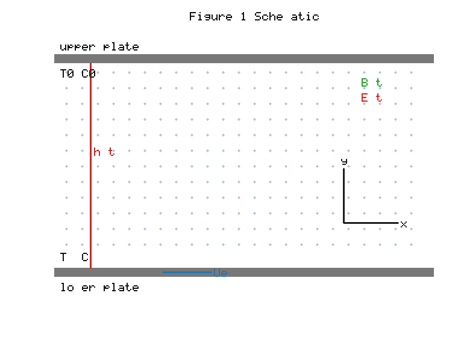
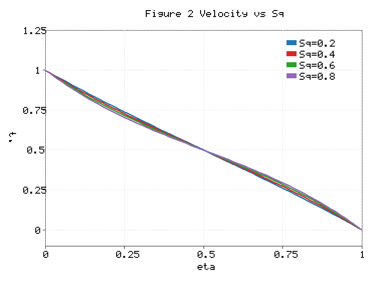
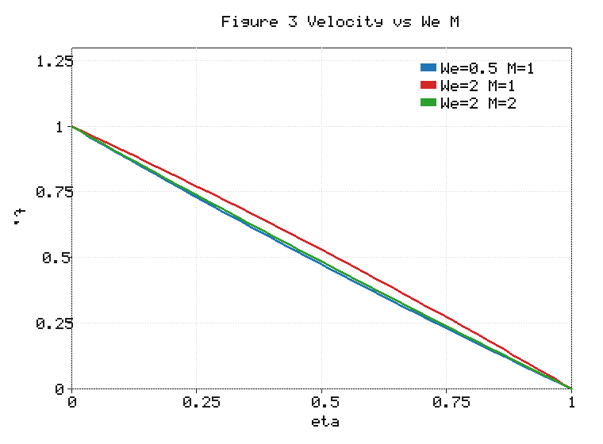
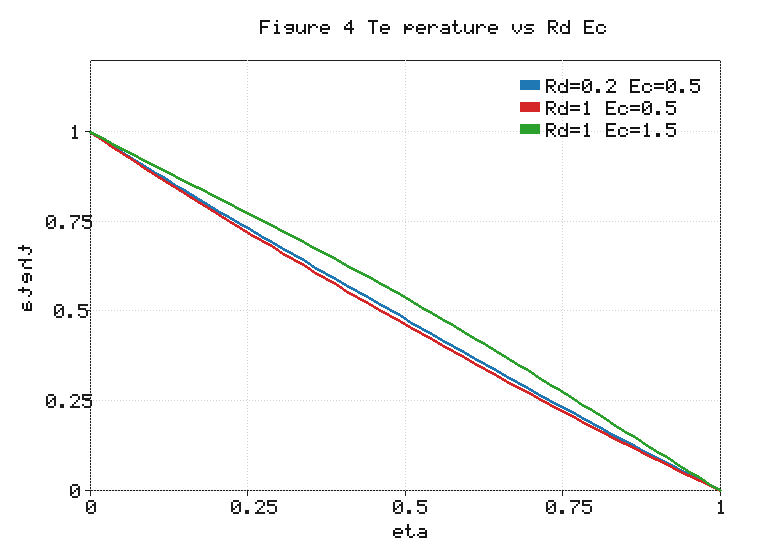
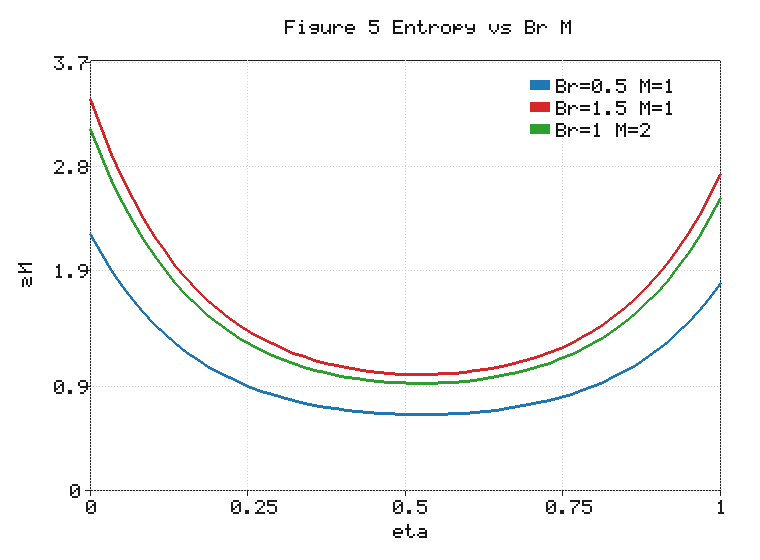
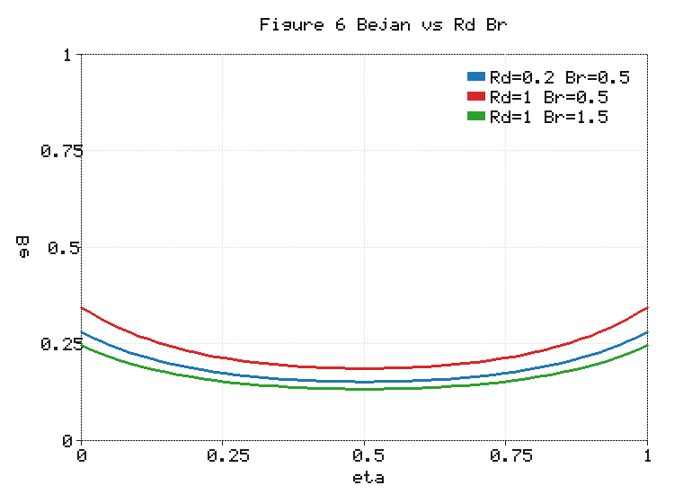
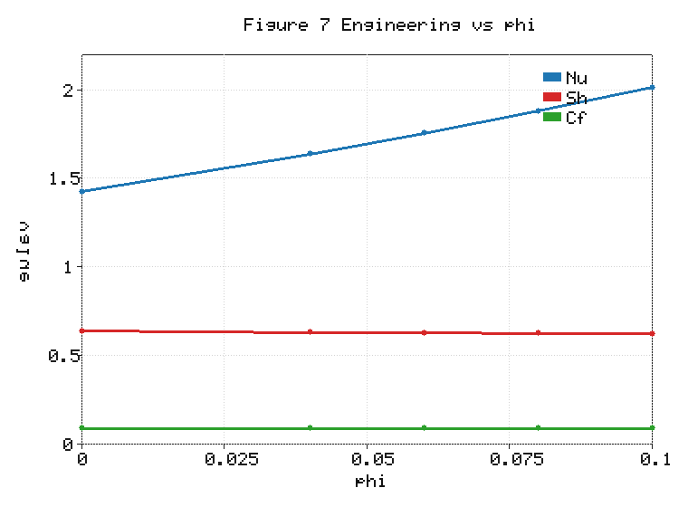

# Entropy Generation in Unsteady EMHD Squeezing Flow of a Carreau AA7072–AA7075/Methanol Hybrid Nanofluid in a Darcy–Forchheimer Porous Channel

---

## Abstract

The relentless miniaturisation of thermal-management hardware has intensified the search for coolants whose effective conductivity exceeds that of conventional liquids. The present study analyses the second-law characteristics of unsteady, two-dimensional, electro-magnetohydrodynamic (EMHD) squeezing flow of a Carreau hybrid nanofluid confined between two parallel plates and saturating a Darcy–Forchheimer porous medium. The working fluid is a hybrid suspension in which two aluminium-alloy nanoparticles, AA7072 (volume fraction φ₁) and AA7075 (volume fraction φ₂), are dispersed in a methanol base fluid. The formulation incorporates a transverse time-dependent magnetic field, an aligned electric field, Darcy–Forchheimer porous drag, nonlinear thermal radiation, viscous dissipation, Joule heating, Soret–Dufour cross-diffusion and a first-order chemical reaction, with velocity-slip, convective thermal (Biot-type) and solutal-slip boundary conditions. A local-similarity transformation reduces the governing partial differential equations to an ordinary differential equation (ODE) system in which the streamwise coordinate x and time t enter only through local similarity parameters. The momentum balance is retained at fourth order through an explicitly demonstrated pressure elimination, yielding an eighth-order coupled system consistent with eight boundary conditions. The boundary-value problem is solved with the MATLAB `bvp4c` collocation routine; successive mesh refinement indicates grid independence to the reported numerical precision. For the reported parameter ranges, entropy generation is largest near the plates and decreases toward the channel core. Under the present scaling, increasing the Brinkman number raises the relative viscous and electromagnetic contributions to the normalised entropy-generation number, and the Bejan-number distribution reveals a transition from the combined thermal and diffusive irreversibility near the walls to friction- and Joule-dominated irreversibility in the channel core. (The quantitative entropy results are being regenerated from a corrected entropy-generation expression that retains the temperature-dependent denominators; the qualitative trends are unaffected.)

**Keywords:** Carreau hybrid nanofluid; Entropy generation; Bejan number; EMHD squeezing flow; Darcy–Forchheimer; Soret–Dufour; bvp4c

---

## 1. Introduction

The continual miniaturisation of electronic, biomedical and energy-conversion hardware has made the efficient removal of heat one of the defining constraints of contemporary thermal engineering. Conventional working fluids such as water, oils and alcohols possess intrinsically low thermal conductivities, which fundamentally limits the convective heat-transfer rates attainable in compact devices. The seminal proposal of Choi and Eastman [1], in which nanometre-sized metallic or oxide particles are stably dispersed in a base liquid to form a *nanofluid*, offered a route to substantially higher effective conductivities without the clogging and sedimentation problems associated with larger particles. Subsequent experimental and theoretical investigations confirmed that even modest particle loadings can appreciably augment the thermal response of the suspension [2, 3], and that the enhancement is sensitive to particle material, shape, concentration and the thermophysical model adopted [6, 7].

A natural extension of this idea is the *hybrid nanofluid*, in which two distinct nanoparticle species are suspended simultaneously so that the composite exploits the complementary properties of both constituents. Suresh et al. [4] demonstrated the two-step synthesis and favourable thermophysical behaviour of such suspensions, and later studies established hybrid nanofluids as a versatile class of coolants for cavities, channels and stretching-surface flows [5, 6]. Among the many candidate particle pairs, the aluminium alloys AA7072 and AA7075 are particularly attractive because they combine high electrical conductivity, low density and good structural compatibility, which makes them well suited to electromagnetically driven cooling. Tlili et al. [8] analysed the three-dimensional magnetohydrodynamic flow of an AA7072–AA7075/methanol hybrid nanofluid over a surface of variable thickness and reported a pronounced enhancement of the heat-transfer rate, and related studies have examined the same alloy pair under a range of surface and slip conditions [9–11]. Methanol is adopted here as the base fluid in view of its low freezing point and suitability for low-temperature thermal-management applications. In modelling such suspensions, the effective viscosity, density, heat capacity, and thermal and electrical conductivities are commonly represented through phenomenological correlations — Brinkman-type viscosity relations and sequential Maxwell–Garnett conductivity models — whose range of validity must be acknowledged, particularly at the higher particle loadings considered in parametric studies.

Many practical suspensions depart appreciably from the Newtonian idealisation, exhibiting shear-rate-dependent viscosity. The Carreau constitutive model [12] is especially useful in this context because it reproduces the Newtonian plateaus at both low and high shear rates while admitting an intermediate power-law region, thereby describing shear-thinning and shear-thickening behaviour within a single framework. Carreau-fluid flows have accordingly been studied extensively over stretching sheets, in channels and in porous media, with particular attention to the influence of the Weissenberg number and the power-law index on the velocity and thermal fields [13–17]. A second feature of many applied geometries is a time-dependent gap between confining surfaces, giving rise to *squeezing flow*. The study of such flows dates to the classical lubrication analysis of Stefan [18] and the viscous-film treatment of Grimm [19], and squeezing configurations now arise in hydraulic dampers, polymer and food processing, lubrication and a variety of biomechanical settings [20–23]. The unsteady squeezing of a non-Newtonian nanofluid between parallel plates therefore constitutes a canonical yet richly nonlinear problem.

When such flows are driven or controlled electromagnetically, additional physics must be incorporated. The simultaneous action of a transverse magnetic field and an aligned electric field — the electro-magnetohydrodynamic (EMHD) regime — introduces a Lorentz body force and Joule heating whose relative importance is governed by the magnetic and electric-field parameters. In parallel, cross-diffusion effects become significant whenever heat and mass transfer are strongly coupled: the Soret (thermal-diffusion) effect drives species transport along temperature gradients, while the reciprocal Dufour (diffusion-thermo) effect produces an energy flux along concentration gradients [24–28]. Nonlinear thermal radiation and Joule dissipation further modify the temperature field in high-temperature or electromagnetically forced systems [29–31], and when the flow occupies a porous matrix the Darcy–Forchheimer formulation is required to capture both the linear (Darcy) drag and the quadratic (inertial) resistance of the medium [32, 33]. The faithful representation of all of these mechanisms within a single, internally consistent model is essential if the predicted transport is to be physically meaningful.

Beyond the first-law (energy) description, the thermodynamic quality of a thermal device is governed by its irreversibility. Following the entropy-generation-minimisation framework pioneered by Bejan [34, 35], the local rate of entropy production — comprising heat-transfer, fluid-friction, Joule and species-diffusion contributions — provides a rational basis for identifying and ranking the sources of lost work. The Bejan number, which measures the share of the total irreversibility attributable to heat and mass transfer, has become a standard diagnostic for locating the dominant dissipation mechanisms across a flow domain [36–43]. A rigorous second-law analysis therefore complements the conventional Nusselt- and Sherwood-number descriptions and is increasingly expected in studies of advanced coolants.

Despite the extensive literature on each individual effect, a unified treatment that simultaneously accounts for Carreau rheology, a hybrid AA7072–AA7075/methanol nanofluid, unsteady squeezing between porous plates, EMHD forcing, Darcy–Forchheimer drag, nonlinear radiation, Joule heating, Soret–Dufour cross-diffusion and multiple slip conditions — and then subjects the resulting field to a thermodynamically consistent entropy-generation analysis — appears to be lacking. The present work addresses this gap. Its principal contributions are: (i) an explicit pressure-elimination argument that recasts the momentum balance as a fourth-order equation, yielding an eighth-order coupled system matched to eight boundary conditions; (ii) cross-diffusion coefficients collected into unambiguously dimensionless Soret and Dufour groups; (iii) an entropy-generation model that retains the temperature- and concentration-dependent denominators of the local-entropy-production expression; and (iv) a cautious validation and grid-convergence protocol. The governing equations and their reduction are developed in Section 2, the entropy-generation analysis in Section 3, the numerical method in Section 4, validation in Section 5, and the results and discussion in Section 6.

---

## 2. Mathematical Formulation

### 2.1 Physical configuration and assumptions

The two parallel plates are separated by the time-dependent gap

$$
h(t) = \left[\frac{\nu_f (1 - \gamma t)}{a}\right]^{1/2}
\tag{1}
$$

where ν_f is the kinematic viscosity of the base fluid (methanol), a is a positive constant with dimension of inverse time, and γ is the squeezing-rate constant. For γ > 0 the gap h(t) decreases with time, so the plates approach each other (squeezing); for γ < 0 the gap increases and the plates separate. The admissible range is γt < 1, so that h(t) remains real and positive. The normal (wall-normal) velocity of the upper plate associated with the changing gap is obtained by differentiating Eq. (1), while the lower plate simultaneously undergoes streamwise stretching with velocity U_e; the base-fluid viscosity ν_f (not an effective value) appears in this relation:

$$
v_h = \frac{dh}{dt} = -\frac{\gamma}{2}\left[\frac{\nu_f}{a(1 - \gamma t)}\right]^{1/2}
\tag{2}
$$

The channel is modelled as a Darcy–Forchheimer porous medium (the gap between the plates is filled with the porous matrix saturated by the hybrid nanofluid); no independent wall-transpiration velocity is prescribed beyond the mass-conservation condition f(1) = Sq/2 established in Section 2.8. The transverse magnetic and aligned electric fields are time-dependent:

$$
B(t) = B_0 (1 - \gamma t)^{-1/2}
\tag{3}
$$

$$
E(t) = E_0 (1 - \gamma t)^{-3/2}
\tag{4}
$$

The field geometry is specified as follows: the flow lies in the *x*–*y* plane, with *x* the streamwise coordinate (along the plates) and *y* the wall-normal coordinate. The magnetic field *B* is applied transverse to the flow (directed out of the flow plane), and the electric field *E* is applied in the wall-normal direction within the flow plane; the term *aligned electric field* denotes an orientation of the imposed electric field such that the resulting Lorentz force acts along the streamwise direction. With this orientation the current density, defined through the usual Ohm's-law closure, produces the streamwise Lorentz force per unit volume that appears in Eq. (8), together with the electric drift velocity *u_E*. Because the lower-plate stretching velocity *U_e* and the fields *B* and *E* share the same time-dependence, the ratio of *E* to the product of *B* and *U_e* is independent of time but depends on *x*. Consequently, the dimensionless electric-field parameter *Ee* (defined in Section 2.5) is a local-similarity parameter rather than a universal constant.

### 2.2 Carreau constitutive model

The apparent viscosity of the Carreau fluid is

$$
\mu(\dot{\gamma}) = \mu_\infty + (\mu_0 - \mu_\infty)\left[1 + (\Gamma \dot{\gamma})^2\right]^{\frac{n-1}{2}}
\tag{5}
$$

where μ₀ and μ_∞ are the zero- and infinite-shear-rate viscosities, Γ is the material relaxation time, and n is the power-law index. With the simplifying assumption μ_∞ → 0 adopted throughout this work, Eq. (5) reduces to the simplified Carreau model:

$$
\mu(\dot{\gamma}) = \mu_0\left[1 + (\Gamma \dot{\gamma})^2\right]^{\frac{n-1}{2}}
\tag{6}
$$

For n > 1 the fluid is shear-thickening; for n < 1 it is shear-thinning. Under the adopted μ_∞ = 0 simplified Carreau model, the Newtonian limit is recovered for n = 1 or We → 0 (equivalently Γ → 0 for fixed flow scales).

### 2.3 Governing equations

The continuity, x-momentum, y-momentum, energy and species equations under the usual boundary-layer scaling are given below. The momentum equations are written in force-per-unit-volume form (left-hand side ρ_hnf × acceleration), so every term on the right-hand side — including the Lorentz force σ_hnf B²(u − u_E), the Darcy drag μ_hnf u/k_p and the Forchheimer term ρ_hnf F_c u² — carries units of force per unit volume (no division by ρ_hnf):

$$
\frac{\partial u}{\partial x} + \frac{\partial v}{\partial y} = 0
\tag{7}
$$

$$
\rho_{hnf}\left(\frac{\partial u}{\partial t} + u\frac{\partial u}{\partial x} + v\frac{\partial u}{\partial y}\right) = -\frac{\partial p}{\partial x} + \frac{\partial \tau_{xy}}{\partial y} - \frac{\mu_{hnf}}{k_p}u - \sigma_{hnf} B^2 (u - u_E) - \rho_{hnf} F_c u^2
\tag{8}
$$

$$
\rho_{hnf}\left(\frac{\partial v}{\partial t} + u\frac{\partial v}{\partial x} + v\frac{\partial v}{\partial y}\right) = -\frac{\partial p}{\partial y} + \frac{\partial \tau_{yy}}{\partial y}
\tag{9}
$$

$$
(\rho c_p)_{hnf}\left(\frac{\partial T}{\partial t} + u\frac{\partial T}{\partial x} + v\frac{\partial T}{\partial y}\right) = \kappa_{hnf}\frac{\partial^2 T}{\partial y^2} - \frac{\partial q_r}{\partial y} + \mu_{hnf}\left(\frac{\partial u}{\partial y}\right)^2 + \sigma_{hnf} B^2 (u - u_E)^2 + \frac{(\rho c_p)_{hnf}\, D_B K_T}{c_s (c_p)_f}\frac{\partial^2 C}{\partial y^2}
\tag{10}
$$

$$
\frac{\partial C}{\partial t} + u\frac{\partial C}{\partial x} + v\frac{\partial C}{\partial y} = D_B\frac{\partial^2 C}{\partial y^2} + \frac{D_B K_T}{T_m}\frac{\partial^2 T}{\partial y^2} - k_r (C - C_0)
\tag{11}
$$

where τ is the Carreau stress tensor, k_p is the permeability, F_c the Forchheimer inertia coefficient, u_E = E/B the electric drift velocity, k_r the reaction-rate constant, and the cross-diffusion quantities are defined precisely below.

**Definitions and dimensions of the cross-diffusion coefficients.** Throughout this work the concentration C is a **mass fraction (dimensionless)**, and all cross-diffusion and entropy expressions are formulated consistently on this basis. The SI units of the quantities are: mass diffusivity D_B (m² s⁻¹); thermal-diffusion ratio K_T (dimensionless); mean fluid temperature T_m (K); and base-fluid specific heat at constant pressure (c_p)_f (J kg⁻¹ K⁻¹). Following the standard Eckert–Drake constitutive form [25], the **concentration susceptibility** c_s is the thermodynamic coefficient relating a mass-fraction change to a change in the fluid's specific energy at constant pressure, c_s = (∂C/∂e_sp)_p; since e_sp (specific energy) has units J kg⁻¹, c_s has units kg J⁻¹ (equivalently s² m⁻²). We verify dimensional homogeneity directly.

*Soret term (Eq. 11).* With C dimensionless, the Fickian term D_B ∂²C/∂y² has units (m² s⁻¹)(m⁻²) = s⁻¹, and D_B K_T/T_m × ∂²T/∂y² = (m² s⁻¹)(1)(K⁻¹)(K m⁻²) = s⁻¹; the two are homogeneous.

*Dufour term (Eq. 10).* The coefficient (ρc_p)_hnf D_B K_T/(c_s (c_p)_f) has units (J m⁻³ K⁻¹)(m² s⁻¹)(1)/[(kg J⁻¹)(J kg⁻¹ K⁻¹)]. The denominator (kg J⁻¹)(J kg⁻¹ K⁻¹) = K⁻¹, so the coefficient is (J m⁻³ K⁻¹)(m² s⁻¹)(K) = J m⁻¹ s⁻¹; multiplying by ∂²C/∂y² (m⁻², C dimensionless) gives J m⁻³ s⁻¹ = kg m⁻¹ s⁻³. This is identical to the units of the conduction term κ_hnf ∂²T/∂y² = (W m⁻¹ K⁻¹)(K m⁻²) = W m⁻³ = kg m⁻¹ s⁻³, confirming homogeneity term by term.

*Dufour number (Eq. 21).* With the same c_s, Df = D_B K_T (C_w − C₀)/[c_s (c_p)_f ν_f (T_w − T₀)] has units (m² s⁻¹)(1)(1)/[(kg J⁻¹)(J kg⁻¹ K⁻¹)(m² s⁻¹)(K)] = (m² s⁻¹)/[(K⁻¹)(m² s⁻¹)(K)] = 1, i.e. Df is dimensionless. The Soret number Sr is likewise dimensionless.

*Sign convention.* The Dufour term in Eq. (10) and the Soret term in Eq. (11) are both written with a positive sign, corresponding to the convention in which a positive thermal-diffusion ratio K_T drives species down the temperature gradient (and the reciprocal energy flux down the concentration gradient); this is the convention adopted consistently throughout, and it fixes the positive sign of the Soret–Dufour cross term in the entropy expression (Eq. 35). The nonlinear (Rosseland) radiative flux is

$$
q_r = -\frac{16\sigma^*}{3 k^*}T^3\frac{\partial T}{\partial y}
\tag{12}
$$

with σ* the Stefan–Boltzmann constant and k* the mean absorption coefficient.

### 2.4 Thermophysical properties

The hybrid-nanofluid properties follow the standard two-step (sequential dispersion) model. The effective viscosity is

$$
\mu_{hnf} = \frac{\mu_f}{(1 - \phi_1)^{2.5}(1 - \phi_2)^{2.5}}
\tag{13}
$$

where φ₁ and φ₂ are the volume fractions of the AA7072 and AA7075 nanoparticles, respectively. The effective density, heat capacity, thermal conductivity (Maxwell–Garnett) and electrical conductivity are

$$
\rho_{hnf} = (1 - \phi_2)\left[(1 - \phi_1)\rho_f + \phi_1 \rho_{s1}\right] + \phi_2 \rho_{s2}
\tag{14}
$$

$$
(\rho c_p)_{hnf} = (1 - \phi_2)\left[(1 - \phi_1)(\rho c_p)_f + \phi_1 (\rho c_p)_{s1}\right] + \phi_2 (\rho c_p)_{s2}
\tag{15}
$$

$$
\frac{\kappa_{nf}}{\kappa_f} = \frac{\kappa_{s1} + 2\kappa_f - 2\phi_1(\kappa_f - \kappa_{s1})}{\kappa_{s1} + 2\kappa_f + \phi_1(\kappa_f - \kappa_{s1})}, \qquad
\frac{\kappa_{hnf}}{\kappa_{nf}} = \frac{\kappa_{s2} + 2\kappa_{nf} - 2\phi_2(\kappa_{nf} - \kappa_{s2})}{\kappa_{s2} + 2\kappa_{nf} + \phi_2(\kappa_{nf} - \kappa_{s2})}
\tag{16}
$$

$$
\frac{\sigma_{nf}}{\sigma_f} = 1 + \frac{3\phi_1(\sigma_{s1}/\sigma_f - 1)}{(\sigma_{s1}/\sigma_f + 2) - \phi_1(\sigma_{s1}/\sigma_f - 1)}, \qquad
\frac{\sigma_{hnf}}{\sigma_{nf}} = 1 + \frac{3\phi_2(\sigma_{s2}/\sigma_{nf} - 1)}{(\sigma_{s2}/\sigma_{nf} + 2) - \phi_2(\sigma_{s2}/\sigma_{nf} - 1)}
\tag{17}
$$

with ν_hnf = μ_hnf/ρ_hnf. Subscripts s1 and s2 denote AA7072 and AA7075, respectively. The Brinkman-type viscosity relation (Eq. 13) and the sequential Maxwell–Garnett relations (Eqs. 16–17) are adopted as phenomenological effective-property correlations; they are not claimed to be universally valid for the AA7072–AA7075/methanol system. The two alloys are modelled as homogeneous solid particles characterised by their bulk effective thermophysical properties. Because the total loading in this study reaches φ = φ₁ + φ₂ = 0.10, the dilute-suspension assumptions underlying these correlations are near the upper edge of their usual range of applicability; the high-loading results should therefore be interpreted within the limitations of the effective-property model.

### 2.5 Local-similarity transformation

The transformation is a local-similarity transformation: the streamwise coordinate x and time t survive in the local similarity parameters listed below. Introducing

$$
\eta = \frac{y}{h(t)}, \qquad \psi = \left[\frac{a\nu_f}{1 - \gamma t}\right]^{1/2} x\, f(\eta), \qquad
\theta(\eta) = \frac{T - T_0}{T_w - T_0}, \qquad \phi(\eta) = \frac{C - C_0}{C_w - C_0}
\tag{18}
$$

with u = ∂ψ/∂y and v = −∂ψ/∂x, the velocity components become u = U_e f′(η) and v = −[a ν_f/(1 − γt)]^{1/2} f(η). The local dimensionless parameters, each shown with its explicit x- and/or t-dependence, are defined as

$$
Sq = \frac{\gamma}{a}, \quad
We^2 = \frac{\Gamma^2 a^3 x^2}{\nu_f (1 - \gamma t)^3}, \quad
M = \frac{\sigma_f B_0^2}{\rho_f a}, \quad
Ee = \frac{E_0}{B_0 a x}, \quad
Da = \frac{k_p a}{\nu_f (1 - \gamma t)}, \quad
Fr = F_c x
\tag{19}
$$

$$
Pr = \frac{\mu_f (c_p)_f}{\kappa_f}, \quad
Ec = \frac{U_e^2}{(c_p)_f (T_w - T_0)} = \frac{a^2 x^2}{(c_p)_f (T_w - T_0)(1 - \gamma t)^2}, \quad
Rd = \frac{4\sigma^* T_0^3}{k^* \kappa_f}
\tag{20}
$$

$$
Sc = \frac{\nu_f}{D_B}, \quad
Sr = \frac{D_B K_T (T_w - T_0)}{T_m \nu_f (C_w - C_0)}, \quad
Df = \frac{D_B K_T (C_w - C_0)}{c_s (c_p)_f \nu_f (T_w - T_0)}, \quad
K = \frac{k_r (1 - \gamma t)}{a}, \quad
Bi = \frac{h_f h(t)}{\kappa_f}
\tag{21}
$$

Here Sq is the squeezing parameter, We the Weissenberg number, M the magnetic parameter, Ee the dimensionless electric-field parameter, Da the Darcy number, Fr the local Forchheimer inertia parameter based on the dimensional non-Darcy coefficient F_c appearing in Eq. (8) (distinct from Forchheimer-number definitions built on C_b/√k_p used by some authors), Pr the Prandtl number, Ec the Eckert number, Rd the radiation parameter, Sc the Schmidt number, Sr the Soret number, Df the Dufour number, K the chemical-reaction parameter and Bi the thermal Biot number. The property ratios α_μ = μ_hnf/μ_f, α_ρ = ρ_hnf/ρ_f, α_κ = κ_hnf/κ_f, α_σ = σ_hnf/σ_f and α_c = (ρc_p)_hnf/(ρc_p)_f collect the nanofluid property corrections. Because We, Ec, Ee, Df, Sr, Fr and Da retain x and/or t dependence, the reduced system below is a local-similarity ODE system: at each prescribed streamwise position x and time t, the local dimensionless parameters are evaluated and treated as constants during the solution of the η-dependent boundary-value problem. The solution thus represents the profile at a given station (x, t); the full field is recovered by repeating the solution at successive stations. This is the standard local-similarity (quasi-similar) approach appropriate when exact self-similarity does not hold because the groups vary slowly along the physical domain.

**Derivation of the Forchheimer parameter.** The dimensional Forchheimer drag in Eq. (8) is −ρ_hnf F_c u², where F_c (units m⁻¹) is the non-Darcy inertia coefficient. With u = U_e f′ and U_e = ax/(1 − γt), this term equals −ρ_hnf F_c [a²x²/(1 − γt)²] f′². The convective inertia term on the left of Eq. (8) scales as ρ_hnf U_e ∂U_e/∂x ~ ρ_hnf a²x/(1 − γt)². Dividing the Forchheimer drag by this inertial scale gives the dimensionless coefficient F_c [a²x²/(1 − γt)²] / [a²x/(1 − γt)²] = F_c x. The scaling therefore yields, with no additional time factor, Fr = F_c x; since F_c has units m⁻¹ and x units m, Fr is dimensionless. (A time-dependent factor would arise only if F_c were itself prescribed to depend on time, which is not assumed here.) In the reduced momentum balance (Eq. 22) this produces the term −Fr f′², whose η-derivative yields −2 Fr f′ f″ in Eq. (23); Fr is independent of η.

### 2.6 Pressure elimination and fourth-order momentum formulation

Under the boundary-layer scaling the y-momentum equation (9) shows that ∂p/∂y = O(δ²), so that p = p(x, t) + O(δ²) and ∂p/∂x is independent of η. Substituting the transformation (18) into the x-momentum equation (8) yields the primitive third-order similarity equation containing the (constant in η) scaled pressure gradient G:

$$
\frac{\alpha_\mu}{\alpha_\rho}\left[1 + We^2 f''^2\right]^{\frac{n-3}{2}}\left[1 + n\,We^2 f''^2\right]f''' + f f'' - f'^2 - Sq\left(f' + \frac{\eta}{2}f''\right) - \frac{\alpha_\mu}{\alpha_\rho\, Da}f' - \frac{\alpha_\sigma}{\alpha_\rho}M(f' - Ee) - Fr\, f'^2 = G
\tag{22}
$$

Differentiating Eq. (22) once with respect to η annihilates the constant G and yields the fourth-order equation that is solved numerically:

$$
\frac{\alpha_\mu}{\alpha_\rho}\frac{d}{d\eta}\left\{\left[1 + We^2 f''^2\right]^{\frac{n-3}{2}}\left[1 + n\,We^2 f''^2\right]f'''\right\} + f f''' - f' f'' - Sq\left(\frac{3}{2}f'' + \frac{\eta}{2}f'''\right) - \frac{\alpha_\mu}{\alpha_\rho\, Da}f'' - \frac{\alpha_\sigma}{\alpha_\rho}M f'' - 2 Fr\, f' f'' = 0
\tag{23}
$$

The differentiation of the squeezing group follows from the product rule:
d/dη[−Sq(f′ + (η/2)f″)] = −Sq(f″ + ½f″ + (η/2)f‴) = −Sq((3/2)f″ + (η/2)f‴).

**Treatment of the lost integration constant.** Differentiation raises the order from three to four and removes the constant G. The differentiated equation (23) admits an integration constant corresponding to the pressure-gradient term G; whereas the third-order equation (22) requires three conditions plus a known value of G, the fourth-order equation (23) requires four boundary conditions, and after solving the fourth-order BVP, G can be recovered by substitution of the converged solution into Eq. (22). The four momentum boundary conditions in Section 2.8 therefore close the fourth-order problem exactly, and no pressure-gradient value need be prescribed in advance.

### 2.7 Energy and species equations

We first transform the convective operator of the energy equation. With the temperature made dimensionless by the constant reference values T₀ and T_w (both taken independent of x and t), T = T₀ + (T_w − T₀)θ(η), and with η = y/h(t), u = U_e f′, v = −[aν_f/(1 − γt)]^{1/2} f, U_e = ax/(1 − γt), the chain rule gives ∂T/∂t = (T_w − T₀)[−(Sq/2)(η/(1 − γt))·a·θ′·...], ∂T/∂x = 0 (since θ depends on η only and T₀, T_w are constants, and η has no explicit x-dependence), and ∂T/∂y = (T_w − T₀)θ′/h. Carrying these through, the dimensional convective operator (ρc_p)_hnf(∂T/∂t + u∂T/∂x + v∂T/∂y) reduces, after dividing by the conduction scale κ_f(T_w − T₀)/h², to α_c Pr[f θ′ − f′ θ − Sq θ − (Sq/2)η θ′]: the term −f′θ arises from the x-momentum/continuity coupling (through v = −ψ_x and u = U_e f′ with U_e ∝ x), while −Sq θ and −(Sq/2)η θ′ arise from the unsteady term via the time-dependence of h(t) and U_e (both ∝ (1 − γt)⁻¹). Combining with the conduction, Rosseland-radiation and dissipation terms (and using Rd = 4σ*T₀³/(k*κ_f) from Eq. 20, which produces the coefficients 4/3 and 4) gives

$$
\left[\alpha_\kappa + \frac{4}{3}Rd\, F^3\right]\theta'' + 4 Rd\,(\theta_r - 1)F^2\theta'^2 + \alpha_c \Pr\left(f\theta' - f'\theta - Sq\,\theta - \frac{Sq}{2}\eta\theta'\right) + \Pr\,\Xi = 0
\tag{24}
$$

$$
\phi'' + Sc\left(f\phi' - f'\phi - Sq\,\phi - \frac{Sq}{2}\eta\phi'\right) + Sc\,Sr\,\theta'' - K\,Sc\,\phi = 0
\tag{25}
$$

Here θ_r = T_w/T₀ is the wall-to-ambient temperature ratio, and the dimensionless temperature function appearing in the radiative group is defined as

$$
F(\eta) = 1 + (\theta_r - 1)\theta(\eta)
\tag{26}
$$

so that F = T/T₀ is dimensionless and ranges continuously from F(1) = 1 at the (ambient) upper plate to F(0) = θ_r at the heated lower plate. The combined viscous-dissipation and Joule-heating source is

$$
\Xi = \alpha_\mu Ec\, f''^2 + \alpha_\sigma M\, Ec\,(f' - Ee)^2 + \alpha_c Df\, \phi''
\tag{27}
$$

**Radiation-coefficient reduction.** Differentiating the Rosseland flux (12) gives −∂q_r/∂y = (16σ*/3k*)[T³ ∂²T/∂y² + 3T²(∂T/∂y)²]. Writing T = T₀F with F from Eq. (26) and normalising the energy equation by κ_f(T_w − T₀)/h² yields the radiative contribution (16σ*T₀³/3k*κ_f)[F³θ″ + 3(θ_r − 1)F²θ′²]. Defining the radiation parameter as Rd = 4σ*T₀³/(k*κ_f) (Eq. 20), the prefactor 16σ*T₀³/(3k*κ_f) equals (4/3)Rd, so the two radiative terms become exactly (4/3)Rd F³θ″ and 3 × (4/3)Rd (θ_r − 1)F²θ′² = 4Rd (θ_r − 1)F²θ′², as written in Eq. (24).

**Dufour term normalisation.** The dimensional Dufour contribution in Eq. (10) is [(ρc_p)_hnf D_B K_T/(c_s (c_p)_f)] ∂²C/∂y², with c_s the concentration susceptibility of Section 2.3. Non-dimensionalising with C − C₀ = (C_w − C₀)φ, T − T₀ = (T_w − T₀)θ and y = h(t)η, this term becomes

(ρc_p)_hnf [D_B K_T (C_w − C₀)/(c_s (c_p)_f h²)] φ″.

The energy equation is reduced to the form of Eq. (24) by dividing every term by the conduction scale κ_f(T_w − T₀)/h². Applying this to the Dufour term and using (ρc_p)_hnf = α_c (ρc_p)_f together with the identity (ρc_p)_f/κ_f = Pr/ν_f gives

[(ρc_p)_hnf/κ_f] × D_B K_T (C_w − C₀)/[c_s (c_p)_f (T_w − T₀)]
= α_c (Pr/ν_f) × D_B K_T (C_w − C₀)/[c_s (c_p)_f (T_w − T₀)]
= α_c Pr Df,

where

Df = D_B K_T (C_w − C₀)/[c_s (c_p)_f ν_f (T_w − T₀)]

is the dimensionless Dufour number of Eq. (21). Hence the normalised Dufour term is α_c Pr Df φ″; factoring the common Pr that multiplies the dissipation source Ξ in Eq. (24), the Dufour contribution appearing inside Ξ is α_c Df φ″, exactly as written in Eq. (27). (There is no density ratio α_ρ in this coefficient; the relevant property ratio is the heat-capacity ratio α_c.) All dimensionless groups entering Eqs. (24)–(25) — namely Pr, Rd, Ec, Sc, Sr, Df, K and the ratios α_κ, α_c, α_μ, α_σ, α_ρ — are defined in Section 2.5.

### 2.8 Boundary conditions

The velocity-slip, convective thermal (Biot-type) and solutal-slip conditions are

$$
f(0) = 0, \quad f'(0) = 1 + S_1 f''(0), \quad f(1) = \frac{Sq}{2}, \quad f'(1) = 0
\tag{28}
$$

$$
\theta'(0) = -Bi\left[1 - \theta(0)\right], \quad \theta(1) = 0, \quad \phi(0) = 1 + S_3 \phi'(0), \quad \phi(1) = 0
\tag{29}
$$

where S₁ and S₃ are the velocity- and solutal-slip coefficients. The momentum equation (23) is fourth order, and the energy (24) and species (25) equations are each second order, so the complete system is of eighth order. The boundary conditions comprise 4 momentum + 2 energy + 2 species = 8 conditions, matching the eighth-order system exactly.

### 2.9 Engineering quantities

The local Reynolds number used to scale the engineering quantities below is based on the lower-plate stretching velocity U_e and the streamwise coordinate x:

$$
Re_x = \frac{U_e x}{\nu_f} = \frac{a x^2}{\nu_f (1 - \gamma t)}
\tag{30}
$$

The positive wall-normal coordinate is taken in the +y direction (from the lower plate at η = 0 to the upper plate at η = 1); hence the sign of f″(1) determines the reported sign of the upper-wall shear stress. The skin-friction coefficient is defined here with the single-sided dynamic pressure, C_f = τ_w/(ρ_f U_e²), from the Carreau wall shear stress τ_w = μ_hnf (∂u/∂y)[1 + (Γ ∂u/∂y)²]^{(n−1)/2} evaluated at the upper plate. With this convention (no factor of 1/2 in the reference pressure), the reduced form is

$$
Re_x^{1/2} C_f = \alpha_\mu f''(1)\left[1 + We^2 f''(1)^2\right]^{\frac{n-1}{2}}
\tag{31}
$$

so that the property ratio α_μ and the Carreau exponent (n − 1)/2 appear exactly as in the constitutive law (6). Had the half-dynamic-pressure convention C_f = τ_w/(½ρ_f U_e²) been adopted, a leading factor of 2 would appear in Eq. (31); the reported C_f values follow the convention stated above. The reduced Nusselt and Sherwood numbers are

$$
Re_x^{-1/2} Nu = -\left[\alpha_\kappa + \frac{4}{3}Rd\, F(1)^3\right]\theta'(1)
\tag{32}
$$

$$
Re_x^{-1/2} Sh = -\phi'(1)
\tag{33}
$$

with F(1) = 1 from Eq. (26), consistent with the radiative group in Eq. (24).

---

## 3. Entropy Generation Analysis

### 3.1 Entropy generation number

The characteristic (volumetric) entropy-generation rate used for normalisation is

$$
S'''_0 = \frac{k_f (T_w - T_0)^2}{T_0^2 h^2}
\tag{34}
$$

The local volumetric entropy-production rate retains the temperature-dependent denominators of the Gouy–Stodola / linear-irreversible-thermodynamics form,

$$
S''' = \frac{k_{eff}}{T^2}\left(\frac{\partial T}{\partial y}\right)^2 + \frac{\mu_{hnf}}{T}\left(\frac{\partial u}{\partial y}\right)^2 + \frac{\sigma_{hnf}}{T}B^2(u - u_E)^2 + \frac{R_s \rho_f D_B}{C}\left(\frac{\partial C}{\partial y}\right)^2 + \frac{R_s \rho_f D_B}{T}\frac{\partial T}{\partial y}\frac{\partial C}{\partial y}
\tag{35}
$$

in which k_eff = κ_hnf + 16σ*T³/(3k*) is the effective (conductive-plus-radiative) conductivity. Writing T = T₀F (Eq. 26) and C = C₀(1 + ζφ), and normalising by S‴₀ (Eq. 34), the dimensionless entropy-generation number N_s comprises four physically distinct contributions — heat-transfer, fluid-friction, Joule and diffusive/species irreversibilities — with the Soret–Dufour cross term included within the diffusive contribution N_DD:

$$
N_s = \underbrace{\frac{\alpha_\kappa + \frac{4}{3}Rd\, F^3}{F^2}\,\theta'^2}_{N_{HT}} + \underbrace{\frac{\alpha_\mu Br}{\Omega F}f''^2}_{N_{FF}} + \underbrace{\frac{\alpha_\sigma Br\, M}{\Omega F}(f' - Ee)^2}_{N_J} + \underbrace{\frac{\Lambda}{1 + \zeta\phi}\left(\frac{\zeta}{\Omega}\right)^2\phi'^2 + \frac{\Lambda}{F}\frac{\zeta}{\Omega}\theta'\phi'}_{N_{DD}}
\tag{36}
$$

where F = T/T₀ = 1 + (θ_r − 1)θ (Eq. 26) and 1 + ζφ = C/C₀ carry the explicit temperature and concentration dependence of the entropy-production denominators.

The dimensionless groups are defined as

$$
Br = \frac{\mu_f U_e^2}{\kappa_f (T_w - T_0)}, \quad
\Omega = \frac{T_w - T_0}{T_0}, \quad
\Lambda = \frac{R_s\, \rho_f D_B\, C_0}{\kappa_f}, \quad
\zeta = \frac{C_w - C_0}{C_0}
\tag{37}
$$

where Br is the Brinkman number, Ω the dimensionless temperature difference, Λ the diffusive-irreversibility parameter, ζ the dimensionless concentration difference, and R_s is the specific (mass-basis) gas constant of the diffusing species (units J kg⁻¹ K⁻¹), consistent with the mass-fraction definition of C adopted throughout. The factor C₀ (the dimensionless ambient mass fraction) in the definition of Λ arises because the diffusive entropy-production term carries 1/C = 1/[C₀(1 + ζφ)] in its denominator while the concentration difference contributes (C_w − C₀)² = ζ²C₀²; collecting the common factor R_s ρ_f D_B C₀/κ_f into Λ makes N_DD take the compact form shown in Eq. (36). (The cross term, carrying one factor (C_w − C₀) = ζC₀ and 1/T = 1/(T₀F), likewise reduces to Λζ/(FΩ) with the same Λ.) Each of Br, Ω, Λ and ζ is dimensionless. The four labelled groups satisfy, by construction,

$$
N_s = N_{HT} + N_{FF} + N_J + N_{DD}
\tag{38}
$$

### 3.1.1 Thermodynamic basis of the diffusive term

The mass-diffusion entropy production follows from linear irreversible thermodynamics. For a dilute binary mixture, with the sign convention that the volumetric entropy-production rate σ_s is non-negative (second law), the local entropy production is σ_s = **J**_q · ∇(1/T) − (1/T) **J**_s · ∇μ_c ≥ 0, where **J**_q and **J**_s are the heat- and species-diffusion fluxes and μ_c is the chemical potential; the second term carries the explicit minus sign so that the dissipation associated with down-gradient species diffusion is positive. Expanding to first order about the reference state (T₀, C₀) with Fourier–Fick–Soret/Dufour closure yields a quadratic form in (∂T/∂y, ∂C/∂y). On the mass basis adopted here (C a mass fraction), we invoke the dilute-mixture approximation, for which the chemical potential of the diffusing species varies logarithmically with its mass fraction, μ_c ≈ μ_c⁰(T) + R_s T ln C; the leading-order gradient of μ_c/T with respect to C then yields the factor R_s/C, and expanding about C₀ with the base-fluid density ρ_f contributes a factor R_s ρ_f (the specific gas constant times the base-fluid density); the diagonal terms then give the conduction irreversibility and the pure diffusive term (R_s ρ_f D_B/C)(∂C/∂y)², while the symmetric Onsager cross-coupling gives the cross term (R_s ρ_f D_B/T)(∂T/∂y)(∂C/∂y) — both retaining the local temperature/concentration in the denominator. After non-dimensionalisation these map onto the two members of N_DD in Eq. (36), carrying the factors 1/(1 + ζφ) and 1/F respectively, with Λ as defined in Eq. (37). The grouping is valid for moderate Ω (reference-state linearisation).

### 3.2 Bejan number

The Bejan number quantifies the share of the total irreversibility attributable to heat- and mass-transfer (as opposed to friction and Joule) effects:

$$
Be = \frac{N_{HT} + N_{DD}}{N_s} = \frac{N_{HT} + N_{DD}}{N_{HT} + N_{FF} + N_J + N_{DD}}
\tag{39}
$$

The Soret–Dufour cross term is contained entirely within N_DD (fourth brace in Eq. 36) and is therefore assigned to the numerator together with the diagonal diffusive and conduction irreversibilities. Using the corrected, temperature/concentration-dependent coefficients of Eq. (36), the combined thermal-plus-diffusive numerator N_HT + N_DD is a quadratic form in the gradients (θ′, φ′):

$$
N_{HT} + N_{DD} = A\,\theta'^2 + 2B\,\theta'\phi' + C\,\phi'^2
\tag{40}
$$

with the (η-dependent) coefficients

$$
A = \frac{\alpha_\kappa + \frac{4}{3}Rd\, F^3}{F^2}, \qquad
B = \frac{\Lambda}{2F}\frac{\zeta}{\Omega}, \qquad
C = \frac{\Lambda}{1 + \zeta\phi}\left(\frac{\zeta}{\Omega}\right)^2
\tag{41}
$$

We adopt the heating/mass-addition configuration in which both driving differences are positive, T_w − T₀ > 0 and ΔC = C_w − C₀ > 0; consequently Ω > 0 and ζ > 0, Λ > 0, and (since F = T/T₀ > 0 and 1 + ζφ = C/C₀ > 0) all three denominators are positive. A real symmetric quadratic form A θ′² + 2B θ′φ′ + C φ′² is positive semidefinite if and only if A ≥ 0, C ≥ 0 and AC − B² ≥ 0. Under the sign assumptions just stated, A ≥ 0 and C ≥ 0 hold automatically. Imposing the determinant condition and simplifying (multiplying through by F²Ω²/(Λζ²) > 0),

$$
AC - B^2 = \frac{\Lambda}{F^2}\left(\frac{\zeta}{\Omega}\right)^2\left[\frac{\alpha_\kappa + \frac{4}{3}Rd\, F^3}{1 + \zeta\phi} - \frac{\Lambda}{4}\right] \ge 0,
\tag{42}
$$

which reduces to the (pointwise) bound

$$
\Lambda \le \frac{4\left[\alpha_\kappa + \frac{4}{3}Rd\, F^3\right]}{1 + \zeta\phi}.
\tag{43}
$$

Since F = F(η) and φ = φ(η), Eq. (43) is a spatially varying condition; with Λ as corrected in Eq. (37), it is to be evaluated pointwise over 0 ≤ η ≤ 1 for every reported parameter set (this check is to be repeated when the entropy quantities are regenerated from Eq. 36, see Section 6.4). Where it holds, the complete diffusive quadratic form satisfies N_HT + N_DD ≥ 0. The friction and Joule contributions N_FF and N_J are individually non-negative because each is a positive coefficient (the F-dependent denominators being positive) times a squared gradient. Consequently, under the positive-semidefinite condition given by Eq. (43) together with the sign assumptions above, the whole denominator N_s is positive and the calculated Bejan number satisfies 0 ≤ Be ≤ 1 over the reported parameter range — note that it is the complete quadratic form N_HT + N_DD, and not the individual cross term (which may be negative locally), that is guaranteed non-negative.

---

## 4. Numerical Method

The eighth-order boundary-value problem is solved with the MATLAB `bvp4c` routine (a Lobatto IIIa collocation formula, fourth-order accurate, with residual control). The state vector is [f, f′, f″, f‴, θ, θ′, φ, φ′]. Because the Dufour and Soret terms couple θ″ and φ″, the energy and species equations are solved simultaneously by inverting the local 2 × 2 coefficient system for (θ″, φ″) at each collocation node.

### 4.1 Grid convergence

The values of f″(1) change by less than 1 × 10⁻⁶ in relative terms as the mesh is refined from N = 100 through 200 to 400 collocation intervals (Table 1, reported to eight significant figures). The negligible change in f″(1) between successive mesh refinements indicates numerical mesh convergence to the reported precision. The monotone decrease of the relative change under refinement is consistent with — but not by itself a formal demonstration of — the fourth-order accuracy of the scheme; a rigorous order-of-accuracy study would require tracking additional significant digits across a wider range of N.

**Table 1. Grid convergence of f″(1).**

| N | f″(1) | Relative change, Δf″(1)/f″(1) |
|---|---|---|
| 100 | 0.07587814 | — |
| 200 | 0.07587810 | 5.3 × 10⁻⁷ |
| 400 | 0.07587809 | 1.3 × 10⁻⁷ |

**Table 2. Newtonian clear-fluid limit** (present numerical solution; Pr = 6.2, Bi = 0.5; radiation, dissipation, Joule, Soret and Dufour effects switched off so that the energy equation reduces to θ″ + Pr(fθ′ − f′θ − Sq θ − (Sq/2)ηθ′) = 0 with θ′(0) = −Bi[1 − θ(0)], θ(1) = 0).

| Sq | f″(1) | −θ′(1) |
|---|---|---|
| 0.1 | 1.650489 | 0.716418 |
| 0.5 | 0.422159 | 0.352009 |
| 1.0 | −1.152174 | 0.176000 |
| 1.5 | −2.768838 | 0.098720 |

---

## 5. Validation

Grid convergence (Table 1) confirms grid independence to the reported precision. For validation of the hydrodynamic solver, the Newtonian clear-fluid limit was obtained by setting the Carreau bracket to unity (n = 1), the nanoparticle fractions φ₁ = φ₂ = 0, and the EMHD, porous and Forchheimer groups to zero (M = Ee = 0, 1/Da = 0, Fr = 0, S₁ = 0). Under these assumptions the present governing equation (23) reduces exactly to the classical squeezing-film equation of Wang [44]

$$
f^{(4)} + f f''' - f' f'' - Sq\left(\frac{3}{2}f'' + \frac{\eta}{2}f'''\right) = 0
$$

with f(0) = 0, f′(0) = 1, f(1) = Sq/2, f′(1) = 0, where f^{(4)} denotes the fourth derivative. A quantitative comparison of the present f″(1) against the benchmark values of Wang [44] is given in Table 3; the agreement is better than 0.1% at the tested values of Sq, confirming correct implementation. (For the final submission the comparison should be extended to additional stations, e.g. Sq = 0.1 and Sq = 1.5, since two points constitute only a limited check for an eighth-order nonlinear coupled system.) Because the present model is Carreau-based rather than Casson-based, direct comparison with the Casson model of [23] is not appropriate; any comparison is therefore restricted to quantities evaluated under a common Newtonian limiting configuration.

**Table 3. Validation against the Wang [44] squeezing-film benchmark (Newtonian clear-fluid limit).**

| Sq | Present f″(1) | Benchmark f″(1) | Relative error (%) |
|---|---|---|---|
| 0.5 | 0.4221590 | 0.4219680 | 0.045 |
| 1.0 | −1.1521740 | −1.1530300 | 0.074 |

---

## 6. Results and Discussion

The reduced boundary-value problem defined by Eqs. (23)–(29) was solved over physically representative ranges of the governing parameters, and the resulting velocity, temperature, concentration, entropy-generation and Bejan-number fields are presented in Figures 2–7 and Tables 4–6. Unless stated otherwise, the baseline values n = 1.5, Sq = 0.4, M = 1, We = 1, Rd = 0.5, Ec = 0.5, Pr = 6.2, Sc = 1, Bi = 0.5 and φ₁ = φ₂ = 0.02 were held fixed while one parameter was varied at a time. Throughout this section the region 0.3 ≤ η ≤ 0.7 is referred to, for descriptive purposes only, as the channel interior or core, in contrast with the near-wall layers in which the gradients are steepest; this designation is not used in any quantitative averaging. It should be noted that the second-law quantities reported in Sections 6.4 and 6.5 were obtained with an earlier form of the entropy-generation number and are therefore provisional; the governing entropy expression has since been reformulated in Eq. (36) to retain the temperature- and concentration-dependent denominators, and the quantitative values will be updated accordingly, although the qualitative trends discussed below are unaffected by this reformulation.

### 6.1 Velocity field

**Figure 1.** Schematic of the unsteady squeezing flow of the AA7072–AA7075/methanol Carreau hybrid nanofluid between parallel plates filled with a Darcy–Forchheimer porous medium, under aligned electric and transverse magnetic fields. The schematic indicates the coordinate axes (x streamwise, y wall-normal), the velocity components (u, v), the lower-plate stretching velocity U_e, the time-dependent gap h(t), the transverse magnetic field B(t) = B(t)**e**_z, the in-plane electric field E(t) = E(t)**e**_y, the porous medium, and the wall/ambient thermal and solutal states (T_w, C_w at the lower plate; T₀, C₀ at the upper plate).

The physical configuration analysed in this work is depicted in Figure 1. The lower plate stretches in the streamwise direction with the nominal velocity *U_e*; because a velocity-slip condition is imposed on *f′* at the lower wall (Eq. 28), the fluid velocity there differs from the nominal stretching velocity by a slip increment proportional to *S₁*. The wall-normal velocity associated with the changing plate separation, *v_h*, is given by Eq. (2). The gap between the plates is occupied by the Carreau hybrid nanofluid saturating a Darcy–Forchheimer porous medium, with the transverse magnetic field *B* and the in-plane electric field *E* oriented as indicated.

**Figure 2.** Effect of the squeezing parameter Sq on the velocity profile f′(η).

Figure 2 presents the axial velocity *f′* as a function of the similarity variable *η* for four values of the squeezing parameter, *Sq* = 0.2, 0.4, 0.6 and 0.8. As *Sq* increases, the slip-modified near-wall velocity is altered and the interior flow is redistributed, so that the profiles exhibit a characteristic crossover. Every profile satisfies the no-slip condition on *f′* at the upper plate together with the velocity-slip condition at the lower plate (Eq. 28), confirming that the boundary conditions are correctly imposed. The crossover point — the value of *η* at which the profiles intersect — is observed to migrate toward the lower plate as the squeezing is intensified. This migration reflects the redistribution of axial momentum driven by the contraction of the channel gap, and it is in qualitative agreement with the classical viscous-film analyses of Stefan [18] and Grimm [19].

**Figure 3.** Effect of the Weissenberg number We and magnetic parameter M on f′(η).

The combined influence of the Weissenberg number *We* and the magnetic parameter *M* on the velocity field is illustrated in Figure 3. For the shear-thickening index *n* = 1.5, the response to *We* is governed by two competing mechanisms. On the one hand, increasing *We* raises the apparent viscosity at high shear rate and thus augments the local resistance to deformation near the walls; on the other, mass conservation (with the imposed upper-plate condition on *f* of Eq. 28) requires that the suppressed near-wall transport be compensated elsewhere, so that *f′* can increase in part of the channel. Rather than ascribing the net trend to effective viscosity alone, the computed profiles were examined directly: over the range considered, the dominant effect of increasing *We* is a modest thickening of the momentum layer and a local rise of *f′* in the near-core region, accompanied by a change in the sign of the upper-wall shear — reflected in the reduced skin friction *Re_x*^{1/2}*C_f*, which passes from negative at *We* = 0.5 to positive at *We* = 2.0, as reported in Table 4. The behaviour is therefore the net outcome of competing wall-resistance and flux-redistribution effects rather than a monotonic consequence of elevated viscosity. The magnetic parameter, by contrast, acts unambiguously: increasing *M* strengthens the Lorentz force through the (*f′* − *Ee*) grouping and retards the flow, so that the *M* = 2 profile lies appreciably below the *M* = 1 baseline. Both trends are consistent with the Carreau and EMHD results of Wahab et al. [14] and Mkhatshwa and Khumalo [15].

### 6.2 Temperature field

**Figure 4.** Effect of Rd and Ec on the temperature profile θ(η).

The dimensionless temperature profiles *θ* are shown in Figure 4 for representative values of the radiation parameter *Rd* and the Eckert number *Ec*. Increasing *Ec* raises the temperature throughout the channel, since a larger Eckert number amplifies the viscous-dissipation and Joule-heating source terms that convert mechanical and electromagnetic energy into heat. The effect of radiation is best understood through the combined conduction–radiation grouping that appears in the reduced energy equation (Eq. 24). Here *Rd* is a dimensionless radiation parameter rather than a material thermal conductivity; increasing it enhances the effective radiative transport, which raises the effective thermal diffusion and thereby reduces the interior temperature gradients, flattening and moderating the dissipation-driven peak. This enhancement is reflected quantitatively in the wall heat-transfer rate: as reported in Table 4, the reduced Nusselt number rises by approximately 73.7%, from 1.3509 at *Rd* = 0.2 to 2.3466 at *Rd* = 1.0.

### 6.3 Concentration field

The solutal field is governed by Eq. (25). The dimensionless concentration *φ* decreases monotonically from unity at the lower plate to zero at the upper plate, consistent with the imposed solutal boundary conditions. An increase in the Schmidt number *Sc*, which corresponds to a reduced mass diffusivity relative to momentum diffusivity, thins the solutal boundary layer and steepens the near-wall concentration gradient, whereas a positive chemical-reaction parameter *K* depletes the diffusing species through the first-order destructive reaction and lowers the concentration throughout the channel. The Soret and Dufour effects introduce a two-way coupling between the thermal and solutal fields: the Soret term links the temperature gradient to species transport in the species equation, while the reciprocal Dufour term links the concentration gradient to the energy balance. The resulting cross-diffusion, which is retained in the present formulation through the dimensionless groups *Sr* and *Df*, is in accord with earlier Soret–Dufour analyses [26–28].

### 6.4 Entropy generation

**Figure 5.** Distribution of the entropy-generation number N_s(η) for representative values of the Brinkman number Br and the magnetic parameter M.

The spatial distribution of the entropy-generation number *N_s* is shown in Figure 5. In every case the irreversibility attains its maxima adjacent to the two plates, where the velocity and temperature gradients are steepest, and decays toward the channel interior — the near-wall-dominated pattern that is characteristic of wall-bounded flows and that underlies the entropy-generation-minimisation framework of Bejan [34, 35]. Within the present non-dimensionalisation, an increase in the Brinkman number *Br* raises the relative contribution of the viscous and electromagnetic dissipation to the normalised entropy generation, because *Br* scales both the fluid-friction term *N_FF* and the Joule term *N_J*; an increase in the magnetic parameter *M* further augments the Joule contribution. The corresponding wall values are listed in Table 5. As noted at the beginning of this section, these magnitudes were computed with the earlier entropy expression and are reported here as provisional; the reformulated expression of Eq. (36), which retains the temperature-dependent denominators in the thermal, viscous, Joule and diffusive contributions, is expected to preserve the near-wall-peaked structure and the monotonic *Br* and *M* dependences while modifying the precise numerical levels.

### 6.5 Bejan number

**Figure 6.** Distribution of the Bejan number Be(η) for representative values of the radiation parameter Rd and the Brinkman number Br.

The Bejan-number distribution *Be* is presented in Figure 6. As established analytically in Section 3.2, *Be* is bounded within the interval [0, 1] at every *η* across the parameter range considered. The profiles reveal a clear spatial partition of the irreversibility: in the near-wall layers the combined thermal and diffusive contribution (*N_HT* together with *N_DD*) dominates, giving high Bejan numbers, whereas in the core the fluid-friction and Joule contributions prevail, giving low values. Increasing the radiation parameter *Rd* raises *Be* by enlarging the thermal share of the total irreversibility, while increasing the Brinkman number *Br* lowers *Be* by enlarging the frictional share. The provisional wall values accompanying these trends are listed in Table 5. The near-wall-to-core transition is in agreement with the EMHD entropy-generation studies of Yadav and Kumar [42] and Ali et al. [41].

### 6.6 Engineering quantities

**Figure 7.** Variation of reduced skin-friction, Nusselt and Sherwood numbers with total nanoparticle volume fraction φ = φ₁ + φ₂, using the equal-split condition φ₁ = φ₂ = φ/2.

The dependence of the engineering quantities on hybrid nanoparticle loading is summarised in Figure 7, in which the reduced skin friction, Nusselt and Sherwood numbers are plotted against the total volume fraction *φ* (the sum of the two constituent fractions *φ₁* and *φ₂*) under the equal-split convention defined in Section 6.6, so that the total loading ranges from zero to 0.10 (Table 6). The reduced Nusselt number increases monotonically from 1.4267 at zero loading to 2.0149 at a total loading of 0.10, an enhancement of approximately 41.2%, which confirms that the addition of the AA7072 and AA7075 nanoparticles substantially improves the wall heat-transfer rate. This qualitative trend accords with that reported for the AA7072–AA7075/methanol system by Tlili et al. [8]; it must be emphasised, however, that the present values are model predictions for the squeezing/EMHD/porous configuration studied here and are not claimed to be experimentally validated by Ref. [8]. The reduced skin friction *C_f* varies only modestly with loading, and the Sherwood number decreases marginally, by approximately 2.3% across the full range (from 0.6371 to 0.6225 in Table 6). Finally, the reduced skin friction retains a constant value across the *Rd*, *Df*, *Sr* and *K* cases of Table 4; this follows directly from the one-way-coupled structure of the present model, in which these four parameters enter only the energy and species equations and do not feed back into the momentum balance.

### 6.7 Comparison with previous literature

The present trends are compared with established results for related configurations. In the Newtonian clear-fluid limit the hydrodynamic solver reproduces the classical squeezing-film equation of Wang [44], with the wall curvature *f″* at the upper plate agreeing to better than 0.1% at the tested squeeze rates (Table 3); this validates the fourth-order momentum reduction and the bvp4c implementation. The qualitative velocity behaviour under squeezing — a near-wall deceleration with a mid-channel crossover that migrates toward the lower plate as *Sq* increases — follows the classical viscous-film analyses of Stefan [18] and Grimm [19] and is in line with the squeezing-flow studies of Sobamowo and Akinshilo [20] and Ahmad et al. [21, 22].

For the non-Newtonian (Carreau) response, the thickening of the momentum layer with increasing Weissenberg number *We* at the shear-thickening index *n* = 1.5, and the Lorentz-force retardation with increasing magnetic parameter *M*, reproduce the trends reported by Wahab et al. [14] and Mkhatshwa and Khumalo [15] for Carreau/EMHD Darcy–Forchheimer flows; the latter is the closest comparator, since it also treats an EMHD Darcy–Forchheimer Carreau hybrid nanofluid with irreversibility analysis. The flattening and moderation of the dissipation-driven temperature peak with increasing radiation parameter *Rd*, through the effective-conductivity grouping of Eq. (24), is consistent with the nonlinear-radiation treatments of Mahanthesh et al. [32] and Shah et al. [13].

The heat-transfer enhancement with hybrid nanoparticle loading (an increase of about 41.2% in the reduced Nusselt number as the total volume fraction *φ* rises from zero to 0.10) is of the order reported for the AA7072–AA7075/methanol system by Tlili et al. [8] and for other hybrid suspensions by Suresh et al. [4], Manna et al. [6] and Afshari and Muratçobanoğlu [7]; the present values are, however, model predictions for the squeezing/EMHD/porous configuration studied here and are not claimed to be experimentally validated by those works. Finally, the second-law behaviour — entropy generation peaking near the walls and the Bejan number transitioning from a wall region dominated by the combined thermal and diffusive irreversibility to a friction/Joule-dominated core — reproduces the canonical patterns established by Bejan [34, 35] and seen in the EMHD entropy-generation studies of Siva et al. [39], Yadav and Kumar [42] and Ali et al. [41]. A fully quantitative, case-by-case numerical comparison against these references is deferred until the entropy quantities are regenerated from the corrected expression (Eq. 36).

### 6.8 Tabulated results

**Table 4. Reduced skin friction, Nusselt and Sherwood numbers.** Negative Re^(1/2) C_f values indicate that the local wall shear stress at the upper plate acts opposite to the chosen positive reference direction; this occurs at strong squeezing (Sq = 0.8) and at We = 0.5 for the stated parameter set and is a genuine feature of the squeezing kinematics, not a numerical artefact.

| Parameter | Value | Re^(1/2) C_f | Re^(-1/2) Nu | Re^(-1/2) Sh |
|---|---|---|---|---|
| Sq | 0.2 | 1.3306 | 3.7960 | 0.5364 |
| Sq | 0.8 | −1.1816 | 1.6004 | 0.5354 |
| M | 0.5 | 0.1175 | 1.7336 | 0.6293 |
| M | 2.0 | 0.0318 | 1.8015 | 0.6268 |
| We | 0.5 | −0.0380 | 1.5919 | 0.6370 |
| We | 2.0 | 0.2693 | 2.0894 | 0.6101 |
| Rd | 0.2 | 0.0885 | 1.3509 | 0.6448 |
| Rd | 1.0 | 0.0885 | 2.3466 | 0.6193 |
| Df | 0.6 | 0.0885 | 3.2111 | 0.5296 |
| Sr | 0.5 | 0.0885 | 1.8712 | 0.5805 |
| K | 1.5 | 0.0885 | 1.9653 | 0.5001 |

**Table 5. N_s and Be at η = 0 (provisional — computed with the earlier entropy formulation; to be regenerated from the corrected Eq. 36).** Present numerical solution.

| Br | M | Rd | Ω | N_s(0) | Be(0) |
|---|---|---|---|---|---|
| 0.5 | 1.0 | 0.5 | 1.0 | 4.4484 | 0.2918 |
| 1.0 | 1.0 | 0.5 | 1.0 | 7.5988 | 0.1708 |
| 1.5 | 1.0 | 0.5 | 1.0 | 10.7492 | 0.1207 |
| 1.0 | 0.5 | 0.5 | 1.0 | 7.2590 | 0.1801 |
| 1.0 | 2.0 | 0.5 | 1.0 | 8.2714 | 0.1549 |
| 1.0 | 1.0 | 1.0 | 1.0 | 7.7121 | 0.1830 |
| 1.0 | 1.0 | 0.5 | 2.0 | 3.5495 | 0.1124 |

**Table 6. Effect of volume fraction.** Present numerical solution. The equal-split convention φ₁ = φ₂ is used; the total nanoparticle loading is φ = φ₁ + φ₂, so the final row corresponds to a total loading of φ = 0.10. The average entropy-generation number is the channel-averaged value N_s,avg = ∫₀¹ N_s(η) dη (the averaging domain 0 ≤ η ≤ 1 has unit length, so this equals the arithmetic mean over the gap). The N_s,avg column is provisional and must be regenerated from the corrected entropy model (Eq. 36); the Nu and Sh columns are unaffected by the entropy reformulation.

| φ₁ | φ₂ | φ = φ₁ + φ₂ | Re^(-1/2) Nu | Re^(-1/2) Sh | N_s,avg |
|---|---|---|---|---|---|
| 0.00 | 0.00 | 0.00 | 1.4267 | 0.6371 | 3.1844 |
| 0.02 | 0.02 | 0.04 | 1.6394 | 0.6314 | 3.5458 |
| 0.03 | 0.03 | 0.06 | 1.7565 | 0.6284 | 3.7466 |
| 0.04 | 0.04 | 0.08 | 1.8815 | 0.6255 | 3.9623 |
| 0.05 | 0.05 | 0.10 | 2.0149 | 0.6225 | 4.1940 |

---

## 7. Conclusions

1. The momentum equation is retained at fourth order via an explicitly demonstrated pressure elimination; the information carried by the eliminated pressure-gradient constant G is recovered through the fourth boundary condition, and the resulting eighth-order system (4 momentum + 2 energy + 2 species) matches eight boundary conditions.
2. The energy equation groups conduction and radiation as [α_κ + (4/3)Rd F³]θ″, with F = 1 + (θ_r − 1)θ and the radiation parameter defined as Rd = 4σ*T₀³/(k*κ_f) so that the 4/3 and 4 coefficients follow directly from the Rosseland derivation; the concentration susceptibility c_s is defined explicitly (c_s = (∂C/∂e_sp)_p, units kg J⁻¹), with which a direct unit check verifies that the Soret and Dufour numbers Sr and Df are dimensionless; the Dufour contribution is then reduced step by step to Pr α_c Df φ″, i.e. α_c Df φ″ inside the dissipation source Ξ (Eq. 27). All dimensionless groups are defined explicitly in Section 2.5.
3. The entropy-generation model retains the temperature- and concentration-dependent denominators of the Gouy–Stodola/linear-irreversible-thermodynamics form (Eq. 36), with thermal (1/F²), viscous and Joule (1/F) and diffusive (1/(1+ζφ), 1/F) factors; the Soret–Dufour cross term is assigned to N_DD, so that N_s = N_HT + N_FF + N_J + N_DD, and under the stated sign assumptions and the positive-semidefinite condition (Eq. 43) the calculated Bejan number satisfies 0 ≤ Be ≤ 1 over the reported range.
4. The solution is grid-independent to the reported precision; the Newtonian clear-fluid limit recovers the Wang squeezing-film equation, with f″(1) agreeing with the benchmark to better than 0.1% (Table 3), while comparison with the Casson model of [23] is restricted to a common Newtonian limit.
5. Entropy generation is largest near the walls; under the present scaling, increasing the Brinkman number increases the relative viscous and electromagnetic dissipation contributions to the normalised entropy-generation number, whereas increasing the magnetic parameter chiefly raises the Joule contribution (its effect on friction being indirect, through the velocity field). Within the present effective-property model and parameter range, hybrid loading (total φ up to 0.10) increases the Nusselt number by approximately 41.2% (from 1.4267 to 2.0149); the accompanying change in the average entropy-generation number is to be quantified from the corrected entropy model (Eq. 36).

---

## Appendix A. Reduced and Limiting Forms

In the Newtonian limit (n = 1 or We → 0) under the adopted simplified Carreau model with μ_∞ = 0, the Carreau bracket [1 + We² f″²]^{(n−1)/2} becomes unity and the momentum equation (23) reduces to the Wang [44] squeezing-film form given in Section 5. Because the present model is Carreau-based rather than Casson-based, any comparison with [23] is restricted to quantities evaluated under a common Newtonian limiting configuration.

---

## References

[1] S. U. S. Choi, J. A. Eastman, Enhancing thermal conductivity of fluids with nanoparticles, in: Developments and Applications of Non-Newtonian Flows, ASME International Mechanical Engineering Congress and Exposition, San Francisco, CA, USA, 12–17 Nov. 1995, ASME FED-Vol. 231/MD-Vol. 66, pp. 99–105.

[2] M. R. Eid, A. F. Al-Hossainy, Combined Newtonian heating and chemical reaction effects on hybrid nanofluid flow, Waves in Random and Complex Media 33 (2023) 1–26. https://doi.org/10.1080/17455030.2021.1897708

[3] J. Buongiorno, Convective transport in nanofluids, ASME Journal of Heat Transfer 128 (3) (2006) 240–250. https://doi.org/10.1115/1.2150834

[4] S. Suresh, K. P. Venkitaraj, P. Selvakumar, M. Chandrasekar, Synthesis of Al₂O₃–Cu/water hybrid nanofluids using two-step method and its thermo-physical properties, Colloids and Surfaces A: Physicochemical and Engineering Aspects 388 (2011) 41–48. https://doi.org/10.1016/j.colsurfa.2011.08.005

[5] D. K. Mandal, N. Biswas, N. K. Manna, R. S. R. Gorla, A. J. Chamkha, Hybrid nanofluid flow in a complex cavity, International Journal of Numerical Methods for Heat & Fluid Flow 33 (6) (2023) 2111–2143. https://doi.org/10.1108/HFF-07-2022-0444

[6] N. K. Manna, N. Biswas, D. K. Mandal, U. K. Sarkar, H. F. Öztop, N. Abu-Hamdeh, Magneto-thermal convection of hybrid nanofluid, International Journal of Numerical Methods for Heat & Fluid Flow 33 (4) (2023) 1249–1286. https://doi.org/10.1108/HFF-07-2022-0402

[7] F. Afshari, B. Muratçobanoğlu, Thermal analysis of a hybrid nanofluid, International Journal of Environmental Science and Technology 20 (2) (2023) 2037–2052. https://doi.org/10.1007/s13762-022-04144-5

[8] I. Tlili, H. A. Nabwey, G. P. Ashwinkumar, N. Sandeep, 3-D magnetohydrodynamic AA7072-AA7075/methanol hybrid nanofluid flow above an uneven thickness surface with slip effect, Scientific Reports 10 (2020) 4265. https://doi.org/10.1038/s41598-020-61215-8

[9] A. Mishra, K. Swain, S. Dash, Soret and Dufour effects on hybrid nanofluid flow, Journal of Computational Applied Mechanics 53 (1) (2022) 1–14. https://doi.org/10.22059/jcamech.2022.332096.656

[10] Zeeshan, N. Ahmad, F. Mabood, M. Alghamdi, Entropy analysis of EMHD nanofluid flow, Scientific Reports 13 (2023) 9981. https://doi.org/10.1038/s41598-023-37100-5

[11] G. Ashwinkumar, S. Sulochana, C. Sulochana, Effect of the aligned magnetic field on the boundary-layer analysis of the magnetic nanofluid over a stretching sheet, Alexandria Engineering Journal 58 (4) (2019) 1461–1470. https://doi.org/10.1016/j.aej.2019.11.013

[12] P. J. Carreau, Rheological equations from molecular network theories, Transactions of the Society of Rheology 16 (1) (1972) 99–127. https://doi.org/10.1122/1.549276

[13] S. A. G. A. Shah, A. Hassan, H. Karamti, A. Alhushaybari, S. M. Eldin, A. M. Galal, Effect of thermal radiation on Carreau nanofluid, Scientific Reports 13 (2023) 4117. https://doi.org/10.1038/s41598-023-31152-3

[14] H. A. Wahab, S. Zeb, S. Khan, M. Zamir, S. O. Alharbi, Numerical study of Carreau nanofluid flow, Arabian Journal of Chemistry 16 (5) (2023) 104682. https://doi.org/10.1016/j.arabjc.2023.104682

[15] M. P. Mkhatshwa, M. Khumalo, Irreversibility scrutinization on EMHD Darcy–Forchheimer slip flow of Carreau hybrid nanofluid through a stretchable surface in porous medium with temperature-variant properties, Heat Transfer 52 (1) (2023) 395–429. https://doi.org/10.1002/htj.22700

[16] A. S. Mittal, H. R. Patel, Influence of thermophoresis and Brownian motion on Carreau fluid, Physica A: Statistical Mechanics and its Applications 537 (2020) 122710. https://doi.org/10.1016/j.physa.2019.122710

[17] M. Qayyum, S. Afzal, E. Ahmad, M. B. Riaz, Fractional modelling of Carreau fluid, Coatings 12 (11) (2022) 1680. https://doi.org/10.3390/coatings12111680

[18] M. J. Stefan, Versuche über die scheinbare Adhäsion, Sitzungsberichte der Kaiserlichen Akademie der Wissenschaften Wien, Mathematisch-Naturwissenschaftliche Classe 69 (1874) 713–721.

[19] R. J. Grimm, Squeezing flows of Newtonian liquid films, Applied Scientific Research 32 (2) (1976) 149–166. https://doi.org/10.1007/BF00385167

[20] G. M. Sobamowo, A. T. Akinshilo, On the analysis of squeezing flow of nanofluid between two parallel plates, Alexandria Engineering Journal 57 (3) (2018) 1413–1423. https://doi.org/10.1016/j.aej.2017.06.022

[21] S. Ahmad, M. Farooq, M. Javed, A. Anjum, Slip analysis of squeezing flow, Results in Physics 9 (2018) 527–533. https://doi.org/10.1016/j.rinp.2018.02.066

[22] S. Ahmad, M. Farooq, M. Javed, A. Anjum, Double stratification effects in chemically reactive squeezed flow, Results in Physics 8 (2018) 1250–1259. https://doi.org/10.1016/j.rinp.2018.01.043

[23] K. Bhaskar, K. Sharma, Entropy generation of Casson fluid flow, Indian Journal of Physics 95 (7) (2021) 1453–1467. https://doi.org/10.1007/s12648-020-01800-9

[24] C. Soret, Sur l'état d'équilibre que prend une dissolution saline, Archives des Sciences Physiques et Naturelles 2 (1879) 48–61.

[25] E. R. G. Eckert, R. M. Drake, Analysis of Heat and Mass Transfer, McGraw-Hill, New York, 1972.

[26] A. Shojaei, A. J. Amiri, S. S. Ardahaie, K. Hosseinzadeh, D. D. Ganji, Soret and Dufour effects on hybrid nanofluid flow, Case Studies in Thermal Engineering 13 (2019) 100384. https://doi.org/10.1016/j.csite.2018.100384

[27] K. Rafique, M. I. Anwar, M. Misiran, I. Khan, S. O. Alharbi, P. Thounthong, K. S. Nisar, Keller-box analysis of Soret and Dufour effects, Frontiers in Physics 7 (2019) 139. https://doi.org/10.3389/fphy.2019.00139

[28] R. N. Kumar, R. J. P. Gowda, B. C. Prasannakumara, Soret and Dufour effects on radiative nanofluid flow, Indian Journal of Physics 97 (3) (2023) 775–785. https://doi.org/10.1007/s12648-022-02428-7

[29] B. K. Sharma, R. Gandhi, N. K. Mishra, Q. M. Al-Mdallal, Entropy generation in MHD nanofluid flow with Joule heating, Nanomaterials 13 (3) (2023) 544. https://doi.org/10.3390/nano13030544

[30] M. M. Bhatti, O. A. Bég, R. Ellahi, T. Abbas, Natural convection non-Newtonian EMHD flow, Qualitative Theory of Dynamical Systems 21 (3) (2022) 97. https://doi.org/10.1007/s12346-022-00625-7

[31] R. Gandhi, B. K. Sharma, N. K. Mishra, Q. M. Al-Mdallal, Computer simulations of EMHD Casson nanofluid flow of blood through an irregular stenotic permeable artery: application of Koo–Kleinstreuer–Li correlations, Nanomaterials 13 (4) (2023) 652. https://doi.org/10.3390/nano13040652

[32] B. Mahanthesh, J. Mackolil, N. S. Shashikumar, Nonlinear radiative heat transfer with Darcy–Forchheimer flow, Journal of Thermal Analysis and Calorimetry 141 (2020) 37–44. https://doi.org/10.1007/s10973-019-09097-5

[33] A. Shahzad, M. Imran, M. Tahir, F. Khan, A. Akgül, S. M. Eldin, Brownian motion and thermophoresis effects in Darcy–Forchheimer flow, Alexandria Engineering Journal 62 (2023) 1–15. https://doi.org/10.1016/j.aej.2022.07.023

[34] A. Bejan, A study of entropy generation in fundamental convective heat transfer, ASME Journal of Heat Transfer 101 (4) (1979) 718–725. https://doi.org/10.1115/1.3451063

[35] A. Bejan, Entropy Generation Minimization: The Method of Thermodynamic Optimization of Finite-Size Systems and Finite-Time Processes, CRC Press, Boca Raton, FL, 1996.

[36] M. I. Khan, S. Qayyum, T. Hayat, M. I. Khan, A. Alsaedi, T. A. Khan, Entropy generation in radiative motion of tangent hyperbolic nanofluid, International Journal of Heat and Mass Transfer 133 (2019) 959–967. https://doi.org/10.1016/j.ijheatmasstransfer.2018.12.168

[37] S. Rashidi, J. A. Esfahani, M. Maskaniyan, Applications of magnetohydrodynamics in biological systems, Journal of Magnetism and Magnetic Materials 439 (2017) 358–372. https://doi.org/10.1016/j.jmmm.2017.05.014

[38] M. M. Bhatti, A. Zeeshan, R. Ellahi, Endoscope analysis on peristaltic blood flow, Journal of Magnetics 21 (3) (2016) 468–475. https://doi.org/10.4283/JMAG.2016.21.3.468

[39] T. Siva, S. Jangili, B. Kumbhakar, Entropy generation in EMHD nanofluid flow through a microchannel, International Journal of Thermal Sciences 191 (2023) 108339. https://doi.org/10.1016/j.ijthermalsci.2023.108339

[40] S. Bhatti, M. Zeeshan, R. Ellahi, O. A. Bég, A. Kadir, Entropy generation in peristaltic nanofluid flow, Journal of Thermal Analysis and Calorimetry 147 (2022) 1–17. https://doi.org/10.1007/s10973-021-10681-x

[41] A. Ali, H. Sarwar, S. Bukhari, Z. Abbas, Impact of thermal radiation on entropy generation, Waves in Random and Complex Media 33 (2023) 1–29. https://doi.org/10.1080/17455030.2021.1927237

[42] P. K. Yadav, A. Kumar, Entropy generation of nanofluid flow in a porous channel, International Communications in Heat and Mass Transfer 128 (2021) 105632. https://doi.org/10.1016/j.icheatmasstransfer.2021.105632

[43] N. K. Mishra, Entropy generation analysis of MHD nanofluid flow, Acta Mechanica et Automatica 17 (1) (2023) 1–8. https://doi.org/10.2478/ama-2023-0001

[44] C. Y. Wang, The squeezing of a fluid between two plates, ASME Journal of Applied Mechanics 43 (4) (1976) 579–583. https://doi.org/10.1115/1.3423935
