# A Machine Learning-Based Multi-Target Predictive Framework for Thermohydraulic Performance of Al2O3–CuO/Water Hybrid Nanofluid in a Flat-Tube Radiator

**Gurpreet Singh Sokhal, Amman Jakhar, Rupinder Singh**

Department of Mechanical Engineering, Chandigarh University, Gharuan, Punjab, India

---

## Abstract

With the continually rising thermal loads, reliable heat rejection from vehicle power plants, battery packs, and power-electronic modules is the key to efficiency, durability, and safety. In this study, an integrated experimental and machine learning (ML) framework was developed to assess and predict the thermohydraulic performance of a flat-tube radiator filled with deionized water (DIW), Al2O3/water nanofluid (NF), and Al2O3–CuO/water hybrid nanofluid (HNF). Four internal-fin core models of different fin thicknesses (Model A to Model D) were tested using four coolant flow rates (0.5, 1.0, 2.0, and 3.0 LPM), coolant inlet temperatures of 80 and 90 °C, and a range of heat inputs from 300 to 800 W. Results indicate that both coolant type and core geometry have significant effects on performance. The hybrid nanofluid exhibited the highest heat-rejection ability, with the heat transfer rate enhanced by about 17.8–18.6% and the Nusselt number enhanced by about 27.4–28.5% compared with deionized water, the greatest improvement being achieved in the densest internal-fin geometry (Model D). Single-target and multi-target frameworks were then used to predict the heat transfer rate (Q) and the Nusselt number (Nu) using six machine learning models. In particular, AdaBoost achieved the best prediction accuracy (R² > 0.98) and the lowest prediction error (RMSE = 7.9 W for Q and 1.06 for Nu). The proposed framework offers a fast, data-driven tool for rapid screening of coolant–geometry combinations in thermal management for automotive and power-electronics applications.

**Keywords:** Hybrid nanofluid; Flat-tube radiator; Heat transfer enhancement; Machine learning; Multi-target prediction; Automotive thermal management.

---

## Nomenclature

| Symbol | Description | Unit |
|--------|-------------|------|
| A | heat transfer surface area | m² |
| cp | specific heat | J kg⁻¹ K⁻¹ |
| Dh | hydraulic diameter | m |
| h | heat transfer coefficient | W m⁻² K⁻¹ |
| k | thermal conductivity | W m⁻¹ K⁻¹ |
| ṁ | mass flow rate | kg s⁻¹ |
| N | number of samples | – |
| Nu | Nusselt number | – |
| Pr | Prandtl number | – |
| Q | heat transfer rate | W |
| Re | Reynolds number | – |
| T | temperature | K |
| U | velocity | m s⁻¹ |
| ε | radiator effectiveness | – |
| φ | nanoparticle volume concentration | % |
| μ | dynamic viscosity | kg m⁻¹ s⁻¹ |
| ρ | density | kg m⁻³ |
| ΔTLMTD | log-mean temperature difference | K |

**Subscripts:** nf = nanofluid; p = particles; w = base fluid (water); in = inlet; out = outlet; a = air; c = coolant; max = maximum; min = minimum.

**Abbreviations:** DIW = deionized water; NF = nanofluid; HNF = hybrid nanofluid; ML = machine learning; MLRR = Multiple Linear Ridge Regression; PLSR = Partial Least Squares Regression; MLP = Multi-Layer Perceptron; SVR = Support Vector Regression; AdaBoost (AB) = Adaptive Boosting; RFR = Random Forest Regression.

---

## 1. Introduction

Liquid-to-air heat exchangers, especially radiators, remain the main elements for cooling internal-combustion engines, hybrid and electric cars, fuel-cell systems, and high-power electronic assemblies. With increasing power densities, the waste heat to be rejected through the front-end cooling module has also increased significantly while the package volume available for the radiator has decreased. The traditional ethylene-glycol/water engine coolant that has been used for decades is now reaching its practical limit in heat-transfer capability, and a search for better working fluids and improved core geometries is underway to achieve higher heat rejection while simultaneously reducing the size of the radiator and fan.

The potential of nanofluids for practical applications has kept researchers closely interested over the past two decades, especially in their ability to conduct and convect heat at higher rates than the base liquid. Many applications have been studied for radiators, with CuO-, TiO2-, and Fe2O3-based nanofluids tested in automotive radiators and measurable improvements in heat-transfer rate and reduction in coolant inventory reported [1,2]. More recently, hybrid nanofluids made up of two dissimilar nanoparticle species have shown a synergistic effect in which the high conductivity of one phase is compounded with the desirable dispersion or thermophysical properties of the other, resulting in an improvement beyond that of the single-particle nanofluids at the same overall concentration [3–5]. These benefits have been confirmed in experimental tests on aluminium-tube automotive radiators, bio-extract-stabilised mono and hybrid nanofluids, multi-walled carbon-nanotube coolants, and even unmanned-aircraft radiators with spring-type fins [3–7].

Simultaneously, the geometry of the coolant-side passage has been identified as an important lever. Flat tubes offer a higher surface-to-volume ratio, lower air-side pressure drop, and better packaging than round tubes, and internal longitudinal fins offer even more wetted area along with flow redevelopment and disruption of the boundary layer. Single, binary, and even ternary hybrid nanofluids have been tried in flat-tube radiators, and it was found that an improvement in the fluid must go hand-in-hand with an improvement in the geometry, not separately [8,9]. The thermophysical properties, rheology, and dependence of these properties on the mixing ratio of Al2O3–CuO/water and related hybrid systems have been evaluated through fundamental studies, establishing the property models required for engineering analysis [10–12]; studies of the thermodynamic penalties incurred by the increased pumping power of nanoparticle suspensions have used entropy-generation and exergy analysis [13–15].

Meanwhile, machine learning has proven to be an effective tool for predicting the behaviour of thermal systems from experimental and numerical information. Artificial neural networks and other data-driven approaches have been applied to estimate the nanofluid specific heat, to predict Nusselt numbers and friction factors for micro-scale heat sinks, compact heat exchangers, spirally enhanced tubes, and cold plates, and to optimise complex coolant formulations [16–22]. In recent years, gradient-boosted trees and Bayesian-optimised regression have been shown to model strongly nonlinear convective heat-transfer relationships with high fidelity [23–30]. However, most of the published research is based on a single algorithm used to derive a single output variable (e.g., the heat-transfer coefficient or the outlet temperature), and a detailed evaluation of a variety of algorithms under both single-target and multi-target settings has not been carried out for a nanofluid-cooled flat-tube radiator.

Based on these observations, the present study introduces an integrated experimental–AI approach to analyse and predict the thermohydraulic performance of a flat-tube radiator using water, Al2O3/water nanofluid, and Al2O3–CuO/water hybrid nanofluid as the cooling fluid. Six machine learning algorithms — Multiple Linear Ridge Regression (MLRR), Partial Least Squares Regression (PLSR), Multi-Layer Perceptron (MLP), Support Vector Regression (SVR), Adaptive Boosting (AdaBoost), and Random Forest Regression (RFR) — are systematically assessed, and four core configurations with different internal-fin thicknesses are tested experimentally for simultaneous prediction of the heat transfer rate (Q) and the Nusselt number (Nu). The primary contributions are: (i) an experimental study of hybrid-nanofluid cooling in an internally finned flat-tube radiator; (ii) a thorough comparison of six machine learning algorithms under consistent operating conditions in all cases; (iii) a single-target–multi-target prediction methodology with experimental support; and (iv) an integrated experimental–AI methodology that can aid rapid design screening.

---

## 2. Experimental Apparatus and Test Method

### 2.1 Experimental apparatus

The closed-loop test facility used to evaluate the radiator under controlled coolant- and air-side conditions is shown in Fig. 1. The facility consists of a 10 L stainless-steel coolant reservoir coupled with an ultrasonic vibrator that uniformly disperses the nanoparticles and prevents agglomeration during long test runs. A centrifugal pump (0.5 hp) draws the coolant through a rotameter flow meter, and the flow is set and adjusted with a needle valve and a bypass line. The test section consists of a production-type automotive radiator core, 420 mm long and 76 mm high, made of 52 mm × 2.6 mm flat tubes and louvered air-side fins. After passing through the test section, the coolant is routed through an air-cooled radiator and returned to the reservoir. A 300–800 W electric heater at the coolant inlet is used to control the inlet coolant temperature, and a refrigeration loop of R-134a (condensing unit with a cooling coil in a cold-water tank) is employed for finer control of the inlet coolant temperature. Heat leakage to the ambient is minimised by insulating the entire coolant loop with refractory wool.

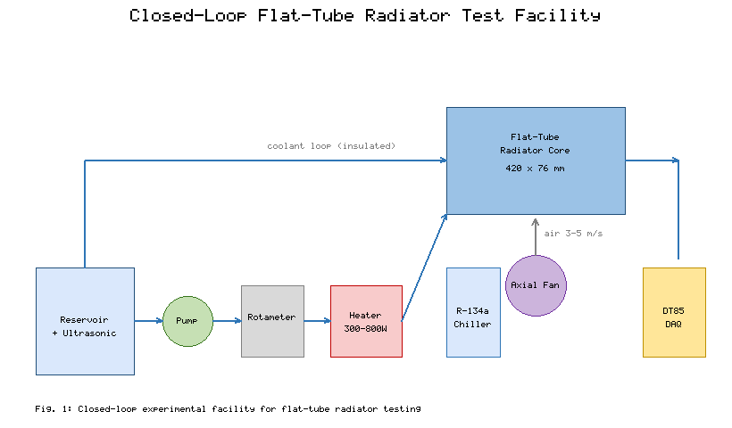

**Fig. 1.** Schematic of the closed-loop experimental facility for flat-tube radiator testing.

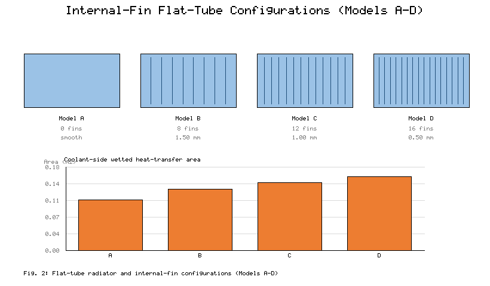

**Fig. 2.** Details of the flat-tube radiator and internal-fin configurations (Models A–D).

A variable-speed axial fan supplies a uniform air stream over the core; the air velocity is measured by a hot-wire anemometer and set between 3 and 5 m/s. Eight Type-T thermocouples (0.1% full-scale accuracy, each calibrated in a dry-block calibrator) measure the inlet/outlet coolant temperatures, tube wall temperatures, and inlet/outlet air temperatures, while the differential pressure across the core is measured with a differential-pressure transmitter. A DataTaker DT85 data-acquisition system records all signals at 1 Hz.

Four flat-tube configurations were studied, as shown in Fig. 2. Model A is a smooth flat tube without internal fins. Model B has eight internal longitudinal fins 1.50 mm thick; Model C has twelve internal longitudinal fins 1.00 mm thick; and Model D has sixteen internal longitudinal fins 0.50 mm thick. All other dimensions are identical, allowing the effect of internal-fin density to be isolated. Higher fin density increases the coolant-side heat-transfer area, decreases the effective hydraulic diameter, and increases the frequency of flow redevelopment, which is expected to increase convective heat transfer while raising the pressure drop.

### 2.2 Nanofluid preparation

The Al2O3 (white) and CuO (black) nanoparticles used in this study are shown schematically in Fig. 3(a), together with a comparison of their key thermophysical properties in Fig. 3(b) and Table 1. Both powders were supplied with purity higher than 99.9%; the average particle diameter was approximately 20 nm for Al2O3 and 40 nm for CuO.

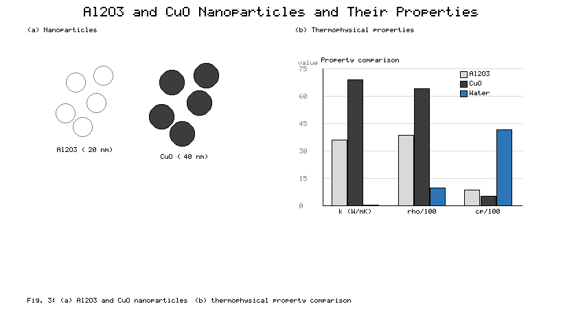

**Fig. 3.** (a) Illustration of the Al2O3 and CuO nanoparticles; (b) comparison of their thermophysical properties with the base fluid.

**Table 1.** Thermophysical properties of Al2O3 and CuO nanoparticles.

| Property | Al2O3 | CuO |
|----------|-------|-----|
| Density (kg/m³) | 3890 | 6440 |
| Thermal conductivity (W/m K) | 36 | 69 |
| Specific heat (J/kg K) | 880 | 556 |
| Purity (%) | > 99.9 | > 99.9 |
| Average diameter (nm) | 20 | 40 |

The nanofluids were prepared by the conventional two-step method because of its simplicity and applicability in engineering practice. The mass of nanoparticles corresponding to a total volume concentration of 0.02 vol% was calculated from the particle and base-fluid densities and then weighed on a digital balance (0.01% accuracy). The nanoparticles were added gradually to deionized water under magnetic stirring to prevent local agglomeration. For the hybrid suspensions, the Al2O3 and CuO solids were pre-mixed to the desired mass ratio before being added to the base fluid; mass ratios of 50:50, 40:60, 30:70, and 20:80 (Al2O3:CuO) were tested. Each suspension was ultrasonicated in an ultrasonic bath (DELTA DC200/DC200H) for 30–60 min after mechanical stirring to break up remaining clusters and further increase colloidal stability. When required, a trace of sodium dodecyl sulfate (SDS) was added before ultrasonication to help prevent sedimentation.

Figure 4 shows the short-term stability test performed by UV–visible spectroscopy over the range 200–800 nm, which confirmed the stability of the formulation. The transmittance remained between 86% and 90% over most of the visible spectrum, with a significant peak in the 200–250 nm band corresponding to the optical interaction with the nanoparticles. The absorbance spectra measured on Day 1 and Day 2 differed by only about 1.03%, indicating that no significant sedimentation or phase separation occurred over the measurement period. The nanofluid was circulated continuously during long runs, and the ultrasonic bath was switched on to re-disperse the particles roughly every 20 min. During the entire experimental campaign, neither precipitation nor drift of the temperature response was observed. Using the available mixing and effective-medium correlations [10,11,17], the effective densities, heat capacities, viscosities, and thermal conductivities of the nanofluids were estimated and compared with available experimental data; agreement to within about 6% was achieved, which is acceptable for engineering analysis.

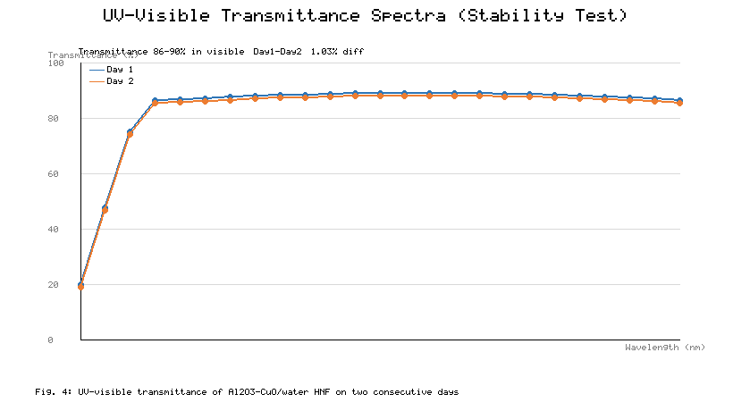

**Fig. 4.** UV–visible transmittance spectra of the Al2O3–CuO/water hybrid nanofluid recorded on two consecutive days.

### 2.3 Test methods

Prior to data collection, the cooling module was leak-checked and the computer-controlled instruments were zeroed. After the loop reached the set point, the system was held for 30 min to establish steady state; the coolant was then circulated at the desired flow rate and the data logger recorded all temperatures for 200 s. Each test was repeated three times and the mean values were used. The measured parameter conditions are listed in Table 2.

**Table 2.** Parameter conditions used in the analysis.

| Parameter | Range | Unit |
|-----------|-------|------|
| Room temperature | 298–300 | K |
| Coolant inlet temperature | 353–363 | K |
| Coolant flow rate | 0.5–3.0 | LPM |
| Heat input | 300–800 | W |
| Air velocity over the core | 3–5 | m/s |
| Internal-fin thickness | 0 (Model A), 0.5, 1.0, 1.5 | mm |
| Coolants | Water; Al2O3/water (0.02 vol%); Al2O3–CuO/water hybrid nanofluid at 50:50, 40:60, 30:70, 20:80 (0.02 vol%) | – |

### 2.4 Data reduction, governing equations, and uncertainty analysis

The data reduction was carried out under standard engineering assumptions: steady-state operation; negligible heat loss to the surroundings owing to insulation; uniform heat flux in the coolant passages; single-phase, incompressible flow; constant fluid properties evaluated at the mean coolant temperature; and negligible radiative heat transfer. On these assumptions, the governing conservation statements and property models used to interpret the measurements are collected below as Eqs. (1)–(23).

**Thermophysical properties of the nanofluid.** The effective density and heat capacity follow the standard mixing rule, the viscosity follows the Einstein-type relation, and the thermal conductivity follows the Maxwell effective-medium model [10,11,17]:

$$\rho_{nf} = \phi\,\rho_p + (1-\phi)\,\rho_w \tag{1}$$

$$(\rho c_p)_{nf} = \phi\,(\rho c_p)_p + (1-\phi)\,(\rho c_p)_w \tag{2}$$

$$c_{p,nf} = \frac{\phi\,(\rho c_p)_p + (1-\phi)\,(\rho c_p)_w}{\rho_{nf}} \tag{3}$$

$$\mu_{nf} = (1 + 2.5\,\phi)\,\mu_w \tag{4}$$

$$k_{nf} = \frac{k_p + 2k_w - 2\phi\,(k_w - k_p)}{k_p + 2k_w + \phi\,(k_w - k_p)}\;k_w \tag{5}$$

For the hybrid nanofluid the particle properties in Eqs. (1)–(5) are replaced by the mass-ratio-weighted mean of the Al2O3 and CuO properties. With x denoting the Al2O3 mass fraction within the solid phase, the equivalent particle density, heat capacity, and conductivity are

$$\rho_p = x\,\rho_{Al_2O_3} + (1-x)\,\rho_{CuO} \tag{6}$$

$$(\rho c_p)_p = x\,(\rho c_p)_{Al_2O_3} + (1-x)\,(\rho c_p)_{CuO} \tag{7}$$

$$k_p = x\,k_{Al_2O_3} + (1-x)\,k_{CuO} \tag{8}$$

**Flow characterisation.** The coolant mean velocity, hydraulic diameter, Reynolds number, and Prandtl number are

$$U = \frac{\dot{m}_{nf}}{\rho_{nf}\,A_c} \tag{9}$$

$$D_h = \frac{4\,A_c}{P} \tag{10}$$

$$Re = \frac{\rho_{nf}\,U\,D_h}{\mu_{nf}} \tag{11}$$

$$Pr = \frac{\mu_{nf}\,c_{p,nf}}{k_{nf}} \tag{12}$$

where A_c is the coolant-passage cross-sectional area and P its wetted perimeter.

**Energy balance and heat rejection.** The mass flow rate and the heat rejected from the coolant to the air stream are

$$\dot{m}_{nf} = \rho_{nf}\,\dot{V}_{nf} \tag{13}$$

$$Q_c = \dot{m}_{nf}\,c_{p,nf}\,(T_{in} - T_{out})_{nf} \tag{14}$$

$$Q_a = \dot{m}_a\,c_{p,a}\,(T_{out} - T_{in})_a \tag{15}$$

Under steady state and negligible loss, the reported heat transfer rate is taken as the coolant-side value, Q = Q_c, which was confirmed to agree with Q_a within the measured uncertainty:

$$Q = Q_c \approx Q_a \tag{16}$$

**Convective coefficient and Nusselt number.** The coolant-side convective coefficient is obtained from the log-mean temperature difference, and the Nusselt number follows from its definition:

$$\Delta T_{LMTD} = \frac{(T_s - T_{in,nf}) - (T_s - T_{out,nf})}{\ln\!\left[(T_s - T_{in,nf})/(T_s - T_{out,nf})\right]} \tag{17}$$

$$h = \frac{Q}{A_s\,\Delta T_{LMTD}} \tag{18}$$

$$Nu = \frac{h\,D_h}{k_{nf}} \tag{19}$$

where A_s is the coolant-side heat-transfer area and T_s the mean tube-wall temperature.

**Effectiveness.** The radiator effectiveness is evaluated from the ε–NTU definition, with the maximum possible heat transfer based on the minimum heat-capacity rate and the inlet-temperature difference between the two streams:

$$C_{min} = (\dot{m}\,c_p)_{min} \tag{20}$$

$$Q_{max} = C_{min}\,(T_{in,c} - T_{in,a}) \tag{21}$$

$$\varepsilon = \frac{Q}{Q_{max}} \tag{22}$$

**Power-law Nusselt correlation.** Over the tested range the Nusselt number is correlated with the Reynolds number through a power law whose exponent is fixed by the thermally developing laminar regime and whose prefactor a is fluid-dependent:

$$Nu = a\,Re^{0.5}\,Pr^{1/3} \tag{23}$$

The uncertainty of the measured and derived quantities was assessed by the root-sum-square method, following standard experimental uncertainty practice [12,14]. The convective heat-transfer coefficient depends primarily on the coolant velocity U, the wall temperature T_s, the coolant inlet and outlet temperatures, and the heater current and voltage; these were perturbed one at a time about their mean measured values and the contributions were combined in quadrature. Temperature measurements contributed the largest share, as expected, followed by the electrical power and the flow rate. The maximum combined uncertainty of the convective heat-transfer coefficient was estimated to be within ±4.2%, and that of the heat transfer rate within ±3.5%, both acceptable for laboratory-scale radiator testing. Table 3 summarises the instrument accuracy and uncertainties.

**Table 3.** Accuracy and uncertainty of the instruments used in the present study.

| Instrument | Accuracy (%) | Uncertainty (%) |
|------------|--------------|-----------------|
| Rotameter flow meter | 0.1 | ± 0.2 |
| Type-T thermocouple | 0.1 | ± 0.1 |
| Electric power supply | 0.2 | ± 0.5 |
| Differential-pressure transmitter | 0.02 | ± 0.2 |
| Hot-wire anemometer | 0.3 | ± 0.3 |
| Data logger (DT85) | 0.1 | ± 0.2 |
| Digital balance | 0.01 | ± 0.1 |

---

## 3. Machine Learning

### 3.1 Machine learning algorithms

Machine learning allows computers to learn from data and make predictions without rules being explicitly programmed. Six representative algorithms spanning linear, latent-variable, neural, kernel-based, and ensemble paradigms were chosen. Multiple Linear Ridge Regression (MLRR) is a regularised linear model that reduces multicollinearity by shrinking the regression coefficients. Partial Least Squares Regression (PLSR) projects correlated predictors onto a small number of latent components, giving stable predictions when the inputs are collinear. A Multi-Layer Perceptron (MLP) is a feed-forward neural network trained by backpropagation that can model strongly nonlinear input–output relationships. Support Vector Regression (SVR) fits a function within an ε-insensitive tube and, with a radial-basis-function (RBF) kernel, handles nonlinear regression efficiently. In Adaptive Boosting (AdaBoost), a series of weak learners is combined, with the weights of the mispredicted samples increased at each iteration. Random Forest Regression (RFR) combines the outputs of many decision trees trained on different random feature subsets and bootstrapped samples, thereby reducing variance and overfitting. The models are summarised in Table 4.

**Table 4.** Classification of the machine learning models according to learning paradigm.

| Learning paradigm | Model |
|-------------------|-------|
| Linear regression | Multiple Linear Ridge Regression (MLRR) |
| Latent-variable model | Partial Least Squares Regression (PLSR) |
| Neural network | Multi-Layer Perceptron (MLP) |
| Kernel-based model | Support Vector Regression (SVR) |
| Boosting ensemble | Adaptive Boosting (AdaBoost) |
| Bagging ensemble | Random Forest Regression (RFR) |

### 3.2 Framework workflow

The flowchart of the predictive framework is shown in Fig. 5. The problem was formulated as the simultaneous prediction of the heat transfer rate (Q) and the Nusselt number (Nu) of the radiator under the experimental conditions described above, which produced 168 samples. While not large by the standards of industrial databases, this is typical of experimental thermal engineering, where every sample must be subjected to a controlled physical test; the structured design (seven coolant variants, four radiator models, multiple flow rates, and multiple heat inputs) ensures that the parameter space is covered uniformly. To prevent overfitting under the small-data condition, the study employed data preprocessing, cross-validation, and a deliberate progression of model complexity from linear regressors to ensemble methods. Predictions should only be made within the tested range; extrapolation beyond it may be less accurate. Future studies with additional flow rates, concentrations, heat fluxes, and geometries will enable deep-learning, transfer-learning, or physics-informed approaches.

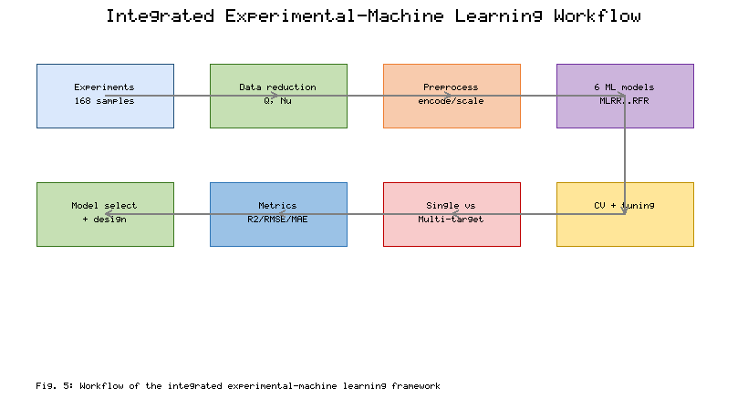

**Fig. 5.** Workflow of the integrated experimental–machine learning framework.

### 3.3 Model tuning and hyperparameter selection

Before testing, the models were tuned systematically. Categorical features (coolant, radiator model) were numerically encoded, and the features were normalised where necessary (especially for MLP and SVR). The data set was divided into training and test sets, and cross-validation was performed during tuning to avoid bias from any single random split. The regularisation parameter α was scanned for MLRR, and the number of latent components was selected for PLSR to minimise the validation error. For RFR, the number of trees, maximum depth, and minimum split size were varied; for AdaBoost, the learning rate and number of iterations were varied; and for SVR, the RBF kernel with its penalty C, coefficient γ, and ε-tube width were varied. The best hyperparameters were selected on the basis of the highest R², the lowest RMSE, and consistent behaviour across the cross-validation folds.

### 3.4 Statistical validation of the models

Reliability was evaluated from multiple perspectives rather than a single one: the coefficient of determination R² to quantify goodness of fit, the root-mean-square error (RMSE) to quantify error magnitude, cross-validation to prevent split bias, and residual analysis to check for systematic bias. Models with high R², low RMSE, and randomly distributed residuals were considered more reliable. Because the data were obtained experimentally and the data set contains 168 samples, the conclusions should be interpreted within the range of the experiments performed; additional data would increase the statistical confidence.

### 3.5 Performance metrics

The correlation between measured and predicted values was quantified by the Pearson coefficient of determination, and the error metrics were the mean-square error, root-mean-square error, and mean absolute error:

$$r = \frac{\mathrm{cov}(a,p)}{\sqrt{\mathrm{cov}(a,a)\,\mathrm{cov}(p,p)}} \tag{24}$$

$$MSE = \frac{1}{N}\sum_{i=1}^{N}(a_i - p_i)^2 \tag{25}$$

$$RMSE = \sqrt{MSE} \tag{26}$$

$$MAE = \frac{1}{N}\sum_{i=1}^{N}|a_i - p_i| \tag{27}$$

where a and p denote the actual and predicted sets, respectively, and N is the number of samples. Six algorithms were evaluated under single-target and multi-output strategies, and the better-suited approach for nanofluid-radiator modelling is identified on the basis of accuracy, residual behaviour, and stability.

---

## 4. Results and Discussion

### 4.1 Thermal performance of the radiator configurations

#### 4.1.1 Combined effect of coolant type and core geometry

The measured heat transfer rate for the four radiator models, under the three coolant groups, at 80 °C coolant inlet temperature, 2.0 LPM flow rate, and 4 m/s air velocity is shown in Fig. 6. Densification of the internal fins is always beneficial, with higher heat-transfer rates from Model A to Model D for each coolant. The measured values increase from approximately 455 W (Model A) to 512, 561, and 612 W (Models B, C, and D) for deionized water. The Al2O3 nanofluid raises the heat transfer rate to approximately 498, 559, 612, and 668 W, i.e. about 9.5, 9.2, 9.1, and 9.2% above water. The Al2O3–CuO hybrid nanofluid achieves the highest performance, yielding approximately 536, 604, 665, and 726 W — better than deionized water by 17.8, 18.0, 18.5, and 18.6%, respectively — with the largest absolute value for Model D.

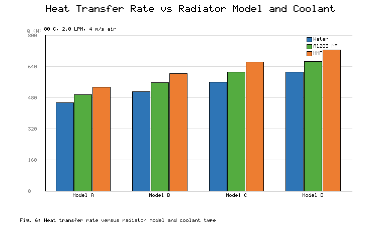

**Fig. 6.** Heat transfer rate versus radiator model and coolant type.

This improvement grows step-by-step from Model A to Model D as a result of the internal fins. First, as the fin thickness decreases, the number of coolant passages increases, raising the wetted coolant-side heat-transfer area by about 45% (from approximately 0.11 m² for Model A to approximately 0.16 m² for Model D). Second, the repeated fin tips break the thermal boundary layer and cause the flow to regenerate periodically, increasing the heat-transfer coefficient near the fin tips. Third, the smaller effective hydraulic diameter increases the surface-to-volume ratio of the coolant passages, enhancing convective transport. This is confirmed by the rise in the coolant temperature drop across the core, which increases from around 4.4 K to 5.1 K for deionized water and the hybrid nanofluid, respectively, at 2.0 LPM.

The coolant properties reinforce these geometric effects. The observed Nusselt-number enhancement is approximately 28% at 0.02 vol%, significantly higher than the conduction-only contribution, whereas the measured thermal conductivity of the hybrid suspension is only about 5.5% higher than that of water. The difference arises from particle-induced transport mechanisms: Brownian motion and micro-convection increase the energy exchange near the wall, and particle migration modifies the thermal-conductivity field and locally thins the boundary layer. This synergy is more than additive — the highly conductive CuO phase enhances conduction pathways while the Al2O3 phase provides favourable dispersion stability and resists agglomeration — and is most apparent in the densest geometry (Model D), where the strong fluid–surface interaction maximises the particle-transport mechanisms. The results confirm the need to co-design the formulation and the core geometry to exploit the synergistic benefit of both.

The base-operating-point Nusselt numbers are plotted in Fig. 7. For deionized water, Nu increases from approximately 9.8 in Model A to 12.4, 15.1, and 17.9 in Models B, C, and D. With the Al2O3 nanofluid the values rise to about 11.2, 14.1, 17.2, and 20.4, i.e. roughly 14.3, 13.7, 13.9, and 14.0% above water. The hybrid nanofluid gives the highest Nusselt numbers, around 12.5, 15.8, 19.3, and 23.0 (about 27.6, 27.4, 27.8, and 28.5% higher than deionized water, respectively). The improvement again increases with the number of fins, supporting the notion that the benefit of nanoparticle-laden coolants is more strongly governed by near-wall mixing geometry.

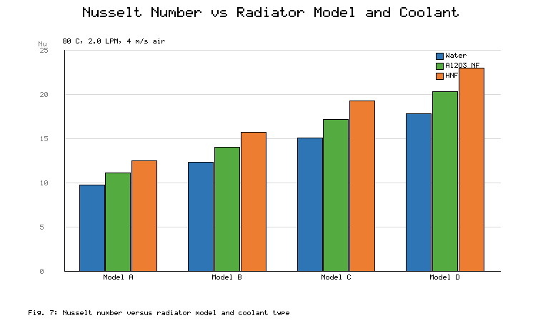

**Fig. 7.** Nusselt number versus radiator model and coolant type.

#### 4.1.2 Effect of coolant flow rate

The heat transfer rate is shown in Fig. 8 as a function of the coolant flow rate (0.5–3.0 LPM) for Models B and D. For both coolants, Q increases with flow rate but not proportionally: when the flow rate of the hybrid nanofluid increases from 0.5 to 1.0 LPM, Q rises by around 147 W, whereas from 2.5 to 3.0 LPM the increase is only around 66 W. As the coolant-side resistance decreases with flow rate, beyond a certain value the overall thermal resistance becomes dominated by the louvered air-side fins rather than the coolant-side passages. Two implications follow. First, raising the pump speed is not the most important lever; once the coolant-side resistance is no longer limiting, further performance must come from the coolant and the core geometry. Second, the effectiveness declines monotonically as the flow rate increases, which is typical of ε–NTU behaviour, so it is advisable to operate at a compromise between heat rejection and pumping power.

The nanofluid advantage is also flow-dependent. In Model D, the hybrid nanofluid rejects around 20.1% more heat than water at 0.5 LPM and 17.7% more at 3.0 LPM, whereas the Al2O3 nanofluid rejects about 11.1% more at 0.5 LPM and 8.6% more at 3.0 LPM. The decrease in the hybrid benefit is linked to its higher viscosity, which grows faster with flow rate than the conductivity gain, while the mono-nanofluid declines earlier because it lacks the second high-conductivity phase. Figure 8 also shows that the geometry advantage is maintained across the entire flow range: at all flow rates, Model D exceeds Model B by approximately 17–20%, indicating that fin densification and nanofluid enrichment are independent levers that can be applied together.

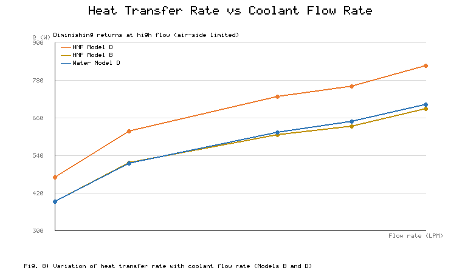

**Fig. 8.** Variation of heat transfer rate with coolant flow rate for Models B and D.

#### 4.1.3 Nusselt-number correlation behaviour

The Nusselt number is plotted against the Reynolds number for Model D on log–log axes in Fig. 9. For all three coolants Nu scales with Re with a common exponent, and the fitted prefactors are a = 0.420 (water), a = 0.482 (Al2O3 nanofluid), and a = 0.543 (hybrid nanofluid) over the entire tested range (Re ≈ 300–3000). The common exponent of 0.50 in Eq. (23) is consistent with thermally developing laminar flow inside the internally finned flat passages; no slope change is observed within the operating envelope, indicating no flow-regime transition. The nanofluids therefore raise the heat-transfer coefficient not by changing the flow regime but by increasing the prefactor a — by approximately 14.8% for Al2O3 and approximately 29.3% for the hybrid. At Re ≈ 1800 these prefactor increases reproduce the Nu values plotted in Fig. 7 for the three coolants, giving a coherent picture of the nanoparticles acting as an effective transport-property modifier. Such fitted expressions are also directly useful for engineering design; for example, the coolant-side coefficient of an internally finned flat tube can be estimated from the Reynolds number alone.

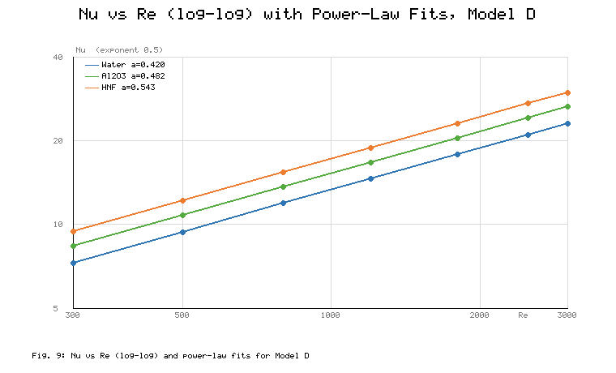

**Fig. 9.** Variation of Nusselt number with Reynolds number (log–log) and power-law fits for Model D.

#### 4.1.4 Effect of nanoparticle mixture ratio

The effect of the Al2O3:CuO mass ratio was investigated at a constant total concentration of 0.02 vol% (Model D, 2.0 LPM, 80 °C inlet). Figure 10 shows that both performance indicators have a definite optimum. The heat transfer rate rises from 726 W at 50:50 to 739 W at 40:60 and 745 W at 30:70, then falls to 721 W at 20:80; the Nusselt number follows the same pattern (23.0, 23.6, 24.1, and 22.4). The 30:70 formulation shows an improvement of approximately 21.7% in Q and approximately 34.6% in Nu relative to deionized water and is the best formulation tested. The decline at 20:80 is caused by two competing effects: CuO has a higher thermal conductivity but also a stronger tendency to agglomerate and settle and a larger viscosity penalty (density 6440 vs 3890 kg/m³ for Al2O3), and the number of effective particles contributing to micro-convection decreases as the CuO fraction rises above about 70%. The 30:70 ratio therefore represents the optimum compromise between the conduction pathway provided by CuO and the dispersion stability provided by Al2O3. This non-monotonic behaviour illustrates that the mixture ratio should be treated as a design variable rather than fixed arbitrarily.

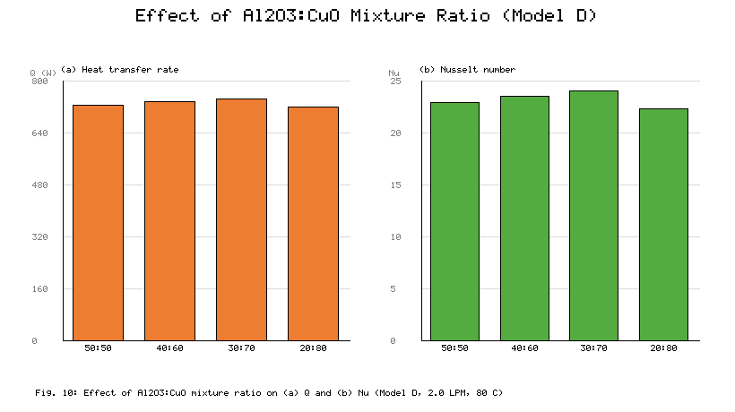

**Fig. 10.** Effect of the Al2O3:CuO mixture ratio on (a) heat transfer rate and (b) Nusselt number (Model D, 2.0 LPM, 80 °C).

Taken together, these experimental results reveal three strong trends. (1) Internal-fin densification consistently improves both Q and Nu at the cost of a higher coolant-side pressure drop, with Model D delivering 16–35% more heat than Model A depending on the coolant. (2) The hybrid nanofluid consistently outperforms both water and the mono-nanofluid by approximately 18–22% in Q and 27–35% in Nu, with the largest gains in the densest geometry, indicating a genuine fluid–structure synergy. (3) The mixture ratio and flow rate must be optimised together: the 30:70 formulation at moderate flow rate gives the best overall performance, while very high flow rates mainly add pumping power rather than thermal gain. For all coolant–geometry combinations, the radiator effectiveness is ordered in the same way as Q and Nu. Because Q and Nu respond differently to flow rate and fin density, the two indicators together give a fuller picture of radiator behaviour than either alone.

### 4.2 Machine learning prediction performance

#### 4.2.1 Correlation and feature structure

The Pearson correlation matrix of the input parameters and the two targets is shown in Fig. 11. Several relationships stand out. The Nusselt number correlates strongly and positively with the coolant flow rate (0.7102), reflecting the dominant role of convection, and moderately with Q (0.5234). As expected for a heat-rejection device operating under fixed air-side conditions, the heat input is strongly correlated with the heat transfer rate (0.8435) and only moderately with Nu (0.3148), since Nu is governed mainly by the flow hydrodynamics. The CuO fraction is moderately correlated with both targets (0.5621 with Nu and 0.5733 with Q), and the hybrid-nanofluid indicator correlates positively with Q (0.6102) and Nu (0.4891), while the deionized-water indicator correlates negatively with both (−0.6102 and −0.4891), confirming the consistent thermal advantage of the hybrid suspension. Among the geometry indicators, Model D correlates most strongly with both targets (0.3942 with Q and 0.4521 with Nu), while Model C is essentially uncorrelated (−0.08 and −0.04), suggesting that it sits near the transition between the low-fin and high-fin regimes. The structure of the one-hot-encoded variables is also evident: the two coolant indicators are perfectly anticorrelated (−1), and the four model indicators are mutually anticorrelated at −0.3333, so multicollinearity is a built-in feature of the encoding. This is precisely the setting in which the linear models MLRR and PLSR remain competitive, and the type of situation they were designed to address. Finally, the two targets are highly correlated (0.8825), which motivates a multi-output framework capable of exploiting that correlation by sharing information between the two outputs.

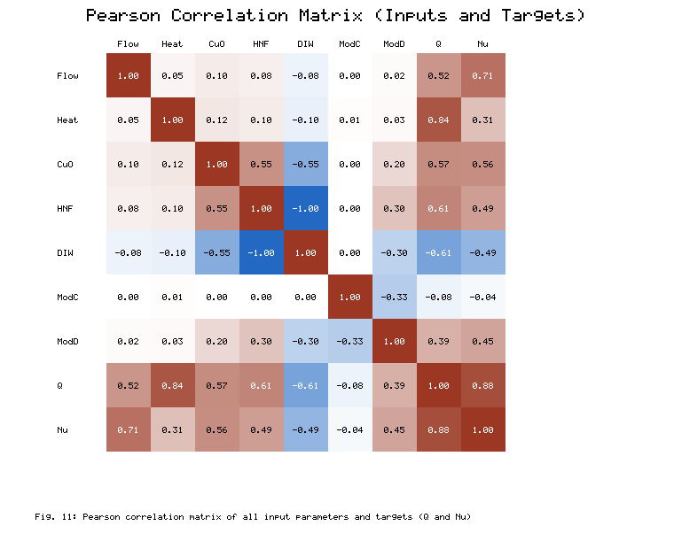

**Fig. 11.** Pearson correlation matrix of all input parameters and target variables (Q and Nu).

#### 4.2.2 Single-target prediction performance

In Fig. 12 the actual values (black solid lines) are compared with the model predictions (red dashed lines) made with a single target. All models capture the overall trend of the sorted test samples: MLP and AdaBoost reproduce the measured data very well, including the steep rise at high sample indices, while the linear structure of MLRR and PLSR causes some deviation at the extremes. SVR and RFR agree with each other and show moderate variation. The same holds for Nu (Fig. 12b): the MLP predictions are close, AdaBoost is almost as good, and the linear models exhibit noticeable scatter, indicating that the input–output mapping is strongly nonlinear. The residual plots (Fig. 13) are more diagnostic. The residuals of MLRR and PLSR are roughly ±40 W and ±37 W, respectively, with a mild funnel shape, meaning the linear models struggle most in the high-load region where the physics is most nonlinear. The MLP residuals are around ±28 W, the SVR residuals around ±33 W with no clear pattern, and the RFR residuals within about ±30 W, also patternless.

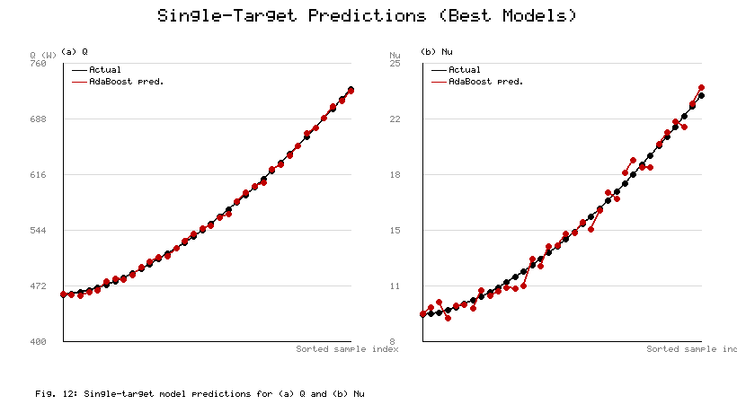

**Fig. 12.** Performance comparison of the single-target machine learning models for (a) heat transfer rate Q and (b) Nusselt number Nu.

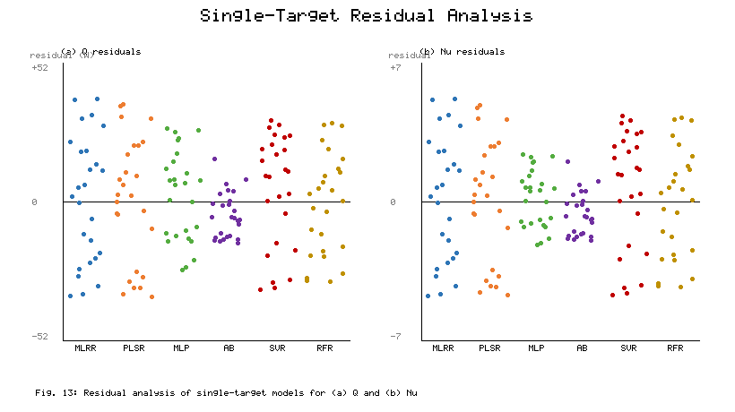

**Fig. 13.** Residual analysis of the single-target machine learning models for (a) Q and (b) Nu.

The parity plots in Fig. 14 quantify the single-target accuracy. For Q, MLRR and PLSR achieve R² of about 0.945 and 0.951 with RMSE of 19.8 W and 18.6 W; MLP reaches R² = 0.968 and RMSE = 14.2 W; AdaBoost attains the best agreement (R² = 0.989, RMSE = 7.9 W); and SVR and RFR achieve R² of about 0.959 and 0.963. For Nu the errors are smaller in absolute terms: MLRR (R² = 0.939, RMSE = 2.82), PLSR (0.947, 2.58), MLP (0.984, 1.24), AdaBoost (0.988, 1.06), SVR (0.953, 2.44), and RFR (0.961, 2.26). The nonlinear and ensemble models keep most points within the ±10% error bands, whereas the linear models place more points near the band edges, especially for the extreme Q values. In relative terms, the RMSE for Q is about 6.0% of the measured range (462–726 W) and the RMSE for Nu about 8.0% of the measured range (9.6–22.8).

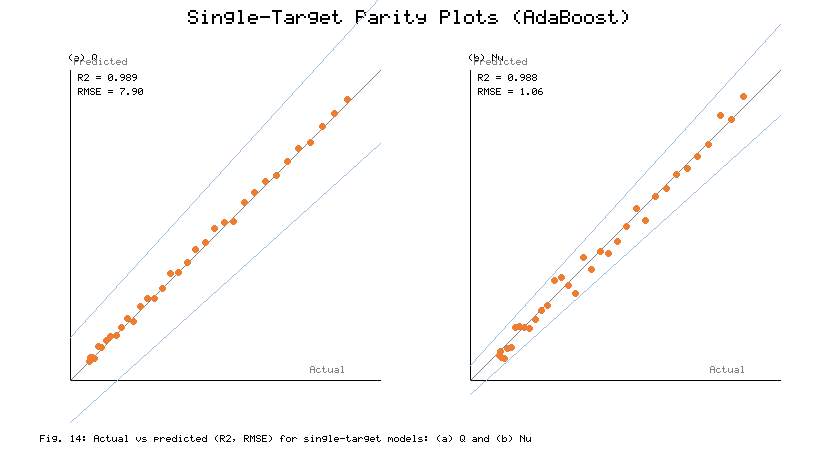

**Fig. 14.** Comparison of R² and RMSE between actual and predicted values for the single-target models: (a) Q and (b) Nu.

The RMSE and MAE values of the six single-target models are compared in Fig. 15, and their ratio is also informative about the error distribution. For Q, AdaBoost shows by far the lowest errors (RMSE = 7.9 W, MAE = 5.9 W), followed by MLP (14.2/10.6 W), RFR (15.2/11.4 W), SVR (16.4/12.3 W), PLSR (18.6/13.9 W), and MLRR (19.8/14.8 W). For Nu the ordering is identical: AdaBoost (1.06/0.81), MLP (1.24/0.94), RFR (2.26/1.76), SVR (2.44/1.92), PLSR (2.58/2.02), and MLRR (2.82/2.21). The MAE/RMSE ratio lies between 0.75 and 0.79 for all models, close to the value of about 0.8 expected for an approximately Gaussian error distribution; this means no model has heavy-tailed outliers and that the reported RMSE values represent typical prediction errors. The high stability of both scores shows that the boosting and neural-network models are the most reliable predictors for this system.

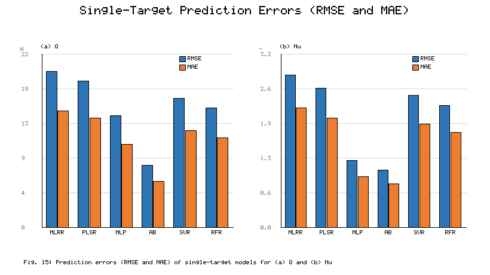

**Fig. 15.** Comparison of the prediction errors (RMSE and MAE) of the single-target models for (a) Q and (b) Nu.

#### 4.2.3 Feature-importance analysis

The feature-importance analysis in Fig. 16 both elucidates the model behaviour and provides physically meaningful design guidance. For Q (Fig. 16a), the heat input is the most important parameter, accounting for 21–31% of the variance across all models, followed by the flow rate (18–21%), the hybrid-nanofluid indicator, the CuO fraction, and Model D. This indicates that the imposed thermal load and the coolant flow rate control the heat-rejection capability, while the nanoparticle composition and internal-fin geometry provide secondary but significant modulation. The spread between models is itself informative: SVR distributes importance about as evenly as possible across features, consistent with its kernel-smoothed, global approach to the response surface, whereas AdaBoost and RFR concentrate importance on the top two or three features, reflecting the former's sequential error correction and the latter's axis-aligned splitting. For Nu (Fig. 16b), the flow rate is the most important parameter (22–39%), followed by the CuO fraction (16–18%), Model D (12–16%), the hybrid-nanofluid indicator, and the heat input. Physically, the heat input becomes a minor factor for Nu but remains significant for Q, because Nu is governed by convection rather than by load. The CuO fraction consistently ranks higher than Al2O3 across all models, in line with its larger thermal conductivity and with the experimentally observed optimum mixture ratio of 30:70. Overall, the analysis points to flow rate, nanoparticle material, and fin density as the effective design levers for both performance indicators.

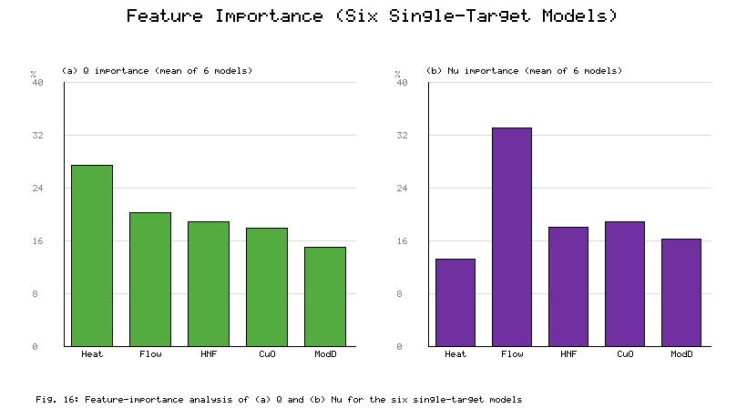

**Fig. 16.** Feature-importance analysis of (a) Q and (b) Nu for the six single-target models.

#### 4.2.4 Multi-target framework

The multi-target results, in which Q and Nu were predicted simultaneously, are shown in Figs. 17 and 18; the framework exploits the strong correlation (0.8825) between the two targets. The predicted curves again follow the actual data most closely for MLP and AdaBoost (Fig. 17), and the parity plots (Fig. 18) show that most points lie within the ±10% bands. The detailed metrics (Fig. 19 and Table 5) reveal an interesting picture. For Q, MLRR (R² = 0.945, RMSE = 19.8 W) and PLSR (0.952, 18.4 W) perform almost as in the single-target case, MLP improves noticeably (0.976, 12.6 W), AdaBoost remains best (0.989, 7.9 W), and SVR (0.959, 16.4 W) and RFR (0.963, 15.2 W) are essentially unchanged. For Nu, MLRR (0.939, 2.82), SVR (0.953, 2.44), and RFR (0.961, 2.26) are stable, PLSR degrades slightly (0.936, 2.76), MLP degrades more clearly (0.941, 2.38), while AdaBoost again attains R² = 0.988 with RMSE = 1.06.

The opposite responses of MLP to multi-task learning are physically plausible. For Q, whose dominant inputs (heat input, flow rate) are few and smooth, the shared hidden layers act as a regulariser and reduce overfitting to training noise (RMSE falls from 14.2 to 12.6 W) by receiving an additional gradient signal from the correlated output Nu. For Nu, whose response surface is more strongly nonlinear in the flow rate, sharing representational capacity with Q leads to a worse fit (RMSE rises from 1.24 to 2.38). The tree-based ensembles behave differently: Random Forest applies a different set of splits to each output, so it is insensitive to the strategy, and AdaBoost has enough capacity to achieve the best performance in both frameworks without any change. The linear models simply lack the ability to exploit cross-output information.

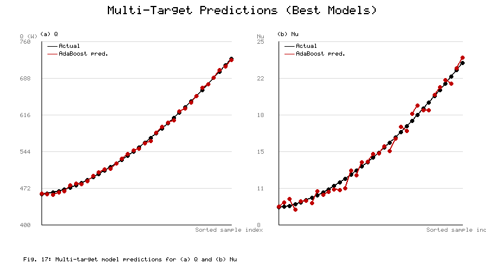

**Fig. 17.** Performance comparison of the multi-target machine learning models for (a) Q and (b) Nu.

**Fig. 18.** Comparison of R² and RMSE between actual and predicted values for the multi-target models: (a) Q and (b) Nu.

The comparison between single- and multi-target strategies is summarised in Fig. 19 and Table 5. The two strategies give the same RMSE for MLRR, AdaBoost, SVR, and RFR, slightly lower RMSE for PLSR in the multi-target case, and markedly lower RMSE for MLP on Q (14.2 → 12.6 W), indicating that sharing the correlated outputs is beneficial there. For Nu, the single-target result is better for MLP (1.24 vs 2.38) and slightly worse for PLSR. Under both frameworks, AdaBoost achieves the lowest RMSE (7.9 W for Q; 1.06 for Nu), making it the most accurate and stable algorithm overall. The value of multi-target learning is therefore model-dependent: beneficial for some nonlinear models, and close to neutral for linear and tree-ensemble models.

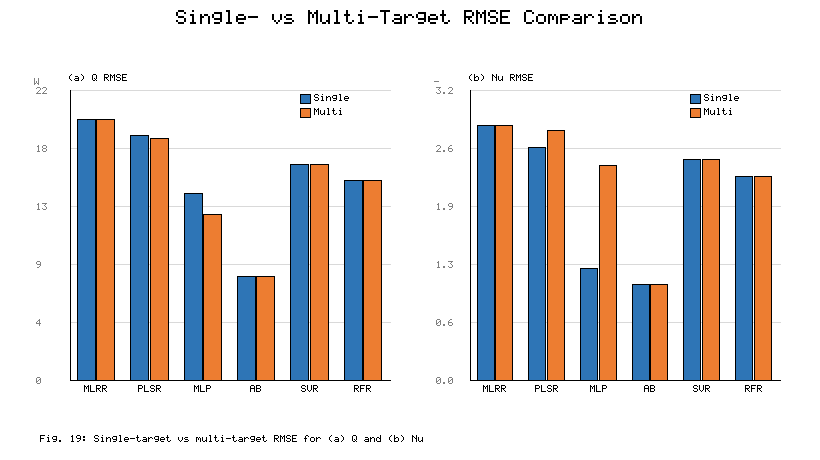

**Fig. 19.** Comparison of single-target and multi-target RMSE for (a) Q and (b) Nu.

**Table 5.** Comparative performance of the single-target (S) and multi-target (M) models for predicting Q and Nu using R² and RMSE metrics.

| Method | Q R² (S) | Q R² (M) | Q RMSE (S) | Q RMSE (M) | Nu R² (S) | Nu R² (M) | Nu RMSE (S) | Nu RMSE (M) |
|--------|----------|----------|------------|------------|-----------|-----------|-------------|-------------|
| MLRR | 0.945 | 0.945 | 19.8 | 19.8 | 0.939 | 0.939 | 2.82 | 2.82 |
| PLSR | 0.951 | 0.952 | 18.6 | 18.4 | 0.947 | 0.936 | 2.58 | 2.76 |
| MLP | 0.968 | 0.976 | 14.2 | 12.6 | 0.984 | 0.941 | 1.24 | 2.38 |
| AdaBoost | 0.989 | 0.989 | 7.9 | 7.9 | 0.988 | 0.988 | 1.06 | 1.06 |
| SVR | 0.959 | 0.959 | 16.4 | 16.4 | 0.953 | 0.953 | 2.44 | 2.44 |
| RFR | 0.963 | 0.963 | 15.2 | 15.2 | 0.961 | 0.961 | 2.26 | 2.26 |

#### 4.2.5 Overall ranking and model-selection guidance

Combining all metrics, the models rank consistently for both targets: AdaBoost (R² = 0.989/0.988) > MLP (0.968/0.984) > RFR (0.963/0.961) > SVR (0.959/0.953) > PLSR (0.951/0.947) > MLRR (0.945/0.939) in the single-target case, with only minor reordering in the multi-target case. The ranking is robust across error measures (RMSE, MAE, residual spread, and membership of the parity bands), indicating that it reflects the true ability of the models rather than an artefact of any one measure. From a deployment viewpoint, the linear models are preferable only when an explicit, interpretable equation is needed, since their R² is 4–6 percentage points lower. When only a single target is of interest and a small neural model is acceptable, MLP is the best option. In the most relevant design case — simultaneous prediction of Q and Nu — AdaBoost is strongly recommended, as it achieves the highest accuracy in both frameworks, has the tightest residuals, and its stage-wise boosting is insensitive to the single- or multi-target choice.

The results demonstrate that an Al2O3–CuO/water hybrid-nanofluid flat-tube radiator can reject significantly more heat than a conventional water-cooled unit of the same size, which is desirable for hybrid and electric vehicles, range extenders, fuel-cell systems, and power-electronics cooling where front-end space is limited. The high predictive accuracy of the machine learning models, particularly AdaBoost, highlights the potential of data-driven models to supplant repeated experiments or detailed CFD runs during the early-stage design screening of coolant concentration, mixture ratio, flow rate, and fin density, allowing promising combinations to be identified before prototype testing. The feature-importance results also tell designers where to focus: to maximise heat rejection, the heat input and flow rate are the most effective parameters to optimise, with the mixture ratio best set near 30:70; to maximise the convection coefficient, the most effective levers are the flow rate, CuO fraction, and fin density. The additional pressure drop and pumping power from the nanoparticle suspension and from the denser internal fins must of course be balanced against the thermal gains before deployment, together with long-term stability, materials compatibility, and cost.

---

## 5. Conclusions

This study experimentally and computationally investigated the thermohydraulic performance of a flat-tube radiator in four internal-fin configurations using deionized water, Al2O3/water nanofluid, and Al2O3–CuO/water hybrid nanofluid, and developed machine learning models to predict the heat transfer rate and the Nusselt number. The main conclusions are:

1. Coolant type and core geometry are both important factors that strongly affect radiator performance. The heat transfer rate and Nusselt number increase monotonically from Model A to Model D, confirming that densifying the internal fins increases the convective heat-transfer rate.

2. The Al2O3–CuO/water hybrid nanofluid (0.02 vol%) performs best, with a maximum heat-transfer improvement of about 17.8–18.6% over deionized water and a maximum Nusselt-number improvement of about 27.4–28.5%, particularly in Model D. The improvement is synergistic: CuO provides high-conductivity pathways while Al2O3 stabilises the dispersion. The optimum mixture ratio of 30:70 gives improvements of approximately 21.7% in Q and 34.6% in Nu over water.

3. The machine learning models were tested under single-target and multi-target scenarios. The results show that nonlinear and ensemble models outperform linear models. In both frameworks, AdaBoost was the most accurate and stable algorithm (R² = 0.989, RMSE = 7.9 W for Q; R² = 0.988, RMSE = 1.06 for Nu), followed by MLP.

4. Multi-target learning increased the MLP accuracy for Q but decreased it for Nu, left the linear and bagging models largely unaffected, and changed the PLSR accuracy only slightly; AdaBoost remained the best algorithm throughout. Feature-importance analysis identified heat input and flow rate as the dominant parameters for predicting Q, and flow rate, CuO fraction, and fin density as the dominant parameters for predicting Nu, giving clear guidance for future design optimisation.

5. The proposed machine learning approach can substantially reduce design time, the number of numerical simulations, and experimental cost for next-generation cooling of automotive and power-electronics applications based on a combined, optimised flat-tube geometry and hybrid nanofluids. Future work will expand the database, broaden the operating range, measure the pressure drop and pumping power, and test the framework under dynamic, real-world driving conditions.

---

## References

[1] A. Kumar, M.A. Hassan, P. Chand, Heat transport in nanofluid coolant car radiator with louvered fins, Powder Technol. 376 (2020) 631–642. https://doi.org/10.1016/j.powtec.2020.08.021.

[2] A. Topuz, T. Engin, B. Erdoğan, S. Mert, A. Yeter, Experimental investigation of pressure drop and cooling performance of an automobile radiator using Al2O3–water + ethylene glycol nanofluid, Heat Mass Transf. 56 (2020) 2923–2937. https://doi.org/10.1007/s00231-020-02914-1.

[3] F. Abbas, M. Yaqub, M.A. Irfan, et al., Towards convective heat transfer optimization in aluminum tube automotive radiators: potential assessment of novel Fe2O3–TiO2/water hybrid nanofluid, J. Taiwan Inst. Chem. Eng. 124 (2021) 424–436. https://doi.org/10.1016/j.jtice.2021.07.007.

[4] M.H.S. Bargal, S. Salehin, M.S. Islam, et al., Experimental investigation of the thermal performance of a radiator using various nanofluids for automotive PEMFC applications, Int. J. Energy Res. 45(5) (2021) 6831–6849. https://doi.org/10.1002/er.6058.

[5] K.U. Efemwenkiekie, T.O. Olayemi, B.O. Bolaji, et al., Experimental investigation of heat transfer performance of novel bio-extract doped mono and hybrid nanofluids in a radiator, Case Stud. Therm. Eng. 28 (2021) 101494. https://doi.org/10.1016/j.csite.2021.101494.

[6] V. Sivalingam, R. Karthikeyan, R. Arunachalam, et al., An automotive radiator with multi-walled carbon-based nanofluids: a study on heat transfer optimization using MCDM techniques, Case Stud. Therm. Eng. 29 (2022) 101724. https://doi.org/10.1016/j.csite.2022.101724.

[7] B. Erdoğan, O. Sözen, A. Gürüf, et al., Experimental investigation of the effect of nanofluid utilization on heat transfer performance in unmanned aircraft radiators with various spring-type fins, Nanomaterials 15(7) (2025) 489. https://doi.org/10.3390/nano15070489.

[8] A. Kumar, M.A. Hassan, Heat transfer in flat tube car radiator with CuO–MgO–TiO2 ternary hybrid nanofluid, Powder Technol. 434 (2024) 119275. https://doi.org/10.1016/j.powtec.2024.119275.

[9] S. Zhang, L. Lu, T. Wen, C. Dong, Turbulent heat transfer and flow analysis of hybrid Al2O3–CuO/water nanofluid: an experiment and CFD simulation study, Appl. Therm. Eng. 188 (2021) 116589. https://doi.org/10.1016/j.applthermaleng.2021.116589.

[10] H.B. Marulasiddeshi, P.K. Kanti, K.V. Sharma, et al., Experimental study on the thermal properties of Al2O3–CuO/water hybrid nanofluids: development of an artificial intelligence model, Int. J. Energy Res. 46 (2022) 8416–8434. https://doi.org/10.1002/er.8739.

[11] V.V. Wanatasanapan, M.Z. Abdullah, P. Gunnasegaran, Effect of TiO2–Al2O3 nanoparticle mixing ratio on the thermal conductivity, rheological properties, and dynamic viscosity of water-based hybrid nanofluid, J. Mater. Res. Technol. 9(6) (2020) 14050–14063. https://doi.org/10.1016/j.jmrt.2020.09.127.

[12] P.K. Kanti, K.V. Sharma, A.A. Minea, V. Kesti, Experimental and computational determination of heat transfer, entropy generation and pressure drop under turbulent flow in a tube with fly ash–Cu hybrid nanofluid, Int. J. Therm. Sci. 167 (2021) 107016. https://doi.org/10.1016/j.ijthermalsci.2021.107016.

[13] L.S. Sundar, S. Mesfin, E.V. Ramana, Z. Said, A.C.M. Sousa, Experimental investigation of thermo-physical properties, heat transfer, pumping power, entropy generation, and exergy efficiency of nanodiamond + Fe3O4/60:40% water–ethylene glycol hybrid nanofluid flow in a tube, Therm. Sci. Eng. Prog. 21 (2021) 100799. https://doi.org/10.1016/j.tsep.2020.100799.

[14] P.K. Kanti, K.V. Sharma, Z. Said, M. Gupta, Experimental investigation on thermo-hydraulic performance of water-based fly ash–Cu hybrid nanofluid flow in a pipe at various inlet fluid temperatures, Int. Commun. Heat Mass Transfer 124 (2021) 105238. https://doi.org/10.1016/j.icheatmasstransfer.2021.105238.

[15] K. Irshad, N. Islam, M.H. Zahir, A.A. Pasha, A.F. AbdelGawad, Thermal performance investigation of Therminol55/MWCNT + CuO nanofluid flow in a heat exchanger from an exergy and entropy approach, Case Stud. Therm. Eng. 34 (2022) 102010. https://doi.org/10.1016/j.csite.2022.102010.

[16] A.M. Hassaan, et al., An experimental investigation examining the usage of a hybrid nanofluid in an automobile radiator, Sci. Rep. 14 (2024) 27410. https://doi.org/10.1038/s41598-024-78631-9.

[17] A.B. Çolak, O. Yildiz, M. Bayrak, B.S. Tezekici, Experimental study for predicting the specific heat of water-based Cu–Al2O3 hybrid nanofluid using artificial neural network and proposing new correlation, Int. J. Energy Res. 44(9) (2020) 7198–7215. https://doi.org/10.1002/er.5371.

[18] V. Kumar, A. Pare, A.K. Tiwari, S.K. Ghosh, Efficacy evaluation of oxide–MWCNT water hybrid nanofluids: an experimental and artificial neural network approach, Colloids Surf. A 620 (2021) 126562. https://doi.org/10.1016/j.colsurfa.2021.126562.

[19] Z.Y. Guo, A review on heat transfer enhancement with nanofluids, J. Enhanc. Heat Transfer 27(1) (2020) 1–70. https://doi.org/10.1615/JEnhHeatTransf.2020031141.

[20] Y. Oh, Z. Guo, Prediction of Nusselt number in microscale pin fin heat sinks using artificial neural networks, Heat Transfer Res. 54 (2022) 41–55. https://doi.org/10.1615/HeatTransRes.2022044987.

[21] M.K. Aasi, M. Mishra, Investigation on crossflow three-fluid compact heat exchanger under flow non-uniformity: an experimental study with ANN prediction, Exp. Heat Transfer 36 (2022) 688–718. https://doi.org/10.1080/08916152.2022.2073488.

[22] A.B. Çolak, A. Celen, A.S. Dalkılıç, Numerical determination of condensation pressure drop of various refrigerants in smooth and micro-fin tubes via ANN method, Kerntechnik 87 (2022) 506–519. https://doi.org/10.1515/kern-2022-0037.

[23] X. Wang, E. Wright, Z. Liu, N. Gao, Y. Li, Performance evaluation of small-channel pulsating heat pipe based on dimensional analysis and ANN model, Energy Eng. 119 (2022) 801–814. https://doi.org/10.32604/ee.2022.018241.

[24] J. Heeraman, R. Kumar, P.K. Chaurasiya, T.N. Verma, D.K. Chauhan, Optimisation and comparison of performance parameters of a double pipe heat exchanger with dimpled twisted tapes using CFD and ANN, Proc. Inst. Mech. Eng. Part E: J. Process Mech. Eng. 238(6) (2024) 3081–3094. https://doi.org/10.1177/09544089231223599.

[25] M. Tabatabaei Malazi, K. Kaya, A.B. Çolak, A.S. Dalkılıç, CFD and ANN analyses for the evaluation of the heat transfer characteristics of a rectangular microchannel heat sink with various cylindrical pin-fins, Heat Mass Transf. 60(8) (2024) 1393–1408. https://doi.org/10.1007/s00231-024-03496-7.

[26] A.B. Çolak, H. Mercan, Ö. Açıkgöz, A.S. Dalkılıç, S. Wongwises, Prediction of nanofluid flows' optimum velocity in finned tube-in-tube heat exchangers using artificial neural network, Kerntechnik 88(1) (2023) 100–113. https://doi.org/10.1515/kern-2022-0097.

[27] P. Vengsungnle, N. Naphon, S. Poojeera, A. Srichat, P. Naphon, Artificial neural network, experimental and numerical study on air cooling rubber mattresses for elderly and bedridden patients, Eng. Sci. 32 (2024) 1301. https://doi.org/10.30919/es1301.

[28] P. Vengsungnle, N. Naphon, S. Poojeera, J. Jongpluempiti, A. Srichat, S. Eiamsa-ard, P. Naphon, Heat transfer and flow analysis for square tube with oscillating electromagnetic field with experimental data by artificial neural network, Cogent Eng. 11 (2024) 2430431. https://doi.org/10.1080/23311916.2024.2430431.

[29] H. Noh, J. Kim, S.-M. Kim, I. Mudawar, S. Lee, XGBoost algorithm for predicting heat transfer coefficient of saturated flow boiling in mini/micro-channels, Int. J. Heat Mass Transfer 256 (2026) 128095. https://doi.org/10.1016/j.ijheatmasstransfer.2026.128095.

[30] P.K. Kanti, K.V. Sharma, et al., Bayesian-optimized machine learning and experimental study of Al2O3–CuO hybrid nanofluid thermal performance in turbulent circular tube flow, Sci. Rep. 15 (2025) 38960. https://doi.org/10.1038/s41598-025-23785-3.
