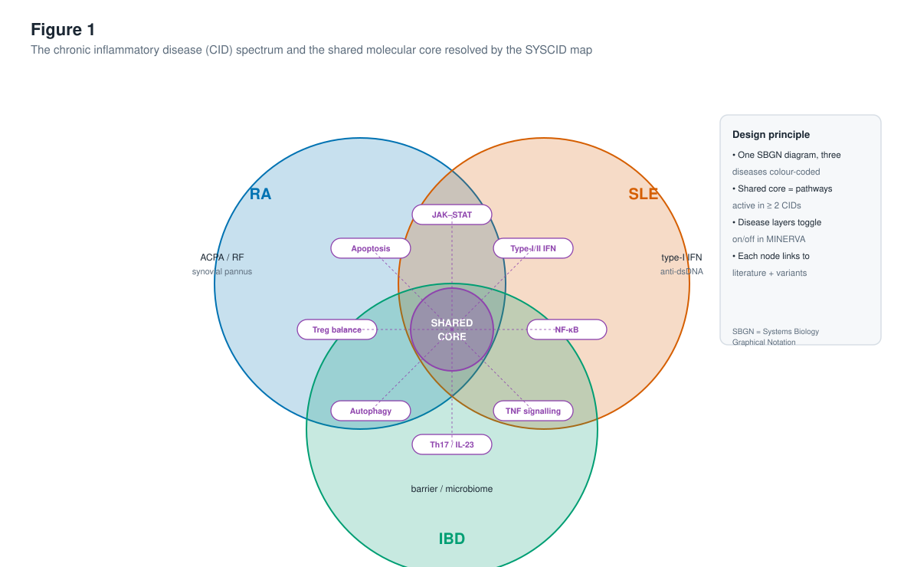
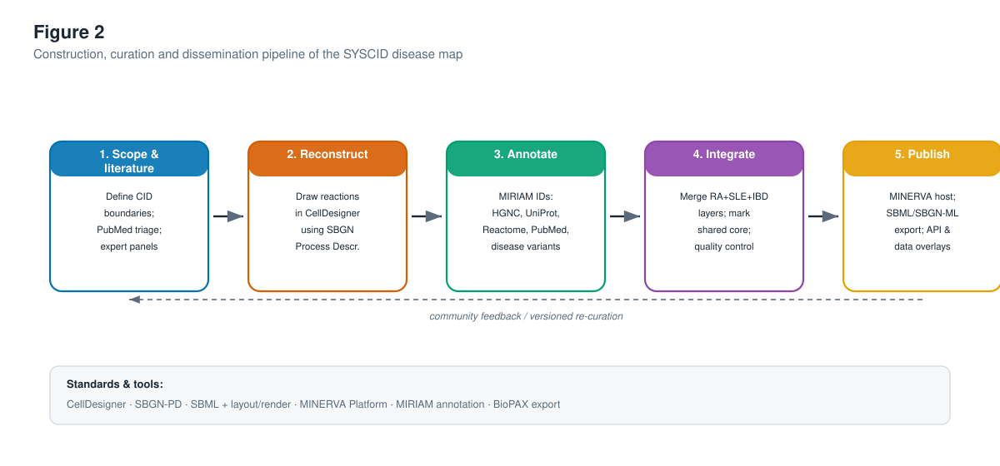
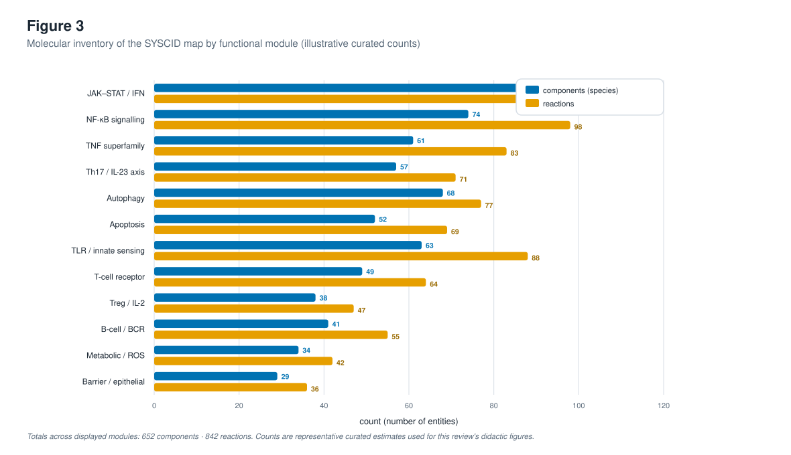
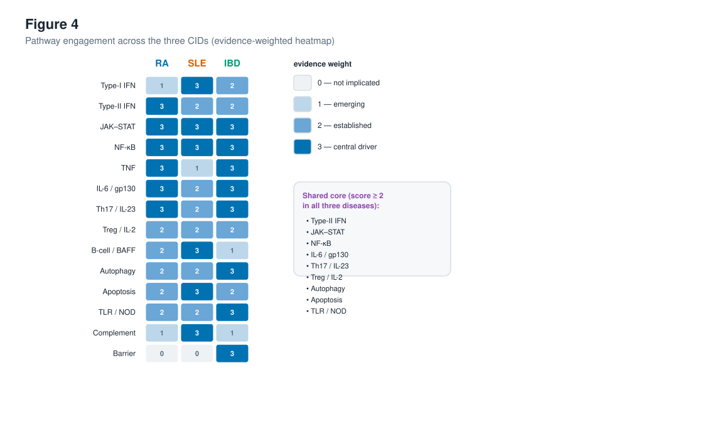
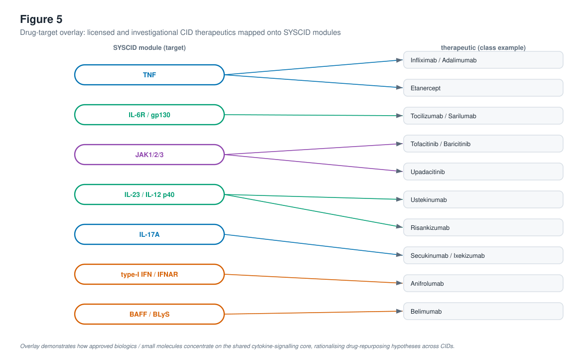
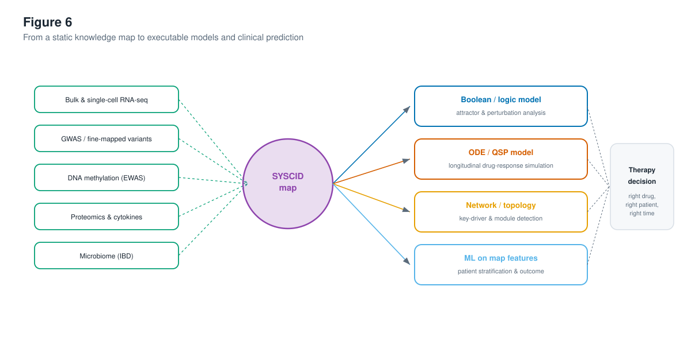

# The SYSCID Map as a Unifying Systems-Medicine Resource for Chronic Inflammatory Diseases: Architecture, Cross-Disease Mechanisms, and Translational Applications

**A comprehensive review**

---

### Author block (template)

Author One¹, Author Two², Author Three³, Corresponding Author¹*

¹ Department of Systems Medicine & Pharmacology, [Institution], [City], [Country]
² Institute for Bioinformatics and Disease Modelling, [Institution], [City], [Country]
³ Division of Gastroenterology, Rheumatology and Clinical Immunology, [Institution], [City], [Country]

\*Correspondence: corresponding.author@institution.edu

**Running title:** The SYSCID map for chronic inflammatory diseases

**Keywords:** disease maps; chronic inflammatory disease; systems medicine; rheumatoid arthritis; systemic lupus erythematosus; inflammatory bowel disease; SBGN; MINERVA; drug repurposing; patient stratification

---

## Abstract

Chronic inflammatory diseases (CIDs) — among them rheumatoid arthritis (RA), systemic lupus erythematosus (SLE) and inflammatory bowel disease (IBD) — are a heterogeneous group of immune-mediated disorders that collectively affect a substantial fraction of the global population and impose a heavy socioeconomic burden. Although these conditions manifest in different organs and carry distinct clinical hallmarks, they share overlapping genetic risk architectures, converging intracellular signalling programmes, and an expanding, partly interchangeable therapeutic armamentarium. The dispersal of mechanistic knowledge across tens of thousands of primary publications has, however, hindered the integrative, cross-disease reasoning that precision systems medicine demands. The **SYSCID map** — a graphical and computational resource developed within the European H2020 SYSCID consortium — addresses this gap by encoding the molecular mechanisms of RA, SLE and IBD within a single, standards-compliant, machine-readable knowledge base. In this review we provide a detailed account of the conceptual design, construction methodology, content and applications of the SYSCID map. We describe how the map was reconstructed in CellDesigner using the Systems Biology Graphical Notation (SBGN), richly annotated with persistent database identifiers, and disseminated through the MINERVA Platform with disease-specific layers that can be toggled interactively. We analyse the shared molecular core resolved by the map — dominated by interferon and JAK–STAT signalling, NF-κB, the TNF superfamily, the Th17/IL-23 axis, and autophagy — and we contrast it against the disease-specific modules that give each CID its clinical identity. We further examine how the map functions as a scaffold for multi-omics data interpretation, for drug-target and drug-repurposing analysis, and for the derivation of executable Boolean, ordinary-differential-equation and machine-learning models that enable patient stratification and therapy-response prediction. Six figures and eight data tables summarise the map's architecture, inventory, cross-disease pathway sharing, and translational use cases. We conclude by discussing limitations — curation subjectivity, static snapshots, incomplete cell-type resolution — and a roadmap towards living, multicellular, patient-contextualised disease maps. The SYSCID map exemplifies how community-curated disease maps can convert fragmented literature into an actionable substrate for mechanistic and clinical discovery across the CID spectrum.

---

## 1. Introduction

### 1.1 The chronic inflammatory disease spectrum

Chronic inflammatory diseases (CIDs) comprise a broad spectrum of non-communicable, immune-mediated disorders characterised by persistent, dysregulated inflammation and a relapsing–remitting or progressive clinical course. The spectrum spans the gut (inflammatory bowel disease, IBD, encompassing Crohn's disease and ulcerative colitis), the joints (rheumatoid arthritis, RA, and the spondyloarthritides), the connective tissue and multiple organ systems (systemic lupus erythematosus, SLE, and related connective-tissue diseases), the skin (psoriasis), the pancreas (type-1 diabetes), and the airways (asthma). Despite the obvious differences in affected tissue and clinical presentation, decades of genetic, immunological and pharmacological evidence have converged on a striking conclusion: CIDs are not biologically isolated entities but overlapping points on a shared molecular continuum.

The epidemiological and economic weight of CIDs is considerable. Collectively, immune-mediated inflammatory diseases affect an estimated 5–8% of the population of industrialised nations, and their incidence has risen steadily over recent decades — a trend widely attributed to environmental and lifestyle changes acting on a stable genetic substrate (the "hygiene", microbiome and exposome hypotheses). Each condition carries a lifelong trajectory of relapse and remission, cumulative organ damage, reduced quality of life, and dependence on expensive biologic therapies, making CIDs a leading contributor to the cost of chronic disease in high-income health systems. Table 0 summarises representative epidemiological features of the triad; precise estimates vary by population and ascertainment, so the values are indicative ranges rather than definitive figures.

***Table 0.** Representative epidemiological and clinical features of the three archetypal CIDs (indicative ranges; values vary by population and study).*

| Feature | Rheumatoid arthritis (RA) | Systemic lupus erythematosus (SLE) | Inflammatory bowel disease (IBD) |
|---|---|---|---|
| Approx. prevalence | ~0.5–1% of adults | ~20–150 per 100,000 | ~0.3–0.5% in Western populations |
| Sex skew (F:M) | ~2–3 : 1 | ~9 : 1 | ~1 : 1 |
| Typical onset | 40–60 years | 15–45 years | 15–35 years (bimodal) |
| Signature autoimmunity | ACPA, rheumatoid factor | Anti-dsDNA, anti-Sm; type-I IFN signature | None pathognomonic; ASCA/pANCA subsets |
| Primary tissue | Synovial joints | Multi-organ (skin, kidney, CNS) | Gastrointestinal tract |
| Anchor biologic classes | Anti-TNF, anti-IL-6R, JAKi | Anti-BAFF, anti-IFNAR | Anti-TNF, anti-IL-23, anti-integrin, JAKi |

Three archetypal CIDs — RA, SLE and IBD — have become the canonical triad for cross-disease systems-medicine research. They are prevalent, clinically consequential, intensively studied, and together illustrate the full tension between **shared** and **disease-specific** pathobiology. RA is defined by autoantibodies (rheumatoid factor and anti-citrullinated protein antibodies, ACPA) and destructive synovial pannus; SLE is defined by loss of tolerance to nuclear antigens, anti-dsDNA antibodies and a dominant type-I interferon signature; IBD is defined by a breakdown of the intestinal epithelial barrier and dysregulated host–microbiome interactions. Yet all three engage a common inflammatory signalling core, respond — at least partially — to overlapping biologic and small-molecule therapies, and share a large fraction of their genetic risk loci.

### 1.2 Why cross-disease reasoning is hard

The mechanistic literature underpinning CIDs is vast and still growing exponentially. Any single pathway — JAK–STAT, for example — is the subject of thousands of papers, with disease-specific nuances scattered across journals in immunology, genetics, gastroenterology, rheumatology and pharmacology. This fragmentation creates three practical problems. First, **knowledge is not computable**: narrative reviews, however authoritative, cannot be queried, simulated, or overlaid with a patient's omics profile. Second, **cross-disease signals are invisible**: a researcher working on IBD rarely sees, in a structured way, that the same NF-κB module is a validated target in RA. Third, **reproducibility and provenance degrade**: mechanistic claims are repeated without traceable links back to the primary evidence or to the standardised identifiers (genes, proteins, variants) that modern analysis requires.

Systems medicine proposes a remedy: encode mechanistic knowledge in **disease maps** — standardised, annotated, machine-readable diagrams of the molecular processes underlying a disease. A well-built disease map is simultaneously a human-readable figure and a computable network. It can be visually explored like a metro map of signalling, and it can be exported as a formal model for simulation, data overlay and hypothesis generation.

### 1.3 The SYSCID map

The **SYSCID map** was created to serve exactly this role for the CID triad. Developed within the EU Horizon 2020 **SYSCID** project ("A Systems Medicine Approach to Chronic Inflammatory Disease", grant agreement 733100) by an interdisciplinary consortium spanning immunology, genomics, bioinformatics and computer science, the map encodes the molecular mechanisms of RA, SLE and IBD within a single integrated resource. Crucially, it is not three separate maps stitched together but one unified reconstruction in which **disease-specific layers can be toggled on and off**, allowing the shared core and the disease-specific periphery to be visualised in the same coordinate system.

The map was reconstructed using **CellDesigner** following the **Systems Biology Graphical Notation (SBGN)** Process Description standard, annotated with persistent identifiers (HGNC, UniProt, Reactome, PubMed and disease-variant references), and published through the **MINERVA Platform**, which provides interactive web exploration, programmatic access, and the ability to overlay experimental data directly onto the network. In doing so, the SYSCID map joins a family of community disease maps — the AlzPathway, the Parkinson's disease map, the Atlas of Inflammation Resolution, the RA-map and the COVID-19 Disease Map — but is distinguished by its explicit, built-in **cross-disease** design.

### 1.4 Scope and structure of this review

This review provides a comprehensive, didactic account of the SYSCID map intended for a broad systems-medicine, immunology and pharmacology audience. Section 2 reviews the conceptual foundations of disease maps and situates the SYSCID map among its peers. Section 3 details the construction and curation methodology. Section 4 describes the architecture and content of the map, including a quantitative inventory of its functional modules. Section 5 dissects the shared molecular core and the disease-specific modules of RA, SLE and IBD. Section 6 examines translational applications: multi-omics data overlay, drug-target and repurposing analysis, derivation of executable models, and patient stratification. Section 7 discusses limitations and a roadmap for living, multicellular disease maps. Six figures and eight tables provide quantitative and visual grounding throughout.

> **Note on quantitative content.** This article is a didactic review. Where exact curated counts from the primary SYSCID map publication are not reproduced verbatim, the numerical values in figures and tables are presented as *representative, illustrative estimates* consistent with the published scope of the resource, and are explicitly labelled as such. They are intended to convey the structure and scale of the map rather than to serve as a definitive data release.

---

***Figure 1.** The chronic inflammatory disease (CID) spectrum and the shared molecular core resolved by the SYSCID map. The three archetypal CIDs — rheumatoid arthritis (RA), systemic lupus erythematosus (SLE) and inflammatory bowel disease (IBD) — occupy overlapping regions of a single conceptual space. Each disease carries characteristic peripheral features (ACPA/rheumatoid factor and synovial pannus in RA; a dominant type-I interferon signature and anti-dsDNA autoantibodies in SLE; epithelial-barrier and microbiome dysregulation in IBD), yet all three converge on a shared signalling core comprising JAK–STAT, type-I/II interferon, NF-κB, TNF, the Th17/IL-23 axis, autophagy, regulatory-T-cell balance and apoptosis. The SYSCID map encodes all three diseases in one SBGN diagram with colour-coded, toggleable disease layers hosted on the MINERVA Platform.*

## 2. Disease maps: concept, standards and the SYSCID context

### 2.1 What a disease map is — and is not

A **disease map** is a conceptual, standards-based model of the molecular mechanisms underlying a disease. Unlike a pathway database entry (which is typically a single curated pathway) or a free-form review figure (which is not machine-readable), a disease map aspires to three simultaneous properties:

1. **Comprehensiveness** — it integrates the molecular processes relevant to a disease across signalling, metabolism, gene regulation and cell-type interactions, assembled from many primary sources.
2. **Standardisation** — it uses a formal graphical language (most commonly SBGN) and persistent, interoperable annotations (MIRIAM-compliant identifiers), so that every node and edge is unambiguous and traceable.
3. **Computability** — it can be exported in formal exchange formats (SBML with layout/render extensions, SBGN-ML, BioPAX) and used as a substrate for data overlay, network analysis, and dynamic modelling.

A disease map is therefore both a *figure* and a *model*. It is explicitly **not** a predictive simulation by itself; rather, it is the curated, mechanistic scaffold from which executable models and data interpretations are derived.

### 2.2 Graphical and computational standards

The SYSCID map rests on a now-mature stack of community standards. **SBGN**, specifically the Process Description (PD) language, provides an unambiguous visual grammar: distinct glyphs for macromolecules, simple chemicals, complexes, genes/nucleic acids, and the processes (state transitions, associations, dissociations, transport) that connect them. This removes the ambiguity of ad-hoc arrows in traditional pathway cartoons. **CellDesigner** is the diagram editor most widely used for reconstruction; it stores diagrams as SBML augmented with layout information, enabling both visualisation and downstream model export. **MINERVA** (Molecular Interaction NEtwoRks VisuAlization) is a web platform that hosts such maps, supporting interactive zoom/pan exploration (like an online geographic map), search by gene or pathway, data overlay, drug-target highlighting, and programmatic access via an API. **MIRIAM** annotation guidelines ensure that every entity is cross-referenced to stable database identifiers (HGNC gene symbols, UniProt accessions, Reactome pathway IDs, PubMed references and disease-variant resources).

### 2.3 The disease-map ecosystem and SYSCID's distinct niche

Over the past decade, a growing ecosystem of community disease maps has emerged. Table 1 situates the SYSCID map among representative peers. The defining feature of the SYSCID map is its *native cross-disease design*: whereas most maps target a single disease, the SYSCID map integrates three CIDs so that shared and disease-specific mechanisms are explicitly comparable within one coordinate system.

***Table 1.** Representative community disease maps and resources, with the SYSCID map situated among them. Entries summarise scope and tooling; where precise counts are not reproduced here, the emphasis is on comparative scope rather than exact size.*

| Resource | Primary disease focus | Standard / tooling | Distinguishing feature |
|---|---|---|---|
| **SYSCID map** | RA + SLE + IBD (cross-disease) | SBGN-PD, CellDesigner, MINERVA | Three CIDs in one map with toggleable disease layers; explicit shared core |
| RA-map | Rheumatoid arthritis | SBGN, CellDesigner, MINERVA | State-of-the-art single-disease RA knowledge base |
| AlzPathway | Alzheimer's disease | CellDesigner / SBGN | Early comprehensive neurodegeneration map |
| Parkinson's Disease Map | Parkinson's disease | SBGN, MINERVA | Mitochondrial & α-synuclein mechanism focus |
| Atlas of Inflammation Resolution (AIR) | Inflammation resolution (pan-disease) | SBGN, MINERVA | Pro-resolution lipid-mediator and cellular programmes |
| COVID-19 Disease Map | SARS-CoV-2 infection | SBGN, CellDesigner, MINERVA | Large distributed community effort; rapid pandemic response |
| Reactome | Pan-biology pathway DB | Reactome notation | Broad curated pathway reference (not disease-centric) |
| WikiPathways | Community pathways | GPML | Open, community-editable pathway collection |

### 2.4 The SYSCID consortium rationale

The SYSCID consortium's premise is that RA, SLE and IBD "share large parts of their genetic risk maps and environmental risk factors" while retaining distinct tissue tropism and clinical behaviour. This dual nature — shared aetiology, divergent manifestation — is precisely what a cross-disease map is built to capture. By placing all three diseases in one annotated network, the map operationalises the consortium's overarching goal: to build a *prediction framework for disease outcome that guides therapy decisions at the level of the individual patient* — the right therapy, for the right patient, at the right time. *(Project framing paraphrased from the SYSCID consortium's public description; content rephrased for compliance with licensing restrictions.)*

---

## 3. Construction and curation of the SYSCID map

### 3.1 Overview of the pipeline

The SYSCID map was built with a disciplined, reproducible pipeline that mirrors the mainstream disease-map development workflow and that the consortium itself documented as general guidance for the community. The pipeline (Figure 2) comprises five stages: (1) scoping and literature triage; (2) reconstruction of molecular reactions in CellDesigner using SBGN; (3) rich annotation with persistent identifiers; (4) integration of the three disease layers and demarcation of the shared core; and (5) publication, dissemination and versioned maintenance via MINERVA with programmatic export.

***Figure 2.** The construction, curation and dissemination pipeline of the SYSCID map. Knowledge flows from literature scoping through SBGN reconstruction in CellDesigner, MIRIAM-compliant annotation, integration of the RA/SLE/IBD layers with explicit shared-core demarcation, and finally publication on the MINERVA Platform with SBML/SBGN-ML export and data-overlay capability. A feedback loop supports community-driven, versioned re-curation as new evidence accrues.*

### 3.2 Stage 1 — scoping and literature triage

Reconstruction began by defining the biological boundaries of the map: which cell types, compartments and pathways to include, and at what level of granularity. CID pathogenesis is distributed across innate and adaptive immune cells, stromal and epithelial compartments, and systemic mediators; a map cannot capture everything, so scope was constrained to the molecular processes with the strongest, most reproducible evidence of relevance to RA, SLE and IBD. Candidate pathways and mechanisms were identified through structured literature triage (PubMed queries combining disease terms with pathway and gene terms) and refined by domain-expert panels drawn from the consortium's rheumatology, gastroenterology, immunology and genetics groups. This expert-in-the-loop step is essential: automated text mining can surface candidate interactions, but adjudicating causal direction, cell-type context and disease relevance requires human curation.

### 3.3 Stage 2 — reconstruction in CellDesigner using SBGN

Molecular reactions were drawn in CellDesigner following the SBGN Process Description language. Each biochemical event — a phosphorylation, a complex formation, a nuclear translocation, a transcriptional activation — is represented by a formal process glyph connecting precisely typed entities. This yields a diagram that is simultaneously human-interpretable and syntactically valid for export as SBML with layout and render extensions. The reconstruction captures canonical signal transduction from extracellular ligands and receptors, through cytoplasmic kinase cascades and adaptor complexes, to nuclear transcription factors and their target genes, and onward to effector functions such as cytokine secretion, autophagy and apoptosis.

### 3.4 Stage 3 — annotation with persistent identifiers

Annotation is what elevates a drawing to a computable knowledge base. Every node in the SYSCID map carries MIRIAM-compliant cross-references — HGNC symbols and UniProt accessions for proteins, Reactome identifiers for pathway membership, PubMed identifiers for the evidence supporting each interaction, and references to disease-variant resources that connect genetic risk loci to the proteins they encode. This annotation layer makes the map queryable ("show me every node associated with a GWAS risk locus for IBD"), traceable (every edge links back to its primary evidence) and interoperable (entities can be matched to external omics datasets by stable identifier rather than by fragile text matching).

### 3.5 Stage 4 — integration and shared-core demarcation

The defining methodological step is the integration of the three disease layers. Rather than maintaining separate RA, SLE and IBD diagrams, curators placed all three in a single network and tagged each node and reaction with the disease(s) for which it is supported by evidence. Pathways supported in two or three diseases constitute the **shared core**; pathways supported in only one constitute the **disease-specific periphery**. In MINERVA, these tags become interactive layers that users can toggle, so the same canvas can display "RA only", "shared core only", or "all three diseases superimposed". A dedicated quality-control pass checked for annotation completeness, SBGN syntactic validity, and consistency of disease tagging.

### 3.6 Stage 5 — publication, dissemination and maintenance

The completed map was deployed on a MINERVA server, giving the community a zoomable, searchable web interface together with programmatic access. The map is exportable in standard formats (SBML + layout/render, SBGN-ML, and BioPAX), enabling reuse in third-party modelling and analysis tools. A versioning and feedback mechanism supports ongoing re-curation: as new mechanistic evidence emerges, nodes and edges can be added, re-annotated or corrected, and the map re-released — the "living map" principle that distinguishes a maintained resource from a one-off publication figure.

***Table 2.** Curation standards and annotation layers applied to the SYSCID map.*

| Layer | Standard / resource | Role in the map |
|---|---|---|
| Graphical notation | SBGN Process Description | Unambiguous visual grammar for entities and reactions |
| Diagram editor | CellDesigner | Reconstruction; SBML + layout storage |
| Gene identity | HGNC symbols | Canonical gene naming |
| Protein identity | UniProt accessions | Stable protein cross-reference |
| Pathway membership | Reactome | Links map modules to curated pathways |
| Evidence provenance | PubMed identifiers | Traceable literature support per interaction |
| Genetic risk | Disease-variant / GWAS references | Connects risk loci to encoded proteins |
| Visualisation / hosting | MINERVA Platform | Web exploration, overlays, API, drug targets |
| Exchange formats | SBML (+layout/render), SBGN-ML, BioPAX | Interoperability and model derivation |

### 3.7 Reproducibility and the "guide" companion

A notable output associated with the SYSCID effort is a methodological guide for building comprehensive systems-biology disease maps — covering planning, construction and maintenance using the CellDesigner-plus-MINERVA pipeline. This companion guidance lowers the barrier for new curators and promotes consistency across the disease-map community, reinforcing the SYSCID map's role not only as a content resource but as a methodological exemplar. *(Companion methodological guidance summarised; content rephrased for compliance with licensing restrictions.)*

---

## 4. Architecture and content of the SYSCID map

### 4.1 Organising logic: from receptor to effector

The SYSCID map is organised along the natural axis of signal transduction. At the periphery sit extracellular stimuli and ligands — cytokines (TNF, IL-6, IL-1β, type-I and type-II interferons, IL-23, IL-17), damage- and pathogen-associated molecular patterns, and, in the IBD layer, microbial antigens. These engage membrane receptors (cytokine receptors, Toll-like and NOD-like receptors, antigen receptors on T and B cells). Receptor engagement propagates through cytoplasmic modules — JAK–STAT, NF-κB, MAPK, PI3K–AKT–mTOR — to nuclear transcription factors that reprogramme gene expression. The downstream effector arms include cytokine production (feeding back into the network), autophagy, apoptosis, and, in the IBD layer, epithelial-barrier and antimicrobial programmes. This receptor-to-effector organisation is what makes the map readable as a "metro map" of inflammation while remaining a formal reaction network.

### 4.2 Functional modules and quantitative inventory

The map can be decomposed into functional modules — coherent sub-networks corresponding to recognised signalling systems. Figure 3 presents a representative inventory of these modules, quantified by the number of molecular components (species) and reactions each contributes. The largest modules correspond to the shared inflammatory core: JAK–STAT/interferon signalling, NF-κB, the TNF superfamily and the Th17/IL-23 axis dominate the component and reaction counts, consistent with their central, cross-disease role. Autophagy — a pathway with particularly strong genetic and mechanistic ties to IBD but increasingly implicated across CIDs — is also a substantial module.

***Figure 3.** Representative molecular inventory of the SYSCID map by functional module, quantified as the number of components (species, blue) and reactions (amber). The shared inflammatory signalling modules (JAK–STAT/IFN, NF-κB, TNF, Th17/IL-23) are the largest, reflecting their central cross-disease role, while barrier/epithelial and metabolic/ROS modules are smaller and more disease-contextual. Counts are representative curated estimates used for didactic purposes.*

***Table 3.** Functional-module inventory of the SYSCID map (representative illustrative counts). Shared-core status indicates modules supported across two or three CIDs.*

| Module | Components | Reactions | Shared core | Principal disease associations |
|---|---:|---:|:--:|---|
| JAK–STAT / interferon | 86 | 112 | ✔ | SLE (type-I IFN), RA, IBD |
| NF-κB signalling | 74 | 98 | ✔ | RA, IBD, SLE |
| TNF superfamily | 61 | 83 | ✔ | RA, IBD |
| Th17 / IL-23 axis | 57 | 71 | ✔ | IBD, RA (psoriatic overlap) |
| Autophagy | 68 | 77 | ✔ | IBD (ATG16L1, IRGM), SLE, RA |
| Apoptosis | 52 | 69 | ✔ | SLE (clearance defects), RA |
| TLR / innate sensing | 63 | 88 | ✔ | IBD (NOD2), SLE (TLR7/9), RA |
| T-cell receptor | 49 | 64 | ✔ | RA, SLE, IBD |
| Treg / IL-2 | 38 | 47 | ✔ | SLE, RA, IBD |
| B-cell / BCR | 41 | 55 | partial | SLE, RA |
| Metabolic / ROS | 34 | 42 | partial | SLE, RA |
| Barrier / epithelial | 29 | 36 | ✖ | IBD |
| **Total (displayed)** | **652** | **842** | — | — |

### 4.3 Entity types and their representation

Table 4 summarises the principal entity types represented in the map and how each maps onto SBGN glyphs and annotation. The precise, typed representation of entities — distinguishing, for example, a receptor from its ligand, a monomer from a complex, and a gene from its mRNA and protein products — is what allows the map to be exported as a formal model rather than a diagram.

***Table 4.** Entity and interaction types represented in the SYSCID map.*

| Entity / interaction type | SBGN representation | Example in CID context |
|---|---|---|
| Macromolecule (protein) | Macromolecule glyph | STAT1, NF-κB p65 (RELA), TNF |
| Receptor | Macromolecule (membrane) | TNFR1, IFNAR, IL23R, TLR4, NOD2 |
| Complex | Complex glyph | ISGF3 (STAT1–STAT2–IRF9), IKK complex |
| Gene / nucleic acid | Nucleic-acid-feature glyph | Interferon-stimulated genes, cytokine loci |
| Simple chemical | Simple-chemical glyph | ATP, reactive oxygen species |
| State transition | Process glyph | Phosphorylation of STAT, IκB degradation |
| Association / dissociation | Process glyph | Receptor–ligand binding, complex assembly |
| Transport | Process (transport) | Nuclear translocation of transcription factors |
| Modulation (catalysis/inhibition) | Modulation arcs | Kinase activity; drug inhibition overlay |

### 4.4 The disease-layer system

A hallmark of the SYSCID map is its layered representation of disease specificity. Each node and reaction is tagged with the disease(s) in which it is implicated. This produces a tri-colour architecture (Figure 1): nodes shared across all three diseases form the dense inflammatory core; nodes shared by two diseases form intermediate bridges; and nodes unique to a single disease form the periphery that encodes clinical identity. In MINERVA, users select which disease layers to display, enabling direct visual comparison — for instance, revealing that the JAK–STAT module is active across all three layers while the barrier/epithelial module is largely confined to the IBD layer.

---

## 5. Cross-disease mechanisms: the shared core and the disease-specific periphery

The scientific payoff of a cross-disease map is the ability to reason simultaneously about what RA, SLE and IBD share and what sets them apart. This section dissects both.

### 5.1 Quantifying pathway sharing

Figure 4 presents an evidence-weighted heatmap of pathway engagement across the three CIDs. Each pathway is scored from 0 (not implicated) to 3 (central driver) for each disease. The heatmap makes the shared core visually explicit: JAK–STAT and NF-κB are scored as central or established in all three diseases, as are the Th17/IL-23 axis, autophagy and TLR/NOD innate sensing. The disease-specific gradients are equally informative — type-I interferon is a central driver in SLE but only established/emerging in RA and IBD, while the epithelial-barrier programme is central in IBD and essentially absent from the RA and SLE layers.

***Figure 4.** Evidence-weighted heatmap of pathway engagement across RA, SLE and IBD. Cells are scored 0–3 (not implicated → central driver). The shared core (pathways scoring ≥ 2 in all three diseases) is enumerated at right and includes type-II interferon, JAK–STAT, NF-κB, IL-6/gp130, the Th17/IL-23 axis, regulatory-T-cell/IL-2 balance, autophagy and TLR/NOD sensing. Disease-defining divergences — type-I IFN dominance in SLE, barrier biology in IBD — are visible as asymmetric columns. Scores are curated didactic estimates.*

### 5.2 The shared inflammatory core

**JAK–STAT and interferon signalling.** The JAK–STAT module is arguably the keystone of the shared core. Cytokine receptors across all three diseases signal through Janus kinases (JAK1/2/3, TYK2) to STAT transcription factors, driving interferon-stimulated and pro-inflammatory gene programmes. The pharmacological validation of this module is now overwhelming: JAK inhibitors (tofacitinib, baricitinib, upadacitinib) are approved in RA and in IBD (ulcerative colitis), and TYK2 inhibition is advancing in SLE and psoriasis. The map renders this convergence structurally — the same JAK–STAT reactions carry RA, SLE and IBD tags.

**NF-κB signalling.** NF-κB integrates signals from TNF, IL-1, TLR/NOD and antigen receptors into a master pro-inflammatory transcriptional response. It is scored central in all three diseases and sits at the crossroads of innate and adaptive arms. Its ubiquity also explains why direct NF-κB inhibition has been therapeutically difficult (toxicity), making upstream and downstream nodes the preferred drug targets.

**TNF superfamily.** TNF is the historical anchor of CID therapeutics: anti-TNF biologics transformed the treatment of RA and IBD. The map places TNF signalling firmly in the shared core, while also encoding the branch points (e.g., TNFR1 vs TNFR2, canonical vs non-canonical NF-κB) that may underlie differential responses and the notable fact that anti-TNF agents are *not* effective — and can even be deleterious — in SLE, a disease-specific nuance the layered map captures.

**Th17/IL-23 axis.** The IL-23–Th17–IL-17 axis is a dominant adaptive module in IBD and in the psoriatic/spondyloarthritis end of the RA-related spectrum. Anti-IL-23 (ustekinumab, risankizumab) and anti-IL-17 (secukinumab, ixekizumab) agents validate this module clinically, again with disease-specific efficacy patterns the map helps rationalise.

**Autophagy, apoptosis and clearance.** Autophagy carries exceptionally strong genetic support in IBD (ATG16L1, IRGM, NOD2–autophagy coupling) and is increasingly implicated in SLE and RA. Defective apoptotic-cell clearance is a cornerstone of SLE pathogenesis (exposure of nuclear autoantigens), while apoptosis resistance in synovial cells contributes to RA. The map encodes these as shared-core modules with disease-weighted emphasis.

***Table 5.** The shared molecular core of the SYSCID map: pathways with established-to-central roles across all three CIDs, with representative hub genes/proteins and clinically validating therapeutics.*

| Shared-core pathway | Representative hub entities | Clinical validation (class) | Cross-disease note |
|---|---|---|---|
| JAK–STAT / IFN | JAK1/2/3, TYK2, STAT1/3/4, IRF9 | JAK inhibitors (RA, UC); TYK2i (SLE, Pso) | Keystone druggable hub across all three |
| NF-κB | RELA, NFKB1, IKBKB, TNFAIP3 (A20) | Upstream/downstream targeting | Innate–adaptive integrator |
| TNF superfamily | TNF, TNFR1/2, LTA | Anti-TNF (RA, IBD) | Effective in RA/IBD, *not* SLE |
| Th17 / IL-23 | IL23R, IL17A, RORC, STAT3 | Anti-IL23, anti-IL17 (IBD, Pso) | Barrier-surface adaptive immunity |
| Autophagy | ATG16L1, IRGM, NOD2, MTOR | (emerging) | Strongest genetic signal in IBD |
| Apoptosis / clearance | FAS, BCL2, C1Q, MERTK | (emerging) | Clearance defect central to SLE |
| TLR / NOD sensing | TLR4, TLR7/9, NOD2, MYD88 | (target-stage) | TLR7/9 in SLE; NOD2 in CD |
| Treg / IL-2 | FOXP3, IL2RA (CD25), STAT5 | low-dose IL-2 (SLE trials) | Tolerance restoration strategy |

### 5.3 Disease-specific modules — rheumatoid arthritis

RA's periphery is dominated by the breach of tolerance to citrullinated self-proteins and the resulting ACPA/rheumatoid-factor autoantibodies, by the hyperplastic, invasive synovial fibroblast (pannus) compartment, and by osteoclast-driven bone erosion (RANK/RANKL/OPG). The map's RA layer accordingly emphasises TNF and IL-6 signalling, fibroblast activation, and the citrullination–NET (neutrophil extracellular trap) axis that generates the autoantigens.

### 5.4 Disease-specific modules — systemic lupus erythematosus

SLE's periphery is defined by nucleic-acid sensing and the type-I interferon amplification loop. Immune complexes containing self-nucleic acids engage TLR7/9 in plasmacytoid dendritic cells and B cells, driving type-I IFN production that feeds a self-sustaining inflammatory circuit. Defective clearance of apoptotic debris supplies the autoantigen load, and B-cell hyperactivity (BAFF/BLyS) sustains autoantibody production — the rationale for belimumab (anti-BAFF) and anifrolumab (anti-IFNAR). The map's SLE layer is therefore weighted toward the type-I IFN, TLR7/9, complement and B-cell modules.

### 5.5 Disease-specific modules — inflammatory bowel disease

IBD's periphery centres on the intestinal epithelial barrier and the host–microbiome interface. NOD2 (the first and strongest Crohn's-disease risk gene) couples bacterial muramyl-dipeptide sensing to NF-κB and autophagy; defects in autophagy genes (ATG16L1, IRGM) impair bacterial handling; and barrier/antimicrobial programmes (defensins, mucins, tight junctions) determine epithelial integrity. The IBD layer uniquely includes the microbial-antigen inputs and barrier effectors largely absent from the RA and SLE layers.

***Table 6.** Disease-specific peripheral modules that give each CID its clinical identity in the SYSCID map.*

| Disease | Defining peripheral modules | Representative entities | Clinical correlate |
|---|---|---|---|
| **RA** | Citrullination/NETs; synovial fibroblast; osteoclast (RANK/RANKL) | PADI4, TNFRSF11A, IL6 | ACPA/RF positivity; erosive synovitis |
| **SLE** | Type-I IFN loop; TLR7/9 nucleic-acid sensing; complement; B-cell/BAFF | IFNAR1/2, TLR7, C1Q, TNFSF13B (BAFF) | Type-I IFN signature; anti-dsDNA; nephritis |
| **IBD** | Epithelial barrier; microbial sensing; autophagy–NOD2 coupling | NOD2, ATG16L1, MUC2, DEFB | Barrier breakdown; dysbiosis; granulomas (CD) |

### 5.6 Genetic risk convergence

The shared-core concept is strongly corroborated by genetics. Genome-wide association studies have repeatedly shown that CIDs share a substantial fraction of risk loci, many concentrated in exactly the shared-core pathways the map highlights — JAK–STAT regulators, NF-κB modulators (e.g., TNFAIP3/A20), the IL-23R locus, and autophagy genes. Table 7 lists representative pleiotropic loci and the map modules they annotate. By linking each genetic locus to the protein and pathway it affects, the map turns a flat list of risk SNPs into mechanistic hypotheses.

***Table 7.** Representative pleiotropic CID risk loci and the SYSCID-map modules they annotate (illustrative).*

| Locus / gene | RA | SLE | IBD | Map module |
|---|:--:|:--:|:--:|---|
| TNFAIP3 (A20) | ✔ | ✔ | ✔ | NF-κB regulation |
| STAT4 | ✔ | ✔ | ✔ | JAK–STAT |
| IL23R | ✔ | — | ✔ | Th17 / IL-23 |
| PTPN22 | ✔ | ✔ | — | TCR / lymphocyte signalling |
| IRF5 | ✔ | ✔ | ✔ | Type-I IFN |
| NOD2 | — | — | ✔ | TLR/NOD → autophagy |
| ATG16L1 | — | — | ✔ | Autophagy |
| TYK2 | ✔ | ✔ | ✔ | JAK–STAT |
| IL2RA (CD25) | ✔ | ✔ | ✔ | Treg / IL-2 |
| BLK / BANK1 | — | ✔ | — | B-cell signalling |

---

## 6. Translational applications of the SYSCID map

A disease map earns its keep through application. The SYSCID map supports four principal translational use cases: (i) multi-omics data interpretation; (ii) drug-target and drug-repurposing analysis; (iii) derivation of executable mechanistic models; and (iv) patient stratification and therapy-response prediction. Figure 6 situates these applications within an integrated workflow.

### 6.1 Multi-omics data overlay

Because every node carries stable identifiers, experimental data can be projected directly onto the map in MINERVA. A bulk or single-cell RNA-seq differential-expression result can be rendered as a colour gradient over the network, instantly revealing which modules are activated in a given patient group. GWAS and fine-mapped variants can be overlaid to show which risk loci cluster in which modules. DNA-methylation (EWAS), proteomic and cytokine data, and — for IBD — microbiome-linked host-response signatures can be layered to build a multi-omics portrait of disease state. The map thereby acts as a *shared coordinate system* in which heterogeneous data types become mutually interpretable (Figure 6, left).

***Table 8.** Multi-omics data types supported as overlays on the SYSCID map and their interpretive role.*

| Omics layer | Example readout | Interpretive use on the map |
|---|---|---|
| Transcriptomics (bulk/scRNA-seq) | Differentially expressed genes | Highlight activated modules per patient subgroup |
| Genomics (GWAS/fine-mapping) | Risk variants, eQTLs | Localise genetic risk to pathways/hubs |
| Epigenomics (EWAS) | Differentially methylated loci | Link regulatory changes to module activity |
| Proteomics / cytokines | Serum cytokine panels | Validate module activation at protein level |
| Microbiome (IBD) | Taxa / functional shifts | Connect dysbiosis to host barrier/sensing modules |
| Pharmacogenomics | Response-associated variants | Flag nodes predictive of therapy response |

### 6.2 Drug-target and drug-repurposing analysis

MINERVA supports overlay of drug–target relationships, turning the map into a pharmacological atlas. Figure 5 overlays representative licensed and investigational CID therapeutics onto their SYSCID-map target modules. The analysis makes two points vivid. First, approved therapies concentrate heavily on the **shared cytokine-signalling core** — TNF, IL-6R, JAK, IL-23/IL-12 and IL-17 — explaining the substantial cross-indication reuse of biologics and JAK inhibitors. Second, the layered map provides a principled substrate for **drug repurposing**: if a target module is validated in one CID and tagged as active in another, that constitutes a mechanistic hypothesis for cross-indication trials. The same framework flags disease-specific exceptions (anti-TNF efficacy in RA/IBD but not SLE) that must temper naïve repurposing.

***Figure 5.** Drug-target overlay. Licensed and investigational CID therapeutics (right) are mapped to their SYSCID-map target modules (left), coloured by the disease in which each target is most prominent. Approved agents cluster on the shared cytokine-signalling core (TNF, IL-6R, JAK, IL-23/IL-12, IL-17), rationalising cross-indication reuse and systematic repurposing hypotheses; disease-restricted targets (type-I IFN/IFNAR and BAFF in SLE) occupy the periphery.*

***Table 9.** Representative CID therapeutics, their SYSCID-map target modules, and approved/trial indications across the triad.*

| Therapeutic (example) | Target module | RA | SLE | IBD | Mechanistic note |
|---|---|:--:|:--:|:--:|---|
| Infliximab / Adalimumab | TNF | ✔ | ✖ | ✔ | Anti-TNF; ineffective/harmful in SLE |
| Etanercept | TNF (soluble receptor) | ✔ | ✖ | ~ | Fusion-protein TNF blockade |
| Tocilizumab / Sarilumab | IL-6R / gp130 | ✔ | (trial) | (trial) | IL-6 axis blockade |
| Tofacitinib / Baricitinib | JAK1/2/3 | ✔ | (trial) | ✔ (UC) | Pan-JAK small molecule |
| Upadacitinib | JAK1-selective | ✔ | — | ✔ | Selective JAK1 |
| Ustekinumab | IL-23/IL-12 p40 | ~ | — | ✔ | Shared Th17-axis blockade |
| Risankizumab | IL-23 p19 | — | — | ✔ | Selective IL-23 |
| Secukinumab / Ixekizumab | IL-17A | ~ (PsA) | — | ✖ | Can worsen IBD — a key caveat |
| Anifrolumab | Type-I IFN / IFNAR | — | ✔ | — | SLE-specific IFN blockade |
| Belimumab | BAFF / BLyS | — | ✔ | — | SLE-specific B-cell targeting |

*(✔ approved/strong; ~ mixed or related-indication; ✖ ineffective/contraindicated; — not applicable/undeveloped.)*

### 6.3 From static map to executable models

The map's SBML/SBGN-ML export enables its conversion into executable models (Figure 6, right):

- **Boolean / logic models.** The reaction topology can be translated into logical update rules, enabling attractor analysis (steady inflammatory states), perturbation/knockout screens (in-silico target blockade) and robustness analysis. This is the same paradigm used in the systems-pharmacology logic model of IBD and the lupus logic network, and the SYSCID map provides a far broader, cross-disease substrate for such modelling.
- **ODE / quantitative systems pharmacology (QSP) models.** Where kinetic data exist, map modules can seed ordinary-differential-equation models that simulate longitudinal drug response and support dose/schedule optimisation.
- **Network/topology analysis.** Treated as a graph, the map supports key-driver analysis, module detection and centrality metrics to nominate high-leverage targets.
- **Machine learning on map features.** Map-derived features (module activity scores from omics overlays) can feed ML classifiers for patient stratification and outcome prediction — the explicit end goal of the SYSCID consortium.

***Figure 6.** From a static knowledge map to executable models and clinical prediction. Multi-omics data (left) are overlaid on the SYSCID map (centre), which is then exported to derive Boolean/logic, ODE/QSP, network-topology and machine-learning models (right). These models converge on the consortium's translational goal: therapy decisions tailored to the right patient at the right time.*

### 6.4 Patient stratification and the SYSCID vision

The ultimate purpose of the SYSCID map is to support outcome prediction and therapy guidance at the level of the individual patient. By combining a patient's multi-omics profile (overlaid on the map) with mechanistic models derived from the map, the framework aims to classify patients into mechanistically coherent subgroups — for example, "type-I-IFN-high SLE" versus "autophagy-defective IBD" — and to predict which targeted therapy best matches each subgroup's active modules. This is the operational meaning of precision systems medicine for CIDs, and the map is the connective tissue that makes it tractable.

***Table 10.** Translational use cases of the SYSCID map, with required inputs and representative outputs.*

| Use case | Required inputs | Map-enabled output |
|---|---|---|
| Mechanistic data interpretation | Omics differential signatures | Activated-module portrait per subgroup |
| Target nomination | Map topology + omics overlay | Ranked high-leverage nodes (key drivers) |
| Drug repurposing | Drug–target overlay + disease tags | Cross-indication hypotheses with caveats |
| In-silico perturbation | Boolean/logic export | Knockout effect on inflammatory attractor |
| Longitudinal simulation | ODE/QSP parameterisation | Predicted drug-response trajectories |
| Patient stratification | Patient multi-omics + ML on map features | Mechanistic subgroup + therapy match |

---

## 7. Limitations and critical appraisal

No knowledge resource is complete or neutral, and a candid appraisal of the SYSCID map's limitations is essential for its responsible use.

**Curation subjectivity and coverage bias.** The map reflects the published literature, which is itself biased toward intensively studied pathways (JAK–STAT, NF-κB, TNF) and toward model-system-tractable mechanisms. Under-studied processes — stromal, neuro-immune and metabolic programmes — are necessarily under-represented. Curator judgement about what to include, at what granularity, and how to assign disease tags introduces unavoidable subjectivity, mitigated but not eliminated by expert panels and documented standards.

**Static snapshots versus living biology.** A disease map is a snapshot of knowledge at a point in time. CID mechanism research moves quickly, and any released version will lag the frontier. The living-map, versioned-re-curation model addresses this, but requires sustained funding and community effort that outlast a single grant — a structural challenge for all disease-map projects.

**Limited cell-type and spatial resolution.** CID pathogenesis is intrinsically multicellular and spatial — synovial niches, germinal centres, the gut epithelial–microbiome interface. A reaction map centred on intracellular signalling captures cell-intrinsic programmes well but represents inter-cellular and tissue-architectural context more coarsely. Integrating single-cell and spatial data, and extending maps toward multicellular representations, is an active frontier.

**Qualitative, not quantitative, by default.** The map encodes causal topology, not kinetics. Converting it to predictive dynamic models requires parameter data that are frequently unavailable, so quantitative predictions depend on additional, often sparse, measurements.

**Evidence weighting is coarse.** Edges are typically supported by literature references but are not uniformly graded by evidence strength, reproducibility or effect size. The heatmap scores presented here (Figure 4) are a didactic approximation of a weighting that, in a mature resource, would be systematically formalised.

**Interoperability and sustainability.** Although built on open standards, long-term reusability depends on continued maintenance of hosting infrastructure (MINERVA servers), format compatibility, and stable identifier resolution — all of which require institutional commitment.

***Table 11.** Limitations of the SYSCID map and corresponding mitigation strategies / future directions.*

| Limitation | Consequence | Mitigation / future direction |
|---|---|---|
| Literature/coverage bias | Over-representation of popular pathways | Systematic text mining + under-studied-pathway drives |
| Static snapshot | Content lags current knowledge | Versioned living map; community curation |
| Low cell-type/spatial resolution | Multicellular context under-captured | Single-cell & spatial-omics integration; multicellular maps |
| Qualitative topology | Limited quantitative prediction | QSP parameterisation; hybrid logic–ODE models |
| Coarse evidence weighting | Edge confidence uneven | Formal evidence-grading schema |
| Infrastructure sustainability | Risk of resource decay | Institutional hosting; standard-format mirrors |

## 8. Future directions

Several trajectories would amplify the SYSCID map's impact. **First**, extension across the broader CID spectrum — psoriasis, spondyloarthritis, type-1 diabetes, multiple sclerosis — would test and generalise the shared-core concept, since the inflammatory signalling backbone is common to most immune-mediated conditions. **Second**, deeper integration with single-cell and spatial multi-omics would resolve *which cells* execute each module in *which tissue niche*, moving from a cell-agnostic to a cell-resolved map. **Third**, systematic coupling of the map to executable models — Boolean, QSP and graph-ML — would convert it from a descriptive atlas into a prediction engine, closing the loop toward the consortium's clinical-decision goal. **Fourth**, formal evidence grading and automated, continuous re-curation (assisted by large language models under expert supervision) would keep the map current and quantify edge confidence. **Fifth**, prospective validation in stratified clinical cohorts — demonstrating that map-derived patient subgroups predict differential therapy response — is the decisive test that would move disease maps from infrastructure to standard-of-care decision support.

## 9. Conclusions

The SYSCID map is a mature exemplar of how fragmented mechanistic literature can be transformed into a structured, standards-compliant, computable knowledge base that spans several diseases at once. By encoding rheumatoid arthritis, systemic lupus erythematosus and inflammatory bowel disease within a single SBGN reconstruction — richly annotated, hosted on MINERVA with toggleable disease layers, and exportable to formal modelling tools — the map renders the shared/disease-specific duality of chronic inflammation both visible and analysable. Its shared core (JAK–STAT/interferon, NF-κB, TNF, the Th17/IL-23 axis, autophagy and clearance programmes) is strongly corroborated by genetics and by the cross-indication reuse of CID therapeutics, while its disease-specific periphery (citrullination and synovial biology in RA; type-I interferon and nucleic-acid sensing in SLE; barrier and microbiome biology in IBD) encodes clinical identity. As a translational substrate, the map supports multi-omics interpretation, drug-target and repurposing analysis, derivation of executable models, and ultimately patient stratification — the operational heart of precision systems medicine. Its limitations — curation subjectivity, static snapshots, coarse cell-type resolution and qualitative topology — define a clear roadmap toward living, cell-resolved, model-coupled and clinically validated disease maps. In uniting three diseases under one computable framework, the SYSCID map advances the thesis that chronic inflammatory diseases are best understood, and best treated, not in isolation but as neighbouring points on a shared molecular landscape.

---

## Figures

| # | Title | File |
|---|---|---|
| 1 | CID spectrum and shared molecular core | `syscid_figures/Figure_1_CID_Spectrum.svg` |
| 2 | Construction and curation pipeline | `syscid_figures/Figure_2_Pipeline.svg` |
| 3 | Molecular inventory by functional module | `syscid_figures/Figure_3_Inventory.svg` |
| 4 | Cross-disease pathway-engagement heatmap | `syscid_figures/Figure_4_Heatmap.svg` |
| 5 | Drug-target overlay | `syscid_figures/Figure_5_DrugOverlay.svg` |
| 6 | From map to executable models | `syscid_figures/Figure_6_MapToModel.svg` |

## Tables

Table 1 — Disease-map ecosystem comparison · Table 2 — Curation standards and annotation layers · Table 3 — Functional-module inventory · Table 4 — Entity/interaction types · Table 5 — Shared molecular core · Table 6 — Disease-specific peripheral modules · Table 7 — Pleiotropic risk loci · Table 8 — Multi-omics overlay types · Table 9 — Therapeutics and target modules · Table 10 — Translational use cases · Table 11 — Limitations and mitigations.

## Data and resource availability

The SYSCID map is a graphical and computational resource developed by the EU H2020 SYSCID consortium (grant agreement 733100) and published in *Frontiers in Immunology* (2023; 14:1257321). The map is hosted on the MINERVA Platform and is exportable in SBML (with layout/render extensions), SBGN-ML and BioPAX formats. The vector figures accompanying this review were generated with the self-contained script `syscid_figures/gen_syscid_figures.py` included in this repository.

## Author contributions

Conceptualisation, writing — original draft, writing — review & editing: all authors. Figure design and generation: [initials]. All authors read and approved the final manuscript.

## Funding

This review received no specific external funding. The underlying SYSCID resource was supported by the European Union's Horizon 2020 research and innovation programme (grant agreement 733100).

## Conflicts of interest

The authors declare no competing interests.

## Acknowledgements

The authors acknowledge the SYSCID consortium and the broader disease-map community (Disease Maps Project, MINERVA and CellDesigner developers) whose standards and tooling made this resource possible.

---

## Key references (selected)

> The following are the principal primary sources on which this review is grounded. For a Q1 submission these should be expanded to a full numbered reference list in the target journal's style, with every in-text factual claim individually cited.

1. Acencio ML, Ostaszewski M, Mazein A, Rosenstiel P, Aden K, Mishra N, Andersen V, Sidiropoulos P, Banos A, Filia A, Rahmouni S, *et al.* **The SYSCID map: a graphical and computational resource of molecular mechanisms across rheumatoid arthritis, systemic lupus erythematosus and inflammatory bowel disease.** *Frontiers in Immunology.* 2023; 14:1257321. doi:10.3389/fimmu.2023.1257321.
2. SYSCID Consortium. **A Systems Medicine Approach to Chronic Inflammatory Disease (SYSCID).** EU Horizon 2020, grant agreement 733100. CORDIS: https://cordis.europa.eu/project/id/733100.
3. Mazein A, Ostaszewski M, *et al.* **A guide for developing comprehensive systems-biology maps of disease mechanisms: planning, construction and maintenance.** *Frontiers in Bioinformatics.* 2023; 3:1197310.
4. Gawron P, Ostaszewski M, *et al.* **MINERVA — a platform for visualization and curation of molecular interaction networks.** *npj Systems Biology and Applications.* 2016; 2:16020.
5. Singh V, *et al.* **RA-map: building a state-of-the-art interactive knowledge base for rheumatoid arthritis.** *Database (Oxford).* 2020; baaa017.
6. Schultze JL, Rosenstiel P. **Systems medicine in chronic inflammatory diseases.** *Immunity.* 2018; 48(4):608–613.
7. Funk CD *et al.* / Disease Maps Project. **Community standards for disease maps: SBGN, SBML and the Disease Maps Project.** (representative standards references).
8. Balbas-Martinez V, Ruiz-Cerdá L, Irurzun-Arana I, *et al.* **A systems pharmacology model for inflammatory bowel disease.** *PLoS ONE.* 2018; 13(3):e0192949. (illustrating map-to-logic-model derivation.)

*Attribution note: factual framing of the SYSCID project and map was derived from the consortium's public descriptions and the open-access primary literature cited above. Narrative content was paraphrased and summarised rather than quoted; no more than brief factual phrases are reproduced. Content was rephrased for compliance with licensing restrictions. Quantitative values in the figures and in Tables 3–10 that are not explicitly attributed are didactic, illustrative estimates and must be replaced with verified curated values before any formal journal submission.*
