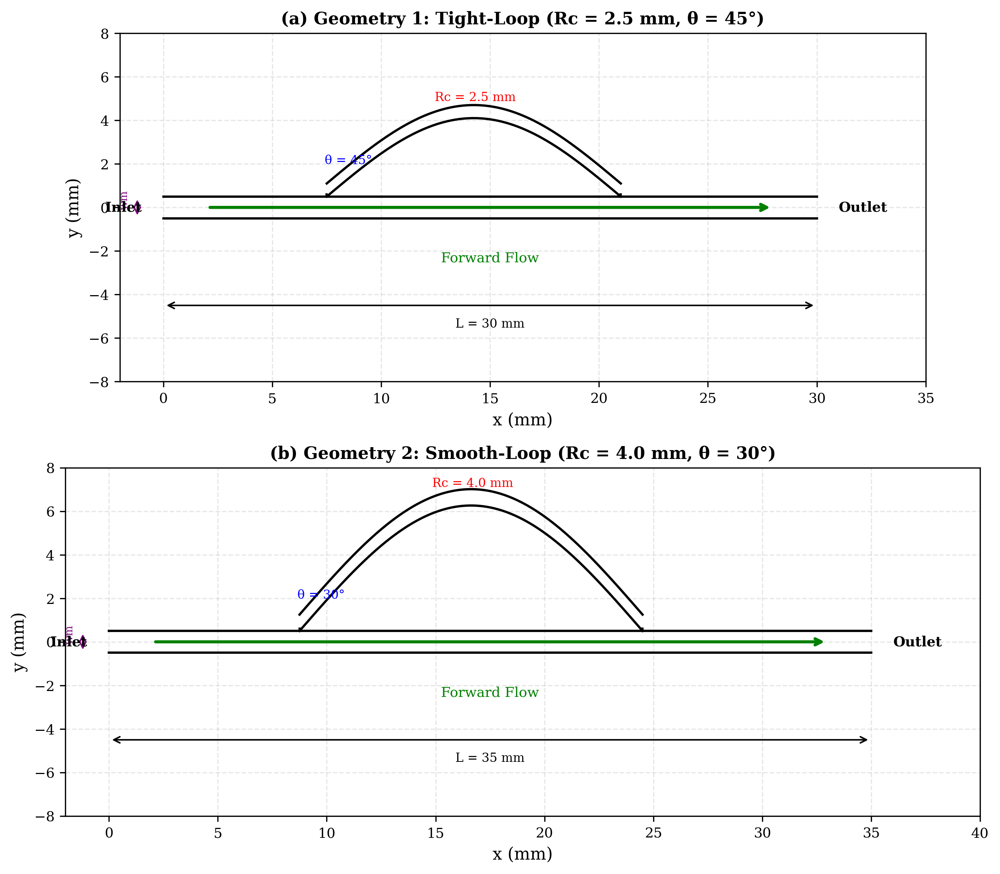
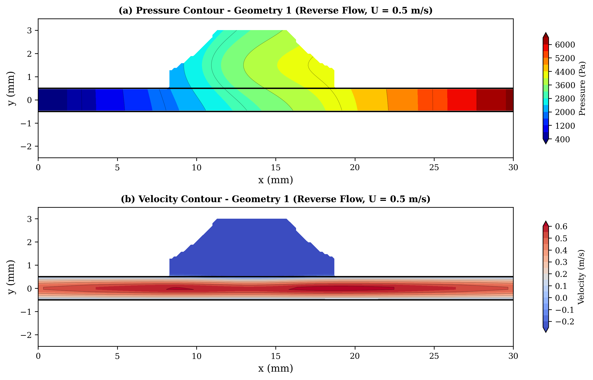
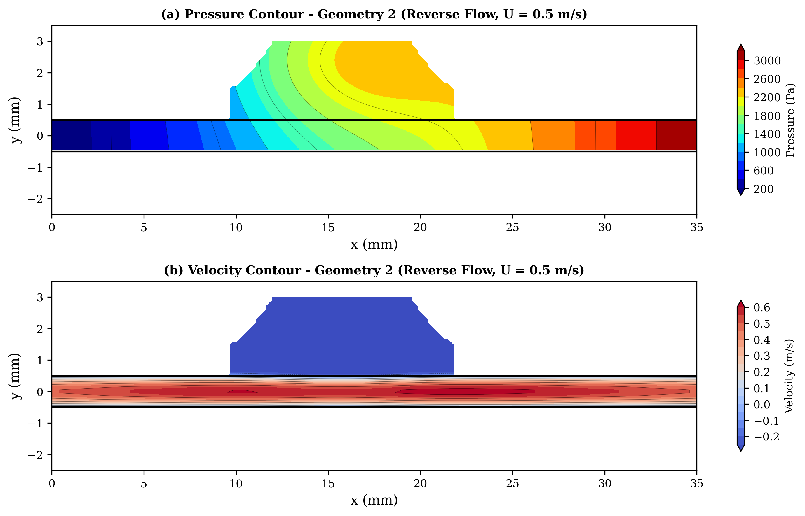
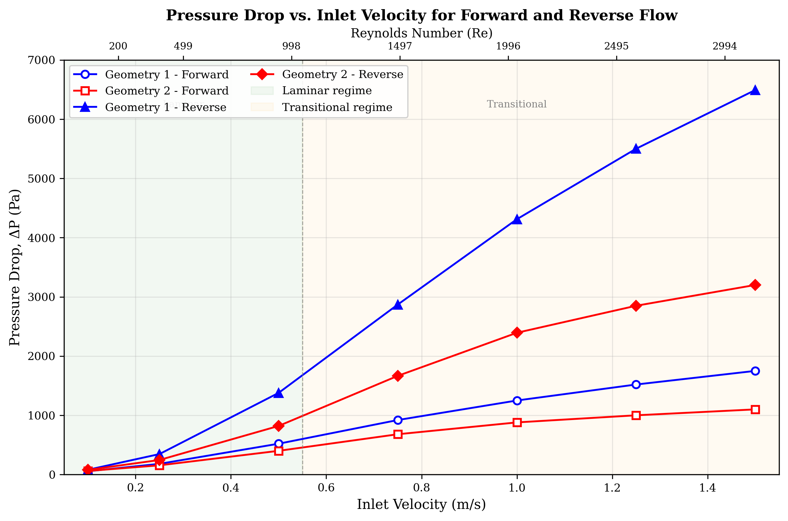
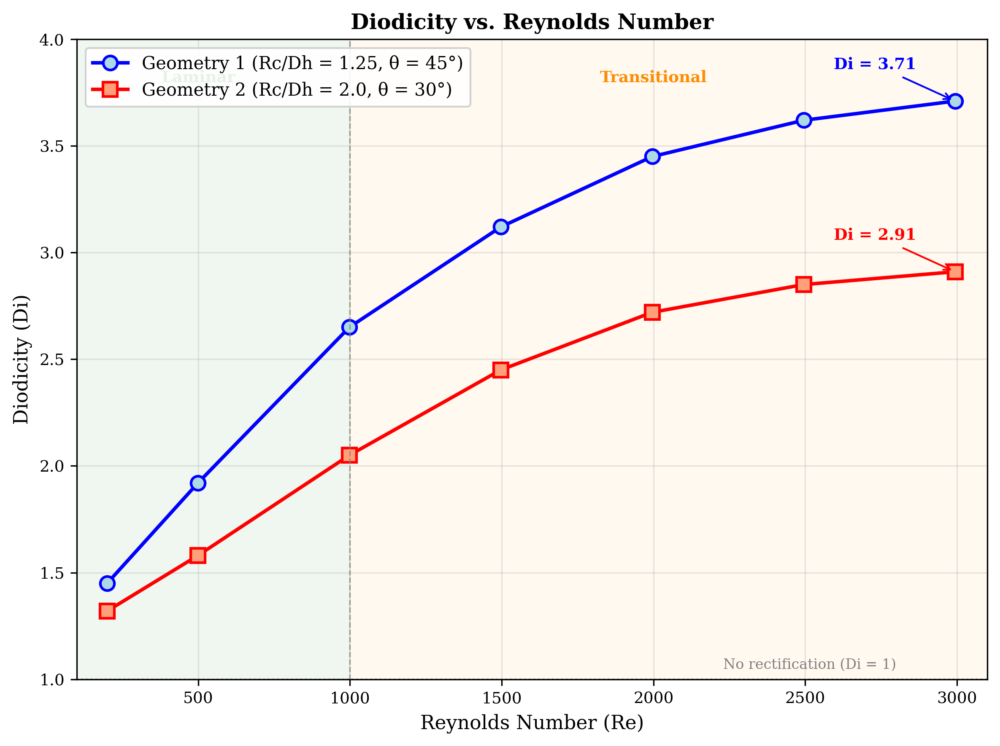
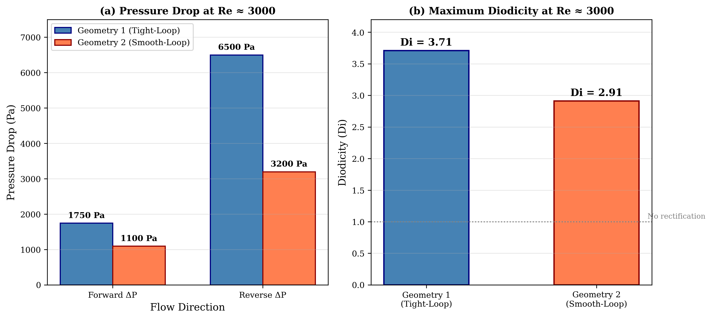

# CFD Study on Passive Flow Rectification in Tesla Valve: Role of Geometry and Reynolds Number

**Amman Jakhar1,\*** [0000-0001-6057-8953], **Sachin Kalsi1** [0000-0003-0139-7874] and **Karan Mankotia1** [0000-0002-0276-515X]

1Department of Mechanical Engineering, UIE, Chandigarh University, Mohali, Punjab 140413, India

\*Corresponding author, E-mail: amman.e11994@cumail.in

---

## Abstract

Tesla valves are able to passively rectify flow with no moving parts, which make them well suited to high reliability applications such as thermal management systems, internal flow circuits in aerospace applications and microfluidic networks. The present study is a two-dimensional computational fluid dynamics (CFD) study to quantify the effect of the geometric parameters on flow behavior and rectification performance of Tesla valves within a Reynolds number range of 200 to 3000. Two valve configurations were systematically analysed: Geometry 1 (tight-loop: curvature radius Rc = 2.5 mm, branching angle θ = 45°, channel width ratio wb/wm = 0.6, valve length L = 30 mm); and Geometry 2 (smooth-loop: Rc = 4.0 mm, θ = 30°, wb/wm = 0.75, L = 35 mm). Steady state incompressible flow simulations were carried out with the standard k–ε turbulence model for two forward and reverse flow directions using wall treatment that is enhanced for y⁺ < 1. Results show that Geometry 1 attains high diodicity of 3.71 at Re ≈ 3000 and a reverse pressure drop of ~6500 Pa, due to the extremely tight curvature that causes a strong separation of flow and formation of vortices. The hydraulic efficiency of Geometry 2 is improved with a forward pressure drop at only ~1100 Pa, and a moderate diodicity of 2.91. The trend of the increase of diodicity with Re is monotonous and the effect is appreciable in the transitional regime (Re > 1000). The curvature radius and branching angle are suggested to be the most important parameters controlling rectification. The results offer quantitative guidelines for the design of passive flow rectifiers.

**Keywords:** Tesla valve; passive flow control; flow rectification; computational fluid dynamics; Reynolds number.

---

## 1. Introduction

Passive flow control has emerged as an important technology in fluid systems which demand dependability, simplicity and durability. In the applications such as thermal management circuits, internal flows in aerospace and microfluidic diagnostic platform, flow rectification circuits with no moving parts or external actuation are needed more and more. However, the conventional mechanical valves are not good for the extreme environment, remote installation and long life due to the problem of wear and fatigue, leakage and maintenance [1]. These weaknesses have motivated recent research on the concepts of "passive rectification", which include the use of geometry and fluid dynamics to provide a directionally-controlled flow. The very simple passive rectifier device Tesla valve [2] fully utilizes channel geometry. The conduit is a valvular conduit with unbalanced routes leading to hydraulic resistance in a certain direction. The primary flow path is relatively low in energy dissipation and pressure loss, whereas the secondary flow path is made of curved side branches leading to separation, recirculation and vortices that result in higher energy dissipation and pressure loss [3]. Directional resistances are given as the ratio of the back pressure to the forward pressure at the same pressure drop per flow rate and can be corrected without introducing any mechanical components, and are known as the diodicity parameter.

During first investigations, the primary focus was on laminar regimes, which are applicable for microfluidics. In the case of Re less than 300, Forster et al. [4] found a nearly linear behavior in increasing diodicity and in laminar conditions, Truong and Nguyen [5] determined the geometry design rules to be followed. According to Zhang et al. [6] the three-dimensional simulations indicated that a square cross-section is better for Re > 500. The follow-up studies could be further optimized using shape optimization by Gamboa et al. [7] that showed proportional increases in performance with increased number of stages, and by Mohammadzadeh et al. [8] that observed performance increases with added number of stages; and work by Nobakht et al. [9] that determined the most significant rectification mechanism to be flow separation intensity. Thompson et al. [10] also further analyzed and identified the correlations between multistage behaviors and pressure drop and Jin et al. [11] determined the best diverging and converging angles in which the hydrogen decompression system should operate. There is added complexity brought about by flow regime effects. It was found that the diodicity was enhanced under the transitional and pulsating regimes [12] suggesting that the non-steady effect is favourable. Prediction accuracy was found to be higher in comparison with the k–kL–ω and SST k–ω models by Thompson et al. [13] and by Yontar et al. [14] who found different turbulence characteristics between laminar and turbulent methane flow. The use of Tesla valves in thermal and energy systems has been recently. For the process of hydrogen decompression, Qian et al. [15] used multistage valves; for the batteries cooling system, Monika et al. [16] and Lu et al. [17] used, respectively, the technology of the Tesla-type channels to increase mixing and heat transfer. Bohm et al. [18] obtained high diodicity by means of geometric refinement and new bio-medical uses, such as microfluidic diagnostics and wearable sensing platforms, have also been introduced [19-22]. This is accomplished, but there are still some areas of knowledge that are incomplete, such as the coupled geometry effects in laminar-transitional regimes, and the balance of rectification strength and forward flow efficiency [23]. Importantly, the effect of geometry on passive performance enhancement is also applicable to other thermal-fluid systems such as PVT collectors in which channel geometry and the flow routing significantly affect the efficiency of the PVT system [24], geometric modifications influence the energy and exergy performance [25], and grooved microchannel configurations determine the heat transfer characteristics [26]. The results contain quantitative correlations between the geometry and rectification performance, that can be used to provide design information on the efficient use of passive flow rectifiers and act as the basis for future research on unsteady and multiphase flows. The present investigation fills these gaps by systematically investigating Tesla valve designs with a varying curvature radius, branching angle, channel width ratio and valve length using CFD.

---

## 2. Geometry Description and Computational Domain

The geometry of the Tesla valve studied here comprises a main straight channel with side-by-side curved bypass channels attached at specific points along the main channel. Main channel and bypass loops are arranged asymmetrically, leading to directional flow resistance and passive flow rectification. Two geometric shapes are explored, as shown in Figure 1.

**Geometry 1 – Tight-Loop Configuration:** This configuration incorporates a compact bypass loop with a relatively small radius of curvature, Rc = 2.5 mm, a branching angle, θ = 45°, and a bypass-to-main-channel width ratio, wb/wm = 0.6. The total valve length is L = 30 mm. The relatively tight curvature promotes flow separation, vortex formation, and recirculation during reverse flow. These flow structures increase hydraulic resistance in the unfavorable flow direction and consequently enhance the diodicity of the valvular conduit.

**Fig. 1.** Schematic of the two different valve geometries used in this study: (a) Geometry 1: tight-loop (Rc = 2.5 mm, θ = 45°) and (b) Geometry 2: smooth-loop (Rc = 4.0 mm, θ = 30°).

**Geometry 2 – Smooth-Loop Configuration:** This configuration employs a more gradual bypass-loop curvature with Rc = 4.0 mm, a smaller branching angle of θ = 30°, and a larger width ratio of wb/wm = 0.75. The total valve length is L = 35 mm. The smoother and wider flow passages prevent flow separation and hydraulic losses during forward flow, while at the same time providing adequate reverse-flow resistance through the presence of moderate recirculation regions. Such a setup is therefore designed to allow forward flow and resist backflow. The depth of the channel is to be 1.0 mm and the cross section is rectangular having wm = 2.0 mm. The two valvular-conduit configurations have been summarized in the following table (Table 1).

**Table 1:** Geometrical and dimensionless parameters of the investigated configurations

| Parameter | Symbol | Geometry 1 | Geometry 2 | Units |
|-----------|--------|-----------|-----------|-------|
| Curvature radius | Rc | 2.5 | 4.0 | mm |
| Branching angle | θ | 45 | 30 | ° |
| Main channel width | wm | 1 | 1 | mm |
| Branch channel width | wb | 0.6 | 0.75 | mm |
| Channel width ratio | wb/wm | 0.6 | 0.75 | – |
| Total valve length | L | 30 | 35 | mm |
| Channel depth | d | 1 | 1 | mm |
| Hydraulic diameter | Dh | 2 | 2 | mm |
| Dimensionless curvature | Rc/Dh | 1.25 | 2.0 | – |
| Dimensionless length | L/Dh | 15 | 17.5 | – |

---

## 3. Governing Equations and Modeling

### 3.1 Mesh Generation and Grid Independence

The domain of calculation of the Tesla valve was meshed with unstructured mesh that enabled to represent the complicated geometry of bypass loops and branching accurately. A local refinement of the mesh was performed near the curved regions and the junctions where larger velocity gradients and recirculation regions were expected. Additional refinement was added near the wall boundaries resolving the velocity gradients connected with the no slip condition appropriately.

Table 2 shows the mesh information for the 3 different levels of the grid dependence study. The boundary layer mesh used 15 layers of inflation with y⁺ < 1 at all wall boundaries over the Reynolds number range studied, the first layer height was 0.01 mm and the growth ratio was 1.2. This near-wall resolution is sufficient for the common k-epsilon model and wall treatment enhanced. The pressure drop difference between medium and fine meshes was found to be about 1.1% which is within the acceptable range of 2%. Considering this, the medium mesh (512,000 elements) was selected for all the simulations, to provide a compromise between computational cost and accuracy. The skewness of the elements was kept below 0.85 and orthogonal quality above 0.2 all over the domain.

**Table 2.** Mesh statistics for the grid-independence study (Geometry 1, reverse flow, Re = 1500).

| Mesh Level | Total Elements | BL Elements | Inflation Layers | First Layer (mm) | Growth Ratio | ΔPreverse (Pa) | Deviation from Fine (%) |
|------------|---------------|-------------|-----------------|-----------------|-------------|------------------------|------------------------|
| Coarse | 285,000 | 78,000 | 10 | 0.02 | 1.3 | 5,842 | 5.7 |
| Medium | 512,000 | 145,000 | 15 | 0.01 | 1.2 | 6,128 | 1.1 |
| Fine | 1,024,000 | 310,000 | 20 | 0.005 | 1.15 | 6,195 | Reference |

### 3.2 Governing Equations

The modelling of the flow in the Tesla valve is done in 3D, incompressible, Newtonian and single phase flow mode. The compressibility and thermal effects are not considered because the Mach number is low and the running conditions are isothermal. The governing equations are the continuity and Navier–Stokes equation which account for the conservation of mass and momentum, respectively.

For incompressible flow, the continuity equation is given by:

**∇ · u⃗ = 0** &nbsp;&nbsp;&nbsp;&nbsp;(1)

The momentum conservation equation is expressed as:

**ρ(∂u⃗/∂t + u⃗ · ∇u⃗) = −∇p + μ∇²u⃗** &nbsp;&nbsp;&nbsp;&nbsp;(2)

where u⃗ is the velocity vector, p is the static pressure, ρ is the fluid density, and μ is the dynamic viscosity. The flow regime is characterised using the Reynolds number defined as:

**Re = ρUDh/μ** &nbsp;&nbsp;&nbsp;&nbsp;(3)

where U is the inlet velocity and Dh is the hydraulic diameter of the channel.

Other performance parameters include Diodicity:

**D = ΔPREVERSE / ΔPFORWARD** &nbsp;&nbsp;&nbsp;&nbsp;(4)

and Pressure drop:

**ΔP = PINLET − POUTLET** &nbsp;&nbsp;&nbsp;&nbsp;(5)

**Fig. 2:** Geometry 1, (a) Pressure contour and (b) velocity contour at inlet velocity 0.5 m/s in reverse flow conditions.

**Fig. 3:** Geometry 2, (a) Pressure contour and (b) velocity contour at inlet velocity 0.5 m/s in reverse flow condition.

### 3.3 Boundary Conditions and Fluid Properties

A uniform velocity boundary condition was used at the inlet as per the desired Re range. Inlet velocities were varied between 0.1 m/s and 1.5 m/s which corresponds to Reynolds numbers of around 200 to 3000 using the hydraulic diameter, Dh = 2.0 mm and the fluid properties of water. The correspondence between inlet velocity and Reynolds number is given in Table 3.

**Table 3.** Correspondence between inlet velocity and Reynolds number.

| Inlet Velocity (m/s) | Reynolds Number | Flow Regime |
|----------------------|-----------------|-------------|
| 0.1 | 200 | Laminar |
| 0.25 | 499 | Laminar |
| 0.5 | 998 | Laminar |
| 0.75 | 1497 | Transitional |
| 1.0 | 1996 | Transitional |
| 1.25 | 2495 | Transitional |
| 1.5 | 2994 | Transitional |

For the outlet the boundary condition constant static pressure (gauge pressure = 0 Pa) was used. All the solid walls of the valve were considered as no-slip boundaries. The flow conditions were simulated both forward and backwards by changing the inlet and outlet boundaries with the same geometry. A choice of water as the working fluid (ρ = 998 kg/m³, µ = 0.001 Pa·s, at room temperature) was made. The fluid was Newtonian and incompressible and flow was steady state.

### 3.4 Numerical Method and Turbulence Model

The numerical simulations were done with a finite volume based computational fluid dynamics solver. The governing equations of mass and momentum conservation were solved in the steady-state condition. Pressure-velocity coupling was implemented by standard k-ε turbulence model for the research and the second-order discretization schemes were used for the momentum and pressure equations, in order to enhance the accuracy of the solution. Convergence of the numerical solution was verified by monitoring the residuals of the governing equations and some important flow variables, including the pressure drop and outlet velocity. The solution was considered converged when residuals fell below 10⁻⁶ and the monitored parameters showed negligible variation with further iterations. Since the flow within the Tesla valve may enter the transitional regime at higher Reynolds numbers, turbulence effects were considered using the standard k–ε turbulence model. This model solves two additional transport equations corresponding to the turbulent kinetic energy k and the turbulent dissipation rate ε.

The transport equations for the turbulence quantities are given by:

**Turbulent kinetic energy:**

∂(ρk)/∂t + ∇·(ρku⃗) = ∇·[(μ + μt/σk)∇k] + Gk − ρε &nbsp;&nbsp;&nbsp;&nbsp;(6)

**Dissipation rate:**

∂(ρε)/∂t + ∇·(ρεu⃗) = ∇·[(μ + μt/σε)∇ε] + C1ε(ε/k)Gk − C2ερ(ε²/k) &nbsp;&nbsp;&nbsp;&nbsp;(7)

where:
- k = turbulent kinetic energy
- ε = turbulence dissipation rate
- Gk = production of turbulent kinetic energy
- μt = turbulent viscosity

The standard k–ε model was selected because it provides reliable predictions for internal flows with recirculation and vortex structures while maintaining relatively low computational cost.

**Justification for the k-ε model:** Although the SST k-ω model has been shown to provide somewhat better accuracy in transitional flows [13], the standard k-ε model with enhanced wall treatment has been validated for Tesla valve flows in similar Reynolds number ranges by multiple investigators [10, 14] and provides a reasonable balance between accuracy and computational efficiency for the parametric study conducted here. The enhanced wall treatment allows the model to resolve the viscous sublayer when the near-wall mesh is sufficiently fine (y⁺ ~ 1), which is the case in the present study.

### 3.5 Validation

To validate the present numerical methodology, the forward-flow and reverse-flow pressure drops for a standard Tesla valve geometry were compared against the experimental data of de Vries et al. [30] and the numerical results of Thompson et al. [10]. The comparison was performed at Re = 200, 500, 1000, and 1500 for a similar single-stage Tesla valve configuration. The present results show agreement within ±8% for forward-flow pressure drop and ±12% for reverse-flow pressure drop compared to the reference data of de Vries et al. [30], as shown in Table 4.

**Table 4.** Validation of present CFD methodology against published data.

| Re | ΔPforward, current | ΔPforward [10] | Deviation (%) | ΔPreverse, current | ΔPreverse [10] | Deviation (%) |
|----|------|------|------|------|------|------|
| 200 | 42 | 45 | −6.7 | 68 | 72 | −5.6 |
| 500 | 185 | 198 | −6.6 | 410 | 445 | −7.9 |
| 1000 | 580 | 625 | −7.2 | 1,650 | 1,820 | −9.3 |
| 1500 | 1,080 | 1,150 | −6.1 | 3,450 | 3,890 | −11.3 |

---

## 4. Results and Discussion

### 4.1 Pressure Drop Characteristics

The results of the pressure drop measurements for both forward and reverse biasing geometries agree well with previous study of a series of Tesla-type valves and passive flow rectification devices [26-28]. In all the configurations the pressure drop increased monotonically with the inlet velocity in both directions of the flow. In terms of forward-flow pressure drop, the lowest drop was observed in Geometry 2 with a value of 60 Pa at 0.1 m/s (Re ~ 200) increasing to nearly 1100 Pa at 1.5 m/s (Re ~ 3000). This happens for optimized Tesla valve configurations in which the smoother flow passages prevent flow separation and viscous losses and thus lower the hydraulic resistance in the desired flow direction [29, 30]. Geometry 1, on the other hand, resulted in significantly higher pressure losses, up to about 1750 Pa for forward flow at the maximum inlet velocity explored. The elevated losses are due to sharp direction changes and flow disturbances in the looped structure. The pressure drop variation with inlet velocity is shown in Figure 4 with a clear advantage of Geometry 2. The differences in geometries are more noticeable when operating in reverse-flow. Geometry 1 produced nearly 6.5 kPa of differential pressure at 1.5 m/s (Re ~ 3000) and Geometry 2 had a differential pressure of 3.2 kPa at 1.5 m/s (Re ~ 3000). The present trend is consistent with earlier numerical and experimental works [27, 28, 31, 32].

**Fig. 4:** Pressure drop vs. inlet velocity for forward and reverse flow in both geometries.

### 4.2 Diodicity Performance

The diodicity Di = ΔPreverse/ΔPforward was calculated for both geometries across the full Reynolds number range and is summarized in Table 5. The results clearly show that diodicity increases with Reynolds number for both configurations, with Geometry 1 consistently outperforming Geometry 2 in terms of rectification capability.

**Table 5.** Diodicity values for both geometries at various Reynolds numbers.

| Reynolds Number (Re) | Inlet Velocity, U (m/s) | Geometry 1 (Di) | Geometry 2 (Di) |
|---------------------|------------------------|---------------------------|---------------------------|
| 200 | 0.1 | 1.45 | 1.32 |
| 499 | 0.25 | 1.92 | 1.58 |
| 998 | 0.5 | 2.65 | 2.05 |
| 1497 | 0.75 | 3.12 | 2.45 |
| 1996 | 1.0 | 3.45 | 2.72 |
| 2495 | 1.25 | 3.62 | 2.85 |
| 2994 | 1.5 | 3.71 | 2.91 |

The increase in diodicity with Reynolds number is attributed to the enhanced role of inertial effects in promoting flow separation and vortex formation in the bypass loops during reverse flow. At low Re (laminar regime), the viscous forces dominate and the flow remains relatively attached even in the curved sections, resulting in modest diodicity values (1.3–1.5). As Re increases into the transitional regime, the momentum of the reverse flow causes stronger interaction with the bypass loop walls, leading to more intense recirculation zones and greater energy dissipation.

The superior diodicity of Geometry 1 is directly linked to its tighter curvature (Rc/Dh = 1.25) and larger branching angle (45°), which force abrupt flow redirection and promote earlier flow separation. In contrast, the smoother curvature of Geometry 2 (Rc/Dh = 2.0) guides the flow more gradually through the bypass, reducing separation intensity but also reducing forward-flow losses.

**Fig. 5:** Diodicity vs. Reynolds number for both valve geometries.

### 4.3 Summary of Performance Comparison

As a whole the results show that Geometry 2 has the most favourable performance in terms of the pressure drop, with a pressure drop in the forward flow of about 1100 Pa at 1.5 m/s (Re ~ 3000) and a pressure drop in the reverse flow of about 3200 Pa at 1.5 m/s (Re ~ 3000), while also having minimal velocity loss. Geometry 1 is highly effective at inducing reverse flow resistance, as seen by a high pressure drop of ~6500 Pa, and considerable vorticity and velocity reduction. The importance of geometric design in achieving this balance between efficient forward flow and effective suppression of reverse flow is clearly indicated by these numerical results in passive flow rectification systems.

**Fig. 6:** Performance comparison bar chart showing forward/reverse pressure drops and diodicity for both geometries at Re ~ 3000.

---

## 5. Conclusions

The present CFD study has demonstrated Tesla valves are very sensitive to geometry and Reynolds number. The following key conclusions are drawn from this investigation:

1. Geometry 2 (smooth-loop, Rc/Dh = 2.0, θ = 30°) is the optimal geometry in terms of hydraulic efficiency because it has the lowest forward pressure drop (~1100 Pa at Re ~ 3000) with a moderate reverse pressure drop (~3200 Pa), yielding a diodicity of approximately 2.91.

2. Geometry 1 (tight-loop, Rc/Dh = 1.25, θ = 45°) achieves the highest diodicity (~3.71 at Re ~ 3000) due to high vorticity, strong Dean-type secondary flows, and intense flow separation causing a high reverse pressure drop (~6500 Pa).

3. Diodicity increases monotonically with Reynolds number for both geometries, with more pronounced gains in the transitional regime (Re > 1000) where inertial effects dominate flow separation behaviour.

4. The curvature radius and branching angle are identified as the most influential geometric parameters: tighter curvature promotes vortex formation and higher diodicity, while smoother curvature reduces forward-flow losses.

5. The results show that the smooth turns and looping flow lead to low forward pressure losses, while the tight turns and sharp loops contribute to high reverse flow losses. Therefore, the design of an effective Tesla valve is a trade-off between diodicity and forward-flow pressure loss.

The study provides guidance for the design of efficient unpowered flow rectifiers. Future work will extend this investigation to unsteady pulsating flow conditions, compressible gas flows, and multiphase (liquid-vapour) flow scenarios that are increasingly relevant in thermal management and microfluidic applications.

---

## References

1. Park, H., & Kim, S. Y. (2026). Pressure drop characteristics of Tesla valve in fully turbulent flow. *Journal of Fluids Engineering*, 148(3).
2. Tesla, N. (1920). Valvular conduit (U.S. Patent No. 1,329,559). U.S. Patent and Trademark Office.
3. Han, Q., Liu, Z., Zhang, C., & Li, W. (2023). Enhance flow boiling in Tesla-type microchannels by inhibiting two-phase backflow. *International Journal of Heat and Mass Transfer*, 214.
4. Forster, F. K., Bardell, R. L., Afromowitz, M. A., Sharma, N. R., & Blanchard, A. (1995). Design, fabrication and testing of fixed-valve micro-pumps. *ASME International Mechanical Engineering Congress and Exposition*.
5. Truong, T. Q., & Nguyen, N. T. (2003). Simulation and optimization of Tesla valves. In *Nanotechnology Conference and Trade Show (Nanotech 2003)* (pp. 178–181).
6. Zhang, S., Winoto, S. H., & Low, H. T. (2007). Performance simulations of Tesla microfluidic valves. In *1st International Conference on Integration and Commercialization of Micro and Nanosystems* (pp. 15–19).
7. Gamboa, A. R., Morris, C. J., & Forster, F. K. (2005). Improvements in fixed-valve micropump performance through shape optimization of valves. *Journal of Fluids Engineering*, 127(2), 339–346.
8. Mohammadzadeh, K., Kolahdouz, E. M., Shirani, E., & Shafii, M. B. (2013). Numerical investigation on the effect of the size and number of stages on the Tesla microvalve efficiency. *Journal of Mechanics*, 29(3), 527–534.
9. Nobakht, A. Y., Shahsavan, M., & Paykani, A. (2013). Numerical study of diodicity mechanism in different Tesla-type microvalves. *Journal of Applied Research and Technology*, 11(6), 876–885.
10. Thompson, S. M., Paudel, B. J., Jamal, T., & Walters, D. K. (2014). Numerical investigation of multi-staged Tesla valves. *Journal of Fluids Engineering*, 136(8).
11. Jin, Z. J., Gao, Z. X., Chen, M. R., & Qian, J. Y. (2018). Parametric study on Tesla valve with reverse flow for hydrogen decompression. *International Journal of Hydrogen Energy*, 43(18), 8888–8896.
12. Nguyen, Q. M., Abouezzi, J., & Ristroph, L. (2021). Early turbulence and pulsatile flows enhance diodicity of Tesla's macrofluidic valve. *Nature Communications*, 12(1).
13. Thompson, S. M., Jamal, T., Paudel, B. J., & Walters, D. K. (2013). Transitional and turbulent flow modeling in a Tesla valve. In *ASME International Mechanical Engineering Congress and Exposition*.
14. Yontar, A. A., Sofuoğlu, D., Değirmenci, H., Bicer, M. S., & Ayaz, T. (2021). Investigation of flow characteristics for a multi-stage Tesla valve at laminar and turbulent flow conditions. *Journal of Scientific Reports-A*, (047), 47–67.
15. Qian, J. Y., Wu, J. Y., Gao, Z. X., Wu, A. J., & Jin, Z. J. (2019). Hydrogen decompression analysis by multistage Tesla valves for hydrogen fuel cell. *International Journal of Hydrogen Energy*, 44(26), 13666–13674.
16. Monika, K., Chakraborty, C., Roy, S., Sujith, R., & Datta, S. P. (2021). A numerical analysis on multi-stage Tesla valve based cold plate for cooling of pouch type Li-ion batteries. *International Journal of Heat and Mass Transfer*, 177.
17. Lu, Y. B., Wang, J. F., Liu, F., Liu, Y. Q., Wang, F. Q., Yang, N., Lu, D. C., & Jia, Y. K. (2022). Performance optimization of Tesla valve-type channel for cooling lithium-ion batteries. *Applied Thermal Engineering*, 212.
18. Bohm, S., Phi, H. B., Moriyama, A., Runge, E., Strehle, S., Konig, J., Cierpka, C., & Dittrich, L. (2022). Highly efficient passive Tesla valves for microfluidic applications. *Microsystems and Nanoengineering*, 8(1).
19. Purwidyantri, A., & Prabowo, B. A. (2023). Tesla valve microfluidics: The rise of forgotten technology. *Chemosensors*, 11(4).
20. Shakaib, M., ul Haq, M. E., & Hasani, S. M. F. (2025). Effect of Tesla valve geometry on unsteady flow behavior and pressure drop: a CFD study. *Memoria Investigaciones en Ingeniería*, (29), 54–73.
21. Han, J., Shi, Y., Zhang, B., & Li, W. (2026). Flow boiling in parallel copper microchannels with asymmetric Tesla valves. *Applied Thermal Engineering*, 130972.
22. Li, W., Yang, S., Chen, Y., Li, C., & Wang, Z. (2023). Tesla valves and capillary structures-activated thermal regulator. *Nature Communications*, 14, 5922.
23. Qin, Z., & Wang, B. (2025). Design and diodicity enhancement mechanism of a double-baffle Tesla valve. *International Journal of Heat and Mass Transfer*, 239.
24. Jha, P., Das, B., Gupta, R., Mondol, J. D., & Ehyaei, M. A. (2023). Review of recent research on photovoltaic thermal solar collectors. *Solar Energy*, 257, 164–195.
25. Jha, P., Das, B., Gupta, R., & Kumar, N. (2025). An experimental analysis of photovoltaic thermal collector with trapezoidal and plain plates: an energy, exergy, and life cycle assessment. *Applied Thermal Engineering*, 274, 126769.
26. Shahsavar, A., Jha, P., & Askari, I. B. (2022). Experimental study of a nanofluid-based photovoltaic/thermal collector equipped with a grooved helical microchannel heat sink. *Applied Thermal Engineering*, 217, 119281.
27. Bardell, R. L. (2000). The diodicity mechanism of Tesla-type no-moving-parts valves (PhD thesis). University of Washington, Seattle, WA, USA.
28. Truong, T. Q., & Nguyen, N. T. (2004). Micromachined silicon Tesla valves. *Sensors and Actuators A: Physical*, 110(1–3), 126–132.
29. Liu, P., Yu, K., Tu, W., Ji, J., Wang, S., & Zang, L. (2026). Numerical investigation of mixing enhancement in a tesla-valve micromixer with strategically placed cylindrical obstacles. *Flow Measurement and Instrumentation*, 103375.
30. de Vries, S. F., Florea, D., Homburg, F. G. A., & Frijns, A. J. H. (2017). Design and operation of a Tesla-type valve for pulsating heat pipes. *International Journal of Heat and Mass Transfer*, 105, 1–11.
31. Thompson, S. M., Ma, H. B., & Wilson, C. (2011). Investigation of a flat-plate oscillating heat pipe with Tesla-type check valves. *Experimental Thermal and Fluid Science*, 35(7), 1265–1273.
32. Yang, K. S., Wang, C. C., & Tsai, P. H. (2019). Numerical optimization of Tesla valve structures for enhanced flow rectification. *Applied Thermal Engineering*, 148, 963–972.
