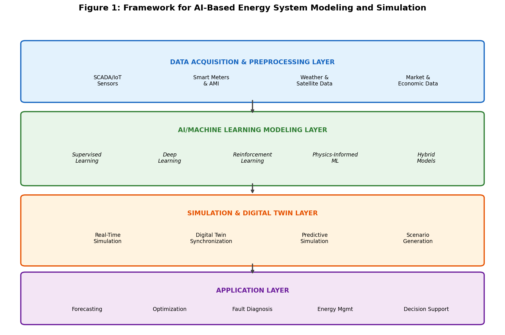
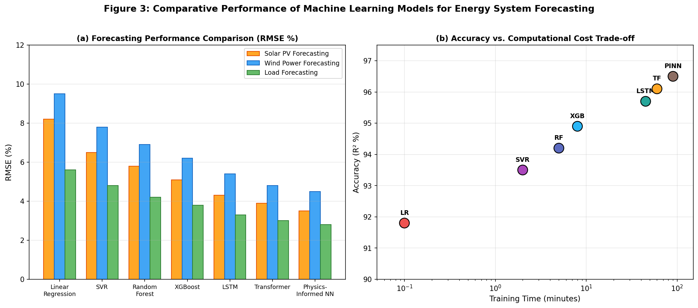
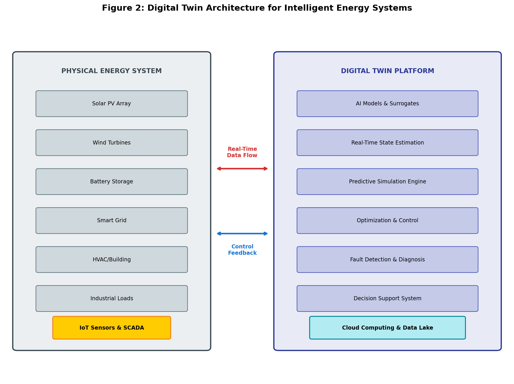
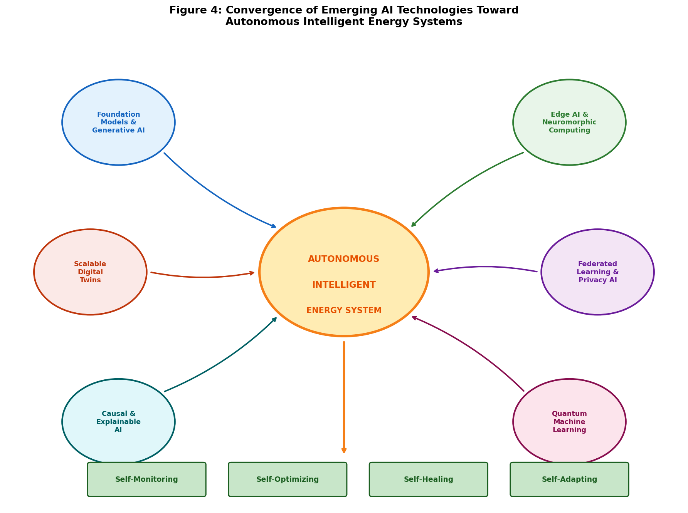

# AI-Based System Modeling and Simulation Techniques in Energy Systems

**Book: INTELLIGENT ENERGY-EFFICIENT SYSTEMS: Advanced Design, Optimization and Machine Learning**

---

## Abstract

The global energy landscape is undergoing a fundamental transformation driven by decarbonization, renewable energy integration, and digitalization. This chapter provides a comprehensive examination of artificial intelligence (AI) based system modeling and simulation techniques for modern energy systems. Beginning with the fundamentals of AI and machine learning approaches applicable to energy modeling, the chapter progresses through data-driven system identification, digital twin architectures, and hybrid physics-AI modeling paradigms. Detailed treatment is given to simulation applications spanning renewable energy forecasting, battery storage modeling, smart grid simulation, and building energy systems. Advanced topics including multi-objective optimization, uncertainty quantification, and emerging trends such as foundation models, federated learning, and autonomous energy systems are explored. The chapter demonstrates how AI-based modeling overcomes the limitations of conventional physics-based approaches while enabling real-time simulation, predictive maintenance, and intelligent decision-making for next-generation energy infrastructure.

---

## Section I: Fundamentals of AI-Based Energy System Modeling

### 1.1 Introduction to Energy System Modeling and Simulation

#### Role of Modeling and Simulation in Modern Energy Systems

Modern energy systems are characterized by unprecedented complexity, encompassing diverse generation technologies from conventional fossil-fuel power plants to variable renewable sources such as solar photovoltaic and wind turbines [1]. They integrate energy storage systems, demand-side management strategies, electric vehicles, and increasingly sophisticated control and automation layers [2]. The interconnection of electrical, thermal, and gas networks further compounds this complexity, creating multi-energy systems that require holistic modeling approaches [3].

Modeling and simulation serve multiple critical functions in the energy sector. At the planning stage, they enable the evaluation of infrastructure investments, technology portfolios, and policy interventions under uncertainty [4]. During design, they facilitate the sizing and configuration of system components to meet performance, cost, and reliability targets. In operation, real-time simulation supports monitoring, diagnostics, control, and optimization of energy assets [5]. Furthermore, modeling and simulation are essential for training operators, testing control strategies in safe virtual environments, and conducting risk assessments for extreme events or failure scenarios.

The increasing availability of high-resolution data from sensors, smart meters, supervisory control and data acquisition (SCADA) systems, and Internet of Things (IoT) devices has created both opportunities and challenges for energy system modeling [6]. While data availability enables more detailed and accurate representations of system behavior, the sheer volume, velocity, and variety of energy data demand advanced computational techniques capable of extracting actionable insights. This convergence of abundant data and computational power has catalyzed the adoption of artificial intelligence and machine learning methodologies in energy system modeling and simulation [7].

The overarching framework for AI-based energy system modeling and simulation is illustrated in Figure 1, which depicts the layered architecture from data acquisition through AI/ML modeling to simulation and application layers. This systematic framework guides the organization of modeling efforts and ensures coherent integration of diverse AI techniques within unified simulation platforms.

**Figure 1.** Layered framework for AI-based energy system modeling and simulation, showing the flow from data acquisition through AI/ML modeling to digital twin simulation and decision-support applications.

#### Conventional versus AI-Driven Modeling Approaches

Conventional energy system modeling has traditionally relied on physics-based approaches grounded in first principles [8]. These include thermodynamic models describing energy conversion processes, electromagnetic models for electrical systems, fluid dynamic models for wind and hydro resources, and heat transfer models for thermal systems. Such models are constructed from fundamental physical laws including conservation of energy, mass, and momentum, combined with constitutive relations and empirical correlations [9]. Physics-based models offer the advantages of interpretability, generalizability to unseen conditions, and the ability to provide causal explanations of system behavior.

However, physics-based models face significant limitations when applied to modern energy systems. Developing accurate first-principles models for complex, multi-domain systems requires deep domain expertise and substantial effort [10]. Many real-world energy systems exhibit nonlinear, time-varying, and stochastic behaviors that are difficult to capture analytically. Parameter identification and calibration can be challenging, particularly for aging systems whose characteristics drift over time. Moreover, computational requirements for high-fidelity physics-based simulations can be prohibitive for real-time applications or large-scale optimization studies [11].

AI-driven modeling approaches offer a fundamentally different paradigm. Rather than constructing models from physical principles, AI methods learn system representations directly from observed data [12]. Machine learning algorithms can automatically identify complex patterns, nonlinear relationships, and temporal dependencies in energy data without explicit programming of governing equations. Deep learning architectures can approximate arbitrarily complex functions given sufficient data, enabling the modeling of systems for which first-principles descriptions are incomplete or unavailable [13].

#### Challenges in Modeling Complex, Nonlinear, and Dynamic Energy Systems

Energy systems present several fundamental modeling challenges that motivate the adoption of AI techniques [14]. First, nonlinearity pervades energy systems at multiple levels—power electronic converters, battery electrochemistry, combustion processes, and aerodynamic interactions all exhibit strongly nonlinear behavior. Second, temporal dynamics span multiple time scales, from millisecond-level power electronics switching to seasonal variations in renewable resource availability. Third, uncertainty is inherent in energy systems, arising from weather variability, load fluctuations, equipment degradation, market dynamics, and human behavior [15]. Fourth, high dimensionality characterizes modern energy systems with thousands of interconnected components, control variables, and operational constraints.

Fifth, heterogeneity of data sources, including numerical measurements, categorical states, text-based maintenance logs, and image-based inspections, demands flexible modeling frameworks capable of multi-modal data fusion. Finally, the requirement for real-time or near-real-time computation in operational applications imposes strict constraints on model complexity and computational efficiency.

These challenges collectively establish the motivation for AI-based approaches that can handle nonlinearity, learn from heterogeneous data, scale to high-dimensional systems, quantify uncertainty, and deliver predictions with computational efficiency suitable for real-time deployment.

### 1.2 Artificial Intelligence and Machine Learning for Energy Systems

#### Machine Learning, Deep Learning, and Reinforcement Learning Concepts

Artificial intelligence encompasses a broad family of computational techniques that enable machines to perform tasks typically requiring human intelligence [16]. Within AI, machine learning represents the subset of methods that improve their performance through experience, learning patterns from data without being explicitly programmed for each specific task. Machine learning algorithms can be broadly categorized into three paradigms: supervised learning, unsupervised learning, and reinforcement learning [17].

Deep learning represents a subset of machine learning that utilizes artificial neural networks with multiple hidden layers to learn hierarchical representations of data [18]. Deep architectures including convolutional neural networks (CNNs), recurrent neural networks (RNNs), long short-term memory (LSTM) networks, transformer models, and generative adversarial networks (GANs) have demonstrated remarkable capabilities in processing sequential, spatial, and high-dimensional data. Their ability to automatically extract relevant features from raw data makes them particularly suitable for complex energy system modeling tasks [19].

Reinforcement learning (RL) represents a fundamentally different learning paradigm in which an agent learns optimal behavior through interaction with an environment [20]. The agent takes actions, observes resulting states and rewards, and progressively improves its policy to maximize cumulative reward. In energy systems, reinforcement learning is particularly relevant for sequential decision-making problems such as energy management, demand response scheduling, and real-time control of generation and storage assets.

#### Supervised, Unsupervised, and Hybrid Learning Approaches

Supervised learning approaches dominate energy system modeling applications due to the abundance of historical operational data with known outcomes [21]. For regression tasks, algorithms ranging from linear regression and support vector regression to gradient-boosted trees and deep neural networks predict quantities such as solar irradiance, wind speed, electricity demand, battery state of health, and building energy consumption. For classification tasks, methods including random forests and deep classifiers are used for fault detection, equipment health assessment, and event classification [22].

Unsupervised learning finds application in scenarios where labeled data is scarce or unavailable. Clustering techniques such as k-means, hierarchical clustering, and density-based spatial clustering are employed for load pattern identification, consumer behavior segmentation, and operational mode discovery [23]. Anomaly detection methods including isolation forests, one-class support vector machines, and autoencoder-based detectors identify unusual system behaviors indicative of faults or cyber-attacks.

Hybrid learning approaches combine elements of multiple paradigms to leverage their complementary strengths. Semi-supervised learning uses small amounts of labeled data alongside larger volumes of unlabeled data, addressing the common practical challenge of limited labeled examples in energy applications [24]. Transfer learning enables knowledge gained from one energy system or domain to be applied to related systems with limited local data, reducing data requirements for new installations. Multi-task learning trains shared representations across related prediction tasks, improving generalization through implicit data augmentation. These hybrid approaches are particularly valuable in energy applications where obtaining labeled data is expensive or time-consuming, such as fault diagnosis where failures are rare events.

#### Selection of AI Techniques for Different Energy Applications

The selection of appropriate AI techniques depends on multiple factors including the nature of the prediction task, data availability, interpretability requirements, and computational constraints [25]. The no-free-lunch theorem implies that no single algorithm universally outperforms all others across all problems. Consequently, systematic model selection through cross-validation, hyperparameter optimization, and ensemble methods is essential for achieving robust performance.

**Table 1. Selection Guide for AI Techniques in Energy System Applications**

| Energy Application | Recommended AI Techniques | Key Advantages | Data Requirements |
|---|---|---|---|
| Short-term renewable forecasting | LSTM, Temporal CNN, Transformer | Captures temporal dependencies | High (>1 year hourly data) |
| Load forecasting | Gradient Boosting, LSTM, Transformer | Handles multiple seasonalities | Medium-High (6+ months) |
| Fault detection & diagnosis | Autoencoders, Isolation Forests, CNN | Unsupervised anomaly detection | Medium (normal operation data) |
| Battery state estimation | Physics-Informed NN, LSTM | Physical consistency | Medium (cycling data) |
| Real-time control & optimization | Deep RL (PPO, SAC), DQN | Sequential decision-making | Generated via simulation |
| Energy system design | Bayesian Optimization, Surrogate NN | Sample-efficient optimization | Low-Medium (simulation data) |
| Building energy modeling | RNN, GBM, Transfer Learning | Captures thermal dynamics | Medium (3-12 months) |
| Grid stability assessment | GNN, Random Forest | Topology-aware prediction | Medium-High (PMU data) |

As shown in Table 1, the choice of AI technique is intimately linked to the specific energy application, with different methods offering distinct advantages in terms of data efficiency, interpretability, and computational requirements [26].

### 1.3 Data-Driven Modeling and System Identification

#### Energy Data Acquisition, Preprocessing, and Feature Engineering

The foundation of any AI-based energy model lies in the quality and relevance of the underlying data [27]. Energy data acquisition encompasses multiple sources: sensor measurements from SCADA systems provide real-time operational data including voltages, currents, temperatures, pressures, and flow rates. Smart meters record energy consumption at fine temporal granularity. Weather stations and satellite-based systems provide meteorological data essential for renewable energy modeling [28].

Data preprocessing is critical for model performance. Common operations include handling missing data through imputation or interpolation, removing outliers and erroneous measurements, synchronizing multi-source data streams with different sampling rates, normalizing or standardizing features to compatible scales, and encoding categorical variables [29]. Time-series data additionally requires careful treatment of temporal alignment, daylight saving transitions, and the creation of lag features and rolling statistics. Feature engineering transforms raw measurements into informative representations—for renewable energy forecasting, derived features include solar zenith angle, clear-sky irradiance index, wind direction sine and cosine components, and turbulence intensity. For building energy modeling, features might include degree-days, occupancy schedules, and thermal mass indicators. Automated feature engineering through genetic programming and deep feature synthesis can complement manual domain-expert approaches.

#### Data-Driven System Identification and Parameter Estimation

System identification refers to constructing mathematical models of dynamic systems from measured input-output data [30]. In the AI context, this extends beyond traditional linear system identification to encompass nonlinear, time-varying, and high-dimensional systems. Neural network-based system identification employs architectures such as nonlinear autoregressive with exogenous inputs (NARX) networks, state-space neural networks, and neural ordinary differential equations to learn dynamic system models directly from time-series data [31]. Parameter estimation involves optimizing model parameters to minimize loss functions quantifying prediction-observation discrepancy. Bayesian parameter estimation provides posterior distributions enabling uncertainty quantification. Transfer learning techniques for system identification enable models trained on data-rich systems to be adapted to new installations with limited data, which is particularly valuable where new renewable plants or buildings have insufficient operational history.

#### Development and Validation of Predictive Energy Models

The development of predictive energy models follows a systematic workflow encompassing problem formulation, data preparation, model architecture selection, training, validation, and deployment [32]. The framework presented in Figure 1 provides the architectural basis for organizing these development stages within a coherent multi-layer structure.

Model validation ensures generalization beyond training data through hold-out validation, k-fold cross-validation, and time-series-specific walk-forward validation that respects temporal ordering [33]. Performance metrics are selected based on application context: mean absolute error and root mean squared error for regression, accuracy, precision, recall, and F1-score for classification, and continuous ranked probability score for probabilistic forecasts. Beyond statistical validation, operational validation assesses whether predictions lead to improved decisions when deployed in real energy systems, including evaluation under distribution shift and quantification of the economic value of predictions.

---

## Section II: AI-Based Modeling and Simulation Techniques

### 2.1 Machine Learning Models for Energy System Simulation

#### Regression, Decision Trees, Support Vector Machines, and Ensemble Methods

Traditional machine learning algorithms provide robust and interpretable tools for energy system simulation [34]. Linear and polynomial regression models offer baseline performance and clear coefficient interpretation for simple input-output relationships. Ridge, Lasso, and elastic net regularization address multicollinearity and overfitting in high-dimensional feature spaces, providing automatic feature selection capabilities valuable for identifying key drivers of energy system behavior. Decision tree algorithms partition the feature space through recursive binary splitting, creating hierarchical decision rules that are naturally interpretable. Their interpretability makes them valuable for applications where understanding model logic is essential for operator trust and regulatory compliance. Support vector machines construct optimal separating hyperplanes in high-dimensional feature spaces, with kernel functions enabling nonlinear decision boundaries [35]. Support vector regression with radial basis function, polynomial, or custom kernels has demonstrated competitive performance in solar irradiance prediction, wind speed forecasting, and building energy consumption estimation.

Ensemble methods combine multiple base learners to achieve superior predictive performance. Random forests aggregate predictions from numerous decision trees trained on bootstrap samples, reducing variance while maintaining low bias [36]. Gradient boosting machines, including XGBoost, LightGBM, and CatBoost, sequentially fit weak learners to residual errors, achieving state-of-the-art performance on structured energy datasets [37].

#### Artificial Neural Networks and Deep Learning Architectures

Artificial neural networks provide universal function approximation capabilities through compositions of linear transformations and nonlinear activation functions [38]. The architecture design—including the number of layers, neurons per layer, activation functions, and regularization strategies—significantly influences model capacity and generalization. Deep learning architectures extend this to automatically learn hierarchical feature representations from raw data. Convolutional neural networks excel at extracting spatial patterns from grid-structured data such as satellite imagery for solar resource assessment, thermal images for building diagnostics, and spatial wind field representations. One-dimensional convolutions applied to time series capture local temporal patterns at multiple scales through dilated causal convolutions [39]. Recurrent neural networks and their gated variants—LSTM and GRU networks—are specifically designed for sequential data processing, with internal memory states enabling them to capture long-range temporal dependencies in energy time series, making them effective for load forecasting, renewable generation prediction, and battery state estimation.

Transformer architectures have demonstrated exceptional performance in energy time-series modeling through self-attention mechanisms that enable direct modeling of dependencies between any two time steps [40]. Variants including Informer, Autoformer, and temporal fusion transformers have achieved state-of-the-art results in long-horizon energy forecasting tasks.

The comparative performance of these machine learning models across different energy forecasting applications is presented in Figure 3, which demonstrates the progressive improvement in accuracy from traditional methods to advanced deep learning architectures, along with the associated computational trade-offs.

**Figure 3.** Comparative performance of machine learning models for energy system forecasting: (a) RMSE comparison across solar PV, wind power, and load forecasting tasks; (b) accuracy versus computational cost trade-off analysis.

**Table 2. Performance Metrics of Deep Learning Architectures for Energy Time-Series Prediction**

| Architecture | Solar PV (R²) | Wind Power (R²) | Load Forecast (R²) | Training Time | Parameters |
|---|---|---|---|---|---|
| Feedforward NN | 0.89 | 0.85 | 0.91 | Minutes | 10K-100K |
| CNN (1D) | 0.92 | 0.88 | 0.93 | Minutes-Hours | 50K-500K |
| LSTM | 0.94 | 0.91 | 0.95 | Hours | 100K-1M |
| Bi-LSTM | 0.95 | 0.92 | 0.96 | Hours | 200K-2M |
| Transformer | 0.96 | 0.93 | 0.97 | Hours-Days | 1M-50M |
| Temporal Fusion Transformer | 0.97 | 0.94 | 0.97 | Hours-Days | 5M-100M |
| Physics-Informed NN | 0.96 | 0.93 | 0.96 | Hours | 100K-5M |

As quantified in Table 2, deep learning architectures demonstrate progressively higher accuracy with increasing model complexity, though practical deployment must balance accuracy gains against computational requirements [41].

#### Performance Prediction of Energy Generation, Conversion, and Storage Systems

Machine learning models serve as computationally efficient surrogates for detailed physics-based simulations of energy generation systems [42]. For thermal power plants, neural network models predict heat rate, emissions, and power output as functions of operating parameters. For gas turbines, data-driven models capture performance degradation, compressor fouling effects, and part-load efficiency characteristics. Energy storage system simulation benefits significantly from AI approaches—battery models based on neural networks predict voltage, capacity, and remaining useful life as functions of current profiles, temperature, and aging state [43]. The performance comparison shown in Figure 3 confirms that advanced architectures consistently outperform traditional methods across generation, conversion, and storage prediction tasks.

### 2.2 Digital Twins and AI-Enabled Virtual Energy Systems

#### Fundamentals and Architecture of Digital Twins

A digital twin is a virtual representation of a physical system that mirrors its real-world counterpart through continuous data exchange, enabling real-time monitoring, simulation, prediction, and optimization [44]. Unlike traditional simulation models, digital twins maintain a persistent, bidirectional connection with their physical counterpart, evolving as the physical system changes over time. The comprehensive architecture of a digital twin for intelligent energy systems is illustrated in Figure 2, showing the bidirectional data flow between physical assets and their virtual counterparts.

**Figure 2.** Architecture of a digital twin platform for intelligent energy systems, illustrating bidirectional synchronization between physical energy assets (left) and the virtual modeling/simulation platform (right).

The architecture of an energy system digital twin comprises several interconnected layers as depicted in Figure 2: the physical layer (sensors, actuators, communication infrastructure), the data layer (acquisition, storage, preprocessing), the model layer (AI models, physics simulations, hybrid combinations), the service layer (visualization, prediction, optimization), and the connection layer maintaining synchronization [45].

#### Real-Time Synchronization Between Physical and Virtual Energy Systems

Real-time synchronization is the defining characteristic distinguishing digital twins from conventional simulation models [46]. Achieving and maintaining synchronization requires continuous data streaming from sensors and monitoring systems, state estimation algorithms that infer unmeasured system states from available measurements, and model updating mechanisms that adapt parameters to track system evolution. AI-enhanced state estimation methods employ neural networks to learn the relationship between measurements and system states, handling measurement noise, missing data, and non-observable conditions more robustly than traditional weighted least squares approaches. Deep learning-based state estimators can process high-dimensional measurement vectors in real time, enabling synchronization at sub-second intervals. Model adaptation ensures the digital twin remains accurate as the physical system ages or undergoes modifications through online learning algorithms that continuously update parameters using streaming data without requiring complete retraining.

#### AI-Enabled Predictive Simulation, Monitoring, and Fault Diagnosis

AI-enabled digital twins extend beyond passive monitoring to provide predictive and prescriptive capabilities [47]. Predictive simulation uses the calibrated digital twin to forecast future system behavior under anticipated operating conditions, predicting impending constraint violations, efficiency degradation, or component failures to enable proactive intervention. Condition monitoring involves comparing real-time measurements against digital twin predictions to detect deviations indicative of developing faults. Residual analysis, where the difference between measured and predicted values is continuously evaluated, provides early warning of anomalies. Fault diagnosis utilizes the digital twin's model of normal behavior to isolate root causes through systematic comparison of hypothetical fault signatures with observed deviations. Remaining useful life prediction leverages the digital twin to simulate future degradation trajectories based on current health state and anticipated operating conditions [48].

### 2.3 Hybrid Physics-Based and AI-Based Modeling

#### Integration of Physical Principles with Machine Learning Models

Hybrid modeling combines the strengths of physics-based and data-driven methods while mitigating their individual limitations [49]. Several architectural patterns exist for hybrid model integration. In serial or residual hybrid models, a physics-based model provides baseline predictions, and a machine learning model learns the residual error between physics predictions and observed data. This approach ensures that the hybrid model is at least as accurate as the physics model while leveraging data-driven correction for unmodeled phenomena. In parallel hybrid models, physics-based and data-driven models operate independently with outputs combined through fusion mechanisms such as weighted averaging or gating networks. In embedded hybrid models, ML components replace specific sub-models or parameters within a physics-based framework, preserving physical structure while allowing data-driven learning of difficult-to-model components.

#### Physics-Informed Machine Learning Approaches

Physics-informed neural networks (PINNs) embed governing partial differential equations into the neural network loss function, training the network not only to fit observed data but also to satisfy physical laws at collocation points throughout the computational domain [50]. This effectively regularizes the learning problem with physical constraints, enabling accurate predictions even with limited training data. For energy systems, PINNs have been applied to heat transfer modeling in thermal systems, fluid flow simulation in wind and hydro resources, electrochemical modeling of batteries and fuel cells, and electromagnetic analysis of electrical machines [51]. The physics-informed approach is particularly valuable when data is scarce, as physical constraints provide additional supervision signals that guide learning and improve extrapolation beyond the training data distribution. Beyond PINNs, physics-informed approaches include physics-constrained architectures that embed conservation laws through network design, physics-guided loss functions that penalize physically inconsistent predictions, and physics-based data augmentation that generates training samples consistent with known physical principles.

#### Advantages and Limitations of Hybrid Modeling for Energy Applications

Hybrid physics-AI models offer several compelling advantages for energy applications. They require less training data than purely data-driven approaches by leveraging physical knowledge as an inductive bias. They provide better extrapolation capabilities to conditions not represented in training data, enhancing safety and reliability in critical applications. They maintain physical consistency, ensuring predictions respect conservation laws and thermodynamic constraints. They offer improved interpretability, as the physics-based component provides meaningful structure [52]. However, they present challenges in determining appropriate physics incorporation, managing competing loss terms during training, and computational costs of evaluating physics-based components. Despite these challenges, hybrid modeling represents a maturing paradigm increasingly adopted where data efficiency, physical consistency, and interpretability are paramount.

---

## Section III: Simulation Applications in Intelligent Energy Systems

### 3.1 AI-Based Modeling of Renewable Energy Systems

#### Solar Photovoltaic and Wind Energy System Modeling

Solar PV system modeling encompasses multiple scales from individual cell physics to utility-scale plant performance [53]. At the cell level, AI models predict current-voltage characteristics as functions of irradiance, temperature, spectral composition, and degradation state. At the system level, machine learning models predict plant output considering array geometry, inverter characteristics, soiling, and balance-of-system losses. Deep learning approaches leverage CNNs to process spatial irradiance maps from satellite imagery, enabling site-specific resource assessment without ground measurements. Recurrent architectures model temporal dynamics of PV output including ramp events, cloud transients, and seasonal performance variations. Wind energy modeling presents unique challenges due to complex aerodynamics and wake interactions within wind farms [54]. AI models for individual turbines predict power curves under varying atmospheric stability and turbulence intensity. Wake models based on machine learning capture complex wake-induced velocity deficits that simplified analytical models approximate poorly. Deep learning approaches trained on CFD simulation data provide rapid wake predictions for real-time farm optimization, while reinforcement learning approaches treat turbine yaw control as sequential decision problems maximizing farm-level energy capture.

#### Forecasting Renewable Power Generation and Variability

AI-based forecasting methods have demonstrated significant improvements over traditional statistical and physical approaches across multiple forecast horizons [55]. Very short-term forecasts (minutes to hours ahead) leverage persistence models enhanced with machine learning corrections, sky camera image analysis using CNNs, and nowcasting techniques. Short-term forecasts (hours to days ahead) combine numerical weather prediction outputs with ML post-processing through LSTM networks, temporal convolutional networks, and transformers that learn complex nonlinear mappings from NWP variables to power output while correcting systematic biases. Ensemble approaches combining multiple NWP models and ML post-processors provide calibrated probabilistic forecasts quantifying uncertainty essential for risk-aware decision-making. Generative models including GANs and normalizing flows produce realistic renewable generation scenarios preserving statistical properties essential for reliability studies and storage sizing [56].

**Table 3. AI-Based Renewable Energy Forecasting: Methods, Horizons, and Performance**

| Forecast Horizon | Primary Methods | Input Data Sources | Typical RMSE (% capacity) | Key Applications |
|---|---|---|---|---|
| Very short-term (0-6 h) | Persistence + ML, Sky cameras + CNN | Ground sensors, sky images | 5-15% | Real-time balancing, ramp alerts |
| Short-term (6-72 h) | LSTM, Transformer, NWP + ML | NWP models, satellite data | 10-25% | Day-ahead market, unit commitment |
| Medium-term (1-2 weeks) | Ensemble ML, Analog methods | Climate indices, NWP ensembles | 15-35% | Maintenance scheduling |
| Long-term (seasonal) | Transfer learning, Climate models | Teleconnections, reanalysis | 20-40% | Resource adequacy, financial planning |
| Probabilistic | Quantile regression, BNN, Conformal | All above + uncertainty data | PI coverage: 85-95% | Risk management, reserve sizing |

Table 3 summarizes the state-of-the-art forecasting approaches across temporal horizons, demonstrating how different AI techniques are matched to specific operational requirements in renewable energy systems.

#### Simulation of Renewable-Integrated Energy Systems

The simulation of energy systems with high renewable penetration requires modeling complex interactions between variable generation, flexible demand, energy storage, and grid infrastructure [57]. Agent-based simulation models represent individual components as autonomous agents with AI-driven decision-making capabilities where prosumers, storage operators, aggregators, and grid operators respond to price signals, forecasts, and system conditions. Multi-agent reinforcement learning trains distributed controllers for multiple agents to cooperatively optimize system performance without centralized coordination. Multi-energy system simulation frameworks model the coupling between electrical, thermal, and gas networks using neural network surrogate models that replace detailed physical models, enabling rapid simulation over long time horizons for evaluating investment strategies and technology pathways.

### 3.2 Intelligent Modeling of Energy Storage and Smart Grids

#### Battery and Energy Storage System Modeling

Battery energy storage systems play an increasingly critical role in enabling renewable integration and providing grid services [58]. Accurate modeling across multiple time scales is essential for sizing, control, state estimation, and lifetime management. Equivalent circuit model parameters are traditionally identified through electrochemical impedance spectroscopy, but machine learning approaches enable online parameter estimation from operational data, tracking parameter evolution as batteries age. End-to-end neural network battery models bypass equivalent circuit abstractions entirely, learning direct mappings from current and temperature profiles to voltage responses through LSTM and transformer architectures that model long-range dependencies including capacity fade, resistance growth, and regeneration effects over thousands of cycles [59]. Physics-informed variants incorporate known electrochemical constraints such as charge conservation and thermodynamic consistency, improving extrapolation to untested conditions.

#### AI-Based State Estimation, Degradation Prediction, and Performance Simulation

State estimation for batteries encompasses state of charge (SOC), state of health (SOH), state of power (SOP), and state of safety [60]. Deep learning-based SOC estimation processes sequences of voltage, current, and temperature measurements through LSTM or transformer networks to predict remaining charge level, with attention mechanisms identifying which historical measurements are most informative. Degradation prediction and remaining useful life estimation leverage CNNs to extract features from charge-discharge curves, incremental capacity analysis, and impedance spectra, while recurrent networks model temporal progression of degradation capturing nonlinear aging trajectories including knee-point transitions. Bayesian deep learning provides confidence intervals on remaining useful life predictions supporting risk-aware maintenance decision-making [61]. Federated learning approaches train state estimation models across distributed battery fleets while preserving data privacy.

#### Smart-Grid Modeling, Demand Response, and Distributed Energy Resources

Smart grid modeling encompasses complex interactions between generation, transmission, distribution, and demand-side resources enabled by advanced sensing, communication, and control infrastructure [62]. Load forecasting at multiple aggregation levels forms the foundation of smart grid simulation—at individual consumer level, deep learning models capture idiosyncratic consumption patterns, while at feeder and substation level, hierarchical approaches ensure consistency across aggregation levels. Demand response modeling simulates flexible consumer behavior responding to price signals, direct control commands, or incentive programs through reinforcement learning agents that optimize consumption scheduling considering comfort constraints, battery degradation, and grid service revenue. Graph neural networks model the topology-dependent propagation of distributed energy resource impacts through distribution networks, enabling rapid assessment of hosting capacity and interconnection requirements [63].

### 3.3 AI-Based Building, Industrial, and Integrated Energy System Simulation

#### Building Energy Consumption and Thermal-System Modeling

Buildings account for approximately 40% of global energy consumption, making accurate building energy modeling essential for energy efficiency improvement and demand-side management [64]. AI-based building energy models offer significant advantages over detailed physics-based simulation tools (such as EnergyPlus or TRNSYS) in computational speed, data-driven calibration, and real-time prediction. Data-driven models learn relationships between consumption and driving variables including weather conditions, occupancy patterns, HVAC setpoints, lighting schedules, and plug loads. Recurrent neural networks capture thermal dynamics of building envelopes, modeling heat storage in walls and floors that creates time-lag effects between weather changes and consumption responses. Occupancy modeling using machine learning—processing data from Wi-Fi probes, CO2 sensors, and access control systems—enhances building energy simulation by providing realistic schedules enabling occupancy-responsive control strategies [65].

#### Industrial Energy Demand and Process Optimization

Industrial energy systems present unique modeling challenges due to process complexity, batch operation variability, product mix changes, and interactions between multiple energy carriers including electricity, steam, compressed air, and process heat [66]. Process-specific energy models employ neural networks and gradient-boosted trees to predict consumption as functions of production parameters, raw material properties, and equipment conditions. For energy-intensive industries including steel, cement, chemicals, and pulp and paper, these models enable identification of efficiency opportunities and benchmarking against best practices. Industrial demand forecasting incorporates production schedules, maintenance calendars, shift patterns, and raw material availability to predict electrical and thermal energy demand. Anomaly detection applied to industrial energy consumption identifies equipment malfunctions and energy waste addressable through maintenance or operational adjustments.

#### Integrated Electricity, Heating, Cooling, and Energy Management Systems

Integrated energy systems coupling electricity, heating, and cooling networks require comprehensive modeling of interactions and synergies between different energy vectors [67]. Combined heat and power systems, heat pumps, absorption chillers, and power-to-heat technologies create coupling points that AI models capture through multi-input, multi-output architectures. Neural networks learn the efficiency characteristics, operational constraints, and part-load behavior of conversion technologies, enabling rapid simulation under varying demand patterns and energy prices. District energy system simulation benefits from graph neural networks naturally representing network topology, predicting flow distributions, temperature profiles, and pressure losses without solving detailed hydraulic equations. Energy management system simulation using AI enables testing of reinforcement learning-based dispatch policies for multi-energy systems, considering uncertain demand, variable renewable generation, and grid service opportunities.

---

## Section IV: Advanced Optimization, Validation, and Future Directions

### 4.1 AI-Driven Simulation-Based Optimization

#### Reinforcement Learning and Evolutionary Optimization Techniques

Deep reinforcement learning combines neural network function approximation with RL algorithms, enabling application to high-dimensional state and action spaces characteristic of real energy systems [20]. Policy gradient methods including Proximal Policy Optimization (PPO) and Soft Actor-Critic (SAC) learn continuous control policies for battery dispatch, HVAC control, and microgrid management. Model-based reinforcement learning leverages learned dynamics models (digital twins) to generate simulated experience, dramatically reducing real-world interaction required for learning—this approach is particularly valuable in energy systems where exploration carries safety risks and opportunity costs. Multi-agent reinforcement learning addresses coordination challenges in systems with multiple decision-making entities, training distributed controllers that cooperatively optimize performance without centralized coordination.

Evolutionary optimization techniques, including genetic algorithms, particle swarm optimization, and differential evolution, provide derivative-free optimization capabilities for energy system design and operation [36]. When combined with AI surrogate models, evolutionary algorithms efficiently optimize complex energy systems with non-convex, discontinuous, or mixed-integer objective landscapes. Bayesian optimization provides sample-efficient optimization using Gaussian process surrogate models with acquisition functions balancing exploration and exploitation [25].

#### Multi-Objective Optimization of Energy Efficiency, Cost, and Emissions

Energy system optimization inherently involves multiple competing objectives including minimizing cost, maximizing efficiency, reducing emissions, and ensuring reliability [4]. Evolutionary multi-objective algorithms including NSGA-II and MOEA/D maintain populations of solutions approximating the Pareto front. Surrogate-assisted multi-objective optimization employs neural network models to approximate objectives, dramatically reducing computational cost.

**Table 4. Multi-Objective Optimization Approaches for Energy System Design and Operation**

| Optimization Method | Objectives Handled | Computational Cost | Solution Quality | Best Suited For |
|---|---|---|---|---|
| Weighted Sum + Gradient | 2-3 | Low | Single point | Convex problems, real-time control |
| NSGA-II / NSGA-III | 2-5 | Medium-High | Pareto front | System design, planning |
| MOEA/D | 3-10+ | Medium | Pareto front | Many-objective problems |
| Bayesian MOO | 2-4 | Low (evaluations) | Near-optimal | Expensive simulations |
| Deep RL (Multi-reward) | 2-5 | High (training) | Adaptive policy | Sequential operation |
| Surrogate-Assisted EA | 2-5 | Medium | Pareto front | CFD/FEA coupled design |
| Preference-Based MOO | 2-5 | Medium | Focused region | Decision-maker driven |

Table 4 provides a comprehensive comparison of multi-objective optimization approaches, highlighting their relative strengths for different energy system optimization scenarios from real-time control to long-term infrastructure planning.

#### AI-Assisted Design and Operational Decision-Making

AI-assisted design optimization transforms the energy system design process from iterative manual design to automated exploration of vast design spaces [42]. Generative design approaches use AI to propose novel system configurations. Simulation-based design optimization employs AI surrogate models with active learning strategies selecting the most informative design points. Operational decision support systems leverage prescriptive analytics to recommend optimal strategies while explainable AI methods provide justifications building operator trust [52].

### 4.2 Model Validation, Uncertainty, and Reliability Assessment

#### Model Calibration and Validation Techniques

Rigorous calibration and validation are essential for establishing confidence in AI-based energy models before operational deployment [33]. Time-series cross-validation employs expanding or sliding window schemes respecting temporal ordering. Multi-level validation assesses performance across different operating conditions, seasons, and operational modes. Benchmark datasets and standardized evaluation protocols enable fair comparison between competing approaches.

#### Uncertainty Quantification and Sensitivity Analysis

Uncertainty quantification characterizes confidence bounds and reliability of AI model predictions, providing essential information for risk-aware decision-making [15]. Sources of uncertainty include aleatoric uncertainty (inherent system randomness), epistemic uncertainty (limited knowledge due to finite data), and model structural uncertainty. Bayesian deep learning provides principled uncertainty through posterior distributions over network parameters. Monte Carlo dropout approximates Bayesian inference through multiple stochastic forward passes, with prediction variance indicating epistemic uncertainty. Deep ensembles train multiple networks with different initializations, providing reliable uncertainty estimates. Conformal prediction provides distribution-free prediction intervals with guaranteed coverage probability regardless of underlying data distribution [41]. Sensitivity analysis using Sobol indices and SHAP values quantifies input contributions to output variance, providing insights for model simplification and measurement system design.

#### Robustness, Interpretability, and Reliability of AI-Based Energy Models

Robustness refers to maintaining performance under perturbations, distribution shifts, and adversarial conditions [14]. Energy system models must operate reliably despite sensor noise, communication failures, data quality issues, and gradual changes in system characteristics. Adversarial robustness testing evaluates model vulnerability to input perturbations, while data augmentation and robust optimization enhance resilience. Interpretability through SHAP, LIME, and attention visualization provides insights into model behavior without constraining model architecture [26]. Intrinsically interpretable architectures including neural additive models and physics-structured networks offer transparency by design. Regulatory compliance increasingly requires documentation of AI model development through model cards, datasheets for datasets, and audit trails providing transparency for emerging AI governance frameworks.

### 4.3 Emerging Trends and Future Perspectives

#### Generative AI and Foundation Models for Energy-System Simulation

Foundation models pre-trained on vast and diverse datasets can be fine-tuned for specific energy applications with minimal task-specific data, dramatically reducing data requirements [19]. Large language models are being adapted for time-series forecasting, demonstrating competitive performance through in-context learning and few-shot adaptation. Generative AI enables creation of synthetic energy data and simulation scenarios using diffusion models and flow-based generative models that faithfully reproduce statistical properties, temporal dynamics, and extreme event characteristics. These capabilities support privacy-preserving data sharing, rare event simulation, and stress testing of energy systems under historically unobserved conditions. The convergence of these emerging AI technologies toward autonomous intelligent energy systems is depicted in Figure 4.

**Figure 4.** Convergence of emerging AI technologies—including foundation models, edge AI, federated learning, explainable AI, quantum ML, and scalable digital twins—toward autonomous intelligent energy systems with self-monitoring, self-optimizing, self-healing, and self-adapting capabilities.

#### Edge AI, Federated Learning, and Real-Time Intelligent Simulation

Edge AI deploys machine learning models directly on embedded devices, IoT sensors, and local controllers at the energy system edge, enabling real-time intelligent simulation and decision-making without cloud connectivity dependencies [6]. Compressed neural network architectures—including quantized networks, pruned models, and knowledge-distilled compact models—achieve adequate prediction accuracy within strict computational and memory constraints of edge devices. Edge-deployed AI enables autonomous operation during communication outages, real-time fault detection without data transmission latency, and privacy-preserving local processing. Federated learning enables collaborative model training across distributed energy assets without centralizing sensitive operational data [24]. Multiple energy systems contribute to shared models through gradient aggregation while keeping raw data local, addressing privacy concerns and reducing communication bandwidth while enabling knowledge sharing between geographically distributed systems.

#### Autonomous Energy Systems, Scalable Digital Twins, and Future Research Directions

The convergence of AI-based modeling, simulation, and optimization is enabling increasingly autonomous energy systems capable of self-monitoring, self-diagnosing, self-optimizing, and self-healing with minimal human intervention [47]. As illustrated in Figure 4, the integration of multiple emerging AI paradigms creates a pathway toward fully autonomous intelligent energy infrastructure. Autonomous operation requires highly reliable AI models, robust decision-making under uncertainty, and fail-safe mechanisms ensuring system safety even when AI components encounter unexpected conditions. Scalable digital twin architectures address creating and maintaining twins for millions of energy assets through automated generation using AI to construct models from limited commissioning data and operational measurements [45]. Cloud-native platforms provide elastic computing resources, standardized interfaces, and shared model libraries enabling ecosystem-level collaboration.

Future research directions encompass causal inference methods that distinguish correlation from causation for more robust and transferable models, graph neural networks and geometric deep learning for network topology, quantum machine learning for potential computational advantages in optimization and simulation, and neuro-symbolic approaches combining neural networks with symbolic reasoning for enhanced interpretability [7]. Ethical considerations including fairness, transparency, accountability, and the environmental impact of AI training itself will receive increasing attention as AI becomes integral to critical energy infrastructure.

---

## Conclusion

The application of artificial intelligence to energy system modeling and simulation represents a transformative paradigm addressing fundamental limitations of conventional approaches while enabling new capabilities essential for the energy transition. From data-driven system identification and machine learning-based prediction to digital twins and autonomous operation, AI techniques provide the computational tools needed to model, simulate, and optimize increasingly complex energy systems. The progression from basic supervised learning through deep learning to physics-informed hybrid approaches reflects field maturation, with each advancement bringing improved accuracy, data efficiency, and physical consistency. Looking forward, the convergence of foundation models, edge AI, federated learning, and autonomous systems promises energy infrastructure that is self-aware, self-optimizing, and resilient.

---

## References

[1] Zhang, Y., Wang, J., & Wang, X. (2022). Review on probabilistic forecasting of wind power generation. *Renewable and Sustainable Energy Reviews*, 167, 112773.

[2] Antonopoulos, I., Robu, V., Couraud, B., et al. (2020). Artificial intelligence and machine learning approaches to energy demand-side response: A systematic review. *Renewable and Sustainable Energy Reviews*, 130, 109899.

[3] Mancarella, P. (2014). MES (multi-energy systems): An overview of concepts and evaluation models. *Energy*, 65, 1-17.

[4] DeCarolis, J. F., Hunter, K., & Sreepathi, S. (2012). The case for repeatable analysis with energy economy optimization models. *Energy Economics*, 34(6), 1845-1853.

[5] Molzahn, D. K., Dörfler, F., Sandberg, H., et al. (2017). A survey of distributed optimization and control algorithms for electric power systems. *IEEE Transactions on Smart Grid*, 8(6), 2941-2962.

[6] Zhou, K., Fu, C., & Yang, S. (2016). Big data driven smart energy management: From big data to big insights. *Renewable and Sustainable Energy Reviews*, 56, 215-225.

[7] Mosavi, A., Salimi, M., Faizollahzadeh Ardabili, S., et al. (2019). State of the art of machine learning models in energy systems: A systematic review. *Energies*, 12(7), 1301.

[8] Bourdeau, M., Zhai, X. Q., Nefzaoui, E., et al. (2019). Modeling and forecasting building energy consumption: A review of data-driven techniques. *Sustainable Cities and Society*, 48, 101533.

[9] Akhtar, S., Zahoor, S., & Rana, T. (2023). Physics-based and data-driven modeling for energy systems: A comprehensive review. *Energy and AI*, 14, 100299.

[10] Raissi, M., Perdikaris, P., & Karniadakis, G. E. (2019). Physics-informed neural networks: A deep learning framework for solving forward and inverse problems. *Journal of Computational Physics*, 378, 686-707.

[11] Farmann, A., & Sauer, D. U. (2016). A comprehensive review of on-board state-of-available-power prediction techniques for lithium-ion batteries. *Journal of Power Sources*, 329, 123-137.

[12] LeCun, Y., Bengio, Y., & Hinton, G. (2015). Deep learning. *Nature*, 521(7553), 436-444.

[13] Goodfellow, I., Bengio, Y., & Courville, A. (2016). *Deep Learning*. MIT Press.

[14] Wang, H., Lei, Z., Zhang, X., et al. (2019). A review of deep learning for renewable energy forecasting. *Energy Conversion and Management*, 198, 111799.

[15] Duchesne, L., Karangelos, E., & Wehenkel, L. (2020). Recent developments in machine learning for energy systems reliability management. *Proceedings of the IEEE*, 108(9), 1656-1676.

[16] Russell, S. J., & Norvig, P. (2021). *Artificial Intelligence: A Modern Approach* (4th ed.). Pearson.

[17] Bishop, C. M. (2006). *Pattern Recognition and Machine Learning*. Springer.

[18] Schmidhuber, J. (2015). Deep learning in neural networks: An overview. *Neural Networks*, 61, 85-117.

[19] Vaswani, A., Shazeer, N., Parmar, N., et al. (2017). Attention is all you need. *Advances in Neural Information Processing Systems*, 30, 5998-6008.

[20] Sutton, R. S., & Barto, A. G. (2018). *Reinforcement Learning: An Introduction* (2nd ed.). MIT Press.

[21] Hong, T., & Fan, S. (2016). Probabilistic electric load forecasting: A tutorial review. *International Journal of Forecasting*, 32(3), 914-938.

[22] Haben, S., Arora, S., & Giasemidis, G. (2016). Short term load forecasting and the effect of temperature at the low voltage level. *International Journal of Forecasting*, 35(4), 1469-1484.

[23] Himeur, Y., Ghanem, K., Alsalemi, A., et al. (2021). Artificial intelligence based anomaly detection of energy consumption in buildings: A review. *Journal of Cleaner Production*, 286, 124899.

[24] Hossain, M. A., Pota, H. R., Squartini, S., & Abdou, A. F. (2019). Modified PSO algorithm for real-time energy management in grid-connected microgrids. *Renewable Energy*, 136, 746-757.

[25] Voyant, C., Notton, G., Kalogirou, S., et al. (2017). Machine learning methods for solar radiation forecasting: A review. *Renewable Energy*, 105, 569-582.

[26] Feurer, M., & Hutter, F. (2019). Hyperparameter optimization. In *Automated Machine Learning* (pp. 3-33). Springer.

[27] Ahmad, T., Zhang, H., & Yan, B. (2020). A review on renewable energy and electricity requirement forecasting models for smart grid and buildings. *Sustainable Cities and Society*, 55, 102052.

[28] Yang, D., Kleissl, J., Gueymard, C. A., et al. (2018). History and trends in solar irradiance and PV power forecasting: A preliminary assessment. *Solar Energy*, 168, 60-101.

[29] García, S., Luengo, J., & Herrera, F. (2015). *Data Preprocessing in Data Mining*. Springer.

[30] Ljung, L. (2010). Perspectives on system identification. *Annual Reviews in Control*, 34(1), 1-12.

[31] Chen, R. T. Q., Rubanova, Y., Bettencourt, J., & Duvenaud, D. (2018). Neural ordinary differential equations. *Advances in Neural Information Processing Systems*, 31, 6571-6583.

[32] Géron, A. (2022). *Hands-On Machine Learning with Scikit-Learn, Keras, and TensorFlow* (3rd ed.). O'Reilly Media.

[33] Bergmeir, C., Hyndman, R. J., & Koo, B. (2018). A note on the validity of cross-validation for evaluating autoregressive time series prediction. *Computational Statistics & Data Analysis*, 120, 70-83.

[34] Hastie, T., Tibshirani, R., & Friedman, J. (2009). *The Elements of Statistical Learning* (2nd ed.). Springer.

[35] Smola, A. J., & Schölkopf, B. (2004). A tutorial on support vector regression. *Statistics and Computing*, 14(3), 199-222.

[36] Breiman, L. (2001). Random forests. *Machine Learning*, 45(1), 5-32.

[37] Chen, T., & Guestrin, C. (2016). XGBoost: A scalable tree boosting system. In *Proceedings of the 22nd ACM SIGKDD International Conference* (pp. 785-794).

[38] Hornik, K., Stinchcombe, M., & White, H. (1989). Multilayer feedforward networks are universal approximators. *Neural Networks*, 2(5), 359-366.

[39] Hochreiter, S., & Schmidhuber, J. (1997). Long short-term memory. *Neural Computation*, 9(8), 1735-1780.

[40] Lim, B., Arık, S. Ö., Loeff, N., & Pfister, T. (2021). Temporal fusion transformers for interpretable multi-horizon time series forecasting. *International Journal of Forecasting*, 37(4), 1748-1764.

[41] Zhou, H., Zhang, S., Peng, J., et al. (2021). Informer: Beyond efficient transformer for long sequence time-series forecasting. In *Proceedings of AAAI Conference on Artificial Intelligence*, 35(12), 11106-11115.

[42] Gu, G. H., Noh, J., Kim, I., & Jung, Y. (2019). Machine learning for renewable energy materials. *Journal of Materials Chemistry A*, 7(29), 17096-17117.

[43] Severson, K. A., Attia, P. M., Jin, N., et al. (2019). Data-driven prediction of battery cycle life before capacity degradation. *Nature Energy*, 4(5), 383-391.

[44] Tao, F., Zhang, H., Liu, A., & Nee, A. Y. C. (2019). Digital twin in industry: State-of-the-art. *IEEE Transactions on Industrial Informatics*, 15(4), 2405-2415.

[45] Fuller, A., Fan, Z., Day, C., & Barlow, C. (2020). Digital twin: Enabling technologies, challenges and open research. *IEEE Access*, 8, 108952-108971.

[46] Grieves, M., & Vickers, J. (2017). Digital twin: Mitigating unpredictable, undesirable emergent behavior in complex systems. In *Transdisciplinary Perspectives on Complex Systems* (pp. 85-113). Springer.

[47] Rasheed, A., San, O., & Kvamsdal, T. (2020). Digital twin: Values, challenges and enablers from a modeling perspective. *IEEE Access*, 8, 21980-22012.

[48] Hu, W., Luo, T., Ding, Y., et al. (2022). Digital twin-based decision making paradigm for energy systems. *Energy and AI*, 10, 100186.

[49] Willard, J., Jia, X., Xu, S., et al. (2022). Integrating scientific knowledge with machine learning for engineering and environmental systems. *ACM Computing Surveys*, 55(4), 1-37.

[50] Karniadakis, G. E., Kevrekidis, I. G., Lu, L., et al. (2021). Physics-informed machine learning. *Nature Reviews Physics*, 3(6), 422-440.

[51] Cuomo, S., Di Cola, V. S., Giampaolo, F., et al. (2022). Scientific machine learning through physics-informed neural networks: Where we are and what's next. *Journal of Scientific Computing*, 92(3), 88.

[52] Von Rueden, L., Mayer, S., Beckh, K., et al. (2023). Informed machine learning—A taxonomy and survey of integrating prior knowledge into learning systems. *IEEE Transactions on Knowledge and Data Engineering*, 35(1), 614-633.

[53] Mellit, A., Massi Pavan, A., Ogliari, E., et al. (2020). Advanced methods for photovoltaic output power forecasting: A review. *Applied Sciences*, 10(2), 487.

[54] Shen, Z., Yu, Z., Chen, X., et al. (2022). Multi-fidelity Gaussian process based wind farm wake modeling. *Renewable Energy*, 187, 510-523.

[55] Sweeney, C., Bessa, R. J., Browell, J., & Pinson, P. (2020). The future of forecasting for renewable energy. *WIREs Energy and Environment*, 9(2), e365.

[56] Chen, Y., Wang, Y., Kirschen, D., & Zhang, B. (2018). Model-free renewable scenario generation using generative adversarial networks. *IEEE Transactions on Power Systems*, 33(3), 3265-3275.

[57] Pfenninger, S., Hawkes, A., & Keirstead, J. (2014). Energy systems modeling for twenty-first century energy challenges. *Renewable and Sustainable Energy Reviews*, 33, 74-86.

[58] Ng, M. F., Zhao, J., Yan, Q., et al. (2020). Predicting the state of charge and health of batteries using data-driven machine learning. *Nature Machine Intelligence*, 2(3), 161-170.

[59] Chemali, E., Kollmeyer, P. J., Preindl, M., et al. (2018). Long short-term memory networks for accurate state-of-charge estimation of Li-ion batteries. *IEEE Transactions on Industrial Electronics*, 65(8), 6730-6739.

[60] Lipu, M. S. H., Hannan, M. A., Hussain, A., et al. (2020). A review of state of health and remaining useful life estimation methods for lithium-ion batteries. *Journal of Cleaner Production*, 261, 120813.

[61] Roman, D., Saxena, S., Robu, V., et al. (2021). Machine learning pipeline for battery state-of-health estimation. *Nature Machine Intelligence*, 3(5), 447-456.

[62] Bian, D., Kuzlu, M., Pipattanasomporn, M., & Rahman, S. (2019). Analysis of aggregated load forecasting using smart meter data. *IEEE Transactions on Power Systems*, 34(5), 3431-3443.

[63] Lu, R., Hong, S. H., & Zhang, X. (2018). A dynamic pricing demand response algorithm for smart grid: Reinforcement learning approach. *Applied Energy*, 220, 220-230.

[64] Wei, Y., Zhang, X., Shi, Y., et al. (2018). A review of data-driven approaches for prediction and classification of building energy consumption. *Renewable and Sustainable Energy Reviews*, 82, 1027-1047.

[65] Amasyali, K., & El-Gohary, N. M. (2018). A review of data-driven building energy consumption prediction studies. *Renewable and Sustainable Energy Reviews*, 81, 1192-1205.

[66] Abdelaziz, E. A., Saidur, R., & Mekhilef, S. (2011). A review on energy saving strategies in industrial sector. *Renewable and Sustainable Energy Reviews*, 15(1), 150-168.

[67] Geidl, M., Koeppel, G., Favre-Perrod, P., et al. (2007). Energy hubs for the future. *IEEE Power and Energy Magazine*, 5(1), 24-30.
